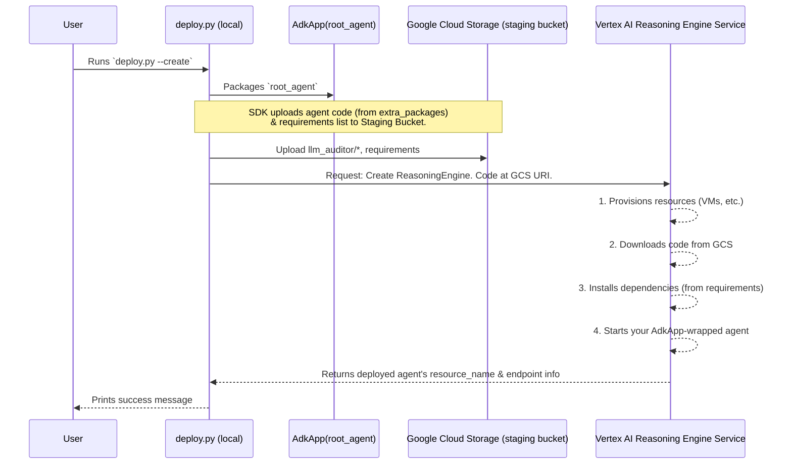

# Chapter 10: Vertex AI Agent Engine Deployment

Welcome to the final chapter of our basic `llm-auditor` tutorial! In [Chapter 9: AdkApp (Deployment Wrapper)](09_adkapp__deployment_wrapper_.md), we learned how to use `AdkApp` to package our sophisticated `root_agent` (the LLM Auditor) into a "shipping container," making it ready for the cloud. Our agent is now neatly boxed up!

But a packaged machine sitting in a warehouse isn't very useful. We need to get it to the factory, set it up, and turn it on! How do we take our `AdkApp`-packaged `llm_auditor` and make it operational as a scalable, remotely callable service on Google Cloud's Vertex AI platform? That's exactly what "Vertex AI Agent Engine Deployment" is all about.

## The "Why": Making Your Agent Accessible to the World

Imagine you've built an incredible, automated fact-checking and editing service (our `llm-auditor`!). You want other applications, perhaps a customer service chatbot or a content generation pipeline, to be able to use this service. Running it just on your own computer won't work for this; you need to host it somewhere reliable, scalable, and accessible over the internet.

**Our Central Use Case:** We want to take our `llm_auditor`, which we've carefully built and packaged using `AdkApp`, and launch it on Google Cloud's Vertex AI. Once deployed, it will become a "Reasoning Engine" – a live service that other applications can call to send LLM responses for auditing and receive back the improved, verified versions.

Think of this as launching a web application. You develop it locally, test it, and then you deploy it to a web server so users from all over the world can access it through their browsers. We're doing something similar for our agent.

## What is a Vertex AI Reasoning Engine? Your Agent's Cloud Home

A **Vertex AI Reasoning Engine** is essentially a managed service on Google Cloud designed to host and run intelligent agents like the ones you build with the Agent Development Kit (ADK).

Think of it as:
*   **A Powerful Server for Your Agent:** Vertex AI handles the underlying computers, making sure your agent has enough power to run.
*   **Scalability:** If many applications start calling your agent, Vertex AI can automatically provide more resources so it can handle the load.
*   **An Address (Endpoint):** Once deployed, your Reasoning Engine gets a unique address (an API endpoint). Other applications can send requests to this address to use your agent.
*   **Management:** Vertex AI helps you manage the lifecycle of your agent – deploying new versions, monitoring it, and deleting it when no longer needed.

By deploying our `llm_auditor` as a Reasoning Engine, we turn it from a local Python project into a robust, production-ready cloud service.

## The Deployment Toolkit: `deployment/deploy.py`

Manually configuring and uploading an agent to the cloud can be complicated. Luckily, the `llm-auditor` project comes with a handy script to help us: `deployment/deploy.py`.

This Python script is our command center for managing the deployment of our `llm_auditor` to Vertex AI. It uses the Vertex AI SDK to:
*   **Configure** the agent for deployment (using the `AdkApp` object we created).
*   Define its **dependencies** (what other Python packages our agent needs to run in the cloud).
*   **Create** a new Reasoning Engine on Vertex AI.
*   **List** existing Reasoning Engines in our project.
*   **Delete** a Reasoning Engine when we're done with it.

## Before You Deploy: Preparing Your Launchpad

To launch anything into the cloud, Google Cloud needs to know a few things:
1.  **Which project are you using?** (Your Google Cloud Project ID)
2.  **Where do you want to deploy it?** (A Google Cloud region, like `us-central1`)
3.  **Where can it temporarily store files during deployment?** (A Google Cloud Storage bucket)

The `deployment/deploy.py` script looks for these details. You can set them up as environment variables (often in a `.env` file that you create in the project root, which `dotenv` in the script can read), or pass them as command-line arguments.

```python
# File: deployment/deploy.py (Snippet showing environment variable loading)

# ...
from dotenv import load_dotenv
# ...

def main(argv: list[str]) -> None:
    # ...
    load_dotenv() # Tries to load from a .env file

    project_id = os.getenv("GOOGLE_CLOUD_PROJECT")
    location = os.getenv("GOOGLE_CLOUD_LOCATION")
    bucket = os.getenv("GOOGLE_CLOUD_STORAGE_BUCKET")
    # ... it then checks if these are set ...
```
For this tutorial, we'll assume these are set up. The script will guide you if they're missing. The key is that these tell Google Cloud *who* is deploying and *where* to put things.

## Making Your Agent Live: Using `deploy.py`

The `deploy.py` script can perform several actions. Let's look at the main ones. You'll typically run these commands from your terminal in the root directory of the `llm-auditor` project.

### 1. Creating a Reasoning Engine (Deploying the Agent)

This is the most exciting step: launching your `llm_auditor`!

**Command:**
```bash
python deployment/deploy.py --create
```
(You might need to add `--project_id YOUR_PROJECT --location YOUR_LOCATION --bucket YOUR_BUCKET` if not using a `.env` file or if they aren't already set in your shell environment.)

**What happens?**
The `create()` function in `deploy.py` is called. Here's a simplified look at its core:
```python
# File: deployment/deploy.py (Simplified create function)

from llm_auditor.agent import root_agent # Our main agent
from vertexai.preview.reasoning_engines import AdkApp
from vertexai import agent_engines # For interacting with Vertex AI

def create() -> None:
    """Creates an agent engine for LLM Auditor."""
    # 1. Package our agent with AdkApp (from Chapter 9)
    adk_app = AdkApp(agent=root_agent, enable_tracing=True)

    # 2. Tell Vertex AI to create the Reasoning Engine
    remote_agent = agent_engines.create(
        adk_app,
        display_name=root_agent.name, # A friendly name for the dashboard
        # Python packages needed by our agent in the cloud:
        requirements=[ 
            "google-adk>=0.0.2",
            "google-cloud-aiplatform[agent_engines]>=1.88.0,<2.0.0",
            # ... other ADK/Gemini related dependencies ...
        ],
        # Our actual agent code (the llm_auditor package itself):
        extra_packages=["./llm_auditor"], 
    )
    print(f"Created remote agent: {remote_agent.resource_name}")
```
Let's break this down:
1.  `adk_app = AdkApp(agent=root_agent, enable_tracing=True)`: We package our `root_agent` using `AdkApp`, just like we learned in [Chapter 9](09_adkapp__deployment_wrapper_.md). `enable_tracing=True` is helpful for debugging in the cloud.
2.  `remote_agent = agent_engines.create(...)`: This is the magic call!
    *   It takes our `adk_app` package.
    *   `display_name`: This is a human-readable name you'll see in the Google Cloud console (e.g., "llm_auditor").
    *   `requirements`: This list tells Vertex AI which Python libraries our `llm_auditor` depends on (like `google-adk`, `google-genai`, etc.). Vertex AI will install these in the cloud environment where our agent runs.
    *   `extra_packages=["./llm_auditor"]`: This is super important! It tells Vertex AI to include our entire `llm_auditor` directory (which contains `root_agent`, `critic_agent`, `reviser_agent`, their prompts, and all our logic) as part of the deployment.

When you run this, it might take a few minutes. The script is talking to Google Cloud, uploading your agent code and dependencies, and then Vertex AI is setting up and starting your agent as a Reasoning Engine.

**Expected Output:**
If successful, you'll see a message like:
```
Created remote agent: projects/YOUR_PROJECT_ID/locations/YOUR_LOCATION/agentEngines/SOME_UNIQUE_ID
```
This long string is the unique **resource name** of your deployed agent. You'll need this ID if you want to delete it later.

Your `llm_auditor` is now live on Vertex AI!

### 2. Checking What's Deployed: Listing Reasoning Engines

Want to see all the agents you've deployed in your project?

**Command:**
```bash
python deployment/deploy.py --list
```

**What happens?**
The `list_agents()` function is called:
```python
# File: deployment/deploy.py (Simplified list_agents function)

from vertexai import agent_engines

def list_agents() -> None:
    remote_agents = agent_engines.list() # Gets a list from Vertex AI
    TEMPLATE = """
{agent.name} ("{agent.display_name}")
- Create time: {agent.create_time}
- Update time: {agent.update_time}
"""
    # ... (code to format and print the list) ...
    print("All remote agents:\n...")
```
It simply calls `agent_engines.list()` from the Vertex AI SDK, which fetches information about all Reasoning Engines in your configured project and location.

**Expected Output:**
You'll see a list of your deployed agents, something like:
```
All remote agents:

projects/YOUR_PROJECT_ID/locations/YOUR_LOCATION/agentEngines/SOME_UNIQUE_ID ("llm_auditor")
- Create time: 2024-03-15 10:00:00
- Update time: 2024-03-15 10:00:00

projects/YOUR_PROJECT_ID/locations/YOUR_LOCATION/agentEngines/ANOTHER_ID ("my_other_agent")
- Create time: ...
- Update time: ...
```

### 3. Taking an Agent Down: Deleting a Reasoning Engine

If you no longer need an agent running (to avoid ongoing costs or just to clean up), you can delete it. You'll need its unique resource name (which you got when you created it, or from the `--list` command).

**Command:**
```bash
python deployment/deploy.py --delete --resource_id "projects/YOUR_PROJECT_ID/locations/YOUR_LOCATION/agentEngines/SOME_UNIQUE_ID"
```
Replace the resource ID with the actual ID of the agent you want to delete.

**What happens?**
The `delete()` function is called:
```python
# File: deployment/deploy.py (Simplified delete function)

from vertexai import agent_engines

def delete(resource_id: str) -> None:
    remote_agent = agent_engines.get(resource_id) # First, get a reference to it
    remote_agent.delete(force=True) # Then, delete it
    print(f"Deleted remote agent: {resource_id}")
```
1.  `agent_engines.get(resource_id)`: Fetches a reference to the specific agent you want to delete.
2.  `remote_agent.delete(force=True)`: Tells Vertex AI to remove this Reasoning Engine.

**Expected Output:**
```
Deleted remote agent: projects/YOUR_PROJECT_ID/locations/YOUR_LOCATION/agentEngines/SOME_UNIQUE_ID
```

## Under the Hood: What Happens During `deploy.py --create`?

The deployment process, especially for `create`, involves several steps behind the scenes, orchestrated by the `deploy.py` script and the Vertex AI SDK:

1.  **Initialization:**
    *   Your `deploy.py` script starts.
    *   It initializes the Vertex AI SDK with your project, location, and staging bucket details (e.g., `vertexai.init(...)`). This tells the SDK which Google Cloud environment to target.

2.  **Agent Packaging:**
    *   The line `adk_app = AdkApp(agent=root_agent, ...)` packages your `root_agent` into the `AdkApp` format, as discussed in [Chapter 9](09_adkapp__deployment_wrapper_.md).

3.  **Staging and Uploading:**
    *   When `agent_engines.create(adk_app, requirements=..., extra_packages=...)` is called:
        *   The SDK takes your `adk_app` object.
        *   It gathers all the code specified in `extra_packages` (our `./llm_auditor` directory).
        *   It prepares a package containing your agent's code and a list of its `requirements`.
        *   This package is then **uploaded to the Google Cloud Storage bucket** you specified as the "staging bucket." This bucket acts as a temporary holding area for your code before Vertex AI picks it up.

4.  **Requesting Reasoning Engine Creation:**
    *   The SDK then makes an API call to the Vertex AI service.
    *   This call essentially says: "Please create a new Reasoning Engine. Here's its display name. You can find its code and dependencies in this location in Google Cloud Storage: `gs://YOUR_STAGING_BUCKET/path/to/package`."

5.  **Vertex AI Provisioning:**
    *   The Vertex AI service receives this request.
    *   It allocates the necessary cloud resources (like virtual machines).
    *   It creates a new environment on these resources.
    *   It downloads your agent's code and dependencies from the staging bucket into this new environment.
    *   It installs all the Python packages listed in your `requirements`.
    *   It then starts up your agent (using the `AdkApp` wrapper to know how to run it).

6.  **Service Activation:**
    *   Once your agent is running, Vertex AI makes it available at a unique API endpoint.
    *   The `agent_engines.create()` call in your script then receives a confirmation, including the `resource_name` of the newly created Reasoning Engine.

7.  **Confirmation:**
    *   Your `deploy.py` script prints the success message with the resource name.

Here's a diagram visualizing this flow:



It's a complex dance, but the `deploy.py` script and the Vertex AI SDK handle most of the heavy lifting for you! Your main job is to define your agent, package it with `AdkApp`, and specify its dependencies.

## Conclusion: Your Agent is in the Cloud!

Congratulations! You've reached the end of this basic tutorial on `llm-auditor` and successfully learned how to take your locally developed intelligent agent and deploy it as a scalable, robust service on Google Cloud's Vertex AI.

You now understand:
*   What a Vertex AI Reasoning Engine is.
*   How the `deploy.py` script helps manage the deployment lifecycle (create, list, delete).
*   The key parameters needed for deployment, like Python `requirements` and your agent's `extra_packages`.
*   The general process that happens behind the scenes when you deploy your agent.

From defining the [LLM Auditor (Root Agent)](01_llm_auditor__root_agent_.md) and its sub-agents like the [Critic Agent](02_critic_agent.md) and [Reviser Agent](03_reviser_agent.md), to understanding workflows, prompting, tools, callbacks, and packaging with [AdkApp (Deployment Wrapper)](09_adkapp__deployment_wrapper_.md), you've come a long way.

With your `llm-auditor` now deployed as a Reasoning Engine, it's ready to be integrated into larger applications, providing valuable auditing capabilities for LLM-generated content. This is a significant step in building trustworthy and reliable AI systems.

Happy Hacking, and we hope you found this `llm-auditor` journey insightful!

---

Generated by [AI Codebase Knowledge Builder](https://github.com/The-Pocket/Tutorial-Codebase-Knowledge)