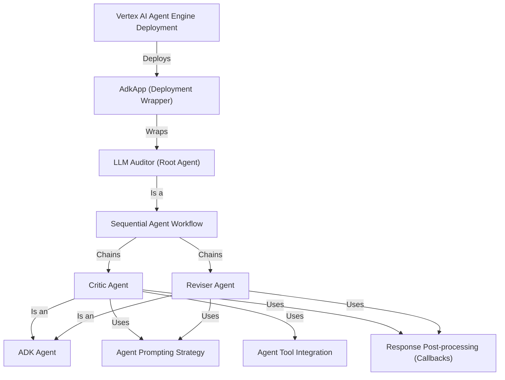

# Tutorial: llm-auditor

The `llm-auditor` project helps **ensure Large Language Model (LLM) answers are accurate and reliable**.
It uses a *main **LLM Auditor** agent* that directs a *two-step process*: first, a **Critic Agent** *fact-checks* claims in an LLM's answer (using web search), and then a **Reviser Agent** *corrects and refines* the answer based on these findings.
This system is built with the *Google Agent Development Kit (ADK)* and can be *deployed to Vertex AI*.

**Source Repository:** [None](None)

## Chapters

1. [LLM Auditor (Root Agent)](01_llm_auditor__root_agent_.md)
2. [Critic Agent](02_critic_agent.md)
3. [Reviser Agent](03_reviser_agent.md)
4. [Sequential Agent Workflow](04_sequential_agent_workflow.md)
5. [ADK Agent](05_adk_agent.md)
6. [Agent Prompting Strategy](06_agent_prompting_strategy.md)
7. [Agent Tool Integration](07_agent_tool_integration.md)
8. [Response Post-processing (Callbacks)](08_response_post_processing__callbacks_.md)
9. [AdkApp (Deployment Wrapper)](09_adkapp__deployment_wrapper_.md)
10. [Vertex AI Agent Engine Deployment](10_vertex_ai_agent_engine_deployment.md)

---

Generated by [AI Codebase Knowledge Builder](https://github.com/The-Pocket/Tutorial-Codebase-Knowledge)