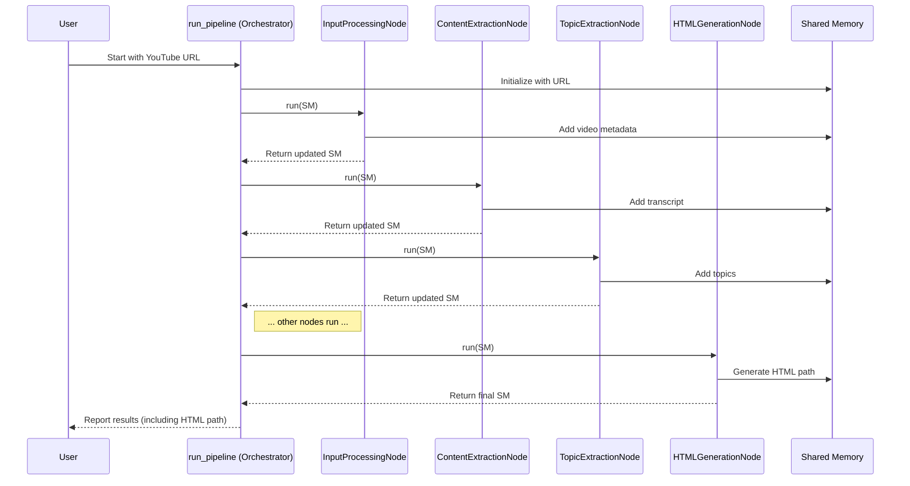

# Chapter 1: Pipeline Orchestration

Welcome to the `pf1` YouTube Summarizer project! We're thrilled to have you here. Our goal is to build a tool that takes a YouTube video URL and automatically creates a nice summary report.

Imagine you want to build a car. You don't just magically get a car! You need an assembly line: a frame is built, then the engine is added, then the wheels, the doors, the paint, and so on. Each step builds upon the previous one, and they have to happen in the right order.

Our YouTube summarizer works similarly. We can't just get a summary instantly from a URL. We need a series of steps:
1.  Get information *about* the video (like its title).
2.  Extract the spoken words (the transcript).
3.  Figure out the main topics discussed.
4.  Analyze each topic (maybe generate questions and answers).
5.  Put everything together into a readable report (like an HTML page).

This sequence of steps is what we call a **Pipeline**.

But who manages this assembly line? Who makes sure step 1 finishes before step 2 starts, and that the output from step 1 is correctly passed to step 2? That's where **Pipeline Orchestration** comes in.

Think of Pipeline Orchestration like the **Project Manager** or the **Factory Foreman** for our summarization task. It doesn't do the specific jobs itself (like extracting the transcript or generating HTML), but it manages the overall *flow*, ensuring each specialist task runs at the right time and in the right order.

## Why Do We Need Orchestration?

You might wonder, why not just write one giant piece of code that does everything?

1.  **Order Matters:** You can't analyze topics before you have the transcript, and you can't create the final report before you've analyzed the topics. Orchestration enforces this correct sequence.
2.  **Managing Complexity:** Breaking the big problem (summarizing a video) into smaller, manageable steps makes the code easier to understand, develop, and fix. Orchestration connects these smaller pieces.
3.  **Passing Information:** The output of one step is often the input for the next. For example, the transcript extracted in one step is needed to find topics in the next step. The orchestrator helps manage how this information (or "data") is passed along.

## Our Project Manager: The `run_pipeline` Function

In our project (`pf1`), the main orchestrator is a function called `run_pipeline` located in the `src/main.py` file. This function defines the sequence of steps needed to go from a YouTube URL to a final summary report.

It calls upon different specialists, which we call **Nodes**. Each Node is responsible for one specific task in the pipeline. We'll learn all about Nodes in [Chapter 2: Node (Pipeline Step)](02_node__pipeline_step_.md).

For now, just know that `run_pipeline` calls these Nodes one after another.

Here's a simplified view of what `run_pipeline` does:

```python
# This is a simplified example!
# Find the real code in src/main.py

def run_pipeline(youtube_url):
    # 1. Get basic video info (like title)
    step1_output = run_input_processing_node(youtube_url)

    # 2. Get the video's transcript
    step2_output = run_content_extraction_node(step1_output)

    # 3. Find the main topics in the transcript
    step3_output = run_topic_extraction_node(step2_output)

    # 4. Analyze each topic (e.g., generate Q&A)
    step4_output = run_topic_orchestration_node(step3_output)

    # 5. Create the final HTML report
    final_report = run_html_generation_node(step4_output)

    print("Pipeline complete! Report created.")
    return final_report

# Imagine calling it like this:
# run_pipeline("https://www.youtube.com/watch?v=some_video_id")
```

In this simplified example, you can clearly see the sequence. The `run_pipeline` function calls each step (`run_..._node`) in order, passing the result from one step to the next.

## Passing Notes: How Data Flows

How does the output from `run_input_processing_node` get to `run_content_extraction_node`? The orchestrator uses a central place to store the results from each step. Think of it like a shared notebook or clipboard that each specialist Node can read from and write to.

In our project, we call this the [Shared Memory](03_shared_memory.md). The `run_pipeline` function initializes this shared memory (initially just containing the input URL) and passes it to the first Node. That Node does its work, adds its results to the shared memory, and returns it. The orchestrator then passes the updated shared memory to the next Node, and so on. We'll dive deeper into this in [Chapter 3](03_shared_memory.md).

## Visualizing the Flow

Let's visualize this flow using a simple diagram. `run_pipeline` is the manager, directing the Nodes and passing the `shared_memory` (our shared notebook) between them.



This diagram shows how `run_pipeline` calls each Node in sequence (`INode`, `CNode`, `TNode`, `HNode`), passing the `Shared Memory` (`SM`) along. Each Node reads from `SM` and adds its own results back into it.

## A Look at the Real Code (`src/main.py`)

Let's look at the actual `run_pipeline` function in `src/main.py`. Don't worry if not everything makes sense yet; we'll cover the details in later chapters. Focus on seeing the sequence of Nodes being called.

First, the function starts by setting things up, including the `shared_memory`:

```python
# From src/main.py

import os
# ... other imports ...
from src.nodes.input_processing_node import InputProcessingNode
# ... imports for other nodes ...
from src.utils.logger import logger

def run_pipeline(youtube_url, output_dir="output", ...):
    logger.info("Starting YouTube Video Summarizer...")
    logger.info(f"Processing URL: {youtube_url}")

    # Initialize shared memory - our 'shared notebook'
    shared_memory = {"video_url": youtube_url}

    # Create output directory if it doesn't exist
    os.makedirs(output_dir, exist_ok=True)

    try:
        # ... (rest of the pipeline steps below) ...
```

This part just logs some information and creates the `shared_memory` dictionary, initially holding only the `video_url`. It also ensures the directory for saving the final report exists.

Now, the orchestrator starts calling the Nodes one by one:

```python
        # 1. Input Processing Node
        logger.info("[1/5] Starting Input Processing...")
        # Create the specialist Node
        input_node = InputProcessingNode(shared_memory)
        # Ask the Node to run and update shared_memory
        shared_memory = input_node.run()
        # Check if the Node reported an error
        if "error" in shared_memory:
            # Handle error and stop
            logger.error(f"Input Processing failed...")
            return shared_memory
        logger.info("Successfully processed video info.")
```

This block shows the pattern:
1.  Log that the step is starting.
2.  Create an instance of the specific Node needed (e.g., `InputProcessingNode`), passing it the current `shared_memory`.
3.  Call the Node's `run()` method. The Node performs its task and returns the *updated* `shared_memory`.
4.  Update the `shared_memory` variable in `run_pipeline` with the returned value.
5.  Check for errors. If an error occurred, the pipeline stops.

This pattern repeats for all the steps:

```python
        # 2. Content Extraction Node
        logger.info("[2/5] Starting Content Extraction...")
        content_node = ContentExtractionNode(shared_memory)
        shared_memory = content_node.run()
        if "error" in shared_memory: # Error check
            logger.error(f"Content Extraction failed...")
            return shared_memory
        logger.info("Successfully extracted transcript.")

        # 3. Topic Extraction Node
        logger.info("[3/5] Starting Topic Extraction...")
        topic_node = TopicExtractionNode(shared_memory, ...) # Some nodes need extra config
        shared_memory = topic_node.run()
        if "error" in shared_memory: # Error check
            logger.error(f"Topic Extraction failed...")
            return shared_memory
        logger.info("Successfully extracted topics.")

        # ... (Steps 4 and 5 follow the same pattern) ...
```

You can see how `run_pipeline` acts as the orchestrator, calling each Node (`InputProcessingNode`, `ContentExtractionNode`, `TopicExtractionNode`, etc.) in the correct order and passing the `shared_memory` between them.

Finally, after all steps are complete (if no errors occurred), it logs a success message:

```python
        # ... After step 5 (HTML Generation) ...

        logger.info("Summary Generation Complete!")
        # ... Print final summary info ...
        return shared_memory # Return the final state

    except Exception as e:
        # Catch any unexpected problems
        logger.exception(f"Unexpected error in pipeline: {str(e)}")
        shared_memory["error"] = f"Pipeline error: {str(e)}"
        return shared_memory
```

The function returns the final `shared_memory`, which now contains all the results from the pipeline, including the path to the generated HTML report.

## Conclusion

In this chapter, we learned about **Pipeline Orchestration**. It's the process of managing a sequence of steps (a pipeline) to achieve a complex goal, like summarizing a YouTube video.

We saw that orchestration is crucial for:
*   Ensuring steps run in the correct order.
*   Breaking down a large task into smaller, manageable parts (Nodes).
*   Passing information between steps using a shared space (Shared Memory).

In our `pf1` project, the `run_pipeline` function in `src/main.py` acts as our orchestrator, calling different **Nodes** in sequence and managing the data flow via **Shared Memory**.

Now that we understand the overall flow managed by the orchestrator, let's zoom in on the individual specialists that perform the actual work: the Nodes.

Ready to meet the specialists? Let's move on to [Chapter 2: Node (Pipeline Step)](02_node__pipeline_step_.md)!

---

Generated by [AI Codebase Knowledge Builder](https://github.com/The-Pocket/Tutorial-Codebase-Knowledge)