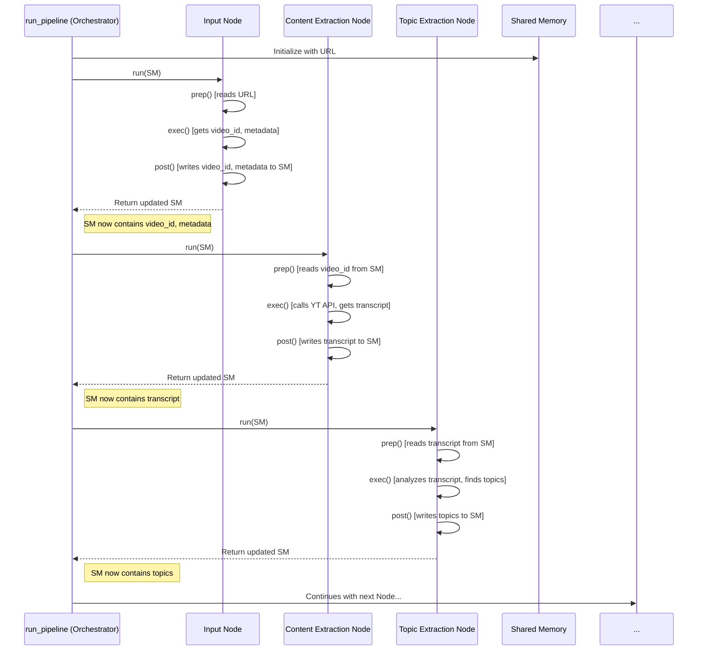

# Chapter 2: Node (Pipeline Step)

In [Chapter 1: Pipeline Orchestration](01_pipeline_orchestration.md), we learned how our YouTube summarizer uses a pipeline, like an assembly line, to perform a series of steps. We saw that the `run_pipeline` function acts as the project manager, ensuring each step happens in the right order.

But who actually does the work at each step? If the orchestrator is the manager, who are the specialized workers on the assembly line? That's where **Nodes** come in!

## What is a Node? The Specialist Worker

Imagine our car assembly line again. One worker installs the engine, another fits the wheels, and another paints the body. Each worker has a very specific job they are trained to do.

In our `pf1` project, a **Node** is like one of these specialized workers. It's a self-contained piece of code responsible for **one specific task** within the overall summarization pipeline.

For example, we have Nodes dedicated to tasks like:
*   Getting the video's title and ID (`InputProcessingNode`)
*   Extracting the spoken words (transcript) (`ContentExtractionNode`)
*   Figuring out the main topics discussed (`TopicExtractionNode`)
*   Generating Questions & Answers for a topic (`TopicProcessorNode`)
*   Creating the final HTML report (`HTMLGenerationNode`)

Each Node focuses *only* on its job. The `ContentExtractionNode` doesn't worry about how to generate HTML; it just focuses on getting the transcript accurately.

## Why Break Tasks into Nodes?

Why not just have one giant function do everything? Breaking the work into Nodes helps us in several ways:

1.  **Clarity:** It's much easier to understand a small piece of code that does one thing well (like getting a transcript) than a huge chunk of code that does everything.
2.  **Organization:** It keeps our project tidy. All the code related to transcript extraction lives within the `ContentExtractionNode`'s file.
3.  **Reusability:** If we needed to extract transcripts for another purpose, we could potentially reuse the `ContentExtractionNode`.
4.  **Testing:** We can test each Node individually to make sure it works correctly before plugging it into the main pipeline.
5.  **Teamwork:** Different people could work on different Nodes simultaneously.

## The Node's Standard Workflow: Prep, Exec, Post

Think about our assembly line worker again. Before starting their main task, they need to get ready. Maybe they need to grab the right tools or pick up the specific part they need to work on (like the engine block). After doing their job, they need to put the finished piece back onto the assembly line correctly so the next worker can use it.

Our Nodes follow a similar standard process, defined by a template (called a "base class" in programming, specifically `BaseNode` in `src/nodes/base_node.py`). Every Node has three main phases, implemented as methods (functions belonging to the Node):

1.  **`prep()` (Prepare):**
    *   **What it does:** Gets the Node ready to work.
    *   **Analogy:** The worker checks the instructions, grabs the necessary tools, and picks up the required input part (e.g., the video ID) from the shared workspace ([Shared Memory](03_shared_memory.md)).
    *   **In code:** Reads necessary information from the `shared_memory` dictionary. Checks if the required inputs are actually there.

2.  **`exec()` (Execute):**
    *   **What it does:** Performs the Node's main task. This is where the real work happens.
    *   **Analogy:** The worker installs the engine, extracts the transcript, or identifies the topics.
    *   **In code:** Calls other utility functions or uses libraries to perform its specific job (like calling the YouTube transcript API or using an AI model).

3.  **`post()` (Post-Process):**
    *   **What it does:** Cleans up and stores the results.
    *   **Analogy:** The worker puts their tools away and places the finished part (e.g., the extracted transcript) back onto the shared workspace ([Shared Memory](03_shared_memory.md)) for the next Node.
    *   **In code:** Takes the results from the `exec` phase and adds them to the `shared_memory` dictionary using specific keys (like `"transcript"`). It might also do some final checks.

These three methods are always called in the order: `prep`, then `exec`, then `post`.

## How Does a Node Run? The `run()` Method

So, how do these `prep`, `exec`, and `post` methods get called? The [Pipeline Orchestration](01_pipeline_orchestration.md) (our `run_pipeline` function) doesn't call them individually. Instead, each Node has a `run()` method (provided by the `BaseNode` template).

When the orchestrator wants a Node to do its job, it simply calls that Node's `run()` method. The `run()` method then takes care of calling `prep()`, `exec()`, and `post()` in the correct sequence.

```python
# Simplified concept of the BaseNode's run method
# (See src/nodes/base_node.py for the real code)

class BaseNode:
    # ... (other parts like __init__) ...

    def prep(self):
        # To be implemented by specific nodes
        pass

    def exec(self):
        # To be implemented by specific nodes
        pass

    def post(self):
        # To be implemented by specific nodes
        pass

    def run(self):
        # 1. Prepare
        self.prep()

        # 2. Execute (only if prep was okay)
        # (Simplified: Real code checks for errors)
        self.exec()

        # 3. Post-process (only if exec was okay)
        # (Simplified: Real code checks for errors)
        self.post()

        # Return the updated shared memory
        return self.shared_memory
```
This `run()` method acts like the Node's internal manager, ensuring the standard workflow is followed. The pipeline orchestrator just needs to call `run()`, making the main pipeline code cleaner.

## Example: The Content Extraction Node

Let's look at a concrete example: the `ContentExtractionNode` (found in `src/nodes/content_extraction_node.py`). Its job is to get the transcript (spoken words) for the YouTube video.

Here's a simplified view of its `prep`, `exec`, and `post` methods:

```python
# Simplified version of ContentExtractionNode
# (See src/nodes/content_extraction_node.py for full code)

from src.nodes.base_node import BaseNode
from src.utils.extract_youtube_transcript import extract_youtube_transcript # Utility function

class ContentExtractionNode(BaseNode):

    def prep(self):
        # Get ready: Need the video_id from shared memory
        print("ContentExtractionNode: Preparing...")
        if "video_id" not in self.shared_memory:
            print("Error: video_id is missing!")
            # (Real node would set an error flag)
            return
        self.video_id = self.shared_memory["video_id"]
        print(f"Found video_id: {self.video_id}")

    def exec(self):
        # Do the work: Call the transcript extraction utility
        print(f"ContentExtractionNode: Executing - Getting transcript for {self.video_id}...")
        # This function actually calls the YouTube API
        transcript_text = extract_youtube_transcript(self.video_id)
        # Store the result temporarily within the node
        self.extracted_transcript = transcript_text
        print("Got the transcript!")

    def post(self):
        # Store result: Put the transcript into shared memory
        print("ContentExtractionNode: Posting results...")
        self.shared_memory["transcript"] = self.extracted_transcript
        print(f"Added 'transcript' (length: {len(self.extracted_transcript)}) to shared memory.")

```

Let's break down what happens when the orchestrator calls `run()` on this Node:

1.  **`run()` starts.**
2.  **`prep()` runs:** It looks into the `shared_memory` dictionary given to it and expects to find a key called `"video_id"`. If it's missing, it signals an error (in the real code). If found, it stores the ID for later use.
3.  **`exec()` runs:** It calls the specialized utility function `extract_youtube_transcript`, passing the `video_id` it got during `prep`. This utility function does the heavy lifting of contacting YouTube and getting the transcript text. The result is stored temporarily inside the Node.
4.  **`post()` runs:** It takes the `extracted_transcript` from the `exec` phase and adds it to the `shared_memory` dictionary under the key `"transcript"`.
5.  **`run()` finishes:** It returns the *updated* `shared_memory` (which now includes the transcript) back to the orchestrator.

The orchestrator then takes this updated `shared_memory` and passes it to the *next* Node in the pipeline (e.g., the `TopicExtractionNode`), which can now read the `"transcript"` key.

## How Nodes Fit Together (Recap)

As we saw in [Chapter 1](01_pipeline_orchestration.md), the `run_pipeline` function manages this flow:



This diagram shows how the orchestrator (`run_pipeline`) calls the `run()` method of each Node in turn. Inside `run()`, the `prep`, `exec`, and `post` methods handle reading from and writing to the Shared Memory (`SM`), effectively passing information down the assembly line.

## Conclusion

In this chapter, we zoomed in on the individual workers of our pipeline: the **Nodes**.

*   A Node is a **specialized component** responsible for **one specific task** (like extracting transcripts or topics).
*   Using Nodes makes our code **organized, modular, and easier to manage**.
*   All Nodes follow a standard **`prep` -> `exec` -> `post` workflow**, managed by their `run()` method.
    *   `prep`: Get ready, read inputs from Shared Memory.
    *   `exec`: Do the main work.
    *   `post`: Store results back into Shared Memory.
*   The pipeline orchestrator calls each Node's `run()` method in sequence, passing the updated Shared Memory along.

Now we understand the orchestrator (the manager) and the Nodes (the workers). But how exactly does this "shared workspace" or "shared notebook" work where Nodes read inputs and write outputs?

Let's dive into the details of that central data hub in [Chapter 3: Shared Memory](03_shared_memory.md)!

---

Generated by [AI Codebase Knowledge Builder](https://github.com/The-Pocket/Tutorial-Codebase-Knowledge)