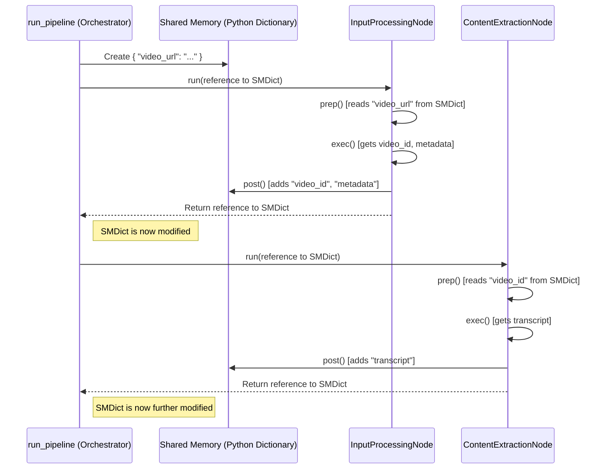

# Chapter 3: Shared Memory

In [Chapter 1: Pipeline Orchestration](01_pipeline_orchestration.md), we saw our pipeline manager (`run_pipeline`) coordinating the different steps. In [Chapter 2: Node (Pipeline Step)](02_node__pipeline_step_.md), we met the specialized workers (Nodes) that perform each task, like getting the video transcript or finding topics.

But how does the "transcript extractor" Node hand over the transcript it found to the "topic finder" Node? They need a way to pass information along the assembly line. That's where **Shared Memory** comes in!

## The Problem: Passing Notes Between Workers

Imagine our assembly line again.
1.  Worker A gets the video ID.
2.  Worker B needs that video ID to fetch the transcript.
3.  Worker C needs the transcript to find the main topics.

How does Worker A tell Worker B the video ID? How does Worker B give the transcript to Worker C? They can't just shout across the factory floor! They need a reliable way to share their results.

## Our Solution: The Shared Whiteboard (A Python Dictionary)

In `pf1`, the **Shared Memory** is our solution. Think of it like a **shared whiteboard** or a **central notebook** that every worker (Node) in the pipeline can access.

*   When a Node finishes its job, it writes its results onto the whiteboard (e.g., "Video ID: xyz123", "Transcript: Hello world...").
*   When the next Node starts its job, it looks at the whiteboard to find the information it needs (e.g., it reads the "Transcript" section).

Technically, this "whiteboard" is just a standard **Python dictionary**. If you're new to Python dictionaries, they simply store information as **key-value pairs**.

```python
# A simple Python dictionary example
my_info = {
  "name": "Alex",
  "task": "Write chapter",
  "tools": ["laptop", "keyboard"]
}

# Accessing information using the key
print(my_info["name"])  # Output: Alex

# Adding new information
my_info["status"] = "In progress"
print(my_info)
# Output: {'name': 'Alex', 'task': 'Write chapter', 'tools': ['laptop', 'keyboard'], 'status': 'In progress'}
```

Our `shared_memory` works exactly like this! It's a dictionary where keys are strings describing the data (like `"video_url"`, `"video_id"`, `"transcript"`, `"topics"`), and the values are the actual data (the URL string, the ID string, the long transcript text, a list of topic strings, etc.).

## How Shared Memory Flows Through the Pipeline

1.  **Initialization:** The pipeline orchestrator (`run_pipeline` in `src/main.py`) creates the `shared_memory` dictionary when the pipeline starts. Initially, it usually just contains the input needed for the very first step, like the YouTube video URL.

    ```python
    # From src/main.py (simplified)
    def run_pipeline(youtube_url, ...):
        # Create the shared memory dictionary
        shared_memory = {"video_url": youtube_url}
        logger.info("Shared memory initialized.")
        # ... rest of the pipeline ...
    ```
    At this point, `shared_memory` looks like: `{"video_url": "https://youtube.com/watch?v=some_id"}`

2.  **Passing to Nodes:** The orchestrator passes this `shared_memory` dictionary to the first Node when it calls the Node's `run()` method.

    ```python
    # From src/main.py (simplified)
    # ... inside run_pipeline ...
    
    # 1. Input Processing Node
    logger.info("Calling InputProcessingNode...")
    input_node = InputProcessingNode(shared_memory) # Give the Node access
    shared_memory = input_node.run() # Node runs and returns the UPDATED dictionary
    ```

3.  **Nodes Read and Write:** Inside the Node's `run()` method, the `prep`, `exec`, and `post` methods interact with the dictionary:
    *   **`prep()` reads:** It looks up the keys it needs (e.g., the `InputProcessingNode` reads `"video_url"`).
    *   **`post()` writes:** After `exec()` does the work, `post()` adds the Node's results back into the *same* dictionary using new keys (e.g., the `InputProcessingNode` adds `"video_id"` and `"metadata"`).

    ```python
    # Inside InputProcessingNode (simplified)
    
    def prep(self):
        # Read the URL provided by the orchestrator
        self.url = self.shared_memory["video_url"]
        logger.debug(f"Input node read URL: {self.url}")

    def exec(self):
        # Do work: Get video ID and metadata from the URL
        # (Simplified - actual logic calls YouTube utilities)
        self.video_id_result = "xyz123"
        self.metadata_result = {"title": "Cool Video", "author": "Creator"}
        logger.debug("Input node got video ID and metadata.")

    def post(self):
        # Write the results back to the dictionary
        self.shared_memory["video_id"] = self.video_id_result
        self.shared_memory["metadata"] = self.metadata_result
        logger.debug("Input node wrote video_id and metadata to shared memory.")
    ```

4.  **Passing Updated Memory:** When the Node's `run()` method finishes, it returns the modified `shared_memory` dictionary back to the orchestrator. The orchestrator then passes this *updated* dictionary to the *next* Node in the sequence.

    ```python
    # From src/main.py (simplified)
    # ... after InputProcessingNode runs ...
    # shared_memory now contains:
    # {
    #   "video_url": "https://youtube.com/watch?v=some_id",
    #   "video_id": "xyz123",
    #   "metadata": {"title": "Cool Video", "author": "Creator"}
    # }
    
    # 2. Content Extraction Node
    logger.info("Calling ContentExtractionNode...")
    content_node = ContentExtractionNode(shared_memory) # Pass the UPDATED memory
    shared_memory = content_node.run() # Get the next update
    ```

5.  **Chain Reaction:** This process repeats for every Node in the pipeline. Each Node reads the data left by previous Nodes and adds its own results.

    *   `ContentExtractionNode` reads `"video_id"`, does its work, and adds `"transcript"`.
    *   `TopicExtractionNode` reads `"transcript"`, does its work, and adds `"topics"`.
    *   ...and so on.

The `shared_memory` dictionary grows as it passes through the pipeline, accumulating all the results.

## Under the Hood: Passing the Dictionary Around

Is this some magic "shared" space in the computer's memory? Not really! It's much simpler in our case.

Python dictionaries are "mutable" objects. This means when you pass a dictionary to a function (or a Node's method), you're passing a reference to the *exact same* dictionary object in memory. If the function modifies the dictionary (like adding a new key), the original dictionary that was passed in also changes.

So, the orchestrator creates *one* dictionary object. It passes a reference to this object to Node 1. Node 1 modifies it directly. The orchestrator then passes the reference to the *same, now modified* object to Node 2, and so on.

Here's a diagram showing this flow:



It's like passing the *same physical notebook* from person to person. Each person adds their notes to it before passing it on.

## Example: Reading and Writing

Let's see how the `ContentExtractionNode` might read the `"video_id"` written by `InputProcessingNode` and then write the `"transcript"`.

```python
# Inside ContentExtractionNode (simplified)

def prep(self):
    # Read the video_id written by the previous node
    if "video_id" in self.shared_memory:
        self.video_id_to_process = self.shared_memory["video_id"]
        logger.debug(f"Content node read video_id: {self.video_id_to_process}")
    else:
        # Handle missing data (important!)
        logger.error("Error: video_id not found in shared memory!")
        self.shared_memory["error"] = "Missing video_id for transcript extraction"

def exec(self):
    # Only run if prep was successful (no error)
    if "error" not in self.shared_memory:
        # Use self.video_id_to_process to get the transcript
        # (Simplified - actual logic calls YouTube utilities)
        self.transcript_result = "This is the transcript text..."
        logger.debug("Content node got the transcript.")

def post(self):
    # Only run if prep and exec were successful
    if "error" not in self.shared_memory:
        # Write the transcript result to shared memory
        self.shared_memory["transcript"] = self.transcript_result
        logger.debug("Content node wrote transcript to shared memory.")
```
This Node first checks if the key `"video_id"` exists in the `shared_memory` it received (this is crucial error handling!). If it exists, it uses that ID in its `exec` step. Finally, in `post`, it adds its own result under the key `"transcript"`. The next Node can now read `"transcript"`.

## Why Use a Dictionary?

*   **Simplicity:** It's a fundamental Python data structure, easy to understand and use.
*   **Flexibility:** Dictionaries can hold various data types (strings, numbers, lists, even other dictionaries), which is perfect for the different kinds of results our Nodes produce.
*   **Clarity:** Using meaningful keys (like `"transcript"`, `"topics"`) makes it clear what data is being passed around.

## Conclusion

We've learned about **Shared Memory**, the crucial mechanism that allows our pipeline Nodes to communicate and share data.

*   It's implemented as a simple **Python dictionary**.
*   The pipeline orchestrator ([Chapter 1](01_pipeline_orchestration.md)) creates it and passes it sequentially to each Node ([Chapter 2](02_node__pipeline_step_.md)).
*   Nodes **read** the inputs they need from the dictionary using keys (usually in `prep`).
*   Nodes **write** their results back into the dictionary using new keys (usually in `post`).
*   This allows data like the video ID, transcript, and topics to flow smoothly from one step to the next.

Understanding Shared Memory is key to seeing how the different parts of our `pf1` project connect and build upon each other's work.

Now that we understand the basic building blocks (Orchestration, Nodes, Shared Memory), we can look at more specialized components. Next, we'll explore a Node that acts as a mini-orchestrator itself, managing the detailed processing of topics.

Let's dive into the [Topic Processing Orchestrator](04_topic_processing_orchestrator.md)!

---

Generated by [AI Codebase Knowledge Builder](https://github.com/The-Pocket/Tutorial-Codebase-Knowledge)