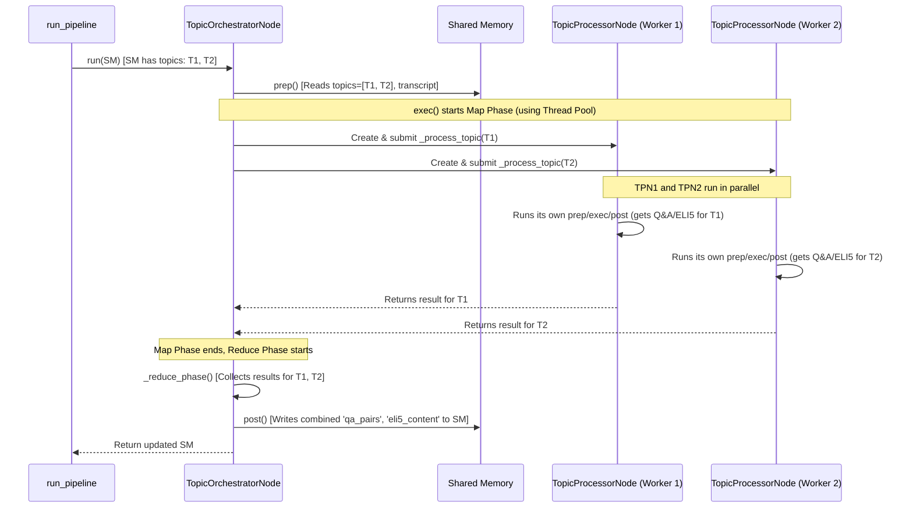

# Chapter 4: Topic Processing Orchestrator

Welcome back! In [Chapter 3: Shared Memory](03_shared_memory.md), we learned how different steps (Nodes) in our pipeline share information using a central dictionary called `shared_memory`. We saw how the `TopicExtractionNode` adds a list of topics it found into this shared space.

Now, imagine our video analyzer found 10 different topics in a long video! For each topic, we want to:
1.  Generate some Questions and Answers (Q&A).
2.  Create a super simple "Explain Like I'm 5" (ELI5) summary.

If we did this one topic at a time, it could take a while, especially since generating Q&A and ELI5 often involves asking an AI model (like the ones we'll see in [Chapter 6: LLM Utility](06_llm_utility.md)), which can be slow. How can we speed this up?

## The Problem: Analyzing Many Topics Takes Time

Let's say analyzing one topic takes 30 seconds. If we have 10 topics, doing them one after another would take 300 seconds (5 minutes!). That's a long coffee break!

```
Topic 1 Analysis --> Wait 30s --> Topic 2 Analysis --> Wait 30s --> ... --> Topic 10 Analysis --> Wait 30s
Total Time = 10 * 30s = 300s
```

We need a smarter way to handle this.

## The Solution: Divide and Conquer with Parallelism!

Think about a big research project given to a team. Does the team lead make everyone wait while one person researches the first part, then the next person researches the second part? No! The lead divides the work: "Alice, you research Topic A. Bob, you research Topic B. Charlie, you research Topic C. Go!" Everyone works *at the same time* (in parallel). When they're done, the lead collects all their findings.

This is exactly what the **Topic Processing Orchestrator** (`TopicOrchestratorNode`) does! It acts like that efficient team lead for analyzing topics.

*   **The Big Task:** Analyze all topics found in the video.
*   **The Team Lead:** `TopicOrchestratorNode`.
*   **The Team Members:** Specialized workers called `TopicProcessorNode` (we'll see these workers in action soon).
*   **The Assignment:** The `TopicOrchestratorNode` gives *each* topic to a *separate* `TopicProcessorNode`.
*   **Working in Parallel:** It lets all the `TopicProcessorNode`s work simultaneously to generate Q&A and ELI5 for their assigned topic.
*   **Collecting Results:** Once all workers are finished, the `TopicOrchestratorNode` gathers their results and puts them together.

If analyzing one topic still takes 30 seconds, but we have, say, 3 workers (or more!) operating in parallel, we can analyze 3 topics in roughly 30 seconds. If we have enough workers for all 10 topics, the total time might be closer to just 30 seconds (plus a little overhead for managing them), instead of 300!

```
                                Topic 1 Analysis (Worker 1) \
Simultaneously Start -->        Topic 2 Analysis (Worker 2)  --> Wait ~30s --> All Done!
                                Topic 3 Analysis (Worker 3) /
                                ... and so on ...
```

This parallel approach is sometimes called **Map-Reduce**:
1.  **Map:** Assign (map) each piece of work (topic) to a worker (`TopicProcessorNode`).
2.  **Reduce:** Collect (reduce) the results from all workers into a final combined output.

## How the Topic Orchestrator Fits In

The `TopicOrchestratorNode` is just another [Node (Pipeline Step)](02_node__pipeline_step_.md) in our main pipeline, run by the [Pipeline Orchestration](01_pipeline_orchestration.md) (`run_pipeline` function).

Here's what it does in the pipeline flow:

1.  **Input:** It reads the `topics` (a list of strings) and the full `transcript` (a long string) from the [Shared Memory](03_shared_memory.md), put there by previous Nodes.
2.  **Processing (Parallel):** It performs the "Map-Reduce" strategy described above, using multiple `TopicProcessorNode` instances internally.
3.  **Output:** It writes the collected results back into [Shared Memory](03_shared_memory.md). The results are typically stored in dictionaries keyed by topic, for example:
    *   `"qa_pairs"`: A dictionary where keys are topics and values are lists of Q&A for that topic.
    *   `"eli5_content"`: A dictionary where keys are topics and values are the ELI5 explanations.
    *   `"topic_results"`: A combined dictionary holding both Q&A and ELI5 for each topic.

## Using the Topic Orchestrator Node

We don't usually call the `TopicOrchestratorNode` directly. The main `run_pipeline` function in `src/main.py` calls it after the topics have been extracted.

```python
# Simplified snippet from src/main.py

# ... (Previous nodes ran, shared_memory contains 'topics' and 'transcript')

# 4. Topic Orchestration Node
logger.info("[4/5] Starting Topic Processing Orchestration...")
# Create the orchestrator node, giving it shared memory
# We can configure how many 'workers' (max_workers) it can use
topic_orchestrator = TopicOrchestratorNode(shared_memory, max_workers=3)

# Run the node - this triggers the parallel processing
shared_memory = topic_orchestrator.run()

# Check for errors
if "error" in shared_memory:
    logger.error(f"Topic Orchestration failed...")
    return shared_memory

logger.info("Successfully processed all topics.")

# Now, shared_memory contains the new keys like 'qa_pairs' and 'eli5_content'
# Example: shared_memory['qa_pairs']['Machine Learning Basics'] might be a list of Q&A
# Example: shared_memory['eli5_content']['Machine Learning Basics'] might be the ELI5 text

# ... (Next node, like HTML Generation, can use these results) ...
```

In this example:
*   We create `TopicOrchestratorNode`, passing the current `shared_memory` (which must contain `"topics"` and `"transcript"`).
*   We also tell it it can use up to `max_workers=3` parallel workers.
*   Calling `topic_orchestrator.run()` kicks off the parallel processing.
*   After it finishes, the `shared_memory` dictionary is updated with the results (`"qa_pairs"`, `"eli5_content"`, etc.).

## Under the Hood: How Parallelism Works

Let's visualize how the `TopicOrchestratorNode` (TON) manages the `TopicProcessorNode` (TPN) workers.



This diagram shows:
1.  `run_pipeline` calls the `TopicOrchestratorNode` (`TON`).
2.  `TON` reads the list of topics (e.g., T1, T2) from `Shared Memory`.
3.  `TON` starts its `exec` phase, creating and launching worker `TopicProcessorNode`s (`TPN1`, `TPN2`) in parallel, one for each topic.
4.  Each `TPN` does its work (generating Q&A/ELI5 for its specific topic).
5.  `TON` waits for all `TPN` workers to finish and collects their individual results.
6.  `TON` combines these results and writes them back to `Shared Memory`.

## Diving into the Code (`src/nodes/topic_orchestrator_node.py`)

Let's peek inside the `TopicOrchestratorNode`. Remember, it follows the standard [Node (Pipeline Step)](02_node__pipeline_step_.md) structure: `prep`, `exec`, `post`.

**1. Preparation (`prep`)**

The `prep` method gets the necessary inputs from `shared_memory`.

```python
# Simplified from src/nodes/topic_orchestrator_node.py

class TopicOrchestratorNode(BaseNode):
    # ... (init method stores max_workers) ...

    def prep(self):
        logger.info("TopicOrchestrator: Preparing...")
        # Check if needed data exists in shared memory
        if "topics" not in self.shared_memory:
            raise ValueError("Topics not found in shared memory")
        if "transcript" not in self.shared_memory:
            raise ValueError("Transcript not found in shared memory")

        # Get the topics and transcript
        self.topics = self.shared_memory["topics"]
        self.transcript = self.shared_memory["transcript"]
        logger.info(f"Found {len(self.topics)} topics to process.")
```
This part just checks if the `"topics"` list and `"transcript"` string are available in the shared memory and stores them within the node instance for later use.

**2. Execution (`exec`)**

The `exec` method orchestrates the Map and Reduce phases.

```python
# Simplified from src/nodes/topic_orchestrator_node.py

    def exec(self):
        logger.info("TopicOrchestrator: Executing...")
        # Map phase: Process topics in parallel
        self._map_phase()

        # Reduce phase: Combine the results
        self._reduce_phase()
```
It simply calls two helper methods: `_map_phase` to run the workers and `_reduce_phase` to collect the results.

**3. Map Phase (`_map_phase`)**

This is where the parallelism happens using Python's `concurrent.futures.ThreadPoolExecutor`. Think of the executor as a manager for a pool of worker threads.

```python
# Simplified from src/nodes/topic_orchestrator_node.py
import concurrent.futures # Tool for running things in parallel

    def _map_phase(self):
        logger.info(f"Starting Map phase with {self.max_workers} workers...")
        self.topic_results = {} # Dictionary to store results

        # Create a pool of workers
        with concurrent.futures.ThreadPoolExecutor(max_workers=self.max_workers) as executor:
            # Give each topic to a worker by submitting the _process_topic task
            future_to_topic = {
                executor.submit(self._process_topic, topic): topic
                for topic in self.topics
            }

            # Wait for workers to finish and collect results
            for future in concurrent.futures.as_completed(future_to_topic):
                topic = future_to_topic[future]
                try:
                    # Get the result from the finished worker
                    result = future.result()
                    self.topic_results[topic] = result # Store result
                    logger.info(f"Finished processing topic: {topic}")
                except Exception as e:
                    logger.error(f"Error processing topic '{topic}': {e}")
                    # Store an error message for this topic
                    self.topic_results[topic] = {"error": str(e)}
```
*   It creates a `ThreadPoolExecutor` which manages the worker threads.
*   `executor.submit(self._process_topic, topic)` tells the executor: "Hey, run the `_process_topic` function with this `topic` as input, using one of your available workers." This happens for *all* topics.
*   `concurrent.futures.as_completed(...)` waits for any worker to finish, gets its result (`future.result()`), and stores it in `self.topic_results` dictionary, keyed by the topic name.

**4. Processing a Single Topic (`_process_topic`)**

This helper function is what each worker thread actually runs. It creates and runs the specialized `TopicProcessorNode` for a single topic.

```python
# Simplified from src/nodes/topic_orchestrator_node.py
from src.nodes.topic_processor_node import TopicProcessorNode # The worker node

    def _process_topic(self, topic):
        logger.info(f"Worker starting on topic: {topic}")
        # Create the specialist node for *this specific topic*
        processor = TopicProcessorNode(
            topic=topic,
            transcript=self.transcript,
            questions_per_topic=self.questions_per_topic # Configurable option
        )
        # Run the specialist node and get its results
        # The result is a dictionary with 'qa_pairs' and 'eli5_content' for this topic
        result_dict = processor.run()
        # We only need the part specific to this topic from the processor's output
        return result_dict["topic_results"][topic]

```
This function takes one `topic`, creates a `TopicProcessorNode` specifically for it (giving it the topic and the full transcript), runs that node, and returns the Q&A/ELI5 results just for that single topic.

**5. Reduce Phase (`_reduce_phase`)**

After the `_map_phase` has collected results from all workers into `self.topic_results`, the `_reduce_phase` combines them into the final structure needed in `shared_memory`.

```python
# Simplified from src/nodes/topic_orchestrator_node.py

    def _reduce_phase(self):
        logger.info("Starting Reduce phase...")
        qa_pairs = {}
        eli5_content = {}

        # Go through results collected from workers
        for topic, result in self.topic_results.items():
            if "error" not in result: # Skip topics that had errors
                qa_pairs[topic] = result.get("qa_pairs", [])
                eli5_content[topic] = result.get("eli5_content", "")

        # Store the combined results in shared memory
        self.shared_memory["qa_pairs"] = qa_pairs
        self.shared_memory["eli5_content"] = eli5_content
        # Also store the raw results per topic
        self.shared_memory["topic_results"] = self.topic_results
        logger.info("Reduce phase complete. Results added to shared memory.")
```
This function iterates through the `self.topic_results` gathered during the map phase. It creates two dictionaries, `qa_pairs` and `eli5_content`, where the keys are the topic strings. It then populates these dictionaries with the results from each worker and finally adds these combined dictionaries to the main `shared_memory`.

**6. Post-Processing (`post`)**

The `post` method mainly does final checks and logging.

```python
# Simplified from src/nodes/topic_orchestrator_node.py

    def post(self):
        # Basic check if any results were generated
        if not self.topic_results:
             self.shared_memory["error"] = "No topic results were generated"
             logger.error(self.shared_memory["error"])
             return # Stop if no results

        logger.info("Topic Orchestrator Node completed successfully.")
```

And that's how the `TopicOrchestratorNode` uses parallelism (Map-Reduce) to speed up the processing of multiple topics by delegating the work to `TopicProcessorNode` instances!

## Conclusion

In this chapter, we explored the `TopicOrchestratorNode`, a smart manager within our pipeline. We learned:

*   **Problem:** Analyzing many topics one-by-one is slow.
*   **Solution:** Use parallelism with a **Map-Reduce** approach.
*   **TopicOrchestratorNode:** Acts as a team lead, assigning each topic to a worker (`TopicProcessorNode`).
*   **Parallel Execution:** Workers run simultaneously using threads, significantly speeding up the process.
*   **Map Phase:** Assigns tasks to workers and runs them.
*   **Reduce Phase:** Collects results from all workers and combines them.
*   **Integration:** It reads `topics` and `transcript` from [Shared Memory](03_shared_memory.md) and writes back `qa_pairs` and `eli5_content`.

This node demonstrates a more advanced pattern within our pipeline architecture, showing how we can optimize for performance.

So far, we've seen how the pipeline flows, how individual nodes work, how they share data, and how we can use parallelism. But where does data like the transcript or video title actually come from? Next, we'll look at the tools used to interact with YouTube itself.

Let's move on to [Chapter 5: YouTube Data Utilities](05_youtube_data_utilities.md)!

---

Generated by [AI Codebase Knowledge Builder](https://github.com/The-Pocket/Tutorial-Codebase-Knowledge)