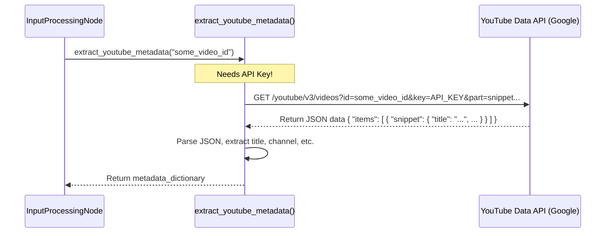

# Chapter 5: YouTube Data Utilities

Welcome back! In the previous chapter, [Topic Processing Orchestrator](04_topic_processing_orchestrator.md), we saw how our pipeline cleverly analyzes multiple topics from a video transcript in parallel. We also saw in earlier chapters how Nodes like `InputProcessingNode` and `ContentExtractionNode` magically seem to get information *about* the video (like its title) and its transcript (the spoken words).

But where does this information actually *come from*? How does our program talk to YouTube? That's where our **YouTube Data Utilities** come in!

## The Problem: Getting Data *From* YouTube

Our summarizer project starts with just one thing: a YouTube video URL (like `https://www.youtube.com/watch?v=some_video_id`). To do anything useful, we need to extract specific pieces of information directly related to that URL:

1.  **Is this even a real YouTube link?** We need to check if the URL points to a valid YouTube video before we try to process it.
2.  **What is this video about?** We need basic details like the video's title, the channel that uploaded it, and maybe how long it is (its duration). We call this "metadata".
3.  **What is being said in the video?** For topic analysis and summarization, we crucially need the spoken words, known as the transcript or captions.

Simply having the URL isn't enough. We need tools to interact with YouTube (or YouTube data sources) to fetch this information.

## Our Solution: Specialized YouTube Tools (Utilities)

Imagine you have a toolbox. You don't just have one giant "Do-Everything" tool. You have specific tools for specific jobs: a screwdriver for screws, a wrench for bolts, a hammer for nails.

Our **YouTube Data Utilities** are like these specialized tools in our project's toolbox. They are *not* full pipeline [Nodes (Pipeline Step)](02_node__pipeline_step_.md) themselves. Instead, they are smaller, focused helper functions that our Nodes *use* to perform specific tasks related to YouTube.

We have three main utility tools in our `src/utils/` directory:

1.  **The Link Checker (`validate_youtube_url`)**: Checks if a given text string looks like a valid YouTube URL and extracts the unique 11-character video ID.
2.  **The Info Fetcher (`extract_youtube_metadata`)**: Takes a video ID and fetches details like the title, channel name, duration, etc., by talking to YouTube's official Data API.
3.  **The Script Grabber (`extract_youtube_transcript`)**: Takes a video ID and retrieves the transcript (the spoken words) for that video using a specialized library.

These utilities live in their own files (like `validate_youtube_url.py`, `extract_youtube_metadata.py`, `extract_youtube_transcript.py`) inside the `src/utils/` folder, keeping our toolbox organized.

## How Nodes Use These Utilities

Our pipeline Nodes, which we learned about in [Chapter 2: Node (Pipeline Step)](02_node__pipeline_step_.md), act like the workers on the assembly line. When a worker needs to perform a YouTube-specific action, they reach into the toolbox and use the appropriate utility. This usually happens inside the Node's `exec()` method.

**Example 1: Input Processing Node using the Link Checker and Info Fetcher**

The `InputProcessingNode`'s job is to take the initial URL, validate it, and get basic video info. Here's a simplified look at how its `exec` method might use our utilities:

```python
# Simplified from src/nodes/input_processing_node.py

# Import the utility functions (tools)
from src.utils.validate_youtube_url import validate_youtube_url
from src.utils.extract_youtube_metadata import extract_youtube_metadata
# ... other imports ...

class InputProcessingNode(BaseNode):
    # ... (prep method gets the URL from shared_memory) ...

    def exec(self):
        # Get the URL we stored during prep
        youtube_url = self.shared_memory["video_url"]

        # Use the 'Link Checker' utility
        is_valid, video_id = validate_youtube_url(youtube_url)

        if not is_valid:
            # If the link is bad, report an error and stop
            self.shared_memory["error"] = "Invalid YouTube URL"
            return

        # Store the extracted video ID in shared memory
        self.shared_memory["video_id"] = video_id

        # Use the 'Info Fetcher' utility with the video ID
        metadata = extract_youtube_metadata(video_id)

        # Check if fetching metadata failed
        if "error" in metadata:
            self.shared_memory["error"] = metadata["error"]
            return

        # Store the fetched metadata in shared memory
        self.shared_memory["metadata"] = metadata

    # ... (post method logs success or failure) ...

```

In this snippet:
1.  The Node calls `validate_youtube_url` with the input URL.
2.  If valid, it gets back `True` and the `video_id`. It stores the `video_id` in [Shared Memory](03_shared_memory.md).
3.  It then calls `extract_youtube_metadata` with the `video_id`.
4.  If successful, it gets back a dictionary of metadata (title, channel, etc.) and stores it in [Shared Memory](03_shared_memory.md).

**Example 2: Content Extraction Node using the Script Grabber**

The `ContentExtractionNode`'s job is to get the transcript. It expects the `video_id` to already be in [Shared Memory](03_shared_memory.md) (put there by the `InputProcessingNode`).

```python
# Simplified from src/nodes/content_extraction_node.py

# Import the utility function (tool)
from src.utils.extract_youtube_transcript import extract_youtube_transcript
# ... other imports ...

class ContentExtractionNode(BaseNode):
    # ... (prep method gets video_id from shared_memory) ...

    def exec(self):
        # Get the video_id we stored during prep
        video_id = self.shared_memory["video_id"]

        # Use the 'Script Grabber' utility
        transcript_text = extract_youtube_transcript(video_id)

        # Check if fetching the transcript failed
        if transcript_text.startswith("Error:"):
            self.shared_memory["error"] = transcript_text
            return

        # Store the fetched transcript in shared memory
        self.shared_memory["transcript"] = transcript_text

    # ... (post method logs success or failure) ...
```

Here:
1.  The Node gets the `video_id` from [Shared Memory](03_shared_memory.md).
2.  It calls `extract_youtube_transcript` with the `video_id`.
3.  If successful, it gets back the transcript text as a string and stores it in [Shared Memory](03_shared_memory.md) under the key `"transcript"`.

These examples show how Nodes delegate specific YouTube interactions to our utility functions, keeping the Node's code focused on its main workflow (`prep`, `exec`, `post`).

## Under the Hood: How the Utilities Work

Let's briefly peek inside the toolbox and see how these tools operate.

**1. Link Checker (`validate_youtube_url`)**

This utility doesn't actually connect to the internet. It just looks at the structure of the URL string you give it. It uses pattern matching (specifically, "regular expressions") to see if the URL *looks like* common YouTube video links (e.g., `youtube.com/watch?v=...` or `youtu.be/...`). If it finds a match, it extracts the 11-character part that is the video ID.

```python
# Simplified from src/utils/validate_youtube_url.py
import re # Python's regular expression module

def validate_youtube_url(url):
    if not url: return False, ""

    # A pattern to match YouTube URLs and capture the ID
    youtube_regex = (
        r'(https?://)?(www\.)?'
        r'(youtube|youtu|youtube-nocookie)\.(com|be)/'
        r'(watch\?v=|embed/|v/|.+\?v=)?([^&=%\?]{11})' # Capture 11 chars
    )
    match = re.match(youtube_regex, url)

    if match:
        video_id = match.group(6) # Get the captured ID part
        return True, video_id
    else:
        # (Also checks other formats like youtu.be/...)
        return False, ""
```

**2. Info Fetcher (`extract_youtube_metadata`)**

This utility *does* connect to the internet. It talks to the official **YouTube Data API**, which is a service provided by Google/YouTube for developers to get video information programmatically.

*   **Needs an API Key:** To use this API, you usually need a special key (like a password) to identify yourself. Our utility looks for this key (you'll need to get one from Google and configure it for the project).
*   **Makes a Request:** It sends the `video_id` and the API key to a specific Google web address.
*   **Gets a Response:** Google sends back structured data (in JSON format) containing the video's title, description, channel, duration, view count, etc.
*   **Parses the Response:** The utility extracts the useful bits from the JSON response and returns them as a Python dictionary.



```python
# Simplified from src/utils/extract_youtube_metadata.py
import requests # Library to make web requests
import os

def extract_youtube_metadata(video_id):
    # Get API key (needs to be set up separately)
    api_key = os.environ.get("YOUTUBE_API_KEY", "YOUR_API_KEY")
    if api_key == "YOUR_API_KEY":
        return {"error": "YouTube API Key not configured"}

    api_url = "https://www.googleapis.com/youtube/v3/videos"
    params = {
        "part": "snippet,contentDetails,statistics", # Ask for specific info
        "id": video_id,
        "key": api_key
    }

    try:
        response = requests.get(api_url, params=params)
        response.raise_for_status() # Check for web errors (like 404)
        data = response.json() # Parse the JSON response

        if not data.get("items"):
             return {"error": "Video not found or API key invalid"}

        # ... (code to extract title, channel, duration etc. from data) ...
        metadata = { "title": "...", "channel_name": "...", ... }
        return metadata

    except Exception as e:
        return {"error": f"API request error: {str(e)}"}
```

**3. Script Grabber (`extract_youtube_transcript`)**

This utility uses a third-party Python library called `youtube_transcript_api`. This library knows how to find and download the captions or transcripts that YouTube provides for many videos.

*   **Uses the Library:** It calls functions from the `youtube_transcript_api` library, passing the `video_id`.
*   **Library Handles Complexity:** The library deals with finding available languages, downloading the transcript data (which includes text and timing information), and potentially translating it if needed.
*   **Returns Text:** Our utility simplifies the result, combining all the text pieces into one single string and returning it. It also handles cases where transcripts are disabled or not found.

```python
# Simplified from src/utils/extract_youtube_transcript.py

# Import the specialized library
from youtube_transcript_api import YouTubeTranscriptApi, TranscriptsDisabled, NoTranscriptFound

def extract_youtube_transcript(video_id):
    try:
        # Ask the library to find and fetch the transcript (prefer English)
        transcript_list = YouTubeTranscriptApi.list_transcripts(video_id)
        transcript = transcript_list.find_transcript(['en'])
        transcript_data = transcript.fetch()

        # Combine the text parts into one string
        full_transcript = ""
        for segment in transcript_data:
            full_transcript += segment['text'] + " "

        return full_transcript.strip()

    except TranscriptsDisabled:
        return "Error: Transcripts are disabled for this video."
    except NoTranscriptFound:
        return "Error: No transcript found for this video."
    except Exception as e:
        return f"Error extracting transcript: {str(e)}"
```

## Conclusion

In this chapter, we opened up the toolbox and looked at our **YouTube Data Utilities**. These are essential helper functions that allow our project to interact directly with YouTube data.

*   They are **specialized tools** for specific tasks: validating URLs, fetching metadata, and grabbing transcripts.
*   They are **not Nodes**, but rather **used by Nodes** (like `InputProcessingNode` and `ContentExtractionNode`) within their `exec` methods.
*   They live in the `src/utils/` directory, keeping our code organized.
*   They handle the details of pattern matching (`validate_youtube_url`), talking to the YouTube Data API (`extract_youtube_metadata`), and using libraries to get transcripts (`extract_youtube_transcript`).

These utilities provide the raw materials (metadata, transcript) that the rest of our pipeline ([Pipeline Orchestration](01_pipeline_orchestration.md)) processes to create the final summary.

Now that we have the video's transcript, how do we actually analyze it to find topics, generate Q&A, or create ELI5 summaries? This often involves using powerful Artificial Intelligence models. Let's explore the utility designed to help us interact with these AI models next.

Ready to see how we talk to the AI? Let's move on to [Chapter 6: LLM Utility](06_llm_utility.md)!

---

Generated by [AI Codebase Knowledge Builder](https://github.com/The-Pocket/Tutorial-Codebase-Knowledge)