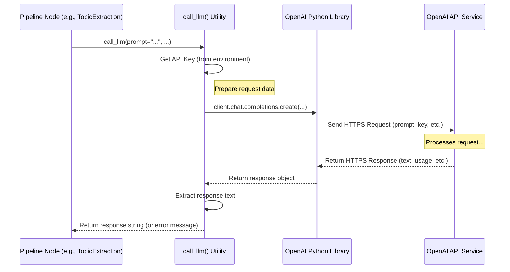

# Chapter 6: LLM Utility

Welcome back! In [Chapter 5: YouTube Data Utilities](05_youtube_data_utilities.md), we saw how our project uses specialized tools to fetch raw data from YouTube, like the video's title and the full transcript (the spoken words). We have the text, but how do we make *sense* of it? How do we automatically figure out the main topics discussed, generate questions and answers about them, or create super-simple explanations?

That sounds like a job for a super-smart assistant!

## The Problem: Understanding and Generating Content

Imagine you have the complete script of a movie. Just reading the script doesn't automatically tell you the main plot points, the underlying themes, or answers to specific questions about the story. You need to *analyze* it.

Similarly, our Nodes, like the `TopicExtractionNode` or the `TopicProcessorNode`, need to analyze the video transcript. They need to:
*   Identify the core subjects being discussed.
*   Maybe create questions a viewer might have about those subjects.
*   Perhaps summarize a complex idea in simple terms.

Doing this analysis accurately and creatively requires advanced understanding of language and context – something traditional programming struggles with. We need help from a powerful Artificial Intelligence (AI).

## Our Solution: A Direct Line to an AI Expert (LLM Utility)

Modern AI includes something called **Large Language Models (LLMs)**. Think of models like GPT-4 (from OpenAI) as incredibly knowledgeable experts you can chat with. They have read vast amounts of text and can understand language, generate creative text, answer questions, summarize information, and much more.

But how do our different Nodes talk to this AI expert? We don't want each Node to figure out the complex details of connecting to the AI service, handling authentication, formatting requests, and parsing responses every time. That would be repetitive and complicated!

So, we created the **LLM Utility**. It's like having a **dedicated, standardized phone line** straight to our AI expert (the LLM).

*   **Standardized:** Every Node uses the *same* simple function (`call_llm`) to talk to the AI.
*   **Simplified:** The utility hides all the complex connection details. Nodes just need to know *what* question to ask.
*   **Centralized:** All AI communication goes through this one utility, making it easier to manage and update.

Any Node in our pipeline that needs help from the AI – whether it's the `TopicExtractionNode` asking "What are the main topics here?" or the `TopicProcessorNode` asking "Explain this topic like I'm 5" – uses this same utility function.

## Asking the Right Question: The Prompt

When you call an expert, you don't just say "Hello?". You need to give them context and clearly state what you need. When we talk to an LLM, this is called a **Prompt**.

A prompt typically includes:
1.  **Instructions:** What task should the AI perform? (e.g., "Identify the main topics", "Generate questions and answers", "Explain this simply")
2.  **Context:** What information does the AI need to do the task? (e.g., the video transcript segment, the specific topic name)
3.  **Format Constraints (Optional):** How should the AI format its answer? (e.g., "Respond with ONLY a JSON list", "Keep it under 100 words")

Here's a simple example of a prompt the `TopicExtractionNode` might create:

```text
You are an expert at analyzing video content.
I have a segment of a video transcript. Please identify the 3 main topics discussed.
List them as short phrases.

Transcript Segment:
[... a chunk of the video transcript text goes here ...]

Respond with ONLY a JSON array of topic strings, like ["Topic A", "Topic B", "Topic C"].
```
This prompt tells the AI its role, the task, provides the necessary text, and specifies the output format.

## How Nodes Use the LLM Utility: `call_llm`

Our Nodes use a single, simple function from our toolbox (`src/utils/`) called `call_llm`. This function takes the carefully crafted prompt and handles sending it to the AI and getting the response back.

Let's look at a simplified example from the `TopicExtractionNode` (which we saw in the context provided earlier). Inside its `_process_chunk` method, it needs to find topics within a piece of the transcript (`chunk`):

```python
# Simplified from src/nodes/topic_extraction_node.py

# Import the utility function
from src.utils.call_llm import call_llm
# ... other imports like textwrap ...

class TopicExtractionNode(BaseNode):
    # ... other methods like __init__, prep ...

    def _process_chunk(self, chunk_index: int, chunk: str):
        logger.info(f"Processing chunk {chunk_index+1}...")

        # 1. Create the prompt (instructions + context)
        prompt = textwrap.dedent(f"""
        You are an expert at analyzing video content.
        Identify the main topics in this transcript segment.
        Provide at most {self.max_topics} topics as short phrases.

        Transcript segment:
        {chunk[:2000]}...

        Respond with ONLY a JSON array of topic strings.
        """)

        # 2. Call the LLM Utility!
        try:
            logger.info(f"Calling LLM for chunk {chunk_index+1}...")
            # Just one simple function call to talk to the AI!
            response_text = call_llm(
                prompt=prompt,
                temperature=0.3, # Lower temperature = more focused/deterministic output
                max_tokens=200,  # Limit the length of the response
                timeout=30       # Wait max 30 seconds for a response
            )
            logger.info(f"Received LLM response for chunk {chunk_index+1}")

            # 3. Process the response (e.g., parse the JSON)
            # ... (code to handle the response_text) ...
            # extracted_topics = parse_json(response_text)
            # return extracted_topics

        except Exception as e:
            logger.error(f"Error calling LLM for chunk {chunk_index+1}: {str(e)}")
            # ... (handle error) ...
            return []

```

In this example:
1.  The Node constructs the `prompt` string with instructions and the relevant `chunk` of the transcript.
2.  It makes a single call to `call_llm`, passing the `prompt`. It can also pass optional parameters like:
    *   `temperature`: Controls creativity. Lower values (like 0.3) make the output more predictable and focused; higher values make it more random.
    *   `max_tokens`: Limits how long the AI's response can be.
    *   `timeout`: Sets a maximum time to wait for the AI to respond.
3.  The `call_llm` function handles all the communication complexity. It returns the AI's response as a simple text string (`response_text`).
4.  The Node then processes this `response_text` (e.g., parsing it if it expects JSON).

That's it! The Node doesn't need to worry about API keys, network requests, or complex error handling for the AI communication itself – the `call_llm` utility takes care of it.

## Under the Hood: Dialing the Expert

What actually happens when a Node calls `call_llm`? Let's trace the call.

1.  **Get Credentials:** The `call_llm` function first needs the secret "phone number" and "password" to connect to the AI service (like OpenAI). This is usually an **API Key**, which it securely reads from the system's environment settings (so we don't store secrets directly in the code).
2.  **Prepare the Call:** It packages the `prompt` and any other parameters (like `temperature`) into the specific format the AI service expects.
3.  **Make the Connection:** It uses a library (like OpenAI's official Python library) to send the request over the internet to the AI service's servers.
4.  **Wait for Response:** It waits for the AI to process the prompt and generate a response. This can take a few seconds. It also keeps an eye on the `timeout` limit.
5.  **Receive Answer:** It gets the response text back from the AI service.
6.  **Return or Report Error:** If successful, it returns the response text to the Node. If anything went wrong (bad API key, network error, timeout, rate limit), it logs the error and returns a helpful error message string.

Here’s a simplified diagram of this flow:



## Diving into the Code (`src/utils/call_llm.py`)

Let's peek inside the `call_llm` function in `src/utils/call_llm.py`. Remember, we'll keep it simple!

**1. Getting the API Key**

The function first needs to find the secret API key. It looks for an "environment variable" named `OPENAI_API_KEY`. You need to set this variable up in your system separately.

```python
# Simplified from src/utils/call_llm.py
import os
import logging

def call_llm(prompt, ...):
    # Get API key from environment variable
    api_key = os.environ.get("OPENAI_API_KEY")

    if not api_key:
        logging.error("OpenAI API key not found!")
        return "Error: OpenAI API key not found."

    # ... (rest of the function)
```
This code uses Python's `os` module to read the environment variable. If it's not found, it immediately returns an error message.

**2. Setting up the Connection (Client)**

Next, it uses the official `openai` library to create a "client" object, which knows how to talk to the OpenAI API.

```python
# Simplified from src/utils/call_llm.py
from openai import OpenAI # The official library
# ... other imports ...

def call_llm(prompt, model="gpt-4o", temperature=0.7, max_tokens=1000, timeout=60):
    # ... (get api_key) ...

    try:
        # Initialize the client with the API key
        client = OpenAI(api_key=api_key)

        # ... (make the API call using 'client') ...

    except Exception as e:
        logging.exception("Error initializing OpenAI client")
        return f"Error initializing client: {str(e)}"
```
This sets up the communication channel using the API key.

**3. Making the Call**

Now, it uses the `client` object to actually send the prompt to the specified AI model.

```python
# Simplified from src/utils/call_llm.py
# ... inside the 'try' block ...

        try:
            logging.debug(f"Calling OpenAI model {model}...")
            # This is the actual call to the AI service
            response = client.chat.completions.create(
                model=model,
                messages=[{"role": "user", "content": prompt}], # Pass the prompt
                temperature=temperature,     # Pass other parameters
                max_tokens=max_tokens,
                timeout=timeout
            )
            logging.debug("OpenAI call successful.")

            # ... (extract the text response) ...

        except Exception as api_error:
            logging.error(f"OpenAI API error: {str(api_error)}")
            # Handle specific errors like timeouts or rate limits
            if "timeout" in str(api_error).lower():
                 return "Error: LLM API call timed out."
            # ... other error handling ...
            return f"Error calling LLM API: {str(api_error)}"

```
The `client.chat.completions.create` method does the heavy lifting of communicating with OpenAI. We wrap this in another `try...except` block to catch specific API errors like timeouts.

**4. Getting the Answer**

If the call is successful, the `response` object contains the AI's answer. We need to extract the actual text content.

```python
# Simplified from src/utils/call_llm.py
# ... inside the successful API call 'try' block ...

            # Extract the text from the response object
            content = response.choices[0].message.content
            logging.debug(f"Received response length: {len(content)}")
            return content # Return the text to the Node

```
The useful text is nested inside the `response` object. We extract it and return it as a simple string.

This utility simplifies AI interaction for all Nodes, providing a consistent and robust way to leverage the power of LLMs.

## Conclusion

In this chapter, we learned about the **LLM Utility**, our project's standardized way of communicating with Large Language Models like GPT-4.

*   **Problem:** Nodes need to perform complex language tasks (topic extraction, Q&A, summarization) that require AI.
*   **Solution:** A central utility function (`call_llm`) provides a simple, consistent interface to the AI.
*   **Analogy:** It's like a dedicated phone line to an AI expert.
*   **Prompts:** Nodes craft instructions and context (`prompts`) to tell the AI what to do.
*   **Usage:** Nodes call `call_llm(prompt, ...)` and receive the AI's response as text.
*   **Under the Hood:** The utility handles API keys, network requests, timeouts, and basic error handling using the official OpenAI library.

This utility is a key component, enabling sophisticated analysis and content generation within our pipeline. Without it, tasks like topic extraction or creating ELI5 summaries would be much harder!

Now that we've gathered video info ([Chapter 5](05_youtube_data_utilities.md)), extracted the transcript, and analyzed it using the LLM ([Chapter 6](06_llm_utility.md)) to get topics, Q&A, and summaries stored in [Shared Memory](03_shared_memory.md), how do we present all this information nicely to the user?

Let's move on to the final step: putting everything together into a user-friendly report with [Chapter 7: HTML Generation](07_html_generation.md)!

---

Generated by [AI Codebase Knowledge Builder](https://github.com/The-Pocket/Tutorial-Codebase-Knowledge)