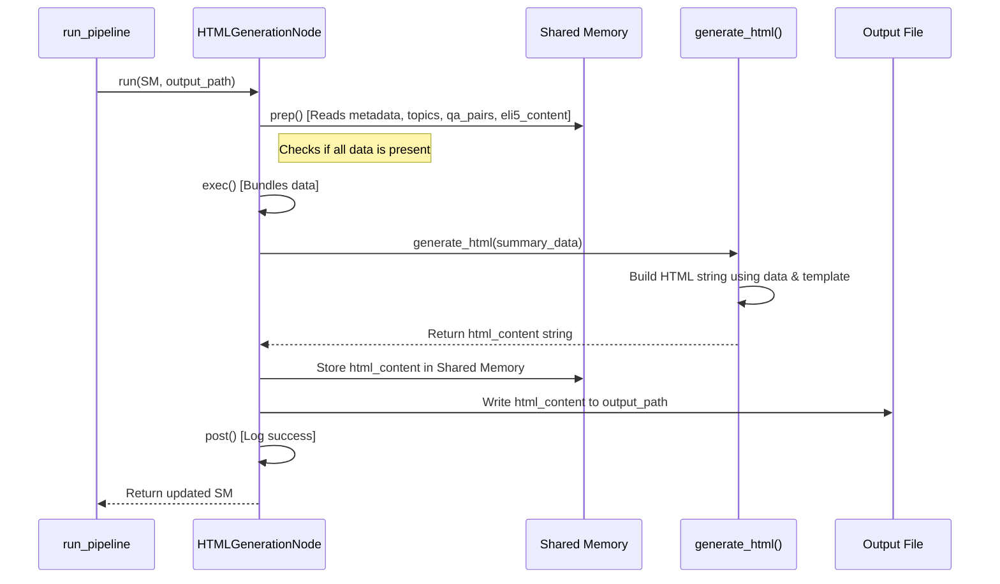

# Chapter 7: HTML Generation

Welcome back! In [Chapter 6: LLM Utility](06_llm_utility.md), we saw how our project uses a powerful AI assistant (a Large Language Model) to analyze the video transcript and generate insightful content like topics, Q&A pairs, and simple ELI5 explanations. All these results are carefully stored in our central [Shared Memory](03_shared_memory.md) dictionary.

But right now, all that great information is just sitting inside a Python dictionary. That's not very easy for a person to read or share! Imagine getting a big pile of notes and data scribbled on scraps of paper. You'd want someone to organize it into a polished, easy-to-read final report.

That's exactly what **HTML Generation** does in our `pf1` project!

## The Problem: Presenting Results Nicely

Our pipeline has worked hard:
1.  It fetched video info ([Chapter 5: YouTube Data Utilities](05_youtube_data_utilities.md)).
2.  It extracted the transcript.
3.  It identified topics ([Chapter 4: Topic Processing Orchestrator](04_topic_processing_orchestrator.md)).
4.  It generated Q&A and ELI5 summaries using AI ([Chapter 6: LLM Utility](06_llm_utility.md)).

All these pieces – the video title, the list of topics, the questions and answers, the simple explanations – are collected in the [Shared Memory](03_shared_memory.md) dictionary. But how do we show this to the user in a way that looks good and is easy to understand?

## Our Solution: The Report Creator (HTML Generation Node)

We need a final step in our pipeline that acts like a **report generator** or a **desktop publisher**. Its job is to take all the processed data and arrange it neatly into a final document.

In our project, this final document is an **HTML file**. HTML (HyperText Markup Language) is the standard language used to create web pages. By generating an HTML file, we create a report that can be easily opened and viewed in any web browser (like Chrome, Firefox, or Safari), complete with nice formatting, images, and links.

The component responsible for this is the **`HTMLGenerationNode`**. It's typically the *last* [Node (Pipeline Step)](02_node__pipeline_step_.md) run by our [Pipeline Orchestration](01_pipeline_orchestration.md).

**What it does:**
1.  **Gathers Ingredients:** Reads all the necessary results (metadata, topics, Q&A, ELI5) from the [Shared Memory](03_shared_memory.md).
2.  **Follows a Recipe:** Uses a template (like a recipe) to structure this information into an HTML format.
3.  **Creates the Dish:** Generates the final HTML text.
4.  **Serves It:** Saves this HTML text into a file (e.g., `summary.html`) that the user can open.

## How the HTML Generation Node Fits In

The `run_pipeline` function ([Chapter 1: Pipeline Orchestration](01_pipeline_orchestration.md)) calls the `HTMLGenerationNode` after all the analysis is done.

```python
# Simplified snippet from src/main.py

# ... (Previous nodes ran, shared_memory has metadata, topics, qa_pairs, eli5_content)

# 5. HTML Generation Node
logger.info("[5/5] Starting HTML Generation...")
# Create the node, telling it where to save the file
html_node = HTMLGenerationNode(
    shared_memory,
    output_path=f"{output_dir}/summary_{shared_memory['video_id']}.html"
)

# Run the node - this creates the HTML content and file
shared_memory = html_node.run()

# Check for errors
if "error" in shared_memory:
    logger.error(f"HTML Generation failed...")
    # Handle error
else:
    logger.info(f"HTML report saved successfully!")
    # The path to the HTML file is usually stored in shared_memory now
    # (or determined by the output_path we gave it)

logger.info("Pipeline finished!")
return shared_memory
```
Here, the orchestrator creates the `HTMLGenerationNode`, passes it the final `shared_memory` containing all results, and tells it where to save the output file (e.g., `output/summary_videoID.html`). Calling `html_node.run()` triggers the creation of the HTML report.

## What Happens Inside the Node: Prep, Exec, Post

Like all our Nodes ([Chapter 2: Node (Pipeline Step)](02_node__pipeline_step_.md)), the `HTMLGenerationNode` follows the standard `prep -> exec -> post` workflow.

1.  **`prep()` (Get Ready):**
    *   Checks the [Shared Memory](03_shared_memory.md) to make sure all the required data pieces are present (e.g., `"metadata"`, `"topics"`, `"qa_pairs"`, `"eli5_content"`).
    *   If anything crucial is missing, it raises an error.
    *   If a previous step already reported an error, it might decide to skip HTML generation.

2.  **`exec()` (Do the Work):**
    *   Bundles the required data (metadata, topics, etc.) into a structure that's easy to work with.
    *   Calls a special helper function (a utility like the ones in [Chapter 5](05_youtube_data_utilities.md)) called `generate_html`. This utility takes the data and does the actual work of creating the HTML string.
    *   Stores the generated HTML content back into [Shared Memory](03_shared_memory.md) (e.g., under the key `"html_output"`).
    *   If an `output_path` was provided (like in the `main.py` example), it writes the generated HTML content to that file on the disk.

3.  **`post()` (Clean Up):**
    *   Logs whether the HTML was generated successfully.
    *   Checks if the HTML content was actually created and added to shared memory. Reports an error if not.

## The Magic Tool: `generate_html` Utility

The `HTMLGenerationNode` doesn't contain messy HTML code directly. Instead, it delegates the task of creating the HTML structure to a helper function: `generate_html` (found in `src/utils/generate_html.py`).

Think of `generate_html` as a **template filler**. It has a predefined structure for the HTML page (like a fill-in-the-blanks form letter) and knows where to plug in the specific data (video title, topics, Q&A, etc.) that it receives from the `HTMLGenerationNode`.

**How it works (simplified):**
1.  **Gets Data:** Receives the `summary_data` dictionary from the Node.
2.  **Starts HTML:** Begins creating the HTML string with standard tags (`<html>`, `<head>`, `<body>`).
3.  **Adds Styling:** Includes CSS rules inside `<style>` tags to make the page look nice (colors, fonts, layout).
4.  **Inserts Header:** Puts the video title, channel name, thumbnail, and YouTube link near the top.
5.  **Loops Through Topics:** Goes through each topic in the list. For each topic:
    *   Creates a section header (e.g., "Topic 1: Music Video Plot").
    *   Adds the ELI5 explanation for that topic.
    *   Adds the Q&A pairs associated with that topic, formatting the questions and answers clearly.
6.  **Adds Footer:** Puts some concluding text at the bottom.
7.  **Returns HTML:** Returns the complete HTML content as one long string.

**Important Note on Security:** When putting data from potentially external sources (like video titles or Q&A generated by AI) into HTML, it's crucial to "escape" special characters (like `<`, `>`, `&`). The `generate_html` utility uses Python's `html.escape()` function to do this, preventing potential security issues like Cross-Site Scripting (XSS).

## Visualizing the Flow

Here's how the `HTMLGenerationNode` works with the `generate_html` utility:


This shows the Node getting data from Shared Memory, using the utility to create the HTML, and then saving it both back to Shared Memory and to the file system.

## Diving into the Code

Let's look at simplified snippets.

**`HTMLGenerationNode` (`src/nodes/html_generation_node.py`)**

```python
# Simplified from src/nodes/html_generation_node.py
import os
from src.nodes.base_node import BaseNode
from src.utils.generate_html import generate_html # Import the helper
from src.utils.logger import logger

class HTMLGenerationNode(BaseNode):
    def __init__(self, shared_memory=None, output_path=None):
        super().__init__(shared_memory)
        self.output_path = output_path # Store the save location
        logger.debug("HTML Node ready.")

    def prep(self):
        # Check if needed data exists in shared_memory
        required = ["video_id", "metadata", "topics", "qa_pairs", "eli5_content"]
        if not all(key in self.shared_memory for key in required):
            raise ValueError("Missing data for HTML generation!")
        logger.info("Preparing to generate HTML.")

    def exec(self):
        # Bundle the data
        summary_data = {key: self.shared_memory[key] for key in required}

        # Call the utility to create the HTML string
        logger.debug("Calling generate_html function")
        html_content = generate_html(summary_data)
        self.shared_memory["html_output"] = html_content

        # Save to file if path is given
        if self.output_path:
            try:
                # Ensure directory exists
                os.makedirs(os.path.dirname(self.output_path), exist_ok=True)
                # Write file (UTF-8 ensures special characters work)
                with open(self.output_path, "w", encoding="utf-8") as f:
                    f.write(html_content)
                logger.info(f"HTML saved to: {self.output_path}")
            except Exception as e:
                logger.error(f"Error saving HTML file: {e}")
                self.shared_memory["error"] = f"Failed to save HTML: {e}"

    def post(self):
        if "error" not in self.shared_memory:
            logger.info("HTML Generation completed successfully.")
        # (Error logging happens in prep/exec)
```
This Node clearly shows the `prep` check, calling `generate_html` in `exec`, storing the result, and saving the file.

**`generate_html` Utility (`src/utils/generate_html.py`)**

```python
# Simplified from src/utils/generate_html.py
import html # For escaping special characters

def generate_html(summary_data):
    # Get data, use defaults if missing
    title = html.escape(summary_data.get("metadata", {}).get("title", "Summary"))
    topics = summary_data.get("topics", [])
    qa_pairs = summary_data.get("qa_pairs", {})
    eli5 = summary_data.get("eli5_content", {})

    # Start building the HTML string
    html_str = f"""<!DOCTYPE html>
<html><head><title>{title}</title><style>/* CSS styles */</style></head><body>
<h1>Summary for: {title}</h1>"""

    # Loop through topics
    for i, topic in enumerate(topics):
        topic_esc = html.escape(topic)
        eli5_esc = html.escape(eli5.get(topic, "N/A"))
        html_str += f"<h2>Topic {i+1}: {topic_esc}</h2><p>{eli5_esc}</p>"

        # Add Q&A for this topic
        html_str += "<h3>Questions & Answers</h3>"
        topic_qas = qa_pairs.get(topic, [])
        if topic_qas:
            for qa in topic_qas:
                q = html.escape(qa.get("question", ""))
                a = html.escape(qa.get("answer", ""))
                html_str += f"<div class='question'>Q: {q}</div><div class='answer'>A: {a}</div>"
        else:
            html_str += "<p>No Q&A available.</p>"

    # Finish the HTML
    html_str += "<footer>Generated by pf1.</footer></body></html>"
    return html_str
```
This utility function takes the data and constructs the HTML string, making sure to use `html.escape()` on dynamic content like titles, topics, questions, and answers.

## Conclusion

In this chapter, we explored the final step in our pipeline: **HTML Generation**.

*   **Purpose:** To present all the analyzed video information (metadata, topics, Q&A, ELI5) in a user-friendly, visually appealing format.
*   **Mechanism:** The `HTMLGenerationNode` reads the results from [Shared Memory](03_shared_memory.md).
*   **Helper Utility:** It uses the `generate_html` function, which acts like a template filler, to create the actual HTML content.
*   **Output:** Produces an HTML string (stored in Shared Memory) and saves it as an `.html` file that can be opened in a web browser.

This node turns the complex data collected throughout the pipeline into a tangible, understandable report for the end-user.

Throughout these chapters, we've seen mentions of `logger.info`, `logger.error`, etc. How does our program keep track of what it's doing, report progress, and help us find problems? That's the job of our logging system.

Let's dive into how logging works in our project in the next chapter: [Chapter 8: Logging](08_logging.md)!

---

Generated by [AI Codebase Knowledge Builder](https://github.com/The-Pocket/Tutorial-Codebase-Knowledge)