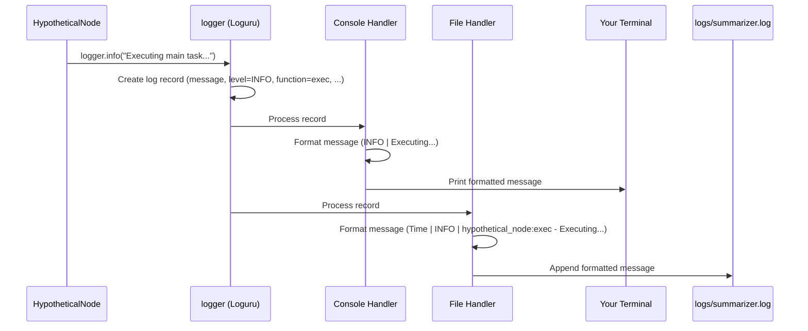

# Chapter 8: Logging

Welcome to the final chapter! In [Chapter 7: HTML Generation](07_html_generation.md), we saw how our `pf1` pipeline takes all the analyzed data and creates a beautiful, easy-to-read HTML report. Our program successfully went from a YouTube URL to a full summary!

But wait... while the pipeline was running all those steps – fetching data, extracting transcripts, talking to AI, generating HTML – how did we know what was happening? What if something went wrong halfway through? How could we track the progress or diagnose a problem?

That's where **Logging** comes in!

## What is Logging? The Ship's Logbook

Imagine a ship on a long voyage. The captain and crew keep a detailed **logbook**. They record important events: when they left port, the weather conditions, any interesting sightings, course changes, and crucially, any problems encountered (like a leak or equipment failure). Later, anyone can read this logbook to understand what happened during the voyage.

**Logging** in a computer program is exactly like keeping this logbook. It's a way for the program to write down messages about what it's doing as it runs. These messages can include:
*   Information about progress ("Starting transcript extraction...")
*   Warnings about potential issues ("API key not found, using default...")
*   Errors that occurred ("Failed to connect to YouTube API!")
*   Detailed debugging information useful for developers.

## Why Do We Need Logging?

Keeping this "program logbook" is super important for several reasons:

1.  **Monitoring Progress:** When you run the `pf1` summarizer, especially on a long video, it might take a while. Logging messages printed to the screen (the "console") tell you what step the program is currently working on, so you know it hasn't crashed.
    *   Example: Seeing `[1/5] Starting Input Processing...`, `[2/5] Starting Content Extraction...` helps you track its progress.
2.  **Diagnosing Problems (Debugging):** If the program crashes or gives a weird result, the log messages are often the first place developers look. Error messages pinpoint where things went wrong, and earlier informational messages show the sequence of events leading up to the failure. It's like reading the ship's log to figure out why it went off course.
3.  **Understanding Behaviour:** Sometimes, you just want to understand *how* the program made a decision or what data it was working with at a certain point. Detailed logs can provide this insight.

Without logging, running a complex program would be like navigating a ship in thick fog with no instruments – you wouldn't know where you are, where you're going, or if you're about to hit something!

## Logging Levels: Different Kinds of Messages

Not all events are equally important. A ship's log might note "Sighted dolphins" (interesting info) but would highlight "Taking on water!" (critical error) much more prominently.

Logging systems use different **levels** to categorize messages:

*   **INFO:** General information about the program's progress. What's happening now? (e.g., `Starting HTML generation...`)
*   **WARNING:** Indicates something unexpected happened, but the program can probably continue. It's a heads-up. (e.g., `Transcript language not specified, defaulting to English.`)
*   **ERROR:** A serious problem occurred. The current task likely failed, but the program might try to continue with other tasks if possible. (e.g., `Failed to extract topics for chunk 3.`)
*   **CRITICAL:** A very severe error, likely meaning the entire program has to stop. (e.g., `Cannot create output directory! Aborting.`)
*   **DEBUG:** Very detailed information, mostly useful only for developers trying to fix bugs. (e.g., `Variable 'x' has value: 42`)

You can usually configure the logging system to only show messages above a certain level. For normal use, you might only want to see `INFO` and above. When debugging, you might enable `DEBUG` messages too.

## Our Logging Setup in `pf1` (`src/utils/logger.py`)

In our `pf1` project, we use a popular and easy-to-use Python library called **Loguru** to handle logging. We have a dedicated setup file: `src/utils/logger.py`.

This file does one main thing: it sets up our "logger" object, telling it *how* and *where* to record messages.

Here’s a simplified look at the `setup_logger` function inside that file:

```python
# Simplified from src/utils/logger.py
import sys
import os
from datetime import datetime
from loguru import logger # Import the library

def setup_logger(log_dir="logs"):
    # Create a directory to store log files if it doesn't exist
    os.makedirs(log_dir, exist_ok=True)
    timestamp = datetime.now().strftime("%Y%m%d_%H%M%S")
    log_file = os.path.join(log_dir, f"youtube_summarizer_{timestamp}.log")

    # --- Configuration Starts Here ---
    logger.remove() # Clear any default settings

    # 1. Log to the Console (what you see on screen)
    logger.add(
        sys.stdout, # 'stdout' means the standard console output
        level="INFO", # Show INFO messages and above (WARNING, ERROR)
        colorize=True, # Make the output colorful!
        format="<level>{level: <8}</level> | <level>{message}</level>" # Simple format
    )

    # 2. Log to a File (for detailed history)
    logger.add(
        log_file, # The path to the log file (e.g., logs/youtube_summarizer_20231027_103000.log)
        level="DEBUG", # Record EVERYTHING (including detailed DEBUG messages) in the file
        format="{time} | {level} | {name}:{function} - {message}" # More detailed format
    )
    # --- Configuration Ends Here ---

    logger.info("Logging initialized.")
    return logger

# Create the logger instance that the rest of the project will use
logger = setup_logger()
```
**Explanation:**

1.  **Import Loguru:** We bring in the `loguru` library.
2.  **Create Log File Path:** It decides where to save the log file, putting it in a `logs` folder and adding a timestamp to the filename so each run gets its own file.
3.  **Console Logging (`logger.add(sys.stdout, ...)`):**
    *   This tells Loguru to send messages to your terminal screen (`sys.stdout`).
    *   `level="INFO"` means you'll see `INFO`, `WARNING`, `ERROR`, and `CRITICAL` messages on the screen, but not `DEBUG` messages (they are usually too noisy for regular users).
    *   `colorize=True` makes the output easier to read with colors (e.g., errors might be red).
    *   `format="..."` defines how each log message looks on the screen (here, just the level and the message).
4.  **File Logging (`logger.add(log_file, ...)`):**
    *   This tells Loguru to also write messages to the `log_file` it prepared earlier.
    *   `level="DEBUG"` means *all* messages, including the detailed `DEBUG` ones, will be saved in the file. This is super helpful for developers later!
    *   `format="..."` uses a slightly different format for the file, including the timestamp, level, and where the message came from (file name, function name).
5.  **Return Logger:** The function returns the configured `logger` object. The last line, `logger = setup_logger()`, makes this configured logger available for the rest of the project to import and use.

So, when our program logs something, it usually appears in two places: nicely formatted on your screen, and stored with full details in a log file!

## How to Use the Logger in `pf1`

Using the logger in any part of our project (like inside a [Node (Pipeline Step)](02_node__pipeline_step_.md) or a utility function) is very simple:

1.  **Import it:** Add this line at the top of your Python file:
    ```python
    from src.utils.logger import logger
    ```

2.  **Call its methods:** Whenever you want to record something, call the appropriate method on the `logger` object:
    *   `logger.info("This is just information.")`
    *   `logger.warning("This might be a problem.")`
    *   `logger.error("Something definitely went wrong here.")`
    *   `logger.debug("Details for the developers.")`

**Example inside a hypothetical Node:**

```python
# hypothetical_node.py
from src.utils.logger import logger # 1. Import the logger

class HypotheticalNode:
    def __init__(self, shared_memory):
        self.shared_memory = shared_memory
        logger.info("HypotheticalNode created.") # Log during creation

    def prep(self):
        logger.debug("Prep phase starting.") # Detailed debug message
        if "input_data" not in self.shared_memory:
            logger.error("Input data is missing!") # Log an error
            self.shared_memory["error"] = "Missing input_data"
            return # Stop prep
        self.data = self.shared_memory["input_data"]
        logger.info("Preparation complete. Data found.") # Log success info

    def exec(self):
        if "error" in self.shared_memory: return # Don't run if prep failed
        logger.info("Executing main task...") # Log start of execution
        # ... do the actual work ...
        result = f"Processed {self.data}"
        self.result = result
        logger.debug(f"Intermediate result: {result}") # Log internal details

    def post(self):
        if "error" in self.shared_memory: return # Don't run if errors
        logger.info("Post-processing results...") # Log start of post
        self.shared_memory["output"] = self.result
        logger.info("Results added to shared memory.") # Log completion

    def run(self):
        self.prep()
        self.exec()
        self.post()
        logger.info("HypotheticalNode finished.") # Log node completion
        return self.shared_memory

# --- Example Usage (not part of the Node class) ---
# node = HypotheticalNode({"input_data": "some value"})
# node.run()
```
When this code runs:
*   You'd see `INFO` and `ERROR` messages on your console (because we set console level to `INFO`).
*   The log file (`logs/youtube_summarizer_....log`) would contain *all* the messages, including the `DEBUG` ones, along with timestamps and function names.

## Under the Hood: How Loguru Knows Where You Are

You might wonder how the log message in the file includes details like the function name (`prep`, `exec`) where the log was called. Loguru is clever! When you call `logger.info("...")`, Loguru automatically inspects the program's current state to find out which file, function, and line number made the call. It then includes this information in the log record, which the file handler uses in its format string.

Here's a simplified view of what happens:


This shows the Node calling the logger. The logger creates a detailed record and passes it to both configured handlers (Console and File). Each handler formats the record according to its settings and sends it to the final destination (screen or file).

## Conclusion

And that's logging! It's the essential practice of recording events during your program's execution. We learned:

*   **What it is:** Like a ship's logbook for your code.
*   **Why it's crucial:** For monitoring progress, diagnosing errors (debugging), and understanding behaviour.
*   **Levels:** Messages have different severities (DEBUG, INFO, WARNING, ERROR, CRITICAL).
*   **In `pf1`:** We use the **Loguru** library, configured in `src/utils/logger.py`.
*   **Dual Output:** Logs go to the console (INFO+) with colors and to a timestamped file (DEBUG+) with full details.
*   **Usage:** Simply `from src.utils.logger import logger` and call methods like `logger.info()`, `logger.error()`, etc.

Effective logging turns a mysterious black box program into something transparent and understandable, making development and troubleshooting much easier.

---

**This concludes our tutorial series for the `pf1` YouTube Summarizer project!**

We've journeyed through the core concepts:
1.  [Pipeline Orchestration](01_pipeline_orchestration.md): The overall manager coordinating the steps.
2.  [Node (Pipeline Step)](02_node__pipeline_step_.md): The specialized workers performing individual tasks.
3.  [Shared Memory](03_shared_memory.md): The central dictionary for passing data between Nodes.
4.  [Topic Processing Orchestrator](04_topic_processing_orchestrator.md): A specialized Node managing parallel topic analysis.
5.  [YouTube Data Utilities](05_youtube_data_utilities.md): Tools for fetching data from YouTube.
6.  [LLM Utility](06_llm_utility.md): Our interface for talking to the AI.
7.  [HTML Generation](07_html_generation.md): Creating the final user-friendly report.
8.  [Logging](08_logging.md): Recording the program's journey.

We hope this gives you a solid foundation for understanding how `pf1` works and empowers you to explore, modify, and contribute to the project. Happy coding!

---

Generated by [AI Codebase Knowledge Builder](https://github.com/The-Pocket/Tutorial-Codebase-Knowledge)