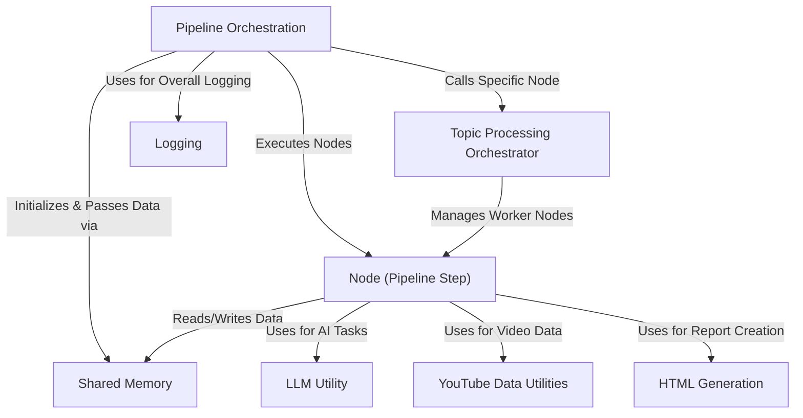

# Tutorial: pf1

This project acts like an automatic **report writer** for YouTube videos.
You give it a *YouTube video link*, and it watches the video (by reading its *transcript*) to understand the main points.
It uses **Artificial Intelligence (AI)** to identify key *topics*, create simple **question & answer pairs** about them, and even write an **"Explain Like I'm 5"** summary for each topic.
Finally, it neatly organizes all this information into a web page (**HTML report**) for easy reading.

**Source Repository:** [https://github.com/Kjdragan/pf1](https://github.com/Kjdragan/pf1)

## Chapters

1. [Pipeline Orchestration](01_pipeline_orchestration.md)
2. [Node (Pipeline Step)](02_node__pipeline_step_.md)
3. [Shared Memory](03_shared_memory.md)
4. [Topic Processing Orchestrator](04_topic_processing_orchestrator.md)
5. [YouTube Data Utilities](05_youtube_data_utilities.md)
6. [LLM Utility](06_llm_utility.md)
7. [HTML Generation](07_html_generation.md)
8. [Logging](08_logging.md)

---

Generated by [AI Codebase Knowledge Builder](https://github.com/The-Pocket/Tutorial-Codebase-Knowledge)