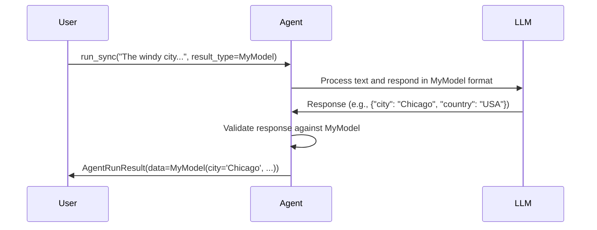
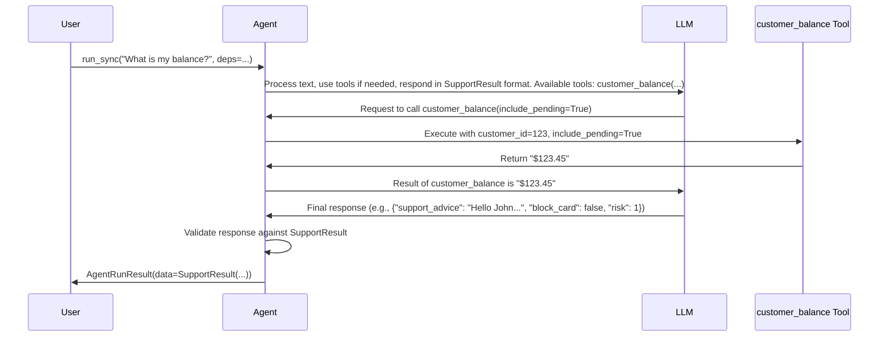

# Chapter 1: Meet the Agent - Your AI Project Manager

Welcome to the `pydantic-ai` tutorial! We're excited to help you build powerful applications that leverage the magic of Large Language Models (LLMs) like GPT-4o, Gemini, Llama, and others.

Imagine you want to build an AI assistant. Maybe it needs to answer customer questions, extract information from text, or even book flights. Doing this often involves multiple steps: understanding the user's request, talking to an AI model, maybe looking up information elsewhere, and finally presenting the result in a useful format. Juggling all these steps can get complicated quickly!

This is where the `Agent` comes in. Think of it as the central **project manager** or "brain" for your AI task.

## What's the Big Idea?

Let's say you want to ask an AI, "What's the capital of France?", but you don't just want the text "Paris". You want a structured answer, maybe like this:

```json
{
  "city": "Paris",
  "country": "France"
}
```

Getting an LLM to consistently produce perfectly formatted JSON (or any structure) can be tricky. The `Agent` in `pydantic-ai` is designed to handle this coordination for you.

## What is an Agent?

The `Agent` is the main coordinator in `pydantic-ai`. Its job is to:

1.  **Receive a Request:** It takes your input, like a question or instruction (we call this the "prompt").
2.  **Think and Plan:** It figures out how to fulfill the request. This usually involves talking to an LLM.
3.  **Use Tools (Optional):** If the LLM needs extra information (like today's weather or a customer's account balance) or needs to perform an action (like sending an email), the Agent can use predefined **[Tools](05_tool.md)**. Think of these as specialists the project manager can delegate tasks to.
4.  **Talk to the LLM:** It sends the prompt, instructions, and any information gathered from tools to an LLM (like GPT-4o). It tells the LLM what kind of structured output it expects.
5.  **Get the Result:** It receives the response from the LLM.
6.  **Ensure Quality:** It checks if the LLM's response matches the desired structure (using Pydantic models!). If not, it might ask the LLM to try again.
7.  **Deliver:** It gives you the final, structured result.

## Your First Agent: Simple Information Extraction

Let's build an Agent that extracts a city and country from a piece of text.

**Goal:** Turn "The windy city in the US of A." into structured data.

**1. Define the Desired Structure:**
First, we tell the Agent what we want the final output to look like. We use a standard Pydantic `BaseModel` for this.

```python
# examples/pydantic_ai_examples/pydantic_model.py
from pydantic import BaseModel

class MyModel(BaseModel):
    city: str
    country: str
```

This simple class defines that our result must have a `city` field (string) and a `country` field (string).

**2. Create the Agent:**
Now, we create the Agent. We need to tell it which LLM [Model](03_model.md) to use and what structure (`result_type`) we expect.

```python
# examples/pydantic_ai_examples/pydantic_model.py
from pydantic_ai import Agent

# Tell the agent to use OpenAI's gpt-4o model
# and expect results matching MyModel
agent = Agent('openai:gpt-4o', result_type=MyModel)
```
*Self-Correction: Add `instrument=True` as shown in the example code.*
```python
# examples/pydantic_ai_examples/pydantic_model.py
from pydantic_ai import Agent
import os

# Use the model specified by environment variable, or default
model = os.getenv('PYDANTIC_AI_MODEL', 'openai:gpt-4o')
print(f'Using model: {model}')

# Tell the agent to use the specified model
# and expect results matching MyModel.
# `instrument=True` helps with logging and debugging.
agent = Agent(model, result_type=MyModel, instrument=True)
```

This creates our "project manager". It knows it needs to talk to `gpt-4o` and that the final product should look like `MyModel`.

**3. Run the Agent:**
Let's give it the task!

```python
# examples/pydantic_ai_examples/pydantic_model.py

# The user's input text
prompt = 'The windy city in the US of A.'

# Run the agent synchronously (waits for the result)
result = agent.run_sync(prompt)

# Print the structured data
print(result.data)
```

**Expected Output:**

```
city='Chicago' country='USA'
```

Voilà! The Agent took our text, used the LLM, and gave us back a neat, structured `MyModel` instance, automatically figuring out that "The windy city" is Chicago and "US of A" is the USA. The result itself is wrapped in an [`AgentRunResult`](07_agentrun___agentrunresult.md) object, which also contains useful metadata like token usage. We access the actual structured data via `result.data`.

## How Did That Work? (Simple View)

Even in that simple example, a few things happened behind the scenes:

1.  **You called `agent.run_sync(...)`:** This kicked off the process.
2.  **Agent Prepares:** It took your prompt (`"The windy city..."`) and looked at the `result_type` (`MyModel`). It prepared instructions for the LLM, essentially saying: "Analyze this text and give me back the answer formatted like `MyModel`".
3.  **LLM Interaction:** The Agent sent the prompt and formatting instructions to the specified [Model](03_model.md) (GPT-4o).
4.  **LLM Responds:** GPT-4o processed the request and sent back its best guess for the structured data.
5.  **Agent Validates:** The Agent received the LLM's response. It used Pydantic to check if the response perfectly matched the `MyModel` structure. In this case, it likely did.
6.  **Agent Delivers:** The Agent packaged the validated `MyModel` object inside an [`AgentRunResult`](07_agentrun___agentrunresult.md) and returned it to you.

Here's a simplified diagram of that flow:



## Using Tools: When the LLM Needs Help

Sometimes, the LLM doesn't have all the information it needs, or you want it to perform an action. For example, checking a user's *current* bank balance. LLMs don't know about real-time data unless you give it to them.

This is where **[Tools](05_tool.md)** come in. You can give your Agent access to functions (tools) that it can decide to use.

Let's look at the bank support example (`examples/pydantic_ai_examples/bank_support.py`).

**Goal:** Answer "What is my balance?", address the customer by name, and assess the query's risk.

**1. Define Structure and Dependencies:**
We need a structure for the result and a way to pass in runtime information like the `customer_id` and a database connection (`DatabaseConn`).

```python
# examples/pydantic_ai_examples/bank_support.py
from pydantic import BaseModel, Field
from dataclasses import dataclass

# --- Fake Database (for example) ---
class DatabaseConn:
    @classmethod
    async def customer_name(cls, *, id: int) -> str | None:
        # ... (looks up name)
        if id == 123: return 'John'
        # ...
    @classmethod
    async def customer_balance(cls, *, id: int, include_pending: bool) -> float:
        # ... (looks up balance)
        if id == 123 and include_pending: return 123.45
        else: raise ValueError('Customer not found')
# --- End Fake Database ---

@dataclass
class SupportDependencies:
    customer_id: int
    db: DatabaseConn # How we pass the DB connection

class SupportResult(BaseModel):
    support_advice: str = Field(description='Advice returned to the customer')
    block_card: bool = Field(description='Whether to block their card or not')
    risk: int = Field(description='Risk level of query', ge=0, le=10)

```

**2. Create the Agent with Dependencies:**
We create the Agent, specifying the `deps_type` so it knows what kind of dependencies to expect.

```python
# examples/pydantic_ai_examples/bank_support.py
support_agent = Agent(
    'openai:gpt-4o',
    deps_type=SupportDependencies, # Tell Agent about dependencies
    result_type=SupportResult,     # Tell Agent about desired result
    system_prompt=(                # Initial instructions for the LLM
        'You are a support agent in our bank, give the '
        'customer support and judge the risk level of their query. '
        "Reply using the customer's name."
    ),
)
```

**3. Define Tools:**
We define Python functions and decorate them with `@support_agent.tool` to make them available to the Agent/LLM. Notice how the tool uses the [`RunContext`](06_runcontext.md) (`ctx`) to access the dependencies (`ctx.deps`).

```python
# examples/pydantic_ai_examples/bank_support.py
from pydantic_ai import RunContext

@support_agent.tool
async def customer_balance(
    ctx: RunContext[SupportDependencies], include_pending: bool
) -> str:
    """Returns the customer's current account balance."""
    # Access dependencies via ctx.deps
    balance = await ctx.deps.db.customer_balance(
        id=ctx.deps.customer_id,
        include_pending=include_pending,
    )
    return f'${balance:.2f}'

# We also add a system prompt function to get the customer's name
@support_agent.system_prompt
async def add_customer_name(ctx: RunContext[SupportDependencies]) -> str:
    customer_name = await ctx.deps.db.customer_name(id=ctx.deps.customer_id)
    return f"The customer's name is {customer_name!r}"

```
The docstring (`"""Returns the customer's..."""`) is important! The Agent sends this description to the LLM so it knows *what the tool does* and *what arguments it takes*.

**4. Run the Agent with Dependencies:**
When running, we pass an instance of our `SupportDependencies`.

```python
# examples/pydantic_ai_examples/bank_support.py

if __name__ == '__main__':
    # Create the dependencies object for customer 123
    deps = SupportDependencies(customer_id=123, db=DatabaseConn())

    # Run the agent with the prompt and dependencies
    result = support_agent.run_sync('What is my balance?', deps=deps)
    print(result.data)

    result = support_agent.run_sync('I just lost my card!', deps=deps)
    print(result.data)

```

**Expected Output:**

```
support_advice='Hello John, your current account balance, including pending transactions, is $123.45.' block_card=False risk=1
support_advice="I'm sorry to hear that, John. We are temporarily blocking your card to prevent unauthorized transactions." block_card=True risk=8
```

The Agent successfully used the `customer_balance` tool (and the `add_customer_name` system prompt function) by leveraging the provided dependencies to answer the first question and assessed the risk correctly for both queries, fulfilling the `SupportResult` structure.

## How Did That Work? (With Tools)

Using tools adds a few steps to the process:

1.  **You called `agent.run_sync(..., deps=...)`:** This started the process with the prompt and necessary dependencies.
2.  **Agent Prepares:** The Agent gathered the prompt, system instructions (including the dynamically fetched customer name), the available [Tools](05_tool.md) (like `customer_balance`) with their descriptions, and the desired `SupportResult` format.
3.  **LLM Interaction (Round 1):** The Agent sent all this to the LLM.
4.  **LLM Decides to Use Tool:** The LLM analyzed the request ("What is my balance?") and realized it needed the balance. It saw the `customer_balance` tool description and decided to use it. It told the Agent: "Call `customer_balance` with `include_pending=True`".
5.  **Agent Executes Tool:** The Agent received this instruction. It found the corresponding Python function (`customer_balance`) and called it, passing the [`RunContext`](06_runcontext.md) which contains the `deps` (customer ID 123, DB connection).
6.  **Tool Runs:** The `customer_balance` function ran, queried the (fake) database, and returned the string `"$123.45"`.
7.  **Agent Reports Back:** The Agent sent this tool result back to the LLM, saying: "The result of calling `customer_balance` was '$123.45'".
8.  **LLM Interaction (Round 2):** The LLM now had the balance ($123.45) and the customer name ("John"). It formulated the final response according to the system prompt and the required `SupportResult` structure.
9.  **Agent Validates:** The Agent received the final structured response and validated it against `SupportResult`.
10. **Agent Delivers:** The Agent returned the validated [`AgentRunResult`](07_agentrun___agentrunresult.md).

Here’s a diagram for the flow with tools:



Internally, the Agent manages this flow using a graph structure (like a flowchart). You can think of steps like "Get User Prompt", "Ask Model", "Call Tools", "Ask Model Again" as nodes in this graph. We'll touch on this graph structure ([`pydantic-graph`](12_graph__pydantic_graph_.md)) later in the tutorial. The core logic lives in `pydantic_ai_slim/pydantic_ai/_agent_graph.py`.

## Key Takeaways

*   The `Agent` is the central orchestrator in `pydantic-ai`.
*   It takes a user request and interacts with an LLM ([Model](03_model.md)) to produce a structured result (`result_type`).
*   It can use [Tools](05_tool.md) to fetch external information or perform actions, powered by dependencies (`deps_type`).
*   It handles the complexity of ensuring the LLM's output matches your desired Pydantic structure.

## Conclusion

You've met the `Agent`, the core component that acts as your AI project manager. It simplifies the process of interacting with LLMs, enforcing structured outputs, and integrating external tools.

But how does the Agent actually communicate with the LLM and the tools? What do those messages look like? In the next chapter, we'll dive into the fundamental building blocks of these conversations: **[Messages and Parts](02_message___part.md)**.

---

Generated by [AI Codebase Knowledge Builder](https://github.com/The-Pocket/Tutorial-Codebase-Knowledge)