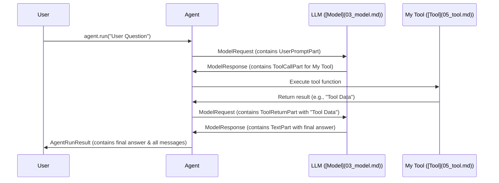

# Chapter 2: Messages and Parts - The Building Blocks of Conversation

In [Chapter 1: Meet the Agent](01_agent.md), we saw how the `Agent` acts as a project manager, taking our requests, talking to a Large Language Model (LLM), and giving us back structured results. But how does this conversation actually *happen*? How are the instructions, questions, and answers passed around?

That's where **Messages** and **Parts** come in. They are the fundamental units of communication in `pydantic-ai`.

## What's the Big Idea? Sending a Package

Imagine you're sending a package to someone.

*   The **Box** itself is like a **Message**. It holds everything together and tells you who sent it and who it's for (in our case, whether it's a request *to* the LLM or a response *from* the LLM).
*   The **Items** inside the box are like **Parts**. Each item carries a specific type of information. You might put:
    *   A **Letter** (like a `TextPart` or `UserPromptPart` carrying text)
    *   A **Photo** (like an `ImagePart` carrying image data - not covered in detail here, but the concept is the same)
    *   **Instructions** for the recipient (like a `ToolCallPart` asking the LLM or Agent to use a specific [Tool](05_tool.md))
    *   A **Receipt** confirming an action was taken (like a `ToolReturnPart` reporting the result of a tool).

This structured way of packaging information ensures that everyone involved (User, Agent, LLM) understands what's being sent and what kind of information it contains.

## Why Do We Need This Structure?

LLMs work best when communication is clear and unambiguous. Just sending a raw string of text back and forth can get confusing, especially when:

*   You need to send different *types* of information (text, images, instructions to use tools).
*   The LLM needs to tell the Agent exactly *what* it wants to do (e.g., "Call the `get_weather` tool with `city='London'`").
*   The Agent needs to report back the *result* of a tool clearly.

Messages and Parts provide this necessary structure.

## Meet the Messages: `ModelRequest` and `ModelResponse`

There are two main types of "boxes" or Messages:

1.  **`ModelRequest`**: This is a message sent *from* the `pydantic-ai` system (usually initiated by your `Agent` call) *to* the LLM. It contains the instructions, prompts, and any tool results the LLM needs to process.
2.  **`ModelResponse`**: This is a message sent *from* the LLM *back to* the `pydantic-ai` system (received by the `Agent`). It contains the LLM's answer, which might be text or instructions to call tools.

## Meet the Parts: The Contents Inside

Each `Message` contains one or more `Parts`. Here are the most common ones:

*   **`UserPromptPart`**: Represents the input provided by the end-user (e.g., the question you pass to `agent.run(...)`). It's usually the first part in the initial `ModelRequest`.
*   **`TextPart`**: Contains plain text generated by the LLM as part of its response.
*   **`SystemPromptPart`**: Contains instructions for the LLM about its role or how to behave (e.g., "You are a helpful assistant."). These often come from the `system_prompt` argument of the `Agent`.
*   **`ToolCallPart`**: An instruction *from* the LLM *to* the Agent, asking it to execute a specific [Tool](05_tool.md) with certain arguments.
*   **`ToolReturnPart`**: A report *from* the Agent *back to* the LLM, containing the result of executing a tool that the LLM previously requested via a `ToolCallPart`.
*   **`RetryPromptPart`**: A message *from* the Agent *to* the LLM asking it to try again, usually because the previous response failed validation or a tool failed.

There are other part types too (like for images or audio), but these are the core ones you'll encounter most often.

## How the Agent Uses Messages and Parts

You usually don't create `Message` or `Part` objects directly. The `Agent` handles this for you behind the scenes.

Let's revisit the simple example from Chapter 1:

```python
# examples/pydantic_ai_examples/pydantic_model.py
from pydantic import BaseModel
from pydantic_ai import Agent
import os

class MyModel(BaseModel):
    city: str
    country: str

# Use the model specified by environment variable, or default
model = os.getenv('PYDANTIC_AI_MODEL', 'openai:gpt-4o')
print(f'Using model: {model}')

# Tell the agent to use the specified model
# and expect results matching MyModel.
# `instrument=True` helps with logging and debugging.
agent = Agent(model, result_type=MyModel, instrument=True)

# The user's input text
prompt = 'The windy city in the US of A.'

# Run the agent synchronously (waits for the result)
result = agent.run_sync(prompt) # The agent uses Messages/Parts here!

# Print the structured data
print(result.data)
```

When you call `agent.run_sync(prompt)`, here's what happens in terms of Messages and Parts:

1.  **Agent Creates `ModelRequest`**: The Agent takes your `prompt` string ("The windy city...") and wraps it inside a `UserPromptPart`. It might also add `SystemPromptPart`s based on its configuration. All these parts are put into a `ModelRequest` "box".
2.  **Agent Sends to LLM**: The `ModelRequest` is sent to the LLM ([Model](03_model.md)).
3.  **LLM Sends `ModelResponse`**: The LLM processes the request and sends back a `ModelResponse`. In this simple case, the LLM figures out the answer and formats it according to `MyModel`. It might send this back as a `TextPart` containing JSON, or potentially a `ToolCallPart` directly matching the structure (depending on the LLM and how `pydantic-ai` interacts with it). Let's assume it sends a `TextPart` with the JSON `{"city": "Chicago", "country": "USA"}`.
4.  **Agent Processes Response**: The Agent receives the `ModelResponse`, extracts the `TextPart`, parses the JSON, validates it against `MyModel`, and puts the final `MyModel` instance into the `AgentRunResult`.

**What about Tools?**

In the bank support example from Chapter 1, the flow involved more steps:

1.  `UserPromptPart` ("What is my balance?") goes in a `ModelRequest`.
2.  LLM responds with a `ModelResponse` containing a `ToolCallPart` (e.g., "Call `customer_balance` tool").
3.  Agent executes the tool function.
4.  Agent sends a *new* `ModelRequest` containing a `ToolReturnPart` (e.g., "Result of `customer_balance` is '$123.45'").
5.  LLM processes the tool result and sends a final `ModelResponse` containing a `TextPart` (e.g., "Hello John, your balance is $123.45.").

## Seeing the Messages

You can inspect the full conversation history, including all the `Message` and `Part` objects, from the [`AgentRunResult`](07_agentrun___agentrunresult.md) returned by `agent.run()` or `agent.run_sync()`.

```python
# Get the result from the previous example
result = agent.run_sync(prompt)

# Access all messages exchanged during the run
all_messages = result.all_messages()

# Print the messages (this can be quite verbose!)
# import pprint
# pprint.pprint(all_messages)

# Let's look at the first message (the request)
first_message = all_messages[0]
print(f"First message type: {type(first_message)}")
# Expected: <class 'pydantic_ai.messages.ModelRequest'>

# Look at the parts inside the first message
print(f"Parts in first message: {first_message.parts}")
# Expected: Might show a UserPromptPart, maybe SystemPromptParts

# Look at the last message (the response)
last_message = all_messages[-1]
print(f"Last message type: {type(last_message)}")
# Expected: <class 'pydantic_ai.messages.ModelResponse'>

# Look at the parts inside the last message
print(f"Parts in last message: {last_message.parts}")
# Expected: Might show a TextPart or ToolCallPart
```

This shows how the `AgentRunResult` stores the entire structured conversation flow using Messages and Parts.

## Internal Flow Diagram

Here’s a simplified view of how Messages and Parts flow when a tool is used:



This structured exchange ensures everything is tracked and understood correctly. The definitions for these messages and parts live primarily in `pydantic_ai/messages.py`. The Agent's logic for handling this flow is managed by the internal graph mechanism (see `pydantic_ai/_agent_graph.py`).

## Key Takeaways

*   **Messages** (`ModelRequest`, `ModelResponse`) are the containers for communication.
*   **Parts** (`UserPromptPart`, `TextPart`, `ToolCallPart`, `ToolReturnPart`, etc.) are the specific pieces of information inside the messages.
*   This structured format ensures clear communication between the User, Agent, and LLM.
*   The Agent manages the creation and interpretation of these Messages and Parts automatically.
*   You can inspect the full conversation history stored in the [`AgentRunResult`](07_agentrun___agentrunresult.md).

## Conclusion

You've now learned about the fundamental building blocks of conversation in `pydantic-ai`: Messages and Parts. They provide the structure needed for reliable communication with LLMs, especially when dealing with different types of content and tool interactions.

Now that we understand how the Agent communicates, let's look closer at the entity that does the actual "thinking": the [**Model**](03_model.md). In the next chapter, we'll explore how `pydantic-ai` represents and interacts with different LLMs like GPT-4o, Gemini, and others.

---

Generated by [AI Codebase Knowledge Builder](https://github.com/The-Pocket/Tutorial-Codebase-Knowledge)