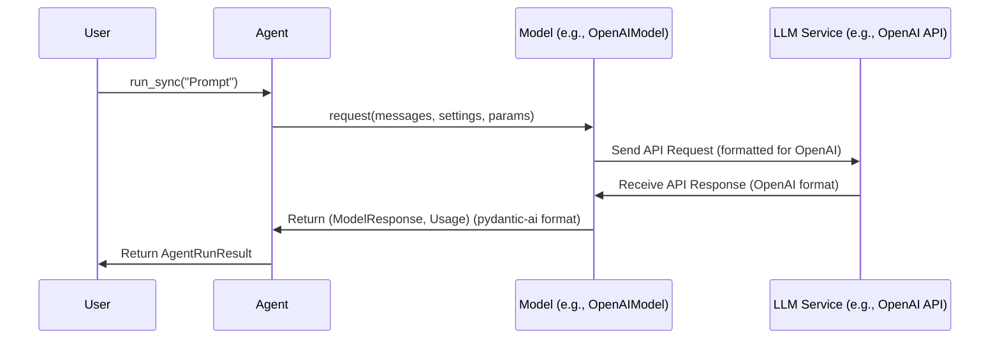

# Chapter 3: Model - Your AI's Communication Channel

In [Chapter 2: Messages and Parts](02_message___part.md), we learned about the structured "packages" (`Message` objects) and "items" (`Part` objects) that the `Agent` uses to communicate. We saw how instructions, questions, and answers are neatly organized for clarity.

But *who* exactly is the `Agent` sending these messages to? If the `Agent` is our project manager, it needs a direct line to the AI worker – the Large Language Model (LLM). That's where the **`Model`** comes in.

## What's the Big Idea? Dialing the Right AI

Imagine you have phone numbers for different experts: one for a history expert (like GPT-4o), one for a creative writer (like Claude 3.5 Sonnet), and another for a data analyst (like Gemini 1.5 Pro). Each expert might speak a slightly different dialect or prefer information presented in a specific way.

The `Model` object in `pydantic-ai` is like having a specific contact entry in your phonebook. It represents:

1.  **Who to Call:** It knows the specific "phone number" (API endpoint) and "name" (model identifier like `gpt-4o`) of the AI service you want to reach.
2.  **How to Talk:** It knows the specific "protocol" or "language" that AI service understands. It handles translating the standard `pydantic-ai` [Messages and Parts](02_message___part.md) into the exact format the target API expects (e.g., the specific JSON structure for OpenAI vs. Anthropic).
3.  **Understanding the Reply:** It knows how to take the raw response from the AI service and translate it back into the standard `pydantic-ai` [Messages and Parts](02_message___part.md) that the `Agent` can understand.

Essentially, the `Model` abstraction hides the nitty-gritty technical details of talking to a *specific* LLM service, providing a consistent interface for the `Agent`.

## What is a Model in `pydantic-ai`?

A `Model` object is an abstraction within `pydantic-ai` that represents a specific combination of:

*   **Provider:** The company or organization offering the LLM service (e.g., OpenAI, Anthropic, Google, Groq). We'll talk more about the [Provider](04_provider.md) concept in the next chapter, as it often handles things like API keys.
*   **Model Name/Version:** The specific LLM you want to use from that provider (e.g., `gpt-4o`, `claude-3-5-sonnet-latest`, `gemini-1.5-pro`).

Its main job is to act as the bridge between the `Agent`'s standardized communication format ([Messages and Parts](02_message___part.md)) and the unique API requirements of the actual LLM service.

## How Do We Use It? Telling the Agent Which AI to Call

Most of the time, you won't need to create `Model` objects directly. You simply tell the `Agent` *which* model you want to use when you create it.

Remember our first example from [Chapter 1: Meet the Agent](01_agent.md)?

```python
# examples/pydantic_ai_examples/pydantic_model.py
from pydantic_ai import Agent
from pydantic import BaseModel
import os

class MyModel(BaseModel):
    city: str
    country: str

# Use the model specified by environment variable, or default
model_string = os.getenv('PYDANTIC_AI_MODEL', 'openai:gpt-4o') # <-- Specify model here!
print(f'Using model: {model_string}')

# Tell the agent to use the specified model
# and expect results matching MyModel.
agent = Agent(model_string, result_type=MyModel, instrument=True)

# ... rest of the code
```

That simple string, `'openai:gpt-4o'`, is the key!

When you pass this string to the `Agent`, `pydantic-ai` intelligently figures out:
1.  The **Provider** is `openai`.
2.  The **Model Name** is `gpt-4o`.
3.  It then automatically creates the correct `Model` object internally (in this case, an instance of `pydantic_ai.models.openai.OpenAIModel`).

This internal `Model` object is what the `Agent` uses whenever it needs to send a request to the LLM.

You *can* create `Model` objects explicitly if needed, for example, if you have custom configurations:

```python
from pydantic_ai.models import OpenAIModel, AnthropicModel
from pydantic_ai import Agent

# Explicitly create an OpenAI Model object
my_openai_model = OpenAIModel('gpt-4o')

# Or an Anthropic Model object
my_claude_model = AnthropicModel('claude-3-5-sonnet-latest')

# Pass the Model object directly to the Agent
agent_explicit = Agent(model=my_openai_model, result_type=...)
```

But for most common use cases, just providing the `'provider:model_name'` string is much simpler.

## Under the Hood: How the `Model` Communicates

So, what happens when the `Agent` needs to talk to the LLM using the `Model` object?

1.  **`Agent` prepares:** The `Agent` gathers the [Messages](02_message___part.md) (like the user's prompt, system instructions, previous conversation turns, tool results) and any specific settings for the call.
2.  **`Agent` calls `Model.request()`:** The `Agent` calls the `request()` method (or `request_stream()` for streaming) on the `Model` object it holds, passing in the prepared messages and settings.
3.  **`Model` translates:** The *specific* `Model` implementation (e.g., `OpenAIModel`) takes the standard `pydantic-ai` messages and translates them into the exact JSON format required by that provider's API (e.g., the OpenAI API format). It adds necessary headers, including authentication details often obtained from a [Provider](04_provider.md) object.
4.  **`Model` sends API call:** The `Model` object makes the actual HTTP request to the LLM service's endpoint (e.g., `api.openai.com`).
5.  **`Model` receives API response:** It gets the raw JSON response back from the service.
6.  **`Model` translates back:** The `Model` object parses the provider-specific response and translates it back into standard `pydantic-ai` [Messages and Parts](02_message___part.md) (like `ModelResponse` containing `TextPart` or `ToolCallPart`). It also extracts usage information (like token counts).
7.  **`Model` returns to `Agent`:** The `Model` returns the translated `ModelResponse` and `Usage` objects back to the `Agent`.
8.  **`Agent` continues:** The `Agent` receives the response and proceeds with its workflow (e.g., validating the result, calling tools, or returning the final answer).

Here’s a simplified diagram showing this interaction:



`pydantic-ai` comes with built-in `Model` implementations for many popular providers:
*   `pydantic_ai.models.openai.OpenAIModel`
*   `pydantic_ai.models.anthropic.AnthropicModel`
*   `pydantic_ai.models.gemini.GeminiModel`
*   `pydantic_ai.models.cohere.CohereModel`
*   `pydantic_ai.models.groq.GroqModel`
*   `pydantic_ai.models.bedrock.BedrockConverseModel`
*   ...and others!

Each of these classes inherits from the base `pydantic_ai.models.Model` abstract class and implements the translation logic for its specific provider. The core logic for selecting the right model based on the string is in the `infer_model` function within `pydantic_ai/models/__init__.py`.

## Specifying Models: The Easy Way

As we saw, the easiest way to tell your `Agent` which LLM to use is via a string:

```python
# Examples of model strings
agent_openai = Agent('openai:gpt-4o', ...)
agent_anthropic = Agent('anthropic:claude-3-5-sonnet-latest', ...)
agent_google = Agent('google-gla:gemini-1.5-pro', ...)
agent_groq = Agent('groq:llama3-70b-8192', ...)
# You can even use shorthand for some common providers
agent_openai_shorthand = Agent('gpt-4o', ...) # Infers 'openai'
agent_claude_shorthand = Agent('claude-3-opus-latest', ...) # Infers 'anthropic'
```

The general format is `provider_name:model_name`. `pydantic-ai` maintains a list of known providers and model name patterns to automatically select the correct `Model` implementation for you.

## Key Takeaways

*   The **`Model`** abstraction represents a specific LLM endpoint (like OpenAI's GPT-4o or Anthropic's Claude).
*   It acts as a **translator**, converting `pydantic-ai`'s standard messages into the format needed by the specific LLM API and translating the API's response back.
*   You usually specify the model using a simple **string** like `'openai:gpt-4o'` when creating an `Agent`.
*   `pydantic-ai` handles creating the correct `Model` object for you based on the string.
*   This keeps your `Agent` code clean and independent of the specific LLM being used underneath.

## Conclusion

You've now learned about the `Model` – the crucial component that lets your `Agent` communicate effectively with different Large Language Models by handling the specific protocols and translation needed for each one.

But how does the `Model` know *how* to authenticate with the AI service? Where do API keys and other connection details come from? Often, the `Model` relies on another abstraction for this: the **[Provider](04_provider.md)**. In the next chapter, we'll explore how Providers manage the configuration and clients needed to connect to different AI services.

---

Generated by [AI Codebase Knowledge Builder](https://github.com/The-Pocket/Tutorial-Codebase-Knowledge)