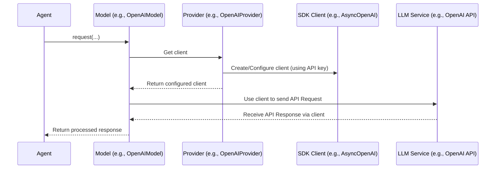

# Chapter 4: Provider - Connecting to Your AI Service

In [Chapter 3: Model](03_model.md), we learned how the `Model` object acts as a specific communication channel to an AI like GPT-4o or Claude. It knows *how* to talk to that particular AI.

But there's a missing piece: how does the `Model` actually *connect* to the AI service? How does it prove it has permission to use the service, usually by providing an API key? This is where the **Provider** comes in.

## What's the Big Idea? The Account Manager

Imagine you want to call a specific expert ([Model](03_model.md)), like the OpenAI expert (GPT-4o). You have their direct phone number (the model name). But before they talk to you, their office needs to verify your account and set up the call.

The **Provider** is like the **account manager** for that AI service (OpenAI, Anthropic, Groq, etc.). Its main jobs are:

1.  **Authentication:** It handles your login details, primarily your **API key**. It knows how to present this key securely when connecting.
2.  **Client Setup:** It creates and configures the specific software tool (the "client" library, like `openai.AsyncOpenAI` or `anthropic.AsyncAnthropic`) needed to actually make the connection and talk over the network.

Think of it this way:
*   The [Model](03_model.md) knows *what to say* to the AI.
*   The **Provider** knows *how to get connected and authenticated* so the Model can say it.

## How Does It Work (Usually Automatically)?

The good news is that `pydantic-ai` often handles this for you behind the scenes! Remember how we created an agent in [Chapter 1](01_agent.md) and specified the model?

```python
from pydantic_ai import Agent
from pydantic import BaseModel
import os

class MyModel(BaseModel):
    city: str
    country: str

# Use the model specified by environment variable, or default
model_string = os.getenv('PYDANTIC_AI_MODEL', 'openai:gpt-4o')
print(f'Using model: {model_string}')

# Creates the Agent, Model, and implicitly the Provider!
agent = Agent(model_string, result_type=MyModel, instrument=True)
```

When you pass the string `'openai:gpt-4o'` to the `Agent`:
1.  `pydantic-ai` sees the `openai` part and knows it needs the OpenAI provider.
2.  It automatically looks for an `OpenAIProvider` instance or creates a default one.
3.  The default `OpenAIProvider` looks for your API key in the standard environment variable (`OPENAI_API_KEY`).
4.  It uses this key to set up the official OpenAI client library (`AsyncOpenAI`).
5.  This configured client is then used by the `OpenAIModel` (which was also created automatically from the string) to communicate with OpenAI's servers.

This automatic setup relies on a helper function called `infer_provider` (found in `pydantic_ai/providers/__init__.py`) which maps the provider name (like "openai", "anthropic", "groq") to the correct Provider class.

**Where to Put Your API Keys?**

For this automatic process to work, `pydantic-ai` needs to find your API keys. The standard way is to set **environment variables**:

*   For OpenAI: `OPENAI_API_KEY`
*   For Anthropic: `ANTHROPIC_API_KEY`
*   For Groq: `GROQ_API_KEY`
*   For Google Gemini (GLA): `GEMINI_API_KEY`
*   For Cohere: `CO_API_KEY`
*   For Mistral: `MISTRAL_API_KEY`
*   ...and so on for other providers.

You can set these in your terminal, your `.env` file (using libraries like `python-dotenv`), or your system settings.

## Explicitly Configuring a Provider

While the automatic way is convenient, sometimes you might want more control. Maybe your API key isn't in an environment variable, or you need custom settings for the connection (like timeouts or specific endpoints).

You can create a `Provider` object yourself and tell the [Model](03_model.md) to use it.

**1. Import the specific Provider and Model:**

```python
from pydantic_ai.providers import OpenAIProvider # Import the specific provider
from pydantic_ai.models import OpenAIModel     # Import the specific model
from pydantic_ai import Agent
from pydantic import BaseModel

# Assume MyModel is defined as before
class MyModel(BaseModel):
    city: str
    country: str
```

**2. Create the Provider Instance:**
Let's say your API key is stored in a variable.

```python
my_openai_api_key = "sk-..." # Your actual OpenAI API key

# Create an OpenAIProvider instance with the key
my_provider = OpenAIProvider(api_key=my_openai_api_key)
```
This creates our "account manager" explicitly and gives it the key.

**3. Create the Model Instance with the Provider:**
Now, tell the `OpenAIModel` to use *your* configured provider.

```python
# Create the model, passing the explicit provider
my_openai_model = OpenAIModel(model_name='gpt-4o', provider=my_provider)
```
The model now knows exactly which account manager (and therefore which API key and client setup) to use.

**4. Create the Agent with the Model:**
Finally, create the Agent using this specifically configured model.

```python
# Create the agent using the explicitly configured model
agent_explicit = Agent(model=my_openai_model, result_type=MyModel)

# Now you can run it
# result = agent_explicit.run_sync("The windy city...")
# print(result.data)
```

This explicit setup gives you full control over authentication and connection parameters managed by the Provider. You can see the code for specific providers like `OpenAIProvider` in files like `pydantic_ai/providers/openai.py`.

## Under the Hood: How Model and Provider Interact

Let's visualize the flow when the `Agent` needs to talk to the LLM, focusing on the Model and Provider roles:

1.  **Agent Request:** The `Agent` decides it needs to call the LLM (e.g., using `agent.run_sync`). It tells its configured [Model](03_model.md) object (e.g., `OpenAIModel`) to make the request.
2.  **Model Needs Client:** The `Model` needs the actual communication tool (the SDK client, e.g., `AsyncOpenAI`) to talk to the API.
3.  **Model Asks Provider:** The `Model` gets the client from its associated **Provider** object (e.g., `OpenAIProvider`).
4.  **Provider Creates/Returns Client:** The `Provider` checks if it already has a configured client. If not, it uses its settings (like the API key) to create and configure a new client instance (e.g., `AsyncOpenAI(api_key=...)`). It then returns this ready-to-use client to the `Model`.
5.  **Model Makes API Call:** The `Model` uses the client obtained from the `Provider` to format the request correctly (as covered in [Chapter 3](03_model.md)) and send it to the actual LLM service (e.g., OpenAI API).
6.  **Response:** The response comes back through the client to the `Model`, which then processes it and passes the result back to the `Agent`.

Here's a simplified diagram:



This separation ensures the `Model` focuses on the *conversation logic* (formatting messages, understanding responses), while the `Provider` focuses on the *connection and authentication logic*.

## Key Takeaways

*   The **Provider** handles authentication (like API keys) and client setup for specific AI services (OpenAI, Anthropic, etc.).
*   It's like the "account manager" ensuring you can securely connect.
*   Often, `pydantic-ai` creates and configures the correct Provider **automatically** based on the model string (e.g., `'openai:gpt-4o'`) and environment variables (e.g., `OPENAI_API_KEY`).
*   You can **explicitly** create and configure `Provider` objects for more control.
*   The [Model](03_model.md) relies on the `Provider` to get the authenticated client needed to talk to the LLM API.

## Conclusion

You've now learned about the `Provider`, the crucial link that manages secure connections to different AI services. It handles the details of API keys and client configuration, often automatically, allowing the [Model](03_model.md) and [Agent](01_agent.md) to focus on their tasks.

So far, we've seen how the Agent can talk to an LLM. But what if the LLM needs to do more than just generate text? What if it needs to access real-time data or perform actions in other systems? In the next chapter, we'll explore **[Tool](05_tool.md)**s, which give your Agent superpowers!

---

Generated by [AI Codebase Knowledge Builder](https://github.com/The-Pocket/Tutorial-Codebase-Knowledge)