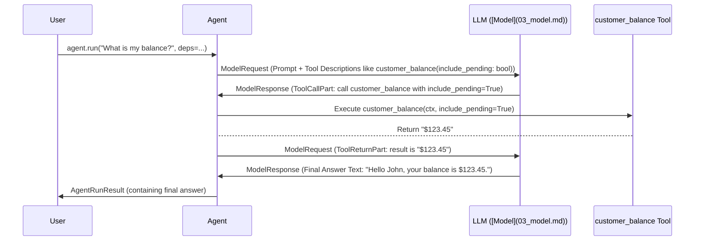

# Chapter 5: Tool - Giving Your Agent Superpowers

In the previous chapter, [Provider - Connecting to Your AI Service](04_provider.md), we saw how `pydantic-ai` manages the connections and credentials needed to talk to different AI services like OpenAI or Anthropic. We now have our [Agent](01_agent.md) project manager, a way to structure conversations using [Messages and Parts](02_message___part.md), a communication channel to the AI ([Model](03_model.md)), and a way to authenticate ([Provider](04_provider.md)).

But what if the AI needs information it doesn't inherently know? Large Language Models (LLMs) are trained on vast amounts of data, but that data is frozen in time. They don't know today's weather, the current price of a stock, or the balance of *your specific* bank account. They also can't perform actions in the real world, like sending an email or booking a flight.

This is where **Tools** come in. They are the key to unlocking your Agent's full potential by allowing it to interact with the outside world and perform specific tasks beyond its core knowledge.

## What's the Big Idea? The Agent's Toolbox

Imagine our [Agent](01_agent.md) is like a very smart project manager. It can understand complex requests and plan how to fulfill them using the LLM's brainpower. However, sometimes the plan requires a specialized skill or piece of information the manager (or the LLM) doesn't have directly.

**Tools** are like specialized gadgets in the Agent's toolbox:

*   A **calculator** for precise math.
*   A **web browser** or search engine interface to look up current information.
*   A **database connector** to fetch specific user data.
*   An **API caller** to interact with other software systems (like booking a flight or sending a notification).

When the Agent (guided by the LLM) encounters a task it can't handle alone, it can decide to pick up the appropriate **Tool** from its toolbox, use it, and then continue with its main task using the information or result obtained from the tool.

## Why Do We Need Tools?

LLMs are amazing at language understanding, reasoning, and generation, but they have limitations:

1.  **Knowledge Cutoff:** They don't know about events or information created after their training data was collected.
2.  **Lack of Real-time Data:** They can't access live data feeds (weather, stocks, news).
3.  **Inability to Act:** They can't directly interact with external systems (databases, APIs, email).
4.  **Hallucination:** They might make up answers (hallucinate) if they don't know the information but try to fulfill the request anyway. Tools provide a way to ground their responses in real data.

Tools bridge these gaps, allowing the Agent to leverage the LLM's reasoning while accessing external capabilities when needed.

## How to Define a Tool

In `pydantic-ai`, a Tool is simply a Python function (sync or async) that the Agent can call. You make a function available as a tool by decorating it with `@agent.tool`.

Let's revisit the `customer_balance` tool from the bank support example in [Chapter 1: Meet the Agent](01_agent.md).

**Goal:** Create a tool that the Agent can use to look up a customer's current bank balance.

```python
# examples/pydantic_ai_examples/bank_support.py (Relevant parts)
from pydantic_ai import Agent, RunContext
# Assume 'support_agent' is an Agent instance already defined
# Assume 'SupportDependencies' and 'DatabaseConn' are defined

@support_agent.tool  # <- This decorator registers the function as a tool!
async def customer_balance(
    ctx: RunContext[SupportDependencies], include_pending: bool
) -> str:
    """Returns the customer's current account balance.""" # <- IMPORTANT!
    # Access dependencies (like DB connection and customer ID) via ctx.deps
    balance = await ctx.deps.db.customer_balance(
        id=ctx.deps.customer_id,
        include_pending=include_pending,
    )
    return f'${balance:.2f}'

```

Let's break this down:

1.  **`@support_agent.tool`**: This decorator tells the `support_agent` that the `customer_balance` function is a tool it can potentially use.
2.  **`async def customer_balance(...)`**: This is a standard Python async function. Tools can also be regular synchronous functions (`def ...`).
3.  **`ctx: RunContext[SupportDependencies]`**: This is the first argument. `RunContext` is a special object provided by `pydantic-ai` that gives the tool access to runtime information, including the dependencies (`ctx.deps`) we set up for the agent (like the `customer_id` and the `db` connection). We'll cover [`RunContext`](06_runcontext.md) in detail in the next chapter. If your tool doesn't need access to dependencies or other context, you can omit this argument and use the `@agent.tool_plain` decorator instead.
4.  **`include_pending: bool`**: This is a regular argument for the tool. The LLM will need to figure out what value (`True` or `False`) to provide when it asks the Agent to call this tool.
5.  **`-> str`**: The function returns the balance as a string.
6.  **`"""Returns the customer's current account balance."""`**: **This docstring is crucial!** `pydantic-ai` automatically extracts this description and the argument information (like `include_pending` is a boolean) and sends it to the LLM. This is how the LLM learns:
    *   That a tool named `customer_balance` exists.
    *   What the tool *does* (based on the description).
    *   What arguments it needs (`include_pending`) and their types.
    Without a clear docstring, the LLM won't know when or how to use your tool effectively.

## How the Agent Uses Tools

You don't explicitly tell the Agent *when* to use a tool. The magic lies in the interaction between the Agent and the LLM:

1.  **Setup:** When you run the Agent (e.g., `agent.run_sync(...)`), the Agent prepares a request for the [Model](03_model.md). This request includes your prompt, any system messages, the conversation history, and importantly, the **descriptions and argument schemas of all available tools** (like `customer_balance`).
2.  **LLM Decides:** The LLM receives this package. It analyzes the user's prompt ("What is my balance?") in the context of its goal and the available tools. It sees the `customer_balance` tool description ("Returns the customer's current account balance.") and determines that this tool is needed to answer the question. It also figures out based on the context or its own reasoning that it should probably include pending transactions (`include_pending=True`).
3.  **LLM Instructs:** The LLM doesn't run the tool itself. Instead, it sends a structured message back to the Agent, typically using a `ToolCallPart` (see [Chapter 2: Messages and Parts](02_message___part.md)). This message essentially says: "Please execute the tool named `customer_balance` with the argument `include_pending` set to `True`."
4.  **Agent Executes:** The Agent receives this `ToolCallPart`. It looks up the corresponding Python function (`customer_balance`) associated with that tool name. It then calls the Python function, passing the arguments provided by the LLM (`include_pending=True`) and the necessary [`RunContext`](06_runcontext.md).
5.  **Tool Runs:** The `customer_balance` Python function executes its logic (in our example, querying the database). It returns its result (`"$123.45"`).
6.  **Agent Reports:** The Agent takes the return value from the Python function and packages it into a `ToolReturnPart`.
7.  **LLM Consumes:** The Agent sends this `ToolReturnPart` back to the LLM in a new request. The LLM now has the specific information it needed (the balance).
8.  **Final Response:** The LLM uses the tool's result, along with the rest of the conversation context, to formulate the final answer to the user (e.g., "Hello John, your current account balance, including pending transactions, is $123.45.") and sends it back to the Agent.

This multi-step dialogue allows the LLM to leverage external capabilities without needing to execute code directly.

Here’s the diagram illustrating this flow again:



## Under the Hood

*   **`@agent.tool` / `@agent.tool_plain`**: These decorators create an instance of the `pydantic_ai.tools.Tool` class behind the scenes.
*   **`Tool` Class**: This class (defined in `pydantic_ai/tools.py`) inspects your Python function. It uses utilities (like those in `pydantic_ai/_pydantic.py`) to:
    *   Parse the docstring for the tool's overall description.
    *   Parse the function signature and docstring (using formats like Google-style or Sphinx-style) for parameter descriptions and types.
    *   Generate a **JSON Schema** representing the function's parameters. This schema is a structured way to tell the LLM exactly what arguments the tool expects (e.g., `{"include_pending": {"type": "boolean", "description": "..."}}`).
*   **`ToolDefinition`**: The `Tool` object creates a `ToolDefinition` dataclass containing the name, description, and the parameter JSON schema. These definitions are sent to the LLM.
*   **Agent Graph**: The Agent's internal execution logic (managed by the graph in `pydantic_ai/_agent_graph.py`, specifically the `CallToolsNode`) handles receiving the `ToolCallPart` from the LLM, finding the correct `Tool` object by name, validating the arguments provided by the LLM against the schema, executing the associated Python function, and packaging the result in a `ToolReturnPart`.

## Key Takeaways

*   **Tools** are Python functions registered with an Agent using decorators (`@agent.tool` or `@agent.tool_plain`).
*   They allow the Agent to **access external data** (databases, APIs, web search) or **perform actions** (send emails, update records).
*   They act as specialized capabilities in the Agent's "toolbox".
*   **Docstrings are critical** as they provide the description and parameter information the LLM needs to use the tool correctly.
*   The **LLM decides *when* and *how* to use a tool**, instructing the Agent via `ToolCallPart`.
*   The **Agent executes the corresponding Python function** and sends the result back to the LLM via `ToolReturnPart`.

## Conclusion

Tools are essential for building powerful and practical AI agents. They break the boundaries of the LLM's static knowledge, enabling interaction with real-time data and external systems. By defining simple Python functions and describing them clearly in docstrings, you can equip your `pydantic-ai` Agent with a wide range of superpowers.

But how exactly does a tool get access to things like the customer ID or the database connection it needs to run? That's where the `RunContext` comes in. In the next chapter, we'll explore the [**RunContext**](06_runcontext.md) and how it provides tools with the necessary context and dependencies during an Agent run.

---

Generated by [AI Codebase Knowledge Builder](https://github.com/The-Pocket/Tutorial-Codebase-Knowledge)