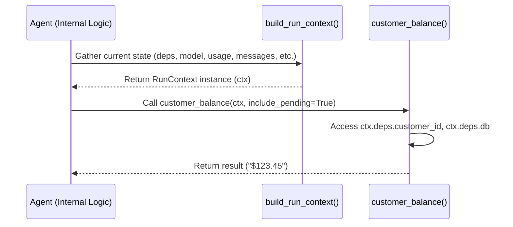

# Chapter 6: RunContext - The Agent's Working Briefing

In [Chapter 5: Tool](05_tool.md), we gave our [Agent](01_agent.md) superpowers by defining tools – Python functions it can call to interact with the outside world. We saw the `customer_balance` tool which could look up a bank balance.

But wait, how did that tool know *which* customer's balance to look up? And how did it know *how* to connect to the database? These details weren't part of the tool's definition itself. They are specific to a *particular run* of the Agent.

This is where the **`RunContext`** comes in. It provides the necessary "briefing" or "workspace" for a tool (or other specific parts of the agent's process) when it's being executed.

## What's the Big Idea? The Briefing for the Job

Imagine our [Agent](01_agent.md) is the project manager, and a [Tool](05_tool.md) is a specialist contractor called in for a specific task (like "check customer balance").

Before the specialist starts working, the project manager gives them a **briefing document**. This document contains all the relevant information needed *right now* for *this specific task*. It might include:

*   **Project Details:** Which customer are we talking about (`customer_id`)?
*   **Required Resources:** Here's the keycard to access the database (`db` connection).
*   **Background Info:** Here's the conversation history so far (`messages`).
*   **Progress Report:** Here's how much budget (tokens) we've used already (`usage`).
*   **Contact Info:** Here's the expert AI we are working with (`model`).

The `RunContext` object in `pydantic-ai` serves exactly this purpose. It's a temporary container holding all the contextual information available *at the moment* a specific piece of the Agent's logic (like a Tool) is being executed.

## Why Do We Need RunContext?

When you define a tool, like our `customer_balance` function, you define the *logic* of how to get a balance. But the specific *data* needed for that logic (like the customer ID or the database connection) often depends on the user's request and the overall context of the Agent's run.

`RunContext` provides a standard way for tools, system prompt functions, and result validators to access this runtime-specific information without needing it passed explicitly as separate arguments everywhere. It keeps the tool signatures cleaner and decouples the tool's logic from how the runtime information is managed.

## What's Inside the RunContext?

The `RunContext` object bundles several useful pieces of information. You typically access it via the `ctx` argument in your tool or function. Here are the most important attributes:

*   **`ctx.deps`**: This is usually the most crucial part. It holds the **dependencies** that you provided when you started the Agent run (using the `deps=...` argument in `agent.run()` or `agent.run_sync()`). This is how our `customer_balance` tool gets the `customer_id` and the `db` connection object. The type of `deps` is defined by the `deps_type` you set when creating the [Agent](01_agent.md).
*   **`ctx.model`**: A reference to the actual [Model](03_model.md) object being used for this specific Agent run.
*   **`ctx.usage`**: An object tracking the accumulated token counts and request counts ([Usage](08_usage.md)) up to the point where the `RunContext` was created.
*   **`ctx.messages`**: A list containing the history of [Messages](02_message___part.md) exchanged between the Agent and the [Model](03_model.md) during this run so far.
*   **`ctx.run_step`**: An integer indicating the current step number within the Agent's internal execution graph.
*   `ctx.tool_name`, `ctx.tool_call_id`, `ctx.retry`: More specific details about the current tool call, if applicable.

## How to Use RunContext in a Tool

Let's look again at the `customer_balance` tool from the bank example (`examples/pydantic_ai_examples/bank_support.py`). Pay close attention to the first argument, `ctx`.

```python
# examples/pydantic_ai_examples/bank_support.py (Tool definition)
from pydantic_ai import Agent, RunContext

# Assume 'support_agent' is defined with deps_type=SupportDependencies
# Assume 'SupportDependencies' class has 'customer_id' and 'db' attributes

@support_agent.tool
async def customer_balance(
    ctx: RunContext[SupportDependencies], # <- Receives the RunContext
    include_pending: bool
) -> str:
    """Returns the customer's current account balance."""
    # Access dependencies provided at runtime via ctx.deps
    balance = await ctx.deps.db.customer_balance(
        id=ctx.deps.customer_id, # <- Using customer_id from context
        include_pending=include_pending,
    )
    return f'${balance:.2f}'

```

1.  **`ctx: RunContext[SupportDependencies]`**: We declare the first parameter named `ctx` and give it a type hint `RunContext[SupportDependencies]`. The `SupportDependencies` part tells Python (and your editor) what structure to expect inside `ctx.deps`. `pydantic-ai` will automatically provide an instance of `RunContext` here when it calls the tool.
2.  **`ctx.deps.db`** and **`ctx.deps.customer_id`**: Inside the tool, we access the specific dependencies (`db` connection object and `customer_id`) needed for this task directly from the `ctx.deps` attribute.

**Where do `ctx.deps` come from?**

Remember how we ran the agent in Chapter 1?

```python
# examples/pydantic_ai_examples/bank_support.py (Running the agent)

# Define the dependencies class
@dataclass
class SupportDependencies:
    customer_id: int
    db: DatabaseConn # The fake database connection class

# ... Agent definition ...

if __name__ == '__main__':
    # 1. Create an instance of the dependencies
    deps_instance = SupportDependencies(customer_id=123, db=DatabaseConn())

    # 2. Pass the instance when running the agent
    result = support_agent.run_sync(
        'What is my balance?',
        deps=deps_instance # <- Here!
    )
    print(result.data)
```

The `deps_instance` we passed to `run_sync` is what becomes available inside the tool as `ctx.deps`. `pydantic-ai` handles packaging it into the `RunContext` for you.

## RunContext in Other Places

Tools aren't the only place `RunContext` appears. You also use it in:

*   **System Prompt Functions:** Functions decorated with `@agent.system_prompt` can accept `ctx: RunContext[...]` to dynamically generate system messages based on dependencies or other context.

    ```python
    # examples/pydantic_ai_examples/bank_support.py (System Prompt Function)

    @support_agent.system_prompt
    async def add_customer_name(ctx: RunContext[SupportDependencies]) -> str:
        # Access customer_id via ctx.deps to fetch the name
        customer_name = await ctx.deps.db.customer_name(id=ctx.deps.customer_id)
        return f"The customer's name is {customer_name!r}"
    ```

*   **Result Validators:** Functions decorated with `@agent.result_validator` can accept `ctx: RunContext[...]` as their *first* argument (before the result data) to perform validation logic that depends on runtime context.

    ```python
    # examples/pydantic_ai_examples/flight_booking.py (Result Validator)
    from pydantic_ai import Agent, RunContext, ModelRetry

    # Assume agent defined with deps_type=Deps (having req_origin etc.)
    # Assume FlightDetails is the result type

    @search_agent.result_validator
    async def validate_result(
        ctx: RunContext[Deps], # <- Context first
        result: FlightDetails | NoFlightFound # <- Result second
    ) -> FlightDetails | NoFlightFound:
        """Procedural validation that the flight meets the constraints."""
        if isinstance(result, NoFlightFound):
            return result

        errors: list[str] = []
        # Access required origin from context's dependencies
        if result.origin != ctx.deps.req_origin:
            errors.append(
                f'Flight should have origin {ctx.deps.req_origin}, not {result.origin}'
            )
        # ... other checks using ctx.deps ...

        if errors:
            # Raise ModelRetry to ask the LLM to try again
            raise ModelRetry('\\n'.join(errors))
        else:
            return result
    ```

In all these cases, `pydantic-ai` automatically constructs and provides the appropriate `RunContext` instance when it calls your function.

## How `pydantic-ai` Provides the `RunContext`

You don't create `RunContext` objects yourself. The framework does it for you at the right time. Here’s a simplified view of what happens when the Agent needs to call a tool:

1.  **Agent Run Starts:** You call `agent.run_sync(..., deps=my_deps)`.
2.  **LLM Requests Tool:** The LLM decides to use a tool (e.g., `customer_balance`) and sends a `ToolCallPart` back to the Agent.
3.  **Agent Prepares Tool Call:** The Agent finds the `customer_balance` Python function. Before calling it, the Agent's internal logic (specifically the `CallToolsNode` within the graph defined in `pydantic_ai/_agent_graph.py`) gathers the necessary information:
    *   The `my_deps` object you provided.
    *   The current [Model](03_model.md) instance.
    *   The current [Usage](08_usage.md) stats.
    *   The current list of [Messages](02_message___part.md).
    *   Details about the specific tool call (ID, name, current retry attempt).
4.  **Agent Creates `RunContext`:** It bundles all this information into a `RunContext` object. The core function for this is `build_run_context` in `pydantic_ai/_agent_graph.py`.
5.  **Agent Calls Tool:** The Agent calls your `customer_balance` function, passing the newly created `RunContext` object as the first argument (`ctx`).
6.  **Tool Uses Context:** Your tool function executes, using `ctx.deps` (and potentially other attributes) to perform its task.

Here's a simplified diagram:



## Key Takeaways

*   **`RunContext`** is the "briefing" or "workspace" provided to specific Agent components (like Tools) during execution.
*   It holds **runtime-specific information** needed for the current task.
*   The most common use is accessing **dependencies** via **`ctx.deps`** (e.g., database connections, user IDs).
*   It also provides access to the current `model`, `usage` stats, and `messages`.
*   It's automatically created and passed by `pydantic-ai` to functions decorated with `@agent.tool`, `@agent.system_prompt`, and `@agent.result_validator` that accept a `ctx` argument.
*   You define the *type* of dependencies (`deps_type`) on the Agent and provide the *instance* (`deps=...`) when running the Agent.

## Conclusion

The `RunContext` is a vital piece of the `pydantic-ai` puzzle, providing a clean and consistent way for tools and other components to access necessary runtime information like dependencies. It acts as the essential briefing needed to perform specific tasks within the broader context of an Agent's execution.

Now that we've seen how individual tools get their context, how do we look at the *entire* execution of an Agent? What information is captured about the whole process, from the initial prompt to the final result, including all the steps and messages in between? In the next chapter, we'll explore the [**AgentRun / AgentRunResult**](07_agentrun___agentrunresult.md), which represents the complete lifecycle and outcome of an Agent's task.

---

Generated by [AI Codebase Knowledge Builder](https://github.com/The-Pocket/Tutorial-Codebase-Knowledge)