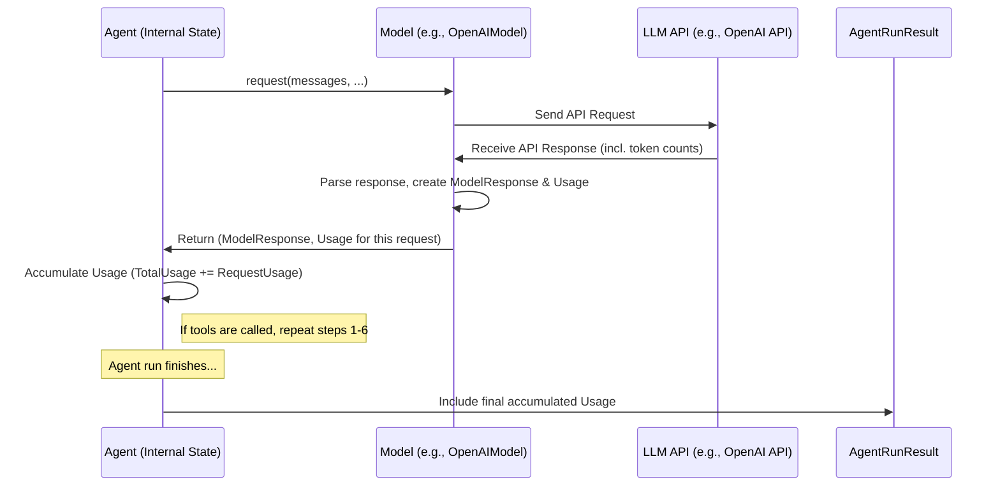

# Chapter 8: Usage - Keeping Track of Your AI Resources

In the previous chapter, [AgentRun / AgentRunResult](07_agentrun___agentrunresult.md), we saw how `AgentRunResult` gives us the final outcome of an [Agent](01_agent.md)'s task, including the structured data and the conversation history. We also briefly saw that it contains "usage" information. But what exactly is that, and why should you care?

Let's find out!

## What's the Big Idea? Your AI Utility Meter

Imagine using electricity or water at home. You have a meter that tracks exactly how much you've used, which helps you understand your bill and maybe encourages you to conserve resources.

Talking to Large Language Models (LLMs) like GPT-4o or Claude also consumes resources, primarily measured in **tokens**. Tokens are like small pieces of words or characters that the LLM processes. When you send a request (your prompt and instructions), it uses input tokens. When the LLM generates a response, it uses output tokens.

Most LLM services charge based on the number of tokens you use, and they often have limits on how many tokens you can use per minute or per month. Therefore, tracking token usage is crucial for:

1.  **Monitoring Costs:** Knowing how many tokens your agent uses helps you estimate and control your spending on LLM APIs.
2.  **Staying Within Limits:** Tracking usage helps you avoid hitting API rate limits or usage quotas, which could interrupt your application.

The **`Usage`** object in `pydantic-ai` acts like that **utility meter** for your AI interactions. It keeps a running tally of the resources consumed during an Agent's run.

## What is the `Usage` Object?

The `Usage` object is a simple container (a dataclass defined in `pydantic_ai/usage.py`) that holds information about resource consumption. Its main attributes are:

*   **`requests`**: The total number of separate requests made to the LLM's API during the run. (e.g., 1 request for a simple query, maybe 2 or more if tools were used).
*   **`request_tokens`**: The total number of tokens sent *to* the LLM across all requests.
*   **`response_tokens`**: The total number of tokens received *from* the LLM across all responses.
*   **`total_tokens`**: The sum of `request_tokens` and `response_tokens`.
*   **`details`**: Sometimes, a specific model provider might give extra usage details (like how many search queries were performed by a tool). These are stored in this dictionary.

Think of it like your electricity meter showing total kilowatt-hours used (`total_tokens`), maybe peak usage time (`details`), and how many times the power grid was accessed (`requests`).

## How Do I See the Usage?

The easiest way to see the usage for a completed agent run is through the [`AgentRunResult`](07_agentrun___agentrunresult.md) object, which we get back from `agent.run()` or `agent.run_sync()`.

Let's revisit the simple example from [Chapter 7](07_agentrun___agentrunresult.md):

```python
# examples/pydantic_ai_examples/pydantic_model.py (Relevant part)
from pydantic import BaseModel
from pydantic_ai import Agent, AgentRunResult # Import AgentRunResult
import os

class MyModel(BaseModel):
    city: str
    country: str

# Assume 'agent' is defined as before:
model_string = os.getenv('PYDANTIC_AI_MODEL', 'openai:gpt-4o')
print(f'Using model: {model_string}')
agent = Agent(model_string, result_type=MyModel, instrument=True)

prompt = 'The windy city in the US of A.'

# Run the agent synchronously
result: AgentRunResult[MyModel] = agent.run_sync(prompt)

# Access the Usage object via the .usage() method
run_usage = result.usage()

# Print the usage object
print(f"Usage for this run: {run_usage}")

# You can also access specific attributes
print(f" - Total Requests: {run_usage.requests}")
print(f" - Input Tokens: {run_usage.request_tokens}")
print(f" - Output Tokens: {run_usage.response_tokens}")
print(f" - Total Tokens: {run_usage.total_tokens}")
print(f" - Details: {run_usage.details}")
```

**Expected Output (Conceptual - token counts will vary):**

```text
Using model: openai:gpt-4o
Usage for this run: Usage(requests=1, request_tokens=80, response_tokens=15, total_tokens=95, details=None)
 - Total Requests: 1
 - Input Tokens: 80
 - Output Tokens: 15
 - Total Tokens: 95
 - Details: None
```

As you can see, calling `result.usage()` on the `AgentRunResult` gives you the `Usage` object, summarizing the resources consumed during that specific run.

## How Does `pydantic-ai` Track Usage?

You might wonder where these numbers come from. Does `pydantic-ai` count the tokens itself? No, it relies on the underlying LLM service.

1.  **Agent Calls Model:** When the [Agent](01_agent.md) needs the LLM, it calls the `request()` (or `request_stream()`) method on the configured [Model](03_model.md) object (e.g., `OpenAIModel`, `AnthropicModel`).
2.  **Model Calls API:** The `Model` object sends the actual request to the LLM provider's API (e.g., OpenAI API).
3.  **API Responds with Usage:** Most LLM APIs, along with the generated text or tool calls, also return metadata including the number of input and output tokens used for *that specific request*.
4.  **Model Extracts Usage:** The `Model` object (e.g., `OpenAIModel`) knows how to parse this provider-specific response and extracts the token counts, packaging them into a `Usage` object.
5.  **Model Returns Usage:** The `Model`'s `request()` method returns both the processed `ModelResponse` and the `Usage` object for that single API call back to the Agent.
6.  **Agent Accumulates Usage:** The Agent's internal state (specifically the `GraphAgentState` in `pydantic_ai/_agent_graph.py`) maintains a running total `Usage` object. After each call to the `Model`, it adds the returned usage to this running total.
7.  **Final Result:** When the run finishes, the final accumulated `Usage` object from the Agent's state is included in the `AgentRunResult`.

Here’s a simplified diagram showing how usage is returned and accumulated:



Because the `Model` implementations (like `pydantic_ai/models/openai.py`) handle the provider-specific details, your agent code doesn't need to worry about *how* usage is counted for different LLMs. The `Usage` object provides a consistent way to access it.

## Advanced: Passing Usage Between Agents

Sometimes, you might have one agent that calls another agent as a [Tool](05_tool.md). In the flight booking example (`examples/pydantic_ai_examples/flight_booking.py`), the `search_agent` uses an `extract_flights` tool, which internally calls the `extraction_agent`.

If you want the `search_agent`'s final `Usage` report to include the tokens used by the `extraction_agent` during the tool call, you need to pass the current usage context along.

```python
# examples/pydantic_ai_examples/flight_booking.py (Tool definition)

@search_agent.tool
async def extract_flights(ctx: RunContext[Deps]) -> list[FlightDetails]:
    """Get details of all flights."""
    # Pass the current usage from the search_agent's context
    # to the extraction_agent's run.
    result = await extraction_agent.run(
        ctx.deps.web_page_text,
        usage=ctx.usage  # <- Pass current usage here!
    )
    # The ctx.usage object will be automatically updated
    # with the usage from the extraction_agent's run.
    logfire.info('found {flight_count} flights', flight_count=len(result.data))
    return result.data
```

By passing `usage=ctx.usage` when calling `extraction_agent.run()`, you ensure that the `Usage` object within the `search_agent`'s [`RunContext`](06_runcontext.md) (`ctx`) is updated by the sub-run, giving you a correct total at the end.

## Advanced: Setting Usage Limits

What if you want to prevent your agent from running away with costs? You can set limits on usage when starting a run using the `UsageLimits` class (defined in `pydantic_ai/usage.py`).

```python
from pydantic_ai import Agent, AgentRunResult
from pydantic_ai.usage import UsageLimits # Import UsageLimits
from pydantic import BaseModel
import os

# Assume MyModel and agent are defined as before

prompt = "Tell me a very long story..."

# Define limits: max 2 requests, max 100 total tokens
limits = UsageLimits(request_limit=2, total_tokens_limit=100)

try:
    # Run the agent with the defined limits
    result: AgentRunResult[MyModel] = agent.run_sync(prompt, usage_limits=limits)
    print("Run completed within limits.")
    print(f"Final Data: {result.data}")
    print(f"Total Usage: {result.usage()}")

except UsageLimitExceeded as e:
    # Catch the exception if limits are exceeded
    print(f"Usage limit exceeded: {e}")
    # You might want to inspect partial usage if needed,
    # perhaps using capture_run_messages context manager.
```

If the agent's execution tries to make more requests or use more tokens than allowed by the `UsageLimits` you provide, `pydantic-ai` will raise a `UsageLimitExceeded` exception, stopping the run before it goes over budget. This acts as a safety net for controlling resource consumption.

## Key Takeaways

*   The **`Usage`** object tracks resource consumption, primarily **token counts** and **API request counts**.
*   It's like a **utility meter** for your LLM interactions, crucial for **cost monitoring** and **API limits**.
*   Access the total usage for a run via the **`.usage()`** method on the [`AgentRunResult`](07_agentrun___agentrunresult.md).
*   Usage data originates from the **LLM provider's API** and is extracted by the specific [Model](03_model.md) implementation.
*   The [Agent](01_agent.md) **accumulates** usage across all steps in a run.
*   You can pass `Usage` objects between agent runs to maintain a **cumulative total**.
*   You can set **`UsageLimits`** to automatically stop runs that exceed defined thresholds.

## Conclusion

Understanding and tracking resource consumption is vital when working with LLMs. The `Usage` object in `pydantic-ai` provides a standardized way to monitor token counts and API calls, helping you manage costs and stay within limits, much like a utility meter helps manage household resource use.

So far, we've mostly dealt with getting the *entire* response back from the agent at once. But what if you want to process the response as it's being generated, piece by piece? This is especially useful for applications like chatbots where you want to display the answer as it comes in. In the next chapter, we'll explore how `pydantic-ai` handles this with [**StreamedResponse / AgentStream**](09_streamedresponse___agentstream.md).

---

Generated by [AI Codebase Knowledge Builder](https://github.com/The-Pocket/Tutorial-Codebase-Knowledge)