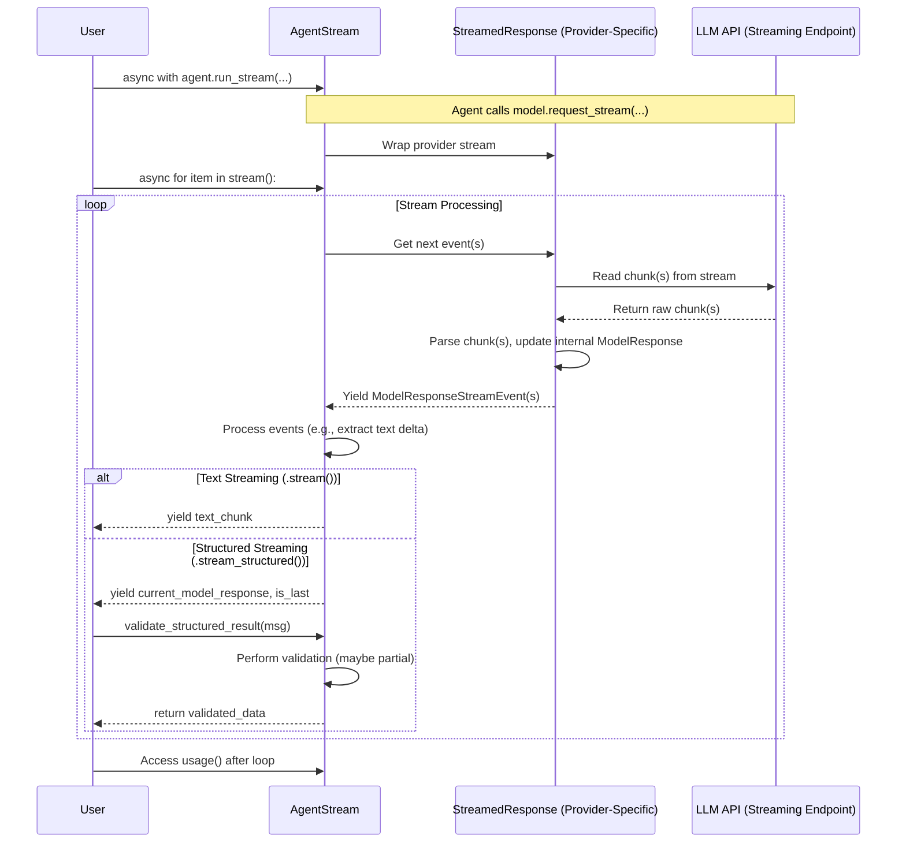

# Chapter 9: StreamedResponse / AgentStream

In the previous chapter, [Usage](08_usage.md), we learned how `pydantic-ai` helps track resource consumption like token counts using the `Usage` object, similar to a utility meter for your AI interactions. This information is available in the [`AgentRunResult`](07_agentrun___agentrunresult.md) after the [Agent](01_agent.md) completes its task.

But what if you don't want to wait for the entire response? Imagine a chatbot: users expect to see the answer appear gradually, word by word, not wait for the whole paragraph to be generated before seeing anything. This is where streaming comes in.

## What's the Big Idea? Live Updates vs. Waiting

Think about watching a video online:
*   **Waiting:** You could download the *entire* video file first, and only then start watching. This is like using `agent.run()` or `agent.run_sync()`. You get the complete result at the end.
*   **Streaming:** You start watching the video almost immediately, while the rest of the file downloads in the background. This gives a much better user experience for large files or real-time interactions.

`StreamedResponse` and `AgentStream` enable this "streaming" behavior for LLM responses in `pydantic-ai`.

*   **`StreamedResponse`**: This is an internal object that manages the raw flow of data chunks coming back from the [Model](03_model.md) (the LLM API). It's like the underlying mechanism handling the video download piece by piece. You usually don't interact with this directly.
*   **`AgentStream`**: This is the user-friendly object you get when you ask the Agent to stream its response (using `agent.run_stream()`). It wraps the `StreamedResponse` and provides methods to easily consume the incoming data, whether it's plain text or structured data that needs validation as it arrives. It's like the video player interface that shows you the video as it downloads and buffers.

## Why Stream Responses?

*   **Improved User Experience:** Display results progressively (like text appearing word by word in a chatbot).
*   **Faster Time-to-First-Token:** Show the beginning of the response much faster, even if the full generation takes time.
*   **Handling Large Responses:** Process large amounts of text or data without loading everything into memory at once.

## How to Use It: Streaming Plain Text

The simplest use case is streaming plain text, like getting a story or explanation from the LLM. Instead of `agent.run()` or `agent.run_sync()`, you use `agent.run_stream()`.

**Goal:** Ask the agent for a short explanation and print it as it arrives.

```python
import asyncio
from pydantic_ai import Agent
import os

async def stream_text_example():
    # Use the model specified by environment variable, or default
    model_string = os.getenv('PYDANTIC_AI_MODEL', 'openai:gpt-4o')
    print(f'Using model: {model_string}')
    # We expect a string result (default for Agent)
    agent = Agent(model_string, instrument=True)

    prompt = "Explain the concept of streaming in simple terms."
    print(f"--- Asking: '{prompt}' ---")

    # Use 'async with agent.run_stream()' to get the AgentStream
    async with agent.run_stream(prompt) as agent_stream:
        # Use 'async for chunk in agent_stream.stream()' to get text chunks
        print("Response: ", end="", flush=True)
        async for chunk in agent_stream.stream():
            # Print each chunk as it arrives
            print(chunk, end="", flush=True)
        print("\n--- Stream finished ---")

    # You can still access usage info after the stream completes
    print(f"Usage: {agent_stream.usage()}")

# To run the async function
# asyncio.run(stream_text_example())
```

**How to run this:** Save the code above as a Python file (e.g., `stream_example.py`) and run it. Ensure you have your LLM API key (e.g., `OPENAI_API_KEY`) set as an environment variable. You'll need `asyncio` to run the `async` function.

```python
# Example of running the script
if __name__ == "__main__":
    try:
        asyncio.run(stream_text_example())
    except Exception as e:
        # Handle potential errors during API calls, etc.
        print(f"An error occurred: {e}")
```

**Expected Output (Conceptual):**

You won't see the whole text appear at once. Instead, it will print progressively:

```text
Using model: openai:gpt-4o
--- Asking: 'Explain the concept of streaming in simple terms.' ---
Response: Imagine watching a long movie online. Streaming means you can start watching the beginning of the movie almost right away, while the rest of the movie is still downloading in the background. You don't have to wait for the whole thing to download first! It's like getting data piece by piece, as you need it.
--- Stream finished ---
Usage: Usage(requests=1, request_tokens=..., response_tokens=..., total_tokens=..., ...)
```

**Explanation:**

1.  **`async with agent.run_stream(prompt) as agent_stream:`**: This initiates the streaming process. Instead of waiting for the full result, it returns an `AgentStream` object almost immediately. The `async with` ensures resources are properly handled.
2.  **`async for chunk in agent_stream.stream():`**: This loop iterates over the incoming text chunks provided by the `AgentStream`. Each `chunk` is a small piece of the total response text.
3.  **`print(chunk, end="", flush=True)`**: We print each chunk without a newline (`end=""`) and force the output buffer to flush (`flush=True`) so you see the text appear progressively in your terminal.
4.  **`agent_stream.usage()`**: After the `async with` block finishes (meaning the stream is complete), you can access the final [`Usage`](08_usage.md) information, just like with `AgentRunResult`.

## How to Use It: Streaming Structured Data

Streaming isn't just for plain text! `pydantic-ai` can also stream responses that are meant to be structured data (like JSON conforming to a Pydantic model). This is more complex because the data needs to be validated *as it arrives*.

**Goal:** Get a list of whale species, validating and displaying them as they stream in.

**1. Define the Structure:**
First, define the Pydantic model for the data you expect.

```python
# examples/pydantic_ai_examples/stream_whales.py (Simplified Model)
from typing import Annotated, NotRequired, TypedDict
from pydantic import Field

class Whale(TypedDict):
    name: str
    length: Annotated[
        float, Field(description='Average length of an adult whale in meters.')
    ]
    weight: NotRequired[ # Optional field
        Annotated[
            float,
            Field(description='Average weight of an adult whale in kilograms.', ge=50),
        ]
    ]
```
We expect a list of these `Whale` dictionaries.

**2. Create the Agent:**
Tell the agent to expect `list[Whale]`.

```python
# examples/pydantic_ai_examples/stream_whales.py (Simplified Agent)
from pydantic_ai import Agent

# Expecting a list of Whale objects
agent = Agent('openai:gpt-4o', result_type=list[Whale], instrument=True)
```

**3. Stream and Validate:**
Use `agent_stream.stream_structured()` and `agent_stream.validate_structured_result()`.

```python
import asyncio
from pydantic import ValidationError
from pydantic_ai import Agent
# Assume Whale TypedDict and agent are defined as above

async def stream_structured_example():
    print("--- Requesting whale data... ---")
    async with agent.run_stream("Generate details of 3 species of Whale.") as agent_stream:
        print("--- Streaming response: ---")
        async for message, is_last in agent_stream.stream_structured(debounce_by=0.1):
            try:
                # Validate the *current state* of the structured data
                # Allow partial validation until the very last chunk
                whales = await agent_stream.validate_structured_result(
                    message, allow_partial=not is_last
                )
                print(f"Partially Validated Whales ({len(whales)} found so far):")
                for w in whales:
                    # Print formatted, potentially incomplete whale info
                    print(f"  - {w.get('name', '...')}: Length {w.get('length', '...')}m, Weight {w.get('weight', '...')}kg")

            except ValidationError as e:
                # Handle cases where the stream is temporarily invalid JSON
                # We might just print a message or ignore it if it's expected
                # Don't raise if it's just the outer list missing (common early on)
                if any(err['type'] != 'missing' or err['loc'] != ('response',) for err in e.errors()):
                    print(f"\nValidation Error (might be temporary):\n{e}\n")
                    # In a real app, you might want more robust error handling

        print("--- Stream finished ---")
        print(f"Usage: {agent_stream.usage()}")

# To run the async function
# asyncio.run(stream_structured_example())
```

**How to run this:** Similar to the text example, save and run the script. Make sure your environment is set up.

**Expected Output (Conceptual):**

The output will build up progressively, showing partially complete whale data as it's validated.

```text
--- Requesting whale data... ---
--- Streaming response: ---
Partially Validated Whales (1 found so far):
  - Blue Whale: Length 30.0m, Weight ...kg
Partially Validated Whales (1 found so far):
  - Blue Whale: Length 30.0m, Weight 180000.0kg
Partially Validated Whales (2 found so far):
  - Blue Whale: Length 30.0m, Weight 180000.0kg
  - Humpback Whale: Length 16.0m, Weight ...kg
Partially Validated Whales (2 found so far):
  - Blue Whale: Length 30.0m, Weight 180000.0kg
  - Humpback Whale: Length 16.0m, Weight 36000.0kg
Partially Validated Whales (3 found so far):
  - Blue Whale: Length 30.0m, Weight 180000.0kg
  - Humpback Whale: Length 16.0m, Weight 36000.0kg
  - Orca: Length ...m, Weight ...kg
Partially Validated Whales (3 found so far):
  - Blue Whale: Length 30.0m, Weight 180000.0kg
  - Humpback Whale: Length 16.0m, Weight 36000.0kg
  - Orca: Length 9.0m, Weight 6000.0kg
--- Stream finished ---
Usage: Usage(requests=1, ...)
```

**Explanation:**

1.  **`async for message, is_last in agent_stream.stream_structured(debounce_by=0.1):`**: This method yields the *current state* of the underlying [`ModelResponse`](02_message___part.md) object as it's being built from the stream. `debounce_by` groups small, rapid updates together to avoid excessive validation calls. `is_last` tells us if this is the final update.
2.  **`agent_stream.validate_structured_result(message, allow_partial=not is_last)`**: This is the key method. It takes the current `ModelResponse` message and attempts to validate it against the agent's `result_type` (`list[Whale]`).
    *   **`allow_partial=not is_last`**: This is crucial. While the stream is ongoing (`is_last` is False), we tell the validator it's okay if the data isn't *fully* complete yet (e.g., maybe only the first whale in the list is present, or a whale object is missing its optional `weight`). Pydantic's experimental partial validation is used here. Only on the very last chunk (`is_last` is True) do we require full validation.
3.  **`except ValidationError`**: Because the streamed JSON might be temporarily invalid as it's being built (e.g., a list missing its closing bracket `]`), validation can fail. We catch `ValidationError` and can decide how to handle it (e.g., ignore temporary errors, log persistent ones).
4.  **Displaying Partial Data:** Inside the loop, we print the `whales` list, which contains partially validated `Whale` objects. We use `.get('...', '...')` to handle potentially missing fields gracefully.

## Under the Hood: How Streaming Works

1.  **User Calls `agent.run_stream()`**: You initiate the streaming process.
2.  **Agent Prepares**: The [Agent](01_agent.md) prepares the request for the [Model](03_model.md) as usual (prompts, tools, history).
3.  **Agent Calls `model.request_stream()`**: Instead of `model.request()`, the agent calls the streaming version on the [Model](03_model.md) object (e.g., `OpenAIModel.request_stream()`).
4.  **Model Returns `StreamedResponse`**: The specific `Model` implementation (e.g., `pydantic_ai.models.openai.OpenAIModel`) connects to the LLM API's streaming endpoint. It doesn't wait for the full response but immediately returns a `StreamedResponse` object (e.g., `OpenAIStreamedResponse`). This object knows how to handle the incoming stream of chunks from that specific provider.
5.  **Agent Returns `AgentStream`**: The Agent wraps the provider-specific `StreamedResponse` inside the user-friendly `AgentStream` object and returns it to your code.
6.  **User Iterates (`.stream()` or `.stream_structured()`):** Your `async for` loop starts pulling data.
7.  **`AgentStream` Pulls from `StreamedResponse`**: The `AgentStream` requests the next chunk(s) from the underlying `StreamedResponse`.
8.  **`StreamedResponse` Processes Chunks**: The `StreamedResponse` reads raw data from the API stream, parses it (e.g., Server-Sent Events), and translates it into standard `pydantic-ai` events (like text deltas or tool call parts). It uses an internal `ModelResponsePartsManager` (more on this in the [next chapter](10_modelresponsepartsmanager.md)) to assemble the complete `ModelResponse` gradually.
9.  **`AgentStream` Yields Data**:
    *   For `.stream()`, it yields the text delta.
    *   For `.stream_structured()`, it yields the current `ModelResponse` object assembled by the `StreamedResponse`.
10. **Validation (Structured)**: If you call `validate_structured_result()`, `AgentStream` uses the `_result_schema` and validators defined on the Agent to check the yielded `ModelResponse` data.
11. **Loop Continues**: Steps 7-10 repeat until the LLM finishes sending data and the stream ends.



The core `AgentStream` logic is in `pydantic_ai/result.py`. The provider-specific `StreamedResponse` implementations live within their respective model files (e.g., `pydantic_ai/models/openai.py`, `pydantic_ai/models/anthropic.py`).

## Key Takeaways

*   Use `agent.run_stream()` instead of `agent.run()`/`run_sync()` for streaming.
*   It returns an `AgentStream` object within an `async with` block.
*   Use `async for chunk in agent_stream.stream()` to get raw text chunks progressively.
*   Use `async for message, is_last in agent_stream.stream_structured()` to get the evolving [`ModelResponse`](02_message___part.md) for structured data.
*   Use `agent_stream.validate_structured_result(message, allow_partial=...)` to validate structured data as it streams, handling potential temporary `ValidationError`s.
*   Streaming improves perceived performance and user experience, especially for chatbots and large responses.

## Conclusion

Streaming is a powerful feature for creating responsive and user-friendly AI applications. `StreamedResponse` handles the low-level data flow from the LLM, while `AgentStream` provides convenient methods like `.stream()` and `.stream_structured()` to consume this data, whether it's simple text or complex structures requiring incremental validation.

Internally, how does `StreamedResponse` manage the incoming pieces (deltas) and assemble them into a coherent `ModelResponse`? In the next chapter, we'll look at the helper class responsible for this: [**ModelResponsePartsManager**](10_modelresponsepartsmanager.md).

---

Generated by [AI Codebase Knowledge Builder](https://github.com/The-Pocket/Tutorial-Codebase-Knowledge)