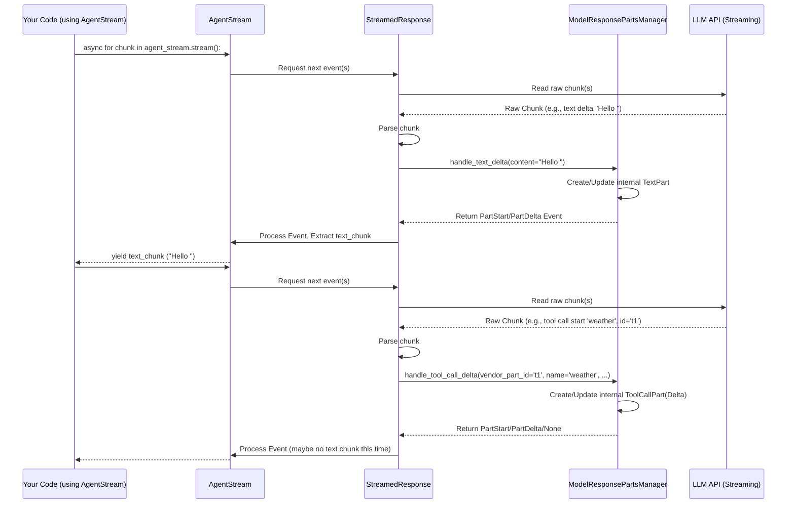

# Chapter 10: ModelResponsePartsManager - The Streaming Assembly Line Worker

In [Chapter 9: StreamedResponse / AgentStream](09_streamedresponse___agentstream.md), we saw how `pydantic-ai` allows us to get responses from the [Agent](01_agent.md) piece by piece, like watching a video online instead of downloading the whole file first. This streaming capability uses `AgentStream` to deliver text chunks or partially validated structured data as it arrives.

But how does `AgentStream` actually get these neat pieces? When the Large Language Model (LLM) streams its response, it often sends back a rapid flow of tiny updates, called "deltas". Some deltas might be small snippets of text, others might be parts of a request to use a [Tool](05_tool.md). Something needs to collect these tiny deltas and assemble them into meaningful chunks or complete parts (like a full sentence or a complete tool call).

This is the job of the **`ModelResponsePartsManager`**.

## What's the Big Idea? Assembling Parts on the Fly

Imagine an assembly line for building toys. Tiny pieces (screws, plastic bits, wheels) come down the conveyor belt very quickly. A worker stands on the line, picking up these pieces and assembling them into larger components (like a car body, or a wheel assembly).

The `ModelResponsePartsManager` is like that **assembly line worker** for streamed LLM responses.

*   The **tiny pieces** coming down the belt are the **deltas** (chunks of text, parts of a tool call) sent by the LLM stream.
*   The **worker** is the **`ModelResponsePartsManager`**.
*   The **larger components** being assembled are the **`ModelResponsePart`** objects (like `TextPart` or `ToolCallPart`) that we learned about in [Chapter 2: Messages and Parts](02_message___part.md).

The manager's job is to:
1.  **Receive Deltas:** Get the incoming stream fragments.
2.  **Identify:** Figure out which part this delta belongs to (e.g., is it more text for the main answer, or part of the arguments for a specific tool call?). Different LLM providers might use different ways to identify these parts (like an index or a unique ID).
3.  **Assemble:** Add the delta to the correct part being assembled. If it's the start of a *new* part, it begins assembling that.
4.  **Notify:** Let the system know when a new part has started or an existing part has been updated.

## Is This Something I Use Directly? (Spoiler: Usually Not!)

It's important to know that `ModelResponsePartsManager` is an **internal helper class**. As a typical user of `pydantic-ai`, you won't usually create or interact with it directly.

It's used *inside* the `StreamedResponse` object (which itself is often wrapped by `AgentStream`).

**So, why learn about it?** Understanding the `ModelResponsePartsManager` helps you grasp *how* streaming works under the hood in `pydantic-ai`. It demystifies the process of turning raw, fragmented stream data into the structured events and parts you consume via `AgentStream`.

## How Does It Work Conceptually?

Let's think about a streaming response that includes both text and a tool call: "Okay, I can help with that. Let me check the weather for London." -> [Call `get_weather` tool with `city="London"`].

The LLM stream might send deltas like this (simplified):

1.  `delta: { type: "text", content: "Okay, I can " }`
2.  `delta: { type: "text", content: "help with that. " }`
3.  `delta: { type: "text", content: "Let me check the " }`
4.  `delta: { type: "tool_call_start", index: 1, name: "get_weather", id: "tool_abc" }` (Start of a new part - a tool call)
5.  `delta: { type: "text", content: "weather for London." }` (Back to the first text part!)
6.  `delta: { type: "tool_call_args", index: 1, args_delta: '{"city": "Lond' }` (Arguments for the tool call)
7.  `delta: { type: "tool_call_args", index: 1, args_delta: 'on"}' }` (More arguments for the tool call)

The `ModelResponsePartsManager` receives these and does the following:

*   **Deltas 1-3:** Sees these are text deltas. It creates a `TextPart` and keeps appending the `content` to it. It might notify `StreamedResponse` about these updates (`PartDeltaEvent`).
*   **Delta 4:** Sees this is the start of a new type of part (a tool call) at a specific index (1). It creates an *incomplete* representation of `ToolCallPart` (internally, maybe a `ToolCallPartDelta`) associated with index 1 and the ID "tool_abc". It notifies `StreamedResponse` that a new part has started (`PartStartEvent`).
*   **Delta 5:** Sees this is more text. It recognizes it belongs to the *first* part (maybe because it has no specific index, or index 0) and appends "weather for London." to the existing `TextPart`. Notifies with a `PartDeltaEvent`.
*   **Deltas 6-7:** Sees these are argument deltas for the part at index 1. It appends the argument strings (`'{"city": "Lond'` and `'on"}'`) to the incomplete `ToolCallPartDelta` for index 1. Once the arguments seem complete and valid JSON, it might upgrade the internal representation to a full `ToolCallPart`. It notifies `StreamedResponse` about these updates, potentially emitting a final `PartStartEvent` when the part becomes complete.

Through this process, the manager keeps track of multiple parts being built simultaneously and reconstructs them from the incoming stream fragments.

## Under the Hood: The Manager in Action

Let's trace the flow when you use `agent_stream.stream()` or `agent_stream.stream_structured()` from [Chapter 9](09_streamedresponse___agentstream.md).

1.  **LLM Sends Chunk:** The LLM API sends a raw chunk of data over the stream (e.g., a Server-Sent Event).
2.  **`StreamedResponse` Receives:** The provider-specific `StreamedResponse` object (e.g., `OpenAIStreamedResponse`) receives this raw chunk.
3.  **`StreamedResponse` Parses:** It parses the chunk to understand what kind of delta it is (text, tool call start, tool call arguments, etc.) and extracts relevant info like content and vendor IDs (e.g., `index` or `tool_call_id`).
4.  **`StreamedResponse` Calls Manager:** Based on the parsed delta, it calls the appropriate method on its internal `ModelResponsePartsManager` instance.
    *   If it's a text delta: `parts_manager.handle_text_delta(vendor_part_id=..., content=...)`
    *   If it's a tool call delta: `parts_manager.handle_tool_call_delta(vendor_part_id=..., tool_name=..., args=..., tool_call_id=...)`
5.  **`ModelResponsePartsManager` Updates State:** The manager updates its internal list of `_parts`. It uses the `_vendor_id_to_part_index` dictionary to find the correct part to update or determines if a new part needs to be created. It handles merging deltas (e.g., appending text, combining tool arguments).
6.  **`ModelResponsePartsManager` Returns Event:** The manager returns a `ModelResponseStreamEvent` (either `PartStartEvent` or `PartDeltaEvent`) indicating what happened, or `None` if the update didn't result in a user-facing event (like updating an incomplete tool call).
7.  **`StreamedResponse` Yields:** The `StreamedResponse` takes the event from the manager and yields it (or the data derived from it) to the `AgentStream`.
8.  **`AgentStream` Delivers:** The `AgentStream` delivers the text chunk (from `.stream()`) or the updated `ModelResponse` (from `.stream_structured()`) to your code.

Here's a simplified diagram of this flow:



## Looking at the Code (Briefly!)

The `ModelResponsePartsManager` lives in `pydantic_ai/_parts_manager.py`. You can see methods like `handle_text_delta` and `handle_tool_call_delta`.

```python
# pydantic_ai/_parts_manager.py (Simplified Snippet)
from pydantic_ai.messages import (
    ModelResponsePart, TextPart, ToolCallPart, # ... other imports
    PartStartEvent, PartDeltaEvent, TextPartDelta, ToolCallPartDelta
)
from collections.abc import Hashable

@dataclass
class ModelResponsePartsManager:
    _parts: list[ModelResponsePart | ToolCallPartDelta] = field(default_factory=list)
    _vendor_id_to_part_index: dict[Hashable, int] = field(default_factory=dict)

    def get_parts(self) -> list[ModelResponsePart]:
        # Returns only the *complete* parts
        return [p for p in self._parts if not isinstance(p, ToolCallPartDelta)]

    def handle_text_delta(self, *, vendor_part_id: Hashable | None, content: str) -> ModelResponseStreamEvent:
        # 1. Find if a TextPart exists for this vendor_part_id
        #    or if vendor_part_id is None, check the last part.
        existing_text_part_and_index = self._find_existing_text_part(vendor_part_id)

        if existing_text_part_and_index is None:
            # 2a. If not, create a new TextPart
            part = TextPart(content=content)
            new_part_index = len(self._parts)
            if vendor_part_id is not None:
                self._vendor_id_to_part_index[vendor_part_id] = new_part_index
            self._parts.append(part)
            return PartStartEvent(index=new_part_index, part=part) # Notify: New part started
        else:
            # 2b. If yes, update the existing TextPart
            existing_text_part, part_index = existing_text_part_and_index
            part_delta = TextPartDelta(content_delta=content)
            # Apply the delta to the part object (e.g., append text)
            self._parts[part_index] = part_delta.apply(existing_text_part)
            return PartDeltaEvent(index=part_index, delta=part_delta) # Notify: Part updated

    def handle_tool_call_delta(self, ...) -> ModelResponseStreamEvent | None:
        # Similar logic:
        # 1. Find existing ToolCallPart or ToolCallPartDelta for vendor_part_id
        # 2. If none, create a new ToolCallPartDelta (or ToolCallPart if fully formed)
        # 3. If found, apply the delta (tool_name_delta, args_delta)
        # 4. If applying the delta makes an incomplete part complete, upgrade it
        # 5. Return PartStartEvent (if new complete part or upgraded)
        #    or PartDeltaEvent (if existing complete part updated)
        #    or None (if part remains incomplete)
        ... # Implementation details omitted for brevity
```

And here's how a `StreamedResponse` implementation (like `OpenAIStreamedResponse` in `pydantic_ai/models/openai.py`) might use it:

```python
# pydantic_ai/models/openai.py (Simplified Snippet from OpenAIStreamedResponse)
from pydantic_ai._parts_manager import ModelResponsePartsManager
# ... other imports

@dataclass
class OpenAIStreamedResponse(StreamedResponse):
    # ... other fields ...
    _parts_manager: ModelResponsePartsManager = field(default_factory=ModelResponsePartsManager)

    async def _get_event_iterator(self) -> AsyncIterator[ModelResponseStreamEvent]:
        async for chunk in self._response: # self._response is the raw OpenAI stream
            # ... parse chunk ...
            try:
                choice = chunk.choices[0]
            except IndexError:
                continue

            # Handle text delta
            content = choice.delta.content
            if content is not None:
                # Call the manager to handle the text delta
                yield self._parts_manager.handle_text_delta(
                    vendor_part_id='content', # Use a consistent ID for text
                    content=content
                )

            # Handle tool call delta
            for dtc in choice.delta.tool_calls or []:
                 # Call the manager to handle tool call delta
                maybe_event = self._parts_manager.handle_tool_call_delta(
                    vendor_part_id=dtc.index, # Use OpenAI's index as ID
                    tool_name=dtc.function and dtc.function.name,
                    args=dtc.function and dtc.function.arguments,
                    tool_call_id=dtc.id,
                )
                if maybe_event is not None:
                    yield maybe_event # Yield the event from the manager
```

This shows the collaboration: `StreamedResponse` parses the provider-specific format, and `ModelResponsePartsManager` handles the generic logic of assembling parts and emitting standard events.

## Key Takeaways

*   `ModelResponsePartsManager` is an **internal helper** class used by `StreamedResponse`.
*   It acts like an **assembly line worker**, taking raw stream **deltas** and building complete **`ModelResponsePart`** objects (`TextPart`, `ToolCallPart`).
*   It tracks parts using vendor-specific IDs or indices.
*   It handles the complexity of assembling fragmented text and incomplete tool calls.
*   It emits `PartStartEvent` and `PartDeltaEvent` to signal updates.
*   Understanding it helps understand the internal mechanics of streaming in `pydantic-ai`.

## Conclusion

You've now peeked behind the curtain of `pydantic-ai`'s streaming mechanism and met the `ModelResponsePartsManager` – the diligent worker ensuring that fragmented stream deltas are correctly assembled into the meaningful parts you interact with via `AgentStream`. While you don't use it directly, it's a key component enabling the smooth streaming experience.

So far, we've focused on the core components for building and running individual agents. But how might you manage *multiple* agents or expose your agent's capabilities as a service? In the next chapter, we'll explore the [**MCPServer**](11_mcpserver.md), a tool for serving `pydantic-ai` agents.

---

Generated by [AI Codebase Knowledge Builder](https://github.com/The-Pocket/Tutorial-Codebase-Knowledge)