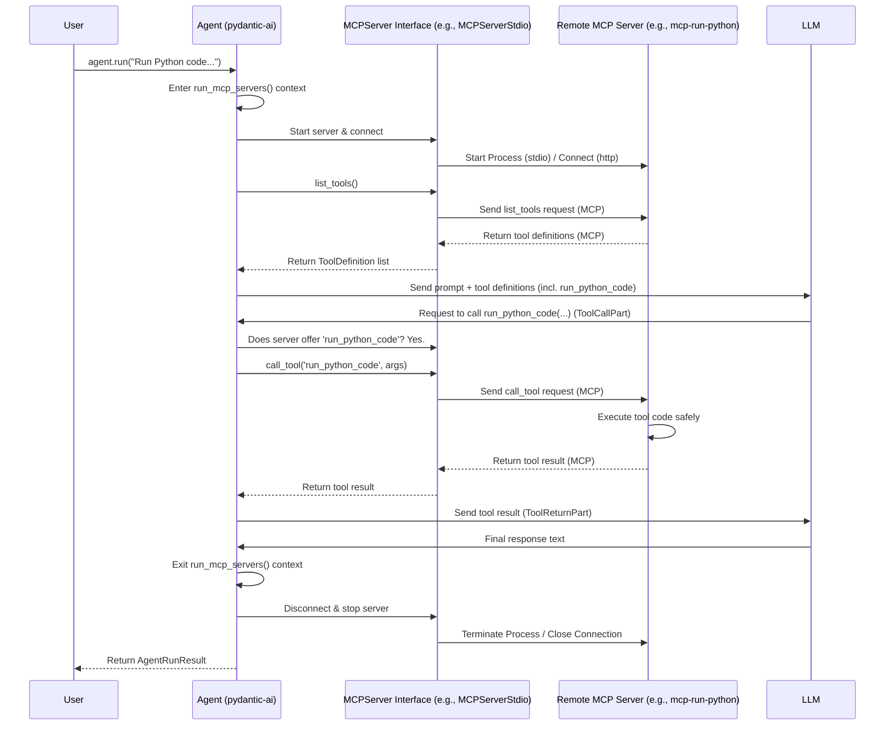

# Chapter 11: MCPServer - Connecting to Remote Tool Workshops

In [Chapter 10: ModelResponsePartsManager](10_modelresponsepartsmanager.md), we looked under the hood at how `pydantic-ai` handles the stream of data chunks coming from the LLM, assembling them neatly. We've built a good understanding of how a single [Agent](01_agent.md) works, talks to a [Model](03_model.md), and even uses Python functions as [Tools](05_tool.md).

But what if the tool you need isn't a simple Python function in your project? What if it's a complex service running elsewhere, maybe one that needs a special secure environment? For example, imagine you want your Agent to safely run arbitrary Python code provided by a user – you definitely wouldn't want to run that directly inside your main application!

This is where `MCPServer` comes in. It allows your Agent to connect to and use tools offered by *external* servers that follow a specific standard: the Model Context Protocol (MCP).

## What's the Big Idea? The Universal Adapter Plug

Think of your [Agent](01_agent.md) wanting to use a specialized piece of equipment, like a high-powered laser cutter, located in a remote, secure workshop. Your Agent can't just reach out and use it directly. It needs a special adapter plug and a standard way to communicate commands ("cut this shape", "report status").

*   The **remote workshop** is the **external server** running the specialized tool (like a secure Python code runner).
*   The **standard communication rule** is the **Model Context Protocol (MCP)**. It defines how the Agent and the server talk to each other about tools.
*   The **`MCPServer` object** in `pydantic-ai` is like that **universal adapter plug**. It knows how to establish the connection and speak the MCP language to the remote workshop on behalf of your Agent.

Using `MCPServer`, your Agent can leverage tools hosted completely outside your Python code, potentially written in different languages or running in different environments, as long as they speak MCP.

## Use Case: Running Python Code Safely

Let's say we want our Agent to be able to execute Python code provided in the prompt. We'll use an external MCP server designed specifically for this, like the [`mcp-run-python`](https://github.com/pydantic/mcp-run-python) project. This server acts as our "remote workshop," offering a `run_python_code` tool that executes code in a sandboxed environment.

Our goal is to connect our `pydantic-ai` Agent to this `mcp-run-python` server so the Agent can use the `run_python_code` tool when needed.

## How to Use `MCPServer`

First, you need the external MCP server program running. For our example, let's assume we have `mcp-run-python` installed and can run it from the command line.

**1. Represent the Server Connection in `pydantic-ai`**

We need to tell `pydantic-ai` *how* to connect to this external server. `pydantic-ai` provides different `MCPServer` classes for different connection methods. A common one for command-line tools is `MCPServerStdio`, which communicates via the standard input and output streams of a subprocess.

```python
# Note: You need to install the 'mcp' extra for this:
# pip install "pydantic-ai-slim[mcp]"

from pydantic_ai.mcp import MCPServerStdio

# Configure how to run the mcp-run-python server via command line
# (This command might vary based on your installation)
python_runner_server = MCPServerStdio(
    command='deno', # Assuming mcp-run-python uses Deno
    args=[
        'run', '-A', '--unstable', # Deno flags
        'jsr:@pydantic/mcp-run-python', # The package name
        'stdio' # Tell it to use stdio communication
    ],
    # env=os.environ # Optionally pass environment variables
)
```

This code creates an `MCPServerStdio` object, which is our "adapter plug". It tells `pydantic-ai`: "To talk to the Python runner workshop, start a process using the `deno` command with these specific arguments, and communicate with it using its standard input/output."

*(Note: There's also `MCPServerHTTP` for connecting to servers via HTTP/SSE, useful if the server is running elsewhere on a network.)*

**2. Give the Adapter Plug to the Agent**

When creating your Agent, you pass the `MCPServer` instance(s) in the `mcp_servers` list.

```python
from pydantic_ai import Agent

# Create an agent, telling it about the remote Python runner server
agent = Agent(
    'openai:gpt-4o', # Or your preferred model
    mcp_servers=[python_runner_server],
    instrument=True, # Good practice for logging
)
```

Now, the Agent knows about this potential remote workshop and its adapter plug.

**3. Manage the Server Lifecycle**

Since `MCPServerStdio` involves starting an external program, we need to make sure that program is running when the Agent needs it and is shut down afterwards. The `Agent` provides a helper context manager `agent.run_mcp_servers()` for this.

```python
import asyncio

async def run_agent_with_mcp():
    prompt = "What is 2 + 2? Use Python to calculate it and show the result."
    print(f"--- Running agent for: '{prompt}' ---")

    # Use run_mcp_servers() to start the server process
    async with agent.run_mcp_servers():
        # Now the python_runner_server is running in the background

        # Run the agent as usual
        result = await agent.run(prompt)

        print("\n--- Agent Result ---")
        print(f"Data: {result.data}")
        print(f"Usage: {result.usage()}")

    # Exiting the 'async with' block automatically stops the server process

# To run the async function:
# asyncio.run(run_agent_with_mcp())
```

The `async with agent.run_mcp_servers():` block does the following:
*   Calls `python_runner_server.__aenter__()`, which starts the `deno ... mcp-run-python stdio` process.
*   Establishes the MCP communication session.
*   Allows your `agent.run(prompt)` call to proceed.
*   When the block exits, it calls `python_runner_server.__aexit__()`, which terminates the server process and cleans up the connection.

**4. Agent Uses the Remote Tool (Behind the Scenes)**

When you call `agent.run(prompt)`, here's what happens regarding the MCP server:

*   **Tool Discovery:** Before talking to the LLM, the Agent asks the `python_runner_server` (via the MCP connection): "What tools do you offer?" The server replies, describing its `run_python_code` tool (including its name, description, and expected input arguments like `python_code`).
*   **LLM Instruction:** The Agent sends your prompt *and* the description of the `run_python_code` tool (along with any regular Python tools you defined) to the LLM.
*   **LLM Decides:** The LLM sees the prompt ("Use Python to calculate...") and the available `run_python_code` tool. It decides to use this tool.
*   **Agent Executes via MCP:** The LLM tells the Agent: "Call `run_python_code` with `python_code='print(2 + 2)'`". The Agent, recognizing this tool comes from `python_runner_server`, uses its adapter plug (`MCPServerStdio`) to send the command over the MCP connection to the external server.
*   **Remote Execution:** The `mcp-run-python` server receives the command, runs the Python code `print(2 + 2)` safely in its sandbox, captures the output (`"4\n"`), and sends the result back to the Agent via the MCP connection.
*   **Agent Reports to LLM:** The Agent gets the result (`"4\n"`) from the server and reports it back to the LLM.
*   **Final Answer:** The LLM uses the tool's result to formulate the final answer.

**Expected Output (Conceptual):**

```text
--- Running agent for: 'What is 2 + 2? Use Python to calculate it and show the result.' ---

--- Agent Result ---
Data: The result of calculating 2 + 2 using Python is 4.
Usage: Usage(requests=2, request_tokens=..., response_tokens=..., ...)
```

The Agent successfully used the `run_python_code` tool hosted by the external MCP server, without that tool's code ever being directly part of your `pydantic-ai` application!

## Under the Hood: How the Connection Works

Let's trace the key internal steps when an Agent uses a tool from an `MCPServer`:

1.  **`run_mcp_servers()` Starts:** You enter the `async with agent.run_mcp_servers():` block. The `MCPServerStdio.__aenter__` method runs the specified command (`deno ...`) as a subprocess and establishes an MCP `ClientSession` over its stdin/stdout pipes.
2.  **Agent Run Starts:** You call `agent.run(...)` or `agent.iter(...)`.
3.  **Tool Discovery (`_prepare_request_parameters`):** Inside the agent's internal graph logic (`pydantic_ai/_agent_graph.py`), before the first request to the LLM, the Agent iterates through its `mcp_servers`. For each one, it calls `server.list_tools()` over the established MCP connection.
4.  **Tool Definitions Gathered:** The `MCPServer` object receives the tool definitions from the remote server and translates them into `pydantic-ai`'s internal `ToolDefinition` format.
5.  **LLM Request:** These remote tool definitions are included (along with local Python tool definitions) in the request sent to the LLM [Model](03_model.md).
6.  **LLM Responds with `ToolCallPart`:** The LLM decides to use the remote tool (e.g., `run_python_code`) and sends back a [`ToolCallPart`](02_message___part.md).
7.  **Tool Identification (`CallToolsNode`):** The Agent's `CallToolsNode` receives the `ToolCallPart`. It first checks its local Python tools (`_function_tools`). If no match is found, it iterates through the `mcp_servers` again, calling `_tool_from_mcp_server`.
8.  **MCP Tool Lookup:** `_tool_from_mcp_server` asks the `MCPServer` if it provides a tool with the requested name (`run_python_code`). If yes, it creates a temporary `Tool` object on the fly.
9.  **Temporary Tool Execution:** The `run` method of this temporary `Tool` is designed to call `server.call_tool(tool_name, arguments)` on the specific `MCPServer` instance.
10. **MCP Call:** The `MCPServer` sends the `call_tool` request over the MCP connection to the remote server (e.g., `mcp-run-python`).
11. **Remote Execution & Response:** The remote server executes the tool and sends the result back over the MCP connection.
12. **Result Packaging:** The `MCPServer` receives the result and the temporary `Tool` object packages it as a [`ToolReturnPart`](02_message___part.md).
13. **Agent Continues:** The Agent sends this `ToolReturnPart` back to the LLM, and the process continues as usual.
14. **`run_mcp_servers()` Ends:** When the `async with` block exits, `MCPServerStdio.__aexit__` terminates the subprocess and closes the MCP connection.

Here's a simplified diagram of the interaction:



Relevant code lives in:
*   `pydantic_ai/mcp.py`: Defines `MCPServer`, `MCPServerStdio`, `MCPServerHTTP`.
*   `pydantic_ai/agent.py`: The `Agent.run_mcp_servers` method and passing `mcp_servers` list.
*   `pydantic_ai/_agent_graph.py`: Logic in `_prepare_request_parameters` for `server.list_tools()` and in `process_function_tools` (calling `_tool_from_mcp_server`) for identifying and calling MCP tools.

## Key Takeaways

*   `MCPServer` acts as an **adapter** to connect your [Agent](01_agent.md) to external servers offering [Tools](05_tool.md) via the **Model Context Protocol (MCP)**.
*   It allows Agents to use tools **hosted externally**, potentially in different environments or languages (like a safe Python sandbox).
*   Use classes like `MCPServerStdio` (for command-line tools) or `MCPServerHTTP` (for network services) to configure the connection.
*   Pass `MCPServer` instances to the `Agent` via the `mcp_servers` argument.
*   Use the `agent.run_mcp_servers()` context manager to handle the lifecycle (start/stop) of servers like `MCPServerStdio`.
*   The Agent automatically discovers tools from the MCP server and the LLM can choose to use them just like local Python tools.

## Conclusion

The `MCPServer` abstraction significantly extends the capabilities of your `pydantic-ai` Agent, allowing it to leverage specialized tools and services hosted in separate, standardized "remote workshops". By simply configuring the connection adapter, your Agent gains access to these external resources without needing to know the intricate details of their implementation.

We've now covered most of the core runtime components of `pydantic-ai`, from the central `Agent` to messages, models, tools, context, results, streaming, and even connecting to external servers. But how is the Agent's internal workflow actually managed? `pydantic-ai` uses another library, `pydantic-graph`, under the hood. In the next chapter, we'll get an introduction to the concepts of [**Graph (pydantic-graph)**](12_graph__pydantic_graph_.md).

---

Generated by [AI Codebase Knowledge Builder](https://github.com/The-Pocket/Tutorial-Codebase-Knowledge)