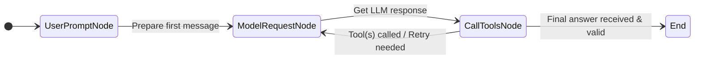
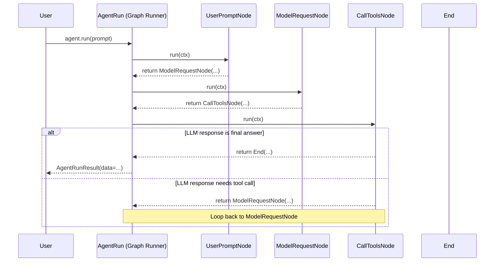

# Chapter 12: Graph (pydantic-graph) - The Agent's Internal Flowchart

In [Chapter 11: MCPServer](11_mcpserver.md), we saw how our [Agent](01_agent.md) can connect to external "workshops" to use tools hosted elsewhere. This adds another layer of potential complexity to the Agent's workflow.

We've seen the Agent handle simple requests, use [Tools](05_tool.md), deal with [Messages](02_message___part.md), and even stream responses. But how does the Agent actually *manage* this flow? Especially when using tools, the conversation might go back and forth with the [Model](03_model.md) multiple times. How does it know what step comes next?

The answer lies in an underlying engine that defines and executes this flow: a **Graph**.

## What's the Big Idea? A Recipe or Flowchart

Imagine you're following a recipe to bake a cake:

1.  Preheat the oven.
2.  Mix flour, sugar, eggs.
3.  *Decision:* Is the batter smooth?
    *   *Yes:* Pour into pan. -> Go to step 4.
    *   *No:* Mix more. -> Go back to step 3.
4.  Bake for 30 minutes.
5.  *End:* Cake is ready!

This recipe is like a **Graph**. It has:
*   **Steps (Nodes):** "Preheat oven", "Mix ingredients", "Pour into pan", "Bake". Each step performs an action.
*   **Transitions (Edges):** Arrows showing where to go next. Sometimes the next step depends on a decision ("Is the batter smooth?").
*   **State:** The ingredients and the batter itself represent the "state" that changes as you move through the steps.

`pydantic-ai` uses a library called `pydantic-graph` to define and manage these kinds of structured workflows. The [Agent](01_agent.md)'s logic – deciding when to talk to the [Model](03_model.md), when to call [Tools](05_tool.md), when to retry, and when to finish – is built on top of this graph system.

Think of the graph as the Agent's internal **flowchart** or state machine diagram. It dictates the possible paths an operation can take.

## Key Concepts of `pydantic-graph`

While you often don't interact with the graph *directly* when using a standard `pydantic-ai` Agent, understanding these concepts helps clarify how the Agent works internally.

1.  **Node (`BaseNode`)**:
    *   Represents a single step or stage in the process.
    *   Each box in our flowchart analogy.
    *   Each node has a specific task to perform (e.g., prepare the request for the LLM, call a tool, check the LLM's response).
    *   In `pydantic-graph`, nodes are typically defined as classes inheriting from `BaseNode`. We'll explore `BaseNode` more in the [next chapter](13_basenode___end__pydantic_graph_.md).

2.  **Edge**:
    *   Represents a transition or connection *between* nodes.
    *   The arrows in our flowchart.
    *   An edge dictates which node should run *after* the current node finishes.
    *   Crucially, the *outcome* of a node's execution determines which edge is followed. For example, if the LLM asks to call a tool, the `CallToolsNode` might transition back to the `ModelRequestNode` (after running the tool). If the LLM provides the final answer, it might transition to the `End` node.

3.  **State**:
    *   The information that persists and potentially changes as the execution moves from node to node.
    *   Like the ingredients and batter in our recipe analogy.
    *   In the `pydantic-ai` Agent's graph, the state (`GraphAgentState`) includes things like the conversation [message history](02_message___part.md), accumulated [usage](08_usage.md) statistics, and the current retry count.

4.  **Graph**:
    *   The overall structure defined by the collection of nodes and the possible edges (transitions) between them.
    *   It manages the execution flow, moving from one node to the next based on the outcome of each step, while maintaining the state.

## The Agent's Internal Graph

The standard `pydantic-ai` [Agent](01_agent.md) uses a predefined graph internally to manage its operations. We actually saw the nodes of this graph in [Chapter 7: AgentRun / AgentRunResult](07_agentrun___agentrunresult.md) when we used `agent.iter()`:

*   **`UserPromptNode`**: Takes the initial user input and system prompts, prepares the first message. Transitions to `ModelRequestNode`.
*   **`ModelRequestNode`**: Sends the current message list to the [Model](03_model.md) (LLM). Transitions to `CallToolsNode`.
*   **`CallToolsNode`**: Receives the LLM's response.
    *   If the response contains the final answer (and it's valid), it transitions to `End`.
    *   If the response asks to call [Tools](05_tool.md), it executes the tools, prepares a `ToolReturnPart`, and transitions back to `ModelRequestNode`.
    *   If the response fails validation or a tool fails, it might prepare a `RetryPromptPart` and transition back to `ModelRequestNode`.
*   **`End`**: A special node indicating the successful completion of the run. It holds the final result data.

This internal flow allows the Agent to handle the back-and-forth nature of tool use and validation automatically.



## Example: A Simple Standalone Graph

Let's build a very simple graph using `pydantic-graph` directly to see the concepts in action. Imagine a simple quiz where we ask a question, get an answer, and check if it's right.

**(Note: This requires `pydantic-graph` to be installed: `pip install pydantic-graph`)**

**1. Define the State:**
What information do we need to track? Just the question and the user's answer.

```python
# examples/pydantic_ai_examples/simple_graph_example.py
from dataclasses import dataclass

@dataclass
class QuizState:
    question: str | None = None
    answer: str | None = None
```
*   We define a simple dataclass `QuizState` to hold the `question` and `answer` strings.

**2. Define the Nodes:**
We need nodes for asking, answering, and checking.

```python
# examples/pydantic_ai_examples/simple_graph_example.py
from pydantic_graph import BaseNode, End, GraphRunContext

# Node 1: Ask the question
@dataclass
class AskQuestion(BaseNode[QuizState]):
    async def run(self, ctx: GraphRunContext[QuizState]) -> 'GetAnswer':
        # Set the question in the state
        ctx.state.question = "What is the capital of Pythonia?"
        print(f"Question: {ctx.state.question}")
        # Return the next node to run
        return GetAnswer()

# Node 2: Get the user's answer
@dataclass
class GetAnswer(BaseNode[QuizState]):
    async def run(self, ctx: GraphRunContext[QuizState]) -> 'CheckAnswer':
        # Get input from the user and store it in state
        ctx.state.answer = input("Your answer: ")
        # Return the next node
        return CheckAnswer()

# Node 3: Check the answer
@dataclass
class CheckAnswer(BaseNode[QuizState, None, str]): # Specify end type str
    async def run(self, ctx: GraphRunContext[QuizState]) -> End[str]:
        correct_answer = "Pydantic City"
        if ctx.state.answer == correct_answer:
            print("Correct!")
            # Return the special 'End' node with the final output
            return End("Quiz passed!")
        else:
            print(f"Incorrect. The answer was {correct_answer}.")
            return End("Quiz failed.")

```
*   Each node inherits from `BaseNode[QuizState]`. The state type is passed as a generic argument.
*   The `run` method of each node takes `ctx: GraphRunContext[QuizState]`. `ctx.state` gives access to our `QuizState` instance.
*   The `run` method *returns* the instance of the *next node* to execute (e.g., `AskQuestion` returns `GetAnswer()`).
*   `CheckAnswer` returns `End(...)` when the process should finish, passing the final result ("Quiz passed!" or "Quiz failed!").

**3. Define the Graph:**
Tell `pydantic-graph` about the nodes.

```python
# examples/pydantic_ai_examples/simple_graph_example.py
from pydantic_graph import Graph

# Create the graph instance
quiz_graph = Graph(nodes=(AskQuestion, GetAnswer, CheckAnswer))
```
*   We create a `Graph` object, passing the list of node classes. `pydantic-graph` figures out the possible transitions from the return type hints in the `run` methods.

**4. Run the Graph:**
Start the process with an initial state and the first node.

```python
# examples/pydantic_ai_examples/simple_graph_example.py
import asyncio

async def main():
    initial_state = QuizState()
    start_node = AskQuestion()

    # Run the graph synchronously until it reaches an End node
    result = await quiz_graph.run(start_node, state=initial_state)

    print(f"\nGraph finished. Final State: {result.state}")
    print(f"Final Output: {result.output}")

# if __name__ == "__main__":
#     asyncio.run(main())
```
*   We create an initial `QuizState`.
*   We specify the starting node (`AskQuestion()`).
*   `quiz_graph.run(...)` executes the graph, moving from node to node based on their return values, until an `End` node is returned.
*   The `run` method returns a `GraphRunResult` containing the final `output` and the final `state`.

**Running the Example:**

If you save and run this code (e.g., using `asyncio.run(main())`):

```text
Question: What is the capital of Pythonia?
Your answer: Pydantic City  # User types this
Correct!

Graph finished. Final State: QuizState(question='What is the capital of Pythonia?', answer='Pydantic City')
Final Output: Quiz passed!
```

Or if the answer is wrong:

```text
Question: What is the capital of Pythonia?
Your answer: Spamville  # User types this
Incorrect. The answer was Pydantic City.

Graph finished. Final State: QuizState(question='What is the capital of Pythonia?', answer='Spamville')
Final Output: Quiz failed.
```

This simple example demonstrates how a graph defines a sequence of steps (nodes), transitions between them (edges via return values), and maintains shared information (state).

## Internal Implementation in `pydantic-ai`

As mentioned, `pydantic-ai`'s `Agent` uses a `pydantic-graph` Graph internally.

1.  **Graph Definition:** When an `Agent` is created, the `build_agent_graph` function (in `pydantic_ai/_agent_graph.py`) defines the `Graph` instance with nodes like `UserPromptNode`, `ModelRequestNode`, `CallToolsNode`.
2.  **Run Starts:** When you call `agent.run()` or `agent.iter()`, it creates the initial state (`GraphAgentState`) and dependencies (`GraphAgentDeps`), then starts the graph execution using `graph.iter()`.
3.  **Node Execution:** The `GraphRun` object (from `pydantic-graph`) manages the process:
    *   It calls the `run` method of the current node (e.g., `UserPromptNode`).
    *   The `run` method performs its action (e.g., prepare messages) and returns the next node instance (e.g., `ModelRequestNode`).
    *   `GraphRun` receives the next node and prepares to call its `run` method.
    *   This repeats, following the transitions defined by the node implementations, until an `End` node is returned.
4.  **Result:** The `AgentRun` wraps the `GraphRun`, providing access to the steps and the final `AgentRunResult` once the `End` node is reached.

Here's a simplified sequence diagram focusing on the node transitions within the Agent:



The `pydantic-graph` library provides the core engine (`Graph`, `GraphRun`) and node definition (`BaseNode`), while `pydantic-ai/_agent_graph.py` defines the specific nodes and state used by the `Agent`.

## Key Takeaways

*   `pydantic-ai` uses the `pydantic-graph` library internally to manage the execution flow of an [Agent](01_agent.md).
*   A **Graph** is like a flowchart or recipe, consisting of **Nodes** (steps) and **Edges** (transitions).
*   **Nodes** perform actions and decide which node comes next by returning an instance of it.
*   **State** is maintained across the execution and is accessible/modifiable by nodes.
*   The `Agent` uses nodes like `UserPromptNode`, `ModelRequestNode`, `CallToolsNode`, and `End` to handle user input, LLM calls, tool execution, and finishing.
*   You usually don't interact with the graph directly when using the `Agent`, but understanding it explains the Agent's behavior.

## Conclusion

You've now learned about the underlying Graph structure, powered by `pydantic-graph`, that orchestrates the complex workflows within a `pydantic-ai` Agent. This flowchart-like system allows the Agent to manage conversations, tool usage, retries, and validation in a structured way.

While the `Agent` class abstracts this away for common use cases, knowing about the graph helps understand the Agent's lifecycle. The fundamental building block of this graph is the Node. In the next chapter, we'll take a closer look at the base class for all nodes: [**BaseNode / End (pydantic-graph)**](13_basenode___end__pydantic_graph_.md).

---

Generated by [AI Codebase Knowledge Builder](https://github.com/The-Pocket/Tutorial-Codebase-Knowledge)