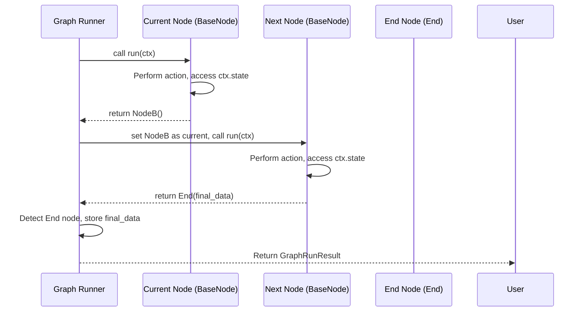

# Chapter 13: BaseNode / End (pydantic-graph) - The Steps in Your Agent's Recipe

In the [previous chapter](12_graph__pydantic_graph_.md), we learned that `pydantic-ai` uses a concept called a Graph, like a flowchart or recipe, to manage the steps an [Agent](01_agent.md) takes. This graph structure helps the Agent handle complex tasks involving multiple interactions with an AI [Model](03_model.md) and external [Tools](05_tool.md).

But what are the individual steps *within* that recipe made of? How does the graph know what to do at each stage, and how does it know when the recipe is finished?

That's where `BaseNode` and `End` come in. They are the fundamental building blocks provided by the `pydantic-graph` library, which powers the Agent's internal workflow.

## What's the Big Idea? Recipe Instructions

Let's go back to our cake recipe analogy from [Chapter 12](12_graph__pydantic_graph_.md).

*   **`BaseNode` is like a single instruction step** in the recipe. Examples: "Preheat oven to 180°C", "Mix flour and sugar", "Check if batter is smooth". Each `BaseNode` represents one specific action or decision point.
*   **`End` is like the final instruction:** "Serve and enjoy!". It signals that the recipe (the graph run) has successfully completed.

These two concepts form the core of how a `pydantic-graph` works.

## What is `BaseNode`? The Workhorse Step

`BaseNode` is the base class for *every* step in a `pydantic-graph` Graph. Think of it as the template for an instruction in our recipe.

Key things about `BaseNode`:

1.  **It Represents One Action:** Each class inheriting from `BaseNode` defines a specific task to be performed.
2.  **It Has a `run` Method:** This is the heart of the node. The `run` method contains the Python code that performs the node's action. This could involve preparing data, calling an AI model, executing a tool, or making a decision.
3.  **It Receives Context:** The `run` method receives a `GraphRunContext` object (often named `ctx`). This context gives the node access to the **shared state** of the graph (like the ingredients in our recipe) and any **dependencies** (like a pre-calibrated oven thermometer).
4.  **It Decides What's Next:** The most important job of the `run` method is to decide which step comes next. It does this by **returning an instance** of the *next* `BaseNode` class to execute, or by returning `End` if the process is finished.

## What is `End`? The "We're Done!" Signal

`End` is a special, simple node type. Its only job is to signal that the graph execution has finished successfully.

Key things about `End`:

1.  **Signals Completion:** When a node's `run` method returns an `End` object, the graph knows the process is complete.
2.  **Holds the Final Result:** The `End` object carries the final output data of the entire graph run. If the recipe was to bake a cake, the `End` object might hold the "Cake" object itself.

## Example: Nodes in Our Simple Quiz Graph

Let's look again at the simple quiz graph we built in [Chapter 12](12_graph__pydantic_graph_.md) and focus on how `BaseNode` and `End` are used.

**(Reminder: This example uses `pydantic-graph` directly. `pydantic-ai` uses these concepts internally.)**

**1. The State:**
We track the question and answer.

```python
# examples/pydantic_ai_examples/simple_graph_example.py
from dataclasses import dataclass

@dataclass
class QuizState:
    question: str | None = None
    answer: str | None = None
```

**2. The Nodes (`BaseNode` subclasses):**

```python
# examples/pydantic_ai_examples/simple_graph_example.py
from pydantic_graph import BaseNode, End, GraphRunContext

# Node 1: Inherits from BaseNode, operates on QuizState
@dataclass
class AskQuestion(BaseNode[QuizState]):
    async def run(self, ctx: GraphRunContext[QuizState]) -> 'GetAnswer':
        # Action: Set the question in the shared state
        ctx.state.question = "What is the capital of Pythonia?"
        print(f"Question: {ctx.state.question}")
        # Decide Next Step: Return an instance of the GetAnswer node
        return GetAnswer()

# Node 2: Inherits from BaseNode, operates on QuizState
@dataclass
class GetAnswer(BaseNode[QuizState]):
    async def run(self, ctx: GraphRunContext[QuizState]) -> 'CheckAnswer':
        # Action: Get input, update shared state
        ctx.state.answer = input("Your answer: ")
        # Decide Next Step: Return an instance of the CheckAnswer node
        return CheckAnswer()

# Node 3: Inherits from BaseNode, operates on QuizState, can return End[str]
@dataclass
class CheckAnswer(BaseNode[QuizState, None, str]):
    async def run(self, ctx: GraphRunContext[QuizState]) -> End[str]:
        correct_answer = "Pydantic City"
        # Action: Check the answer in the state
        if ctx.state.answer == correct_answer:
            print("Correct!")
            # Decide Next Step: Return End with the final result string
            return End("Quiz passed!")
        else:
            print(f"Incorrect. The answer was {correct_answer}.")
            # Decide Next Step: Return End with the final result string
            return End("Quiz failed.")
```

*   **Inheritance:** Notice how each node (`AskQuestion`, `GetAnswer`, `CheckAnswer`) inherits from `BaseNode`. The `[QuizState]` part tells the graph what kind of shared state this node expects. `CheckAnswer` also specifies `str` as the type of data the `End` node will hold (`BaseNode[QuizState, None, str]`).
*   **`run(ctx)`:** Each node implements the `run` method. It uses `ctx.state` to access and modify the shared `QuizState`.
*   **Returning Next Node:** `AskQuestion` returns `GetAnswer()`, and `GetAnswer` returns `CheckAnswer()`. This is how the graph flows from one step to the next.
*   **Returning `End`:** `CheckAnswer` makes a decision. Based on the answer, it returns either `End("Quiz passed!")` or `End("Quiz failed!")`. This signals the end of the quiz and provides the final outcome string.

## How `pydantic-ai` Uses `BaseNode` / `End` Internally

You usually don't write these nodes yourself when using `pydantic-ai`. The [Agent](01_agent.md) comes pre-packaged with its own internal graph built from `BaseNode` subclasses.

The nodes we saw in [Chapter 7](07_agentrun___agentrunresult.md) and [Chapter 12](12_graph__pydantic_graph_.md) are just specific implementations following this pattern:

*   **`UserPromptNode`**: Inherits from `BaseNode`. Its `run` method prepares the initial messages based on user input and system prompts. It returns an instance of `ModelRequestNode`.
*   **`ModelRequestNode`**: Inherits from `BaseNode`. Its `run` method takes the current message history, sends it to the configured AI [Model](03_model.md), and gets the response. It returns an instance of `CallToolsNode` containing the model's response.
*   **`CallToolsNode`**: Inherits from `BaseNode`. Its `run` method examines the model's response.
    *   If the response needs a [Tool](05_tool.md) call, it runs the tool function, prepares the `ToolReturnPart`, and returns an instance of `ModelRequestNode` to send the tool result back to the model.
    *   If the response contains the final answer and it passes validation, it returns `End(FinalResult(...))` containing the structured data. `FinalResult` is a simple wrapper around the actual data, usage, etc.
    *   If the response needs a retry (e.g., validation failed), it prepares a `RetryPromptPart` and returns an instance of `ModelRequestNode`.

So, the Agent's complex behavior (calling models, using tools, validating, retrying) is orchestrated by these specialized `BaseNode` implementations passing control to each other until one finally returns `End`.

## Internal Implementation Walkthrough

How does the graph actually execute these nodes?

1.  **Start:** When you call `agent.run()` or `agent.iter()`, the `pydantic-graph` engine (specifically the `GraphRun` object) is initialized with the *first* node (e.g., `UserPromptNode`) and the initial state.
2.  **Execute Node:** The `GraphRun` calls the `run(ctx)` method of the *current* node.
3.  **Get Next Step:** The `run` method does its work and returns either:
    *   An *instance* of the next `BaseNode` to run (e.g., `ModelRequestNode()`).
    *   An *instance* of `End(...)` containing the final result.
4.  **Update Current Node:** The `GraphRun` takes the returned object and sets it as the *new current* node.
5.  **Check for End:** If the new current node is an `End` object, the run is complete. The `GraphRun` stores the final result and stops.
6.  **Loop:** If the new current node is another `BaseNode`, the `GraphRun` loops back to step 2, calling the `run` method of this new node.

This loop continues until an `End` node is returned.



*Code References:*
*   The definitions for `BaseNode` and `End` are in `pydantic_graph/nodes.py`.
*   The internal Agent nodes (`UserPromptNode`, etc.) are defined in `pydantic_ai/_agent_graph.py`.

## Key Takeaways

*   **`BaseNode`** is the fundamental building block of a `pydantic-graph` Graph, representing a single step or action.
*   Each `BaseNode` subclass implements a `run` method that performs the action and returns the *next* node instance to execute.
*   The `run` method receives a `GraphRunContext` (`ctx`) to access shared **state** and **dependencies**.
*   **`End`** is a special node returned by a `run` method to signal the successful completion of the graph.
*   `End` holds the final `data` output of the graph run.
*   `pydantic-ai`'s internal Agent logic is implemented using specialized `BaseNode` subclasses (`UserPromptNode`, `ModelRequestNode`, `CallToolsNode`).

## Conclusion

You've now learned about the core components that make up the steps within the Agent's internal graph: `BaseNode` defines *what* happens in a step and *where to go next*, while `End` signals the completion of the process. Understanding these building blocks helps clarify how the seemingly complex behavior of an Agent is managed in a structured and predictable way using the `pydantic-graph` engine.

These nodes often need to read and write shared information as the graph runs – the "state". How is this state managed, especially if you want the graph to remember things between runs or survive restarts? In the next chapter, we'll explore [**State Persistence (pydantic-graph)**](14_state_persistence__pydantic_graph_.md).

---

Generated by [AI Codebase Knowledge Builder](https://github.com/The-Pocket/Tutorial-Codebase-Knowledge)