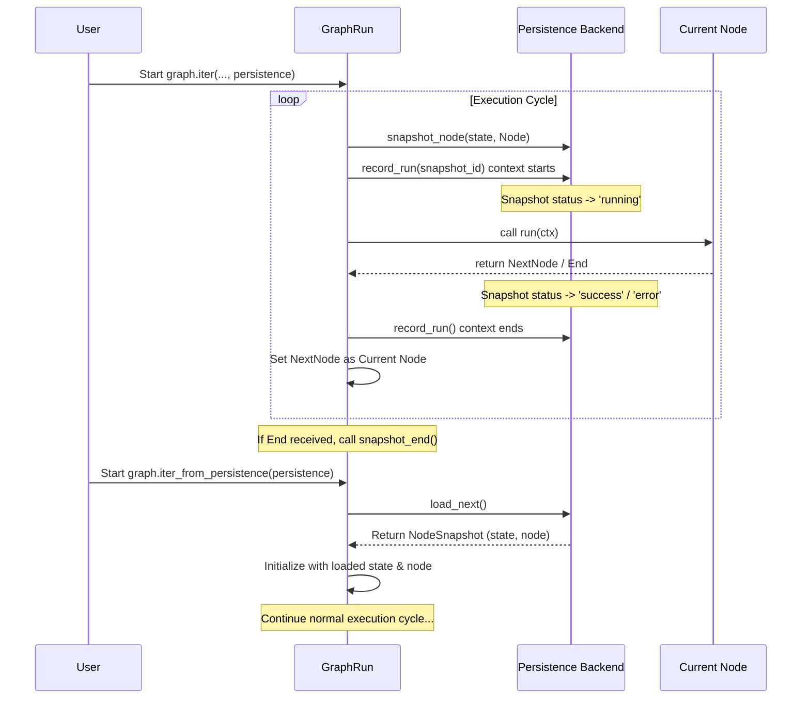

# Chapter 14: State Persistence (pydantic-graph) - Saving Your Agent's Progress

In the [previous chapter](13_basenode___end__pydantic_graph_.md), we learned about the individual steps in our [Agent](01_agent.md)'s internal flowchart (the Graph). These steps are called Nodes (`BaseNode`), and they define the actions the Agent takes, eventually leading to an `End` node when the task is complete.

But what happens if the Agent's task is very long? Imagine an Agent analyzing a large document or having a multi-step conversation that takes hours. What if your program crashes, or you need to pause the Agent and continue later? Without saving progress, you'd have to start all over again!

This is where **State Persistence** comes in. It's the mechanism `pydantic-graph` (the library powering the Agent's internal flow) uses to save and load the progress of a graph run.

## What's the Big Idea? Saving Your Game

Think about playing a long video game. You wouldn't want to finish it in one sitting! You use "save points" or just hit "Save Game" to record your current progress – your character's location, inventory, health, etc. Later, you can load that save file and continue exactly where you left off.

**State Persistence** in `pydantic-graph` is exactly like that save game feature.

*   **The Game:** Running your Agent's graph.
*   **Your Progress:** The current **state** of the graph (e.g., the conversation history, which step is next).
*   **Saving:** The persistence mechanism automatically saves a snapshot (`NodeSnapshot`) of the state *before* each step (Node) runs.
*   **The Save File:** Where these snapshots are stored (e.g., a JSON file on your computer).
*   **Loading:** Resuming the graph run from the last saved snapshot.

This allows your Agent's graph runs to be:
*   **Resumable:** Stop and start again later.
*   **Long-running:** Survive program restarts or temporary interruptions.
*   **Auditable:** You have a history of the states the graph went through.

## Key Concepts

1.  **Snapshot (`NodeSnapshot` / `EndSnapshot`):** A record of the graph's state at a specific point in time. A `NodeSnapshot` captures the state *before* a [`BaseNode`](13_basenode___end__pydantic_graph_.md) runs, including the node itself. An `EndSnapshot` captures the state when the graph reaches an [`End`](13_basenode___end__pydantic_graph_.md) node.
2.  **State (`StateT`):** The shared information that the nodes read and modify (like the `QuizState` in our previous examples, or the `GraphAgentState` inside `pydantic-ai`).
3.  **Persistence Backend (`BaseStatePersistence`):** An object responsible for actually saving and loading these snapshots. It defines *how* and *where* the snapshots are stored.

## Meet `FileStatePersistence`: Saving to a File

`pydantic-graph` comes with different persistence backends. A very common and easy-to-understand one is `FileStatePersistence`.

As the name suggests, `FileStatePersistence` saves the snapshots as JSON data into a file on your computer. Each time a node is about to run, it appends a new snapshot to this file.

```python
# Need pydantic-graph installed: pip install pydantic-graph
from pathlib import Path
from pydantic_graph.persistence.file import FileStatePersistence

# Create a persistence object that saves to 'my_graph_run.json'
# in the current directory.
persistence_file = Path("my_graph_run.json")
persistence_backend = FileStatePersistence(persistence_file)

print(f"Snapshots will be saved to: {persistence_file.absolute()}")
```
*   We import `FileStatePersistence` and `Path`.
*   We create a `Path` object pointing to the desired filename.
*   We instantiate `FileStatePersistence`, giving it the path. Now `persistence_backend` knows where to save the snapshots.

## How to Use It: Running a Graph with Persistence

Let's adapt our simple quiz graph from [Chapter 12](12_graph__pydantic_graph_.md) to use persistence. Remember, this example uses `pydantic-graph` directly to illustrate the concept. The `pydantic-ai` Agent uses this same mechanism internally.

**1. Define Graph and State (as before):**

```python
# examples/pydantic_ai_examples/simple_graph_persistence.py
from dataclasses import dataclass
from pydantic_graph import BaseNode, End, Graph, GraphRunContext
# Assume AskQuestion, GetAnswer, CheckAnswer nodes are defined as before

@dataclass
class QuizState:
    question: str | None = None
    answer: str | None = None

# Assume quiz_graph = Graph(...) is defined using the nodes
```

**2. Set up Persistence:**

```python
# examples/pydantic_ai_examples/simple_graph_persistence.py
import asyncio
from pathlib import Path
from pydantic_graph.persistence.file import FileStatePersistence

# File where we'll save the progress
persistence_file = Path("quiz_save.json")
persistence_backend = FileStatePersistence(persistence_file)

# Important: Tell the persistence backend about the graph's types
# This helps it serialize/deserialize the state and nodes correctly
persistence_backend.set_graph_types(quiz_graph)
```
*   We create the `FileStatePersistence` instance.
*   Crucially, we call `persistence_backend.set_graph_types(quiz_graph)`. This step is needed so the backend knows how to handle our specific `QuizState` and node types when reading/writing the JSON file.

**3. Run with `graph.iter()` and `persistence`:**
Instead of `graph.run()`, we use the `graph.iter()` context manager and pass our persistence backend.

```python
# examples/pydantic_ai_examples/simple_graph_persistence.py
# Assume AskQuestion node is defined

async def run_and_save():
    print(f"--- Starting run, saving to {persistence_file} ---")
    # Clear previous save file if it exists
    persistence_file.unlink(missing_ok=True)

    initial_state = QuizState()
    start_node = AskQuestion()

    # Use 'async with graph.iter()' and pass the persistence object
    async with quiz_graph.iter(
        start_node,
        state=initial_state,
        persistence=persistence_backend
    ) as run:
        async for node in run:
            print(f" > Just ran: {type(node).__name__}")
            # The state is automatically saved before each step runs!

    # Check the final result after the loop
    if run.result:
        print(f"--- Run finished ---")
        print(f"Final Output: {run.result.output}")
        print(f"Saved state in: {persistence_file}")
    else:
        print("Run did not complete.") # Should not happen here

# To run: asyncio.run(run_and_save())
```
*   We start the graph using `async with quiz_graph.iter(...)`.
*   We pass `persistence=persistence_backend` to the `iter` method.
*   As we loop (`async for node in run:`), `pydantic-graph` automatically calls `persistence_backend.snapshot_node()` *before* executing the `run()` method of each node. This saves the state to `quiz_save.json`.
*   The loop continues until an `End` node is reached.

If you run this, it will execute the quiz, and you'll find a `quiz_save.json` file containing snapshots like this (simplified):

```json
[
  {
    "state": { "question": null, "answer": null },
    "node": { "_node_id": "AskQuestion" }, // Details omitted
    "status": "success", // Status after running
    "kind": "node",
    "id": "..."
  },
  {
    "state": { "question": "What is the capital of Pythonia?", "answer": null },
    "node": { "_node_id": "GetAnswer" }, // Details omitted
    "status": "success",
    "kind": "node",
    "id": "..."
  },
  {
    "state": { "question": "What is the capital of Pythonia?", "answer": "Pydantic City" },
    "node": { "_node_id": "CheckAnswer" }, // Details omitted
    "status": "success",
    "kind": "node",
    "id": "..."
  },
  {
    "state": { "question": "What is the capital of Pythonia?", "answer": "Pydantic City" },
    "result": { "data": "Quiz passed!" }, // End node result
    "kind": "end",
    "id": "..."
  }
]
```

## How to Use It: Resuming a Graph Run

Now, the cool part! Let's say the program stopped halfway through. We can use the saved `quiz_save.json` to resume.

We use `graph.iter_from_persistence()` instead of `graph.iter()`.

```python
# examples/pydantic_ai_examples/simple_graph_persistence.py

async def resume_run():
    print(f"--- Attempting to resume from {persistence_file} ---")
    if not persistence_file.exists():
        print("No save file found. Run 'run_and_save' first.")
        return

    # Use 'async with graph.iter_from_persistence()'
    # It automatically loads the next pending node and state
    try:
        async with quiz_graph.iter_from_persistence(
            persistence=persistence_backend
            # No need to pass start_node or state here!
        ) as run:
            print(f"Resuming from node: {type(run.next_node).__name__}")
            print(f"Loaded state: {run.state}")

            async for node in run:
                print(f" > Just ran: {type(node).__name__}")
                # Continues saving state automatically

        if run.result:
            print(f"--- Resumed run finished ---")
            print(f"Final Output: {run.result.output}")
        else: # This can happen if the loaded state was already the End state
             print("--- Run was already finished in save file ---")
             # Load the history to see the last step
             history = await persistence_backend.load_all()
             if history and isinstance(history[-1], EndSnapshot):
                 print(f"Final Output (from history): {history[-1].result.data}")

    except Exception as e:
        print(f"Error resuming: {e}")
        # Might happen if the save file is corrupted or empty

# To run: asyncio.run(resume_run())
```
*   We again create the `FileStatePersistence` object pointing to the *same* file (`quiz_save.json`).
*   We use `async with quiz_graph.iter_from_persistence(...)`.
*   This method automatically:
    *   Loads the snapshots from the file.
    *   Finds the *last successful snapshot* and determines which node should run *next*.
    *   Loads the state from that snapshot.
    *   Starts the `run` loop from that point.
*   The loop continues as normal, executing nodes and saving new snapshots, until it reaches `End`.

If you run `run_and_save()` and stop it partway (e.g., after answering the question but before checking), then run `resume_run()`, it will pick up exactly where it left off!

## Under the Hood: How Persistence Works with the Graph

1.  **Run Starts (`iter`):** When `graph.iter(..., persistence=...)` begins, it prepares the initial node and state.
2.  **Snapshot Taken:** *Before* calling the `run()` method of the current node, the `GraphRun` object calls `persistence.snapshot_node(current_state, current_node)`. This saves the state *before* the node modifies it.
3.  **Node Runs:** The `GraphRun` calls `current_node.run(ctx)`. The node executes, potentially modifying `ctx.state`.
4.  **Run Recorded:** The `persistence` object wraps the node execution (using `record_run`) to update the snapshot's status (e.g., to 'running', then 'success' or 'error') and timing information.
5.  **Next Node Determined:** The `run()` method returns the next node instance (or `End`).
6.  **Loop:** The `GraphRun` sets this as the new `current_node` and loops back to step 2.
7.  **End Snapshot:** If `End` is returned, `persistence.snapshot_end(final_state, end_node)` is called.

**Resuming (`iter_from_persistence`):**

1.  **Load Next:** `graph.iter_from_persistence(persistence)` calls `persistence.load_next()`.
2.  **Find Pending:** The persistence backend (e.g., `FileStatePersistence`) scans its saved snapshots to find the first one with status `'created'` or `'pending'`. This represents the next step that *should* have run.
3.  **Set State:** It loads the `state` and `node` from that snapshot.
4.  **Start Run:** The `GraphRun` is initialized with this loaded state and node.
5.  **Normal Loop:** The execution proceeds as described above from step 2 (Snapshot Taken).



*Relevant Code:*
*   `pydantic_graph/persistence/file.py`: Defines `FileStatePersistence`.
*   `pydantic_graph/persistence/__init__.py`: Defines `BaseStatePersistence`, `NodeSnapshot`, `EndSnapshot`.
*   `pydantic_graph/graph.py`: The `Graph.iter()` and `Graph.iter_from_persistence()` methods use the persistence object.

## Key Takeaways

*   **State Persistence** allows saving and loading the progress of a `pydantic-graph` run, like saving a video game.
*   It's useful for long-running, resumable, or auditable graph executions.
*   Progress is saved as **Snapshots** (`NodeSnapshot`, `EndSnapshot`) containing the **State** and the **Node**.
*   **`BaseStatePersistence`** is the base class for saving/loading mechanisms.
*   **`FileStatePersistence`** is a concrete implementation that saves snapshots to a JSON file.
*   Use `graph.iter(..., persistence=...)` to run a graph *while saving* state.
*   Use `graph.iter_from_persistence(persistence=...)` to *resume* a graph run from saved state.

## Conclusion

You've now learned how `pydantic-graph` enables state persistence, allowing you to save the progress of your complex Agent workflows and resume them later, just like loading a saved game. Using backends like `FileStatePersistence`, you can make your graph executions more robust and manageable, especially for longer tasks.

This concludes our exploration of the core components of `pydantic-ai` and its underlying graph engine `pydantic-graph`. We've covered everything from the main `Agent` and its communication (`Message`, `Model`, `Provider`) to its capabilities (`Tool`), context (`RunContext`), results (`AgentRunResult`, `Usage`), streaming (`AgentStream`), and the internal graph mechanics (`Graph`, `BaseNode`, `End`, State Persistence).

Next, we shift gears to look at a related library in the Pydantic ecosystem: `pydantic-evals`. This library helps you evaluate the quality and performance of your AI applications. We'll start by looking at how to define test data for evaluation using the [**Dataset (pydantic-evals)**](15_dataset__pydantic_evals_.md).

---

Generated by [AI Codebase Knowledge Builder](https://github.com/The-Pocket/Tutorial-Codebase-Knowledge)