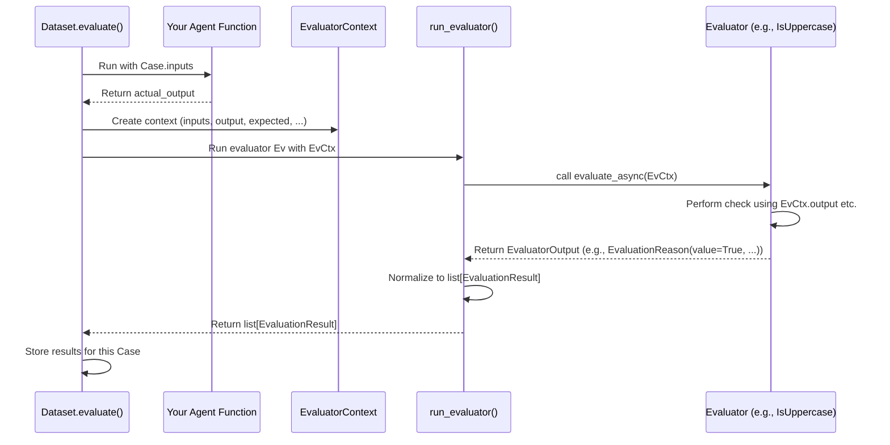

# Chapter 16: Evaluator (pydantic-evals) - Grading the AI's Answers

In [Chapter 15: Dataset (pydantic-evals)](15_dataset__pydantic_evals_.md), we learned how to create a `Dataset` - essentially an exam paper filled with test `Case` objects for our AI [Agent](01_agent.md) or function. We have the questions (`inputs`) and sometimes the perfect answer key (`expected_output`).

But just having the questions and answers isn't enough to grade the exam. We need the specific **grading rules**. For example:
*   Is the student's answer *exactly* the same as the answer key?
*   Is the answer *close enough*?
*   Does the answer follow the instructions, even if there's no single "right" answer (like "write a polite email")?

This is where **Evaluators** come in. They are the individual grading rules used by `pydantic-evals` to judge the quality of your AI's output for each test case.

## What's the Big Idea? The Grading Rubric

Think of your `Dataset` as the exam paper and each `Case` as a question. An **Evaluator** is like a single item on the **grading rubric** for that exam.

*   **Question:** "What is 2 + 2?" (`Case.inputs`)
*   **Answer Key:** 4 (`Case.expected_output`)
*   **Student's Answer:** "4" (`actual_output` from your Agent)
*   **Grading Rule 1 (`EqualsExpected` Evaluator):** "Is the student's answer *exactly* equal to the answer key?" -> Yes (Pass)
*   **Grading Rule 2 (`IsInstance` Evaluator):** "Is the student's answer a number (integer)?" -> Yes (Pass)

Each Evaluator focuses on checking **one specific aspect** of the answer based on a defined condition or metric.

## Why Use Evaluators?

*   **Objective Scoring:** Define clear, repeatable rules for what makes an answer "good" or "bad".
*   **Specific Feedback:** Pinpoint exactly *why* an answer failed (e.g., "Output was not equal to expected", "Output was impolite").
*   **Flexible Criteria:** Evaluate aspects beyond simple equality, like checking for specific content, using another AI to judge quality, or measuring performance metrics like speed.

## Built-in Grading Rules: Common Evaluators

`pydantic-evals` comes with several ready-to-use evaluators for common grading tasks. Here are a few examples:

*   **`EqualsExpected`**: Checks if the actual output is exactly equal (`==`) to the `expected_output` defined in the `Case`. (Like our "2+2=4" example).
*   **`Equals(value=...)`**: Checks if the actual output is exactly equal (`==`) to a specific `value` you provide directly to the evaluator.
*   **`Contains(value=...)`**: Checks if the actual output "contains" a specific `value`. This works differently depending on the type:
    *   Strings: Is `value` a substring of the output?
    *   Lists/Tuples: Is `value` an element *in* the output list?
    *   Dicts: Are all key-value pairs in `value` present in the output dict?
*   **`IsInstance(type_name=...)`**: Checks if the output is an instance of a Python class with the given `type_name` (e.g., `'int'`, `'str'`, `'MyCustomClass'`).
*   **`LLMJudge(rubric=...)`**: Uses another LLM (like GPT-4o) to judge the output based on a `rubric` (a description of what makes a good answer). This is powerful for evaluating subjective qualities like politeness, creativity, or adherence to instructions.
*   **`MaxDuration(seconds=...)`**: Checks if the task completed within a certain time limit.

You can find these and more in the `pydantic_evals.evaluators` module, especially `pydantic_evals/evaluators/common.py`.

## Adding Evaluators to Your Dataset

You can add these grading rules to your whole `Dataset` (so they apply to every `Case`) or just to specific `Case` objects.

Let's add the `EqualsExpected` evaluator to our `uppercase_dataset` from the previous chapter.

**1. Load the Dataset (as before):**

```python
# Example assumes uppercase_test_set.yaml exists from Chapter 15
from pydantic_evals import Dataset
from pathlib import Path

load_path = Path("uppercase_test_set.yaml")
# Inputs are dict, output is str, metadata is None
LoadedDatasetType = Dataset[dict, str, None]
loaded_dataset = LoadedDatasetType.from_file(load_path, fmt='yaml')
```

**2. Import and Add the Evaluator:**

```python
from pydantic_evals.evaluators import EqualsExpected

# Create an instance of the evaluator
exact_match_rule = EqualsExpected()

# Add it to the entire dataset
loaded_dataset.add_evaluator(exact_match_rule)

print(f"Dataset now has {len(loaded_dataset.evaluators)} dataset-level evaluator(s).")
```

**Explanation:**
*   We import `EqualsExpected` from `pydantic_evals.evaluators`.
*   We create an instance: `exact_match_rule = EqualsExpected()`. Some evaluators might take arguments here (like `Equals(value='HELLO')`), but `EqualsExpected` doesn't need any.
*   We use `loaded_dataset.add_evaluator(exact_match_rule)`. This adds the rule to the dataset's list of evaluators, meaning it will be applied to *every* case when the dataset is evaluated.

You could also add it to only one specific case using:
`loaded_dataset.add_evaluator(exact_match_rule, specific_case='Simple Hello')`

Now, when we evaluate this dataset, the `EqualsExpected` rule will automatically check if the Agent's output matches the `expected_output` for each case.

## Creating Your Own Grading Rule: Custom Evaluators

What if the built-in rules aren't enough? You can easily create your own custom `Evaluator`!

Let's create a simple rule for our uppercase example: check if the output string *is actually uppercase*.

**1. Define the Custom Evaluator Class:**

```python
from dataclasses import dataclass
from pydantic_evals.evaluators import (
    Evaluator,
    EvaluatorContext,
    EvaluationReason, # Use this for clearer results
)

# Define the input and output types for clarity
# (Replace with your actual types if not dict/str)
InputType = dict # Agent takes dict input {'text': ...}
OutputType = str # Agent returns a string

@dataclass # Evaluators are typically dataclasses
class IsUppercase(Evaluator[InputType, OutputType, None]): # Specify types
    """Checks if the output string is entirely uppercase."""

    def evaluate(
        self, ctx: EvaluatorContext[InputType, OutputType, None]
    ) -> EvaluationReason:
        """The core logic of the evaluator."""
        output_string = ctx.output # Get the Agent's actual output

        # Ensure the output is a string before checking
        if not isinstance(output_string, str):
            return EvaluationReason(value=False, reason="Output was not a string.")

        if output_string.isupper():
            # Pass: Return True, optionally with a reason
            return EvaluationReason(value=True, reason="String is uppercase.")
        else:
            # Fail: Return False with a reason explaining why
            return EvaluationReason(value=False, reason="String contains lowercase letters.")

```

**Explanation:**
*   **Import:** We import `dataclass`, `Evaluator`, `EvaluatorContext`, and `EvaluationReason`.
*   **`@dataclass`:** Custom evaluators are usually simple dataclasses.
*   **Inheritance:** `IsUppercase` inherits from `Evaluator`. We specify the expected types for `InputsT`, `OutputT`, and `MetadataT` using generics (`Evaluator[InputType, OutputType, None]`). This helps with type checking.
*   **`evaluate` Method:** This is where the grading logic lives.
    *   It receives `ctx: EvaluatorContext`. This `ctx` object is the key! It holds all the information about the current test run:
        *   `ctx.inputs`: The input given to the Agent for this case.
        *   `ctx.output`: The *actual* output produced by the Agent.
        *   `ctx.expected_output`: The expected output defined in the `Case` (if any).
        *   `ctx.metadata`: The metadata defined in the `Case` (if any).
        *   `ctx.duration`: How long the Agent took to run.
        *   `ctx.span_tree`: Detailed tracing information (more advanced, see [Chapter 18](18_spantree___spannode___spanquery__pydantic_evals_.md)).
    *   **Logic:** Inside `evaluate`, we access `ctx.output`, check if it's a string, and then use the standard `.isupper()` method.
    *   **Return Value:** We return an `EvaluationReason` object. This includes:
        *   `value`: The core result (usually `True` for pass, `False` for fail, but can also be scores or labels).
        *   `reason`: An optional string explaining the result, which is very helpful in the final report.

**2. Add the Custom Evaluator to the Dataset:**

```python
# Add an instance of our custom evaluator
is_uppercase_rule = IsUppercase()
loaded_dataset.add_evaluator(is_uppercase_rule)

print(f"Dataset now has {len(loaded_dataset.evaluators)} dataset-level evaluator(s).")

# You might want to save the dataset again, telling it about your custom type
# custom_types = (IsUppercase,)
# loaded_dataset.to_file("uppercase_test_set_v2.yaml", custom_evaluator_types=custom_types)
```

Now, when this dataset is evaluated, *both* `EqualsExpected` and our custom `IsUppercase` rule will be applied to each case.

## How Evaluators are Used (Sneak Peek)

When you call `dataset.evaluate(my_agent_function)` (which we'll cover properly in the next chapter), `pydantic-evals` does roughly this for each `Case`:

1.  **Run Agent:** Executes your `my_agent_function` with `case.inputs`.
2.  **Collect Output:** Gets the `actual_output` from your agent.
3.  **Create Context:** Bundles everything (`inputs`, `actual_output`, `expected_output`, `metadata`, timing, tracing info) into an `EvaluatorContext` object (`ctx`).
4.  **Run Evaluators:** For every evaluator attached to the dataset *and* the specific case:
    *   Calls the evaluator's `evaluate(ctx)` method.
    *   Collects the result (e.g., `True`/`False`, score, label, reason).
5.  **Store Results:** Saves these evaluation results for the final report.

## Under the Hood: Running the Grading Rules

The core logic for running an evaluator happens within the `Dataset.evaluate()` method, specifically delegated to helper functions like `_run_task_and_evaluators` and `run_evaluator` (found in `pydantic_evals/dataset.py` and `pydantic_evals/evaluators/_run_evaluator.py`).

1.  **Task Execution:** First, the user's task function (e.g., the uppercase Agent) is run with the inputs from the `Case`. This produces the actual output.
2.  **Context Creation:** An `EvaluatorContext` is created, packaging the inputs, actual output, expected output (if any), metadata, duration, and tracing data (`SpanTree`).
3.  **Gather Evaluators:** The system collects all relevant evaluators – those defined globally on the `Dataset` and those specific to the current `Case`.
4.  **Execute Each Evaluator:** For each evaluator in the gathered list:
    *   The `run_evaluator` helper function is called.
    *   It calls the evaluator's `evaluate_async(ctx)` method (which handles both sync/async `evaluate` definitions).
    *   It takes the returned `EvaluatorOutput` (which could be a single value, a dict, or an `EvaluationReason`).
    *   It normalizes this into a list of `EvaluationResult` objects, each having a name, value, reason, and source evaluator.
5.  **Collect Results:** The lists of `EvaluationResult` objects from all evaluators are combined.
6.  **Reporting:** These results are stored in a `ReportCase` object, which eventually becomes part of the final `EvaluationReport`.

Here's a simplified diagram showing the flow for a single case:



The `Evaluator` base class itself is defined in `pydantic_evals/evaluators/evaluator.py`. It uses standard Python features like `@dataclass` and `ABCMeta` to provide a simple structure for defining new grading rules.

## Key Takeaways

*   **Evaluators** are the specific **grading rules** used in `pydantic-evals`.
*   They check **one aspect** of an AI's output based on conditions or metrics.
*   `pydantic-evals` provides **built-in** evaluators (`EqualsExpected`, `LLMJudge`, `Contains`, etc.).
*   You can easily create **custom evaluators** by inheriting from `Evaluator` and implementing the `evaluate(ctx)` method.
*   The `evaluate` method receives an **`EvaluatorContext` (`ctx`)** containing inputs, output, expected output, metadata, etc.
*   Evaluators return results (like `True`/`False` or scores), often wrapped in an `EvaluationReason` to provide explanations.
*   Evaluators can be added **globally** to a `Dataset` or **specifically** to a `Case`.

## Conclusion

Evaluators are the heart of the scoring process in `pydantic-evals`. They provide the specific criteria for judging your Agent's performance on each test case in your `Dataset`. By combining built-in and custom evaluators, you can create a comprehensive and objective grading system for your AI application.

Now that we have our exam questions (`Dataset`) and our grading rules (`Evaluator`), how do we see the final grades? How are the results of running all these evaluators across all the cases presented? In the next chapter, we'll explore the final output: the [**EvaluationReport (pydantic-evals)**](17_evaluationreport__pydantic_evals_.md).

---

Generated by [AI Codebase Knowledge Builder](https://github.com/The-Pocket/Tutorial-Codebase-Knowledge)