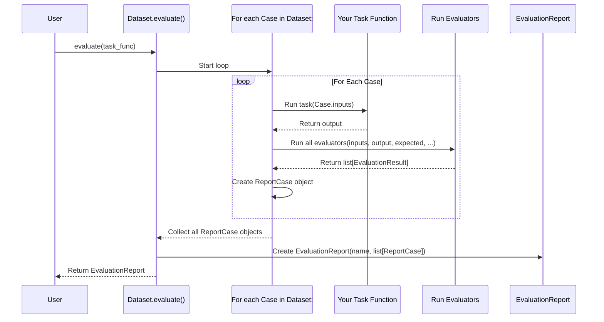

# Chapter 17: EvaluationReport (pydantic-evals) - Your AI's Grade Report

In [Chapter 16: Evaluator (pydantic-evals)](16_evaluator__pydantic_evals_.md), we learned how to create grading rules (`Evaluator` objects) for our AI's exam. We have the exam questions (`Dataset`) and the rubric (`Evaluator` list). Now, after the exam is taken and graded, how do we see the final results? We need a summary of how our AI performed overall and on each specific question.

This is where the **`EvaluationReport`** comes in. It's the final, comprehensive grade report for your AI's performance.

## What's the Big Idea? The Final Report Card

Imagine your AI student took the exam ([`Dataset`](15_dataset__pydantic_evals_.md)) and the teacher used the rubric ([`Evaluator`](16_evaluator__pydantic_evals_.md)) to grade each answer. The `EvaluationReport` is like the final report card you get back. It tells you:

1.  **Overall Performance:** How did the student do on average? (e.g., average score, pass rate).
2.  **Detailed Grades:** How did the student do on *each individual question*?
    *   What was the question (`inputs`)?
    *   What was the student's answer (`output`)?
    *   What was the expected answer (`expected_output`, if provided)?
    *   What scores or judgments did each grading rule (`Evaluator`) give?
    *   How long did it take to answer (`duration`)?

The `EvaluationReport` gathers all this information into one place, making it easy to understand your AI's strengths and weaknesses.

## Why Do We Need an EvaluationReport?

*   **Summarizes Results:** Provides a high-level overview of performance (e.g., average scores, pass/fail rates).
*   **Detailed Analysis:** Allows you to drill down into individual test cases (`ReportCase`) to see *why* an AI succeeded or failed.
*   **Tracking Progress:** Compare reports over time to see if changes to your AI (e.g., new prompts, different models) improve performance.
*   **Sharing Results:** Provides a standardized way to communicate evaluation outcomes.

## Getting the Report: Running the Evaluation

The `EvaluationReport` is the *output* you get after running the evaluation process. You typically get it by calling the `evaluate()` (async) or `evaluate_sync()` (sync) method on your [`Dataset`](15_dataset__pydantic_evals_.md) object, passing in the AI function you want to test.

Let's use our simple uppercase example from the previous chapters.

**1. Define the Task Function (Our "Student"):**
This is the function we want to test.

```python
# Our simple function to test
async def uppercase_func(inputs: dict) -> str:
    text = inputs.get('text', '')
    return text.upper()
```
*   This async function takes a dictionary with a 'text' key and returns the uppercased string.

**2. Load the Dataset and Add Evaluators (as before):**
We assume `uppercase_test_set.yaml` exists from [Chapter 15](15_dataset__pydantic_evals_.md) and contains our test cases. We also add the `EqualsExpected` evaluator from [Chapter 16](16_evaluator__pydantic_evals_.md).

```python
from pathlib import Path
from pydantic_evals import Dataset
from pydantic_evals.evaluators import EqualsExpected

# Load dataset
load_path = Path("uppercase_test_set.yaml")
LoadedDatasetType = Dataset[dict, str, None] # Inputs=dict, Output=str, Metadata=None
loaded_dataset = LoadedDatasetType.from_file(load_path, fmt='yaml')

# Add the grading rule
loaded_dataset.add_evaluator(EqualsExpected())
```

**3. Run Evaluation and Get the Report:**

```python
# Run the dataset against our function
# Use evaluate_sync for simplicity in this example
report = loaded_dataset.evaluate_sync(uppercase_func)

print(f"Evaluation Report generated for task: {report.name}")
```
*   We call `loaded_dataset.evaluate_sync(uppercase_func)`. This method:
    *   Runs `uppercase_func` for each `Case` in the dataset.
    *   Applies the `EqualsExpected` evaluator to each result.
    *   Collects all the inputs, outputs, and evaluation results.
    *   Returns the final `EvaluationReport` object, which we store in `report`.

## Exploring the Report

Now that we have the `report` object, let's see what's inside.

**1. Printing a Summary Table:**
The easiest way to get an overview is using the `print()` method.

```python
# Print the summary table to the console
report.print()
```

**Expected Output (Conceptual):**
This will print a nicely formatted table in your console (using the `rich` library if installed):

```text
           Evaluation Summary: uppercase_func
┏━━━━━━━━━━━━━━┳━━━━━━━━━━━━┳━━━━━━━━━━┓
┃ Case ID      ┃ Assertions ┃ Duration ┃
┡━━━━━━━━━━━━━━╇━━━━━━━━━━━━╇━━━━━━━━━━┩
│ Simple Hello │ ✔          │      0ms │
├──────────────┼────────────┼──────────┤
│ With Numbers │ ✔          │      0ms │
├──────────────┼────────────┼──────────┤
│ Empty String │ ✔          │      0ms │
├──────────────┼────────────┼──────────┤
│ Averages     │ 100.0% ✔   │      0ms │
└──────────────┴────────────┴──────────┘
```
*   This table shows each case name, whether the assertions (like `EqualsExpected`) passed (✔) or failed (✗), and how long the task took for that case.
*   It also shows the average pass rate and duration.

**2. Getting Overall Averages:**
You can access the summary statistics programmatically.

```python
# Get the average results
averages = report.averages()

print(f"Average Assertion Pass Rate: {averages.assertions * 100:.1f}%")
# You can also access average scores, metrics, duration etc. if available
# print(f"Average Score (e.g., 'Accuracy'): {averages.scores.get('Accuracy')}")
print(f"Average Task Duration: {averages.task_duration:.4f} seconds")
```
*   `report.averages()` returns a `ReportCaseAggregate` object containing average values for assertions, scores, metrics, and duration across all cases.

**3. Accessing Individual Case Results:**
The report contains detailed results for every single test case.

```python
# Access the list of individual case reports
all_case_results = report.cases

# Get the result for the first case
first_case_result = all_case_results[0] # This is a ReportCase object

print(f"\n--- Details for Case: {first_case_result.name} ---")
print(f"  Inputs: {first_case_result.inputs}")
print(f"  Expected Output: {first_case_result.expected_output}")
print(f"  Actual Output: {first_case_result.output}")
print(f"  Task Duration: {first_case_result.task_duration:.4f}s")
print(f"  Assertions:")
for name, assertion_result in first_case_result.assertions.items():
    status = "Pass" if assertion_result.value else "Fail"
    reason = assertion_result.reason or ""
    print(f"    - {name}: {status} ({reason})")
# You can also access .scores, .labels, .metrics, .attributes if present
```

**Expected Output (Conceptual):**

```text
--- Details for Case: Simple Hello ---
  Inputs: {'text': 'Hello World'}
  Expected Output: HELLO WORLD
  Actual Output: HELLO WORLD
  Task Duration: 0.0001s
  Assertions:
    - EqualsExpected: Pass (Output matches expected_output.)
```
*   `report.cases` is a list where each item is a `ReportCase` object.
*   Each `ReportCase` holds all the details for that specific test run: `name`, `inputs`, `expected_output`, the actual `output` from your function, `task_duration`, and dictionaries for `assertions`, `scores`, `labels`, `metrics`, and `attributes` populated by the evaluators.

## What's Inside a `ReportCase`?

The `ReportCase` object is where the detailed results for a single test scenario live. Key attributes include:

*   `name`: The name of the [`Case`](15_dataset__pydantic_evals_.md).
*   `inputs`: The inputs provided to your function.
*   `output`: The actual output returned by your function.
*   `expected_output`: The expected output from the `Case` (if defined).
*   `metadata`: Any metadata from the `Case`.
*   `assertions`: A dictionary mapping evaluator names to their boolean results (`EvaluationResult[bool]`). Typically used for pass/fail checks like `EqualsExpected`.
*   `scores`: A dictionary mapping evaluator names to their numeric scores (`EvaluationResult[int | float]`). Used for metrics like accuracy, F1-score, etc.
*   `labels`: A dictionary mapping evaluator names to string labels (`EvaluationResult[str]`). Used for classifications like "Polite", "Impolite", "Relevant".
*   `metrics`: A dictionary mapping metric names (often automatically collected, like token counts) to their numeric values.
*   `attributes`: A dictionary mapping attribute names (often automatically collected) to their values.
*   `task_duration`: Time taken (in seconds) by your function to run.
*   `total_duration`: Time taken for the entire case evaluation, including running evaluators.
*   `trace_id`, `span_id`: Identifiers for tracing the execution (useful for debugging with tools like Logfire).

## Under the Hood: Building the Report

When you call `dataset.evaluate()` or `evaluate_sync()`, `pydantic-evals` orchestrates the process defined in [Chapter 16](16_evaluator__pydantic_evals_.md):

1.  **Loop Through Cases:** It iterates through each `Case` in the `dataset.cases` list.
2.  **Run Task:** For each `Case`, it calls your provided task function (e.g., `uppercase_func`) with `case.inputs`. It measures the duration (`task_duration`).
3.  **Run Evaluators:** It gathers all applicable [`Evaluator`](16_evaluator__pydantic_evals_.md)s (dataset-level + case-specific) and runs each one, passing an `EvaluatorContext` containing the inputs, output, expected output, etc.
4.  **Collect Results:** It collects the results (`EvaluationResult` objects) from all evaluators.
5.  **Create `ReportCase`:** It bundles the inputs, output, expected output, metadata, durations, and all evaluation results into a `ReportCase` object.
6.  **Repeat:** Steps 2-5 are repeated for all cases.
7.  **Create `EvaluationReport`:** Finally, it gathers all the generated `ReportCase` objects into a list and creates the `EvaluationReport` object, adding the overall task name.

Here's a sequence diagram showing this flow:



*Relevant Code:*
*   The `EvaluationReport` and `ReportCase` classes are defined in `pydantic_evals/reporting/__init__.py`.
*   The logic for running the evaluation loop and creating the report happens within the `Dataset.evaluate()` method in `pydantic_evals/dataset.py` (calling helpers like `_run_task_and_evaluators`).

## Key Takeaways

*   The **`EvaluationReport`** is the final output of running `dataset.evaluate()`, summarizing the AI's performance.
*   It's like a **grade report**, containing both overall averages and detailed results for each test case.
*   Use `report.print()` for a quick console summary.
*   Use `report.averages()` to get average statistics programmatically.
*   Access `report.cases` (a list of `ReportCase` objects) to inspect results for individual test scenarios.
*   Each `ReportCase` contains inputs, output, expected output, durations, and results from all evaluators (assertions, scores, labels, metrics).

## Conclusion

The `EvaluationReport` provides the crucial feedback needed to understand how well your AI application performs against your defined test `Dataset` and `Evaluator` rules. By examining the overall averages and drilling down into individual `ReportCase` details, you can systematically assess, debug, and improve your AI.

Sometimes, especially when debugging why an evaluation failed or understanding complex AI behavior, you need more than just the final inputs and outputs. You need to see the *internal steps* the AI took, like which tools were called or what intermediate thoughts the LLM had. `pydantic-evals` integrates with tracing systems to provide this deeper view. In the next chapter, we'll look at how this detailed trace information is captured using [**SpanTree / SpanNode / SpanQuery (pydantic-evals)**](18_spantree___spannode___spanquery__pydantic_evals_.md).

---

Generated by [AI Codebase Knowledge Builder](https://github.com/The-Pocket/Tutorial-Codebase-Knowledge)