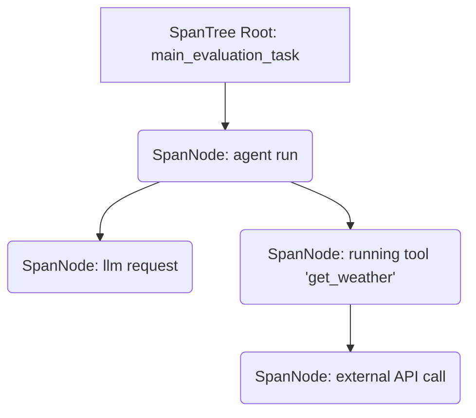
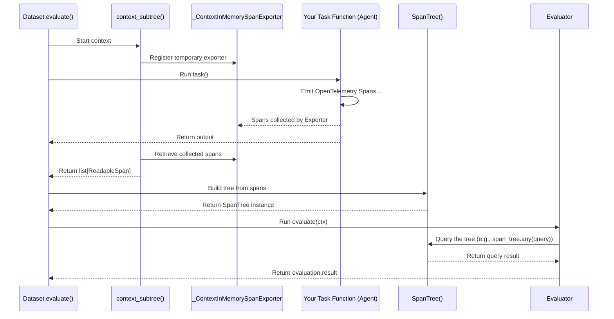

# Chapter 18: SpanTree / SpanNode / SpanQuery (pydantic-evals) - Your AI's Detailed Logbook

In the [previous chapter](17_evaluationreport__pydantic_evals_.md), we saw how the `EvaluationReport` gives us a final grade report for our AI, summarizing its performance across the [`Dataset`](15_dataset__pydantic_evals_.md) using the [`Evaluator`](16_evaluator__pydantic_evals_.md) rules. This report tells us *if* the AI passed or failed, but sometimes we need to know *why*.

Imagine your AI failed a test case where it was supposed to use a specific tool. The `EvaluationReport` might just show a "Fail". How do you figure out what went wrong internally? Did the AI even try to use the tool? Did it use the wrong tool?

To answer these questions, we need more than just the final inputs and outputs. We need a detailed logbook or recording of *every single step* the AI took during the test. This detailed recording is called a **trace**, and `pydantic-evals` provides tools to capture and examine these traces using `SpanTree`, `SpanNode`, and `SpanQuery`.

## What's the Big Idea? A Super-Detailed Video Recording

Think about evaluating a chef cooking a dish:
*   The **Final Grade Report ([`EvaluationReport`](17_evaluationreport__pydantic_evals_.md))** is like tasting the final dish and saying "Pass" or "Fail".
*   The **Trace ([`SpanTree`](#spantree--span-node---the-logbook-structure))** is like watching a **detailed video recording** of the *entire* cooking process: preheating the oven, chopping vegetables, mixing ingredients, how long each step took, and maybe even which assistant helped with which task.

This video recording (the trace) lets you pinpoint exactly where things went right or wrong. If the dish failed, you could review the recording to see if the chef forgot an ingredient or burned the sauce.

In the world of software, this detailed recording is often done using a standard called **OpenTelemetry**. The individual steps recorded are called **spans**. `pydantic-evals` integrates with this system to capture these spans during evaluation.

## SpanTree / SpanNode - The Logbook Structure

`pydantic-evals` organizes the captured steps (spans) into a structured logbook:

*   **`SpanNode`:** Represents a **single entry** in the logbook, corresponding to one specific step or operation (like a function call, an AI model request, or a tool execution). Each `SpanNode` contains information like:
    *   `name`: What was the operation? (e.g., "agent run", "running tool", "llm request")
    *   `start_timestamp` / `end_timestamp`: When did it start and end?
    *   `duration`: How long did it take?
    *   `attributes`: Extra details about the step (like the tool name, model name, or input arguments).
    *   Parent/Child relationships: Which step triggered this step? Which steps did this step trigger?

*   **`SpanTree`:** Represents the **entire logbook** for a single test case run. It's a tree structure where each `SpanNode` is connected to its parent (the step that called it) and its children (the steps it called). This tree shows the complete execution flow and hierarchy.


*This diagram shows a simplified `SpanTree`. The `agent run` node has child nodes for an `llm request` and `running tool 'get_weather'`, which itself has a child for an `external API call`.*

## Accessing the Trace: `ctx.span_tree`

How do you get this detailed logbook? It's automatically captured (if tracing is configured) and made available inside the `EvaluatorContext` (`ctx`) that gets passed to your custom [`Evaluator`](16_evaluator__pydantic_evals_.md) functions.

```python
from dataclasses import dataclass
from pydantic_evals.evaluators import Evaluator, EvaluatorContext
from pydantic_evals.otel import SpanTree, SpanQuery # Import SpanTree
# Assume InputType, OutputType, MetadataT are defined

@dataclass
class MyDebugEvaluator(Evaluator[InputType, OutputType, MetadataT]):
    def evaluate(self, ctx: EvaluatorContext[InputType, OutputType, MetadataT]):
        # Access the SpanTree for this evaluation run
        try:
            trace_logbook: SpanTree = ctx.span_tree
            print(f"Trace captured! Root span name: {trace_logbook.roots[0].name}")
            # Now we can analyze the trace_logbook...
            return True # Placeholder result
        except Exception as e:
            # Handle cases where tracing might not be set up
            print(f"Could not access span tree: {e}")
            return False
```
*   Inside the `evaluate` method of your custom evaluator, you can access the complete trace via `ctx.span_tree`.
*   **Important Prerequisite:** For `ctx.span_tree` to contain data, you need to have OpenTelemetry tracing set up in your environment *before* running the evaluation. The easiest way is usually by installing and configuring `logfire` (`pip install logfire`, then `logfire.configure()`). If tracing isn't set up, accessing `ctx.span_tree` will raise a `SpanTreeRecordingError`.

## Searching the Logbook: `SpanQuery`

Okay, we have the detailed `SpanTree` logbook. But it might contain hundreds of steps! How do we find the specific information we need, like "was the `get_weather` tool called?"

This is where **`SpanQuery`** comes in. It's like a search function for your `SpanTree`. You define a `SpanQuery` dictionary specifying the conditions you're looking for in a `SpanNode`.

A `SpanQuery` is a simple Python dictionary where keys define the search criteria:

*   `name_equals`: Find spans with this exact name.
*   `name_contains`: Find spans whose name contains this string.
*   `has_attributes`: Find spans that have *all* these specific attributes with these exact values (e.g., `{'tool_name': 'get_weather', 'status': 'success'}`).
*   `min_duration` / `max_duration`: Find spans within a certain time range.
*   `some_child_has`: Find spans where *at least one* of their direct children matches another `SpanQuery`.
*   `some_descendant_has`: Find spans where *at least one* of their descendants (children, grandchildren, etc.) matches another `SpanQuery`.
*   `some_ancestor_has`: Find spans where *at least one* of their ancestors matches another `SpanQuery`.
*   `and_`, `or_`, `not_`: Combine multiple queries logically.

## Example: Checking if a Specific Tool Was Called

Let's use `SpanTree` and `SpanQuery` to build the `AgentCalledTool` evaluator we saw briefly in [Chapter 16](16_evaluator__pydantic_evals_.md).

**Goal:** Create an evaluator that checks if an agent named `"MyWeatherAgent"` successfully called a tool named `"get_weather"` during its run.

```python
from dataclasses import dataclass
from pydantic_evals.evaluators import Evaluator, EvaluatorContext
from pydantic_evals.otel import SpanQuery, SpanTreeRecordingError

@dataclass
class AgentCalledTool(Evaluator[object, object, object]):
    # Parameters to make the evaluator reusable
    agent_name: str
    tool_name: str

    def evaluate(self, ctx: EvaluatorContext[object, object, object]) -> bool:
        try:
            span_tree = ctx.span_tree # Get the trace

            # Define the search query
            query = SpanQuery(
                # Find a span named 'agent run'...
                name_equals='agent run',
                # ...that has an attribute 'agent_name' matching our target...
                has_attributes={'agent_name': self.agent_name},
                # ...and where *some descendant* span matches the inner query:
                some_descendant_has=SpanQuery(
                    # Find a descendant span named 'running tool'...
                    name_equals='running tool',
                    # ...that has an attribute 'gen_ai.tool.name' matching our target tool.
                    has_attributes={'gen_ai.tool.name': self.tool_name}
                    # (We could add {'status': 'success'} here too if needed)
                )
                # Optional: If agents call other agents, stop searching deeper
                # once another 'agent run' is found to avoid false positives.
                # stop_recursing_when=SpanQuery(name_equals='agent run'),
            )

            # Execute the search on the tree
            found_match = span_tree.any(query)

            return found_match # True if a matching span was found, False otherwise

        except SpanTreeRecordingError:
            print("Warning: Span tree not available. Cannot check tool usage.")
            return False # Or raise an error, depending on requirements
```

**Explanation:**

1.  **Parameters:** The evaluator takes `agent_name` and `tool_name` so we can reuse it.
2.  **Access Tree:** We get the `span_tree` from `ctx`.
3.  **Define `SpanQuery`:** We build the query dictionary:
    *   We start by looking for the main `agent run` span associated with the target `agent_name`.
    *   The `some_descendant_has` key is crucial. It tells the search: "Look at all the steps that happened *within* this 'agent run' span".
    *   The *inner* `SpanQuery` defines what we're looking for among those descendants: a span named `running tool` with the specific `tool_name` attribute we care about.
4.  **Execute Query:** We use `span_tree.any(query)`. This method searches the entire tree and returns `True` if *any* `SpanNode` matches the top-level query, and `False` otherwise. (You could also use `span_tree.find(query)` to get a list of all matching nodes, or `span_tree.first(query)` to get the first match).
5.  **Return Result:** The evaluator returns `True` if the tool call was found in the trace, `False` otherwise. It also includes basic error handling for missing traces.

Now you can add `AgentCalledTool(agent_name='MyWeatherAgent', tool_name='get_weather')` to your dataset's evaluators to automatically check this condition during evaluation!

## Under the Hood: Capturing and Querying Spans

How does this actually work internally?

1.  **Tracing Setup:** You configure OpenTelemetry tracing (e.g., via `logfire.configure()`). This instruments your code (including `pydantic-ai`) to emit spans whenever key operations happen.
2.  **Evaluation Starts:** When `dataset.evaluate()` runs a test case, it wraps the execution of your task function (e.g., the agent run) in a special context manager called `context_subtree` (from `pydantic_evals.otel._context_subtree`).
3.  **Span Exporter:** `context_subtree` temporarily registers a special `_ContextInMemorySpanExporter`. While your task function runs, this exporter collects *all* the OpenTelemetry spans emitted during that specific run into memory.
4.  **Task Finishes:** Your task function completes.
5.  **Spans Collected:** The `context_subtree` manager retrieves the list of collected `ReadableSpan` objects from the memory exporter.
6.  **`SpanTree` Built:** These raw spans are passed to the `SpanTree` constructor (or `add_readable_spans`). `SpanTree` converts each `ReadableSpan` into a `SpanNode` and builds the parent-child hierarchy based on the `parent_span_id` information within the spans.
7.  **Context Created:** The fully built `SpanTree` is included in the `EvaluatorContext` (`ctx`) passed to your evaluators.
8.  **Query Execution:** When you call `span_tree.any(query)`, `span_tree.find(query)`, or `span_tree.first(query)`:
    *   The method iterates through the relevant nodes in the tree (roots for `any`/`find`/`first`, or specific nodes for child/descendant/ancestor queries).
    *   For each node, it calls `node.matches(query)`.
    *   `node.matches(query)` recursively checks if the node satisfies all conditions defined in the `SpanQuery` dictionary (name, attributes, duration, child/descendant/ancestor conditions).
    *   The results are aggregated (e.g., return `True` on first match for `any`, collect all matches for `find`).



*Relevant Code:*
*   `pydantic_evals/otel/span_tree.py`: Defines `SpanNode`, `SpanTree`, and `SpanQuery`. Contains the `matches` logic.
*   `pydantic_evals/otel/_context_subtree.py`: Provides the `context_subtree` context manager for capturing spans.
*   `pydantic_evals/otel/_context_in_memory_span_exporter.py`: Defines the exporter used by `context_subtree`.
*   `pydantic_evals/evaluators/context.py`: Defines `EvaluatorContext` where `ctx.span_tree` lives.

## Key Takeaways

*   **Tracing** provides a detailed step-by-step log of your AI's execution during evaluation, using OpenTelemetry **spans**.
*   `pydantic-evals` captures these spans into a **`SpanTree`**, a hierarchical structure of **`SpanNode`** objects.
*   The `SpanTree` is accessible in custom evaluators via `ctx.span_tree` (requires tracing to be configured, e.g., with `logfire`).
*   **`SpanQuery`** is a dictionary-based search tool to find specific nodes or patterns within the `SpanTree`.
*   You can use `SpanQuery` in custom evaluators to check for internal behaviors, like verifying if a specific tool was called. Common methods are `span_tree.any(query)`, `span_tree.find(query)`, and `span_tree.first(query)`.

## Conclusion

The `SpanTree`, `SpanNode`, and `SpanQuery` tools provide powerful introspection capabilities for `pydantic-evals`. They allow you to move beyond simply checking the final output and delve into the detailed execution trace of your AI during evaluation. This is invaluable for debugging complex failures, understanding internal decision-making, and verifying specific behaviors like tool usage, making your evaluations much more insightful.

This chapter concludes our journey through the core concepts of `pydantic-ai` and its evaluation companion, `pydantic-evals`. We hope this tutorial has given you a solid foundation for building, running, and evaluating powerful AI applications using these libraries. Happy coding!

---

Generated by [AI Codebase Knowledge Builder](https://github.com/The-Pocket/Tutorial-Codebase-Knowledge)