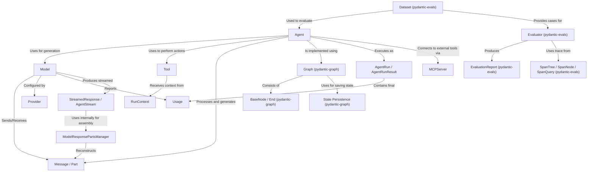

# Tutorial: pydantic-ai

`pydantic-ai` is a library designed to simplify interactions with **Large Language Models (LLMs)** like GPT-4o or Claude.
It allows you to define *structured inputs* and *outputs* using Pydantic models, making it easier to get predictable results from AI.
The core component is the **Agent**, which acts as a coordinator. It takes your request, communicates with an **LLM** (represented by a **Model** abstraction), and can use **Tools** (external functions like web search) to gather information.
Communication happens via structured **Messages** containing different **Parts** (text, images, tool calls).
The library also includes features for *evaluation* (`pydantic-evals`) using **Datasets** and **Evaluators** to test agent performance, and relies on an underlying **Graph** system (`pydantic-graph`) to manage execution flow and state.

**Source Repository:** [https://github.com/pydantic/pydantic-ai](https://github.com/pydantic/pydantic-ai)

## Chapters

1. [Agent](01_agent.md)
2. [Message / Part](02_message___part.md)
3. [Model](03_model.md)
4. [Provider](04_provider.md)
5. [Tool](05_tool.md)
6. [RunContext](06_runcontext.md)
7. [AgentRun / AgentRunResult](07_agentrun___agentrunresult.md)
8. [Usage](08_usage.md)
9. [StreamedResponse / AgentStream](09_streamedresponse___agentstream.md)
10. [ModelResponsePartsManager](10_modelresponsepartsmanager.md)
11. [MCPServer](11_mcpserver.md)
12. [Graph (pydantic-graph)](12_graph__pydantic_graph_.md)
13. [BaseNode / End (pydantic-graph)](13_basenode___end__pydantic_graph_.md)
14. [State Persistence (pydantic-graph)](14_state_persistence__pydantic_graph_.md)
15. [Dataset (pydantic-evals)](15_dataset__pydantic_evals_.md)
16. [Evaluator (pydantic-evals)](16_evaluator__pydantic_evals_.md)
17. [EvaluationReport (pydantic-evals)](17_evaluationreport__pydantic_evals_.md)
18. [SpanTree / SpanNode / SpanQuery (pydantic-evals)](18_spantree___spannode___spanquery__pydantic_evals_.md)

---

Generated by [AI Codebase Knowledge Builder](https://github.com/The-Pocket/Tutorial-Codebase-Knowledge)