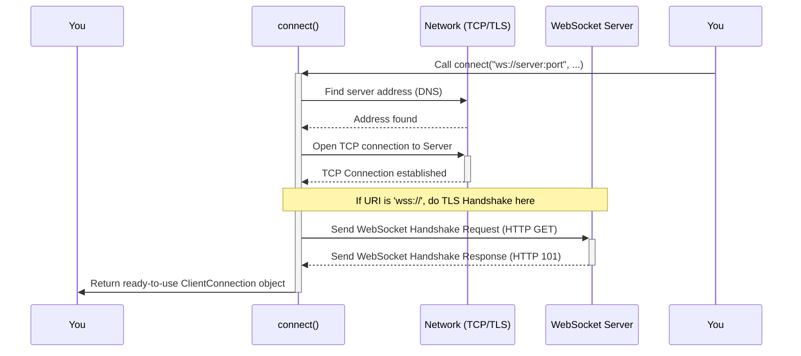

# Chapter 1: Starting the Conversation - The `connect` Factory

Welcome to the world of WebSockets with the `websockets` library! This is the very first step in your journey.

Imagine you want to call a friend. Before you can talk, you need to pick up your phone, dial their number, and wait for them to pick up. Only then can the conversation begin.

In the world of WebSockets, when your program (the "client") wants to talk to a server program, it needs to do something similar. It needs to "dial" the server's address and establish a connection. This is exactly what the `connect` function helps you do!

## What Problem Does `connect` Solve?

Starting a WebSocket connection isn't just a single step. It involves several technical tasks happening behind the scenes:

1.  Finding the server on the network (like looking up a phone number).
2.  Making a basic network connection (like the phone line connecting). This is usually a TCP connection.
3.  If it's a secure connection (like a private, encrypted phone line using `wss://`), setting up encryption (TLS/SSL).
4.  Performing a special "WebSocket handshake" – a specific back-and-forth negotiation to switch from a standard web request (HTTP) to a WebSocket conversation.

Doing all this manually would be complicated and repetitive. The `connect` function acts as a helpful "factory" or assistant that handles all these steps for you. You just tell it *where* to connect, and it gives you back a ready-to-use connection object.

## How to Use `connect` - Making the Call

Let's see how simple it is to use `connect`. We'll use Python's `asyncio` library first, which is great for handling network conversations efficiently.

**Example: Connecting with `asyncio`**

Imagine a server is waiting for you at the address `ws://localhost:8765`. Here's how you connect and say hello:

```python
# example/asyncio/client.py (Simplified)
import asyncio
# Import the connect function for asyncio
from websockets.asyncio.client import connect

async def say_hello():
    # The 'async with' makes sure the connection is closed properly later
    async with connect("ws://localhost:8765") as websocket:
        print("Connected to the server!")
        # Now we can use 'websocket' to send/receive messages
        # (We'll learn more about this in the next chapter)
        await websocket.send("Hello server!")
        response = await websocket.recv()
        print(f"Server replied: {response}")

# Run our asynchronous function
asyncio.run(say_hello())
```

**Explanation:**

1.  `from websockets.asyncio.client import connect`: We import the specific `connect` function designed to work with `asyncio`.
2.  `async with connect("ws://localhost:8765") as websocket:`: This is the core line!
    *   We call `connect()` and give it the server's address (`uri`). The `ws://` part means it's a regular WebSocket connection (not encrypted). `localhost:8765` means it's running on our own computer (`localhost`) on port `8765`.
    *   `connect` does all the background work (TCP, handshake).
    *   If successful, it returns a connection object, which we name `websocket`.
    *   The `async with` statement ensures that when we're done (or if an error occurs), the connection is automatically and cleanly closed.
3.  Inside the `with` block, `websocket` is ready to use! We can now send (`websocket.send`) and receive (`websocket.recv`) messages. We'll dive into this in [Chapter 2: Talking Back and Forth - ClientConnection (Asyncio / Sync)](02_clientconnection__asyncio___sync_.md).

**What if you prefer not to use `asyncio`?**

The `websockets` library also offers a version that uses standard Python threads (often called the "sync" version). It looks very similar:

```python
# example/sync/client.py (Simplified)
# Import the connect function for the sync/threading API
from websockets.sync.client import connect

def say_hello_sync():
    # The 'with' statement works similarly for sync connections
    with connect("ws://localhost:8765") as websocket:
        print("Connected to the server!")
        # Sending and receiving look the same
        websocket.send("Hello server!")
        response = websocket.recv()
        print(f"Server replied: {response}")

# Run our synchronous function
say_hello_sync()
```

The main differences are the `import` statement (`websockets.sync.client`) and the absence of `async`/`await` keywords. The core idea remains the same: `connect` establishes the connection.

## Under the Hood: What `connect` Does

Think of `connect` as a highly efficient coordinator. When you call it, here's a simplified sequence of what happens:



**Step-by-step:**

1.  **You Call `connect`:** You provide the server's address (`uri`) and maybe some options (like timeouts or special headers).
2.  **Address Lookup:** `connect` figures out the server's numerical IP address from the hostname.
3.  **TCP Connection:** It asks the operating system's network layer to open a basic TCP connection to the server's IP address and port.
4.  **TLS Handshake (if `wss://`):** If you used a secure address (`wss://`), `connect` negotiates an encrypted channel (TLS/SSL) over the TCP connection. This keeps your data private.
5.  **WebSocket Handshake:** `connect` sends a special HTTP request to the server asking to "upgrade" the connection to WebSocket. The server replies, and if it agrees, the connection is now a WebSocket! This handshake is managed internally by the [Chapter 7: ClientProtocol / ServerProtocol](07_clientprotocol___serverprotocol.md).
6.  **Return Connection Object:** `connect` bundles everything up into a convenient [Chapter 2: Talking Back and Forth - ClientConnection (Asyncio / Sync)](02_clientconnection__asyncio___sync_.md) object and gives it back to your program.

Let's peek at a *conceptual* snippet showing some internal parts (simplified from `src/websockets/asyncio/client.py`):

```python
# Simplified internal logic of asyncio connect

async def connect(uri_string, **options):
    # 1. Understand the address
    ws_uri = parse_uri(uri_string) # Like reading the phone number

    # 2. Prepare to create the network connection
    # (Handles TCP, TLS/SSL setup based on ws_uri and options)
    transport, protocol_connection = await loop.create_connection(
        lambda: create_the_websocket_protocol(ws_uri, options),
        host=ws_uri.host,
        port=ws_uri.port,
        ssl=ws_uri.secure, # Add TLS if it's wss://
        # ... other network options ...
    )

    # 3. Perform the WebSocket handshake
    # The 'protocol_connection' object handles this part
    await protocol_connection.handshake(
        additional_headers=options.get('additional_headers')
    )

    # 4. Return the ready-to-use connection
    return protocol_connection
```

This shows `connect` orchestrating the lower-level steps: parsing the URI, creating the network transport (potentially with SSL), and triggering the handshake defined within the protocol logic.

## Key Options for `connect`

While just the `uri` is often enough, `connect` accepts many optional arguments to customize the connection:

*   `uri` (string): **Required.** The address of the server (e.g., `"ws://echo.websocket.org"` or `"wss://mysecure.server.com"`).
*   `ssl` (SSLContext or `True`/`False`): Used for `wss://`. You can provide fine-grained TLS settings or just let `websockets` handle defaults.
*   `additional_headers` (dict or Headers object): Send extra information during the initial handshake (like authentication tokens). See [Chapter 9: Headers](09_headers.md).
*   `subprotocols` (list of strings): Request a specific "dialect" or version of communication if the server supports multiple.
*   `open_timeout` (float): How many seconds to wait for the entire connection process to complete before giving up.
*   `ping_interval` (float): How often (in seconds) to send a "ping" to keep the connection alive.
*   `ping_timeout` (float): How long to wait for a "pong" reply after sending a ping.

Don't worry about memorizing all these now! You'll encounter them as you build more complex applications. The most important one is always the `uri`.

## Conclusion

You've learned about `connect`, the essential first step for any WebSocket client using the `websockets` library. It's like dialing a phone number – it handles all the complex setup (TCP, TLS, the WebSocket handshake) and gives you back a simple object to start your conversation. You saw how to use it in both `asyncio` and synchronous (`sync`) code.

Now that you know how to *initiate* the connection, the next step is to learn how to actually *use* that connection to send and receive messages.

Let's move on to [Chapter 2: Talking Back and Forth - ClientConnection (Asyncio / Sync)](02_clientconnection__asyncio___sync_.md)!

---

Generated by [AI Codebase Knowledge Builder](https://github.com/The-Pocket/Tutorial-Codebase-Knowledge)