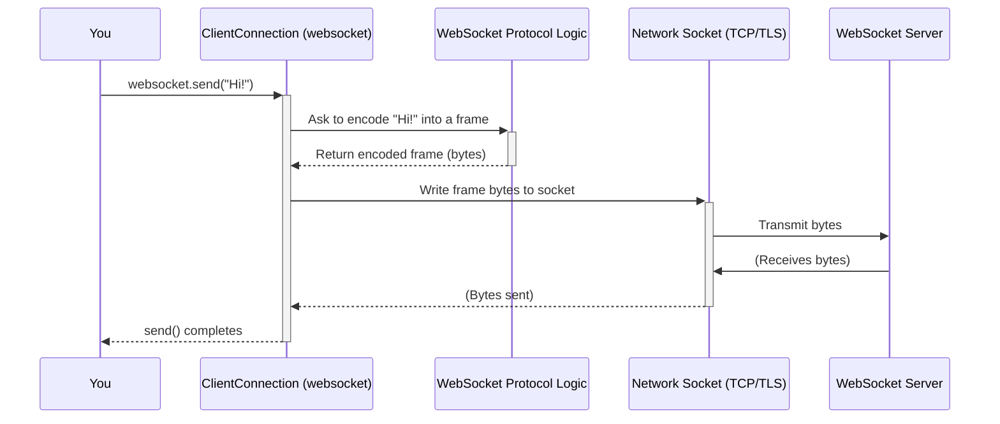
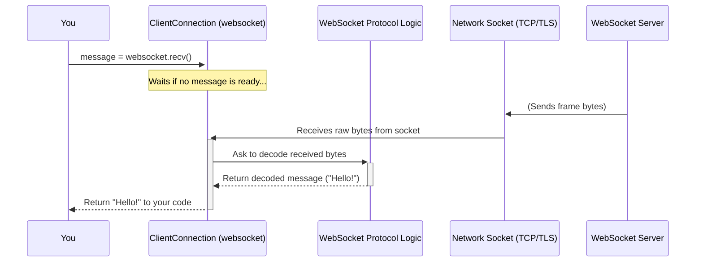

# Chapter 2: Talking Back and Forth - ClientConnection (Asyncio / Sync)

In [Chapter 1: Starting the Conversation - The `connect` Factory](01_connect__factory_.md), we learned how to use the `connect` function to establish a WebSocket connection, like dialing a phone number. We saw that `connect` handles all the complicated setup and gives us back a special object when the connection is ready.

So, the call is connected... now what? How do you actually talk? That's where the `ClientConnection` object comes in!

## What Problem Does `ClientConnection` Solve?

Once `connect` successfully establishes the connection, you need an object that represents *that specific, active connection*. Think of it like the actual phone handset you're holding after your friend picks up. You use *this handset* to speak into (send messages) and listen from (receive messages).

The `ClientConnection` object is exactly that "handset" for your WebSocket conversation. It's the primary thing you'll interact with to communicate with the server.

**Key Ideas:**

*   It represents one *active* WebSocket connection from your program (the client) to a server.
*   You get this object from the `connect` function.
*   You use its methods, like `send()` and `recv()`, to exchange messages.
*   It also holds useful information about the connection, like who you're connected to.

## How to Use `ClientConnection` - Having the Conversation

Let's revisit the example from Chapter 1, but this time, focus on the `websocket` object *after* the connection is made.

**Example: Sending and Receiving with `asyncio`**

```python
# example/asyncio/client.py (Focus on interaction)
import asyncio
from websockets.asyncio.client import connect

async def chat_with_server():
    uri = "ws://localhost:8765"
    async with connect(uri) as websocket:  # connect gives us the 'websocket' object
        # 'websocket' IS our ClientConnection!
        print(f"Connected to {uri}! I can now talk.")

        # 1. Send a message TO the server
        message_to_send = "Hello from the client!"
        await websocket.send(message_to_send)
        print(f"> Sent: {message_to_send}")

        # 2. Wait for and receive a message FROM the server
        response = await websocket.recv()
        print(f"< Received: {response}")

        # The 'async with' block automatically closes the connection when done.

asyncio.run(chat_with_server())
```

**Explanation:**

1.  `async with connect(uri) as websocket:`: As we learned, `connect` establishes the connection. When successful, it returns a `ClientConnection` object, which we've named `websocket`.
2.  `await websocket.send(message_to_send)`: This is how you talk *to* the server. You call the `send()` method on your `ClientConnection` object, passing the message (usually a string or bytes).
3.  `response = await websocket.recv()`: This is how you listen *for* messages *from* the server. You call the `recv()` method. Your program will pause (`await`) here until the server sends a complete message, which is then returned.
4.  The `async with` statement is crucial. When the code inside this block finishes (or if an error occurs), it automatically tells the `ClientConnection` to perform the WebSocket closing handshake and clean up the network connection.

**What about the `sync` version?**

It works almost identically, just without the `async` and `await` keywords:

```python
# example/sync/client.py (Focus on interaction)
from websockets.sync.client import connect

def chat_with_server_sync():
    uri = "ws://localhost:8765"
    with connect(uri) as websocket:  # connect gives us the 'websocket' object
        # 'websocket' IS our ClientConnection!
        print(f"Connected to {uri}! I can now talk.")

        # 1. Send a message TO the server
        message_to_send = "Hello from the sync client!"
        websocket.send(message_to_send) # No 'await' needed
        print(f"> Sent: {message_to_send}")

        # 2. Wait for and receive a message FROM the server
        response = websocket.recv() # No 'await' needed
        print(f"< Received: {response}")

        # The 'with' block automatically closes the connection when done.

chat_with_server_sync()
```

The core methods (`send`, `recv`) are the same, making it easy to switch between `asyncio` and `sync` styles if needed.

**Receiving Multiple Messages**

Often, you'll want to continuously receive messages. `ClientConnection` objects support iteration, which is very convenient:

**Asyncio:**

```python
# example/asyncio/client_listen.py (Simplified)
import asyncio
from websockets.asyncio.client import connect
from websockets.exceptions import ConnectionClosedOK

async def listen_to_server():
    uri = "ws://localhost:8765"
    async with connect(uri) as websocket:
        print(f"Connected to {uri}! Listening for messages...")
        try:
            # Loop forever, receiving messages
            async for message in websocket:
                print(f"< Received: {message}")
                # You could add logic here to send replies, etc.
        except ConnectionClosedOK:
            print("Server closed the connection normally.")
        # Connection automatically closed by 'async with'

asyncio.run(listen_to_server())
```

**Sync:**

```python
# example/sync/client_listen.py (Simplified)
from websockets.sync.client import connect
from websockets.exceptions import ConnectionClosedOK

def listen_to_server_sync():
    uri = "ws://localhost:8765"
    with connect(uri) as websocket:
        print(f"Connected to {uri}! Listening for messages...")
        try:
            # Loop forever, receiving messages
            for message in websocket: # No 'async' needed
                print(f"< Received: {message}")
        except ConnectionClosedOK:
            print("Server closed the connection normally.")
        # Connection automatically closed by 'with'

listen_to_server_sync()
```

The `for message in websocket:` loop (or `async for` in asyncio) will automatically call `recv()` repeatedly and yield each message until the connection closes normally. If the connection closes with an error, it will raise a different exception like `ConnectionClosedError`.

## Under the Hood: What `ClientConnection` Does

The `ClientConnection` acts as a manager for the specific conversation. It takes the raw network connection (like the phone line) and the rules of WebSocket communication ([Chapter 10: Protocol (Core)](10_protocol__core_.md)) and puts them together in a user-friendly way.

Here's a simplified view of sending and receiving:

**Sending a Message:**



1.  You call `websocket.send()`.
2.  `ClientConnection` asks the internal [Chapter 10: Protocol (Core)](10_protocol__core_.md) logic to package your message into the correct WebSocket frame format (adding headers, maybe masking it).
3.  The Protocol logic gives the raw bytes of the frame back to `ClientConnection`.
4.  `ClientConnection` tells the operating system's network layer to send those bytes over the TCP/TLS connection.

**Receiving a Message:**



1.  You call `websocket.recv()`. If a message isn't already waiting, your code pauses.
2.  Meanwhile, the `ClientConnection` (often in a background task/thread) listens to the network socket.
3.  When bytes arrive, it passes them to the [Chapter 10: Protocol (Core)](10_protocol__core_.md).
4.  The Protocol logic decodes the incoming WebSocket frames, potentially reassembling fragmented messages.
5.  Once a complete message is ready, the Protocol logic gives it to the `ClientConnection`.
6.  `ClientConnection` wakes up your paused `recv()` call and returns the message.

**Code Glimpse:**

Let's look at a *highly simplified* conceptual structure based on `src/websockets/asyncio/connection.py` and `src/websockets/sync/connection.py`.

```python
# Conceptual structure of Connection (base for ClientConnection)

class Connection: # Simplified!
    def __init__(self, protocol, transport_or_socket, ...):
        self.protocol = protocol  # The WebSocket rules engine
        self.transport = transport_or_socket # The network pipe
        self.recv_messages = MessageQueue() # Internal buffer for received messages
        # ... other things like keepalive timers, state ...

    async def send(self, message): # Asyncio example
        # 1. Check if connection is open, handle fragmentation, etc.
        # ... (error checking) ...

        # 2. Ask protocol to prepare the data
        bytes_to_send = self.protocol.encode_message(message)

        # 3. Write the bytes to the network
        await self.transport.write(bytes_to_send)
        # ... (flow control, like waiting if buffer is full) ...

    async def recv(self): # Asyncio example
        # 1. Wait for a message to appear in our internal queue
        message = await self.recv_messages.get()

        # 2. Check if the connection closed while waiting
        if message is CONNECTION_CLOSED_SENTINEL:
            raise self.protocol.close_exc # Raise the appropriate closing exception

        # 3. Return the message
        return message

    # --- Background task/thread (simplified concept) ---
    def _background_reader(self):
        while connection_is_open:
            # Read raw bytes from network
            raw_data = self.transport.read_some_bytes()
            # Feed to protocol for processing
            self.protocol.receive_data(raw_data)
            # Get any completed messages/events from protocol
            for event in self.protocol.events_received():
                if isinstance(event, Message):
                     self.recv_messages.put(event.data) # Put in queue for recv()
                elif isinstance(event, CloseFrame):
                     self.recv_messages.put(CONNECTION_CLOSED_SENTINEL)
                # ... handle pings/pongs etc. ...
```

This illustrates how the `ClientConnection` uses the `protocol` object to handle the WebSocket specifics and the `transport` (or `socket`) to handle the raw network communication. It also manages an internal queue (`recv_messages`) so that the background reading process doesn't interfere directly with your calls to `recv()`.

It also inherits details from the base [Chapter 6: Connection (Asyncio / Sync)](06_connection__asyncio___sync_.md) and the [Chapter 7: ClientProtocol / ServerProtocol](07_clientprotocol___serverprotocol.md).

## Key Methods and Attributes

Besides `send()` and `recv()`, here are a few other useful parts of `ClientConnection`:

*   `close(code, reason)`: Starts the closing handshake. Usually handled automatically by `with` / `async with`.
*   `ping(data)`: Sends a ping frame to the server, often used for keepalive or checking responsiveness. Returns an object you can wait on for the pong reply.
*   `pong(data)`: Sends an unsolicited pong frame.
*   `remote_address`: A tuple (like `('127.0.0.1', 8765)`) identifying the server you're connected to.
*   `subprotocol`: The subprotocol string that was agreed upon during the handshake, or `None` if none was negotiated.

Don't worry about memorizing these now; you'll encounter them as needed. `send()` and `recv()` are the most important.

## Conclusion

You've now met the `ClientConnection` object – your main tool for interacting with a WebSocket server once connected. You learned:

*   It's returned by the `connect` function.
*   You use its `send()` method to send messages (strings or bytes).
*   You use its `recv()` method or iterate over it (`for message in websocket:`) to receive messages.
*   It manages the underlying network connection and WebSocket protocol details for you.
*   The `with` (sync) or `async with` (asyncio) statement is the best way to ensure the connection is properly closed.

So far, we've focused entirely on the *client* side – your program connecting *to* a server. But what if you want to *be* the server?

Let's switch gears and learn how to build a WebSocket server in [Chapter 3: Answering the Call - The `serve` Factory](03_serve__factory_.md)!

---

Generated by [AI Codebase Knowledge Builder](https://github.com/The-Pocket/Tutorial-Codebase-Knowledge)