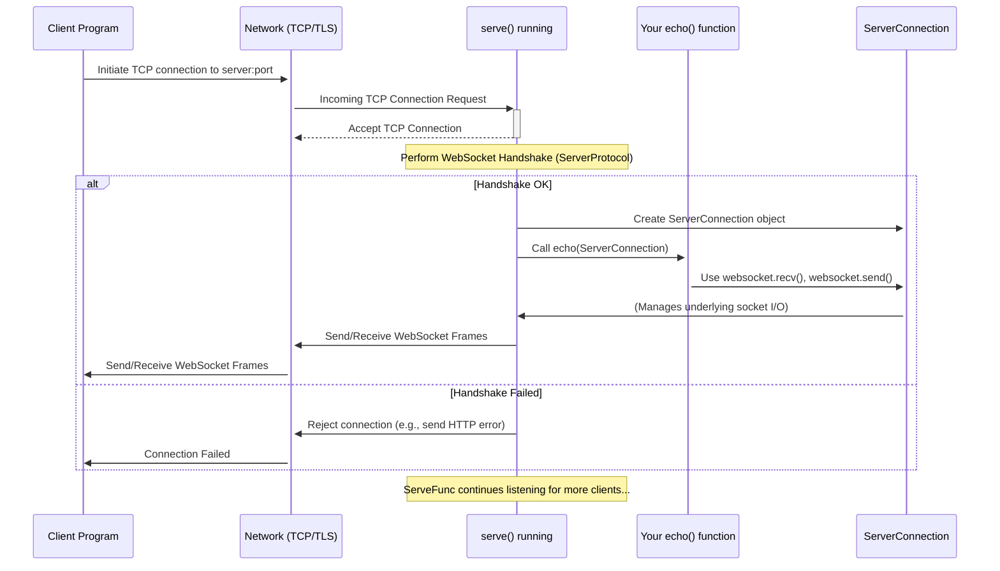

# Chapter 3: Answering the Call - The `serve` Factory

In the first two chapters, we explored how to be a WebSocket *client*. We learned how to use [Chapter 1: Starting the Conversation - The `connect` Factory](01_connect__factory_.md) to initiate a connection to a server, and how to use the [Chapter 2: Talking Back and Forth - ClientConnection (Asyncio / Sync)](02_clientconnection__asyncio___sync_.md) object to send and receive messages.

Now, let's switch hats! What if *you* want to be the one *receiving* connections? What if you want to build a WebSocket *server* that many clients can connect to?

Imagine you're setting up a customer support hotline. You need:
1.  A phone number (like a network address and port) that customers can call.
2.  An operator (or a system) ready to pick up the phone when it rings.
3.  A way to handle multiple calls simultaneously.

This is exactly what the `serve` function helps you do in the world of WebSockets!

## What Problem Does `serve` Solve?

Creating a server involves several steps:
1.  **Listening:** Telling your computer to listen for incoming connection requests on a specific network address (like `localhost`) and port number (like `8765`). This involves creating a special "server socket".
2.  **Accepting Connections:** When a client tries to connect, the server needs to accept the incoming network (TCP) connection.
3.  **WebSocket Handshake:** For each new connection, the server must perform the WebSocket opening handshake – that special negotiation to upgrade from HTTP to WebSocket. This uses the [Chapter 7: ClientProtocol / ServerProtocol](07_clientprotocol___serverprotocol.md).
4.  **Handling the Client:** Once the handshake is successful, the server needs to start interacting with *that specific client*. It needs an object representing this connection.
5.  **Concurrency:** A server usually needs to handle many clients at the same time without getting blocked.

Doing all this manually is complex. The `serve` function acts as a "factory" or manager for your WebSocket server. You tell it *where* to listen and *what function to call* when a client connects successfully, and `serve` handles all the underlying network and protocol details.

## How to Use `serve` - Setting Up Your Hotline

Let's build a very simple "echo" server. This server will accept connections, listen for any message a client sends, and immediately send that same message back to the client.

**Key Ingredients:**

1.  **The `handler` function:** This is the function *you* write. It will be called automatically by `serve` every time a new client successfully connects. This function receives one argument: a `ServerConnection` object representing that specific client's connection. We'll learn more about this object in [Chapter 4: Handling Each Caller - ServerConnection (Asyncio / Sync)](04_serverconnection__asyncio___sync_.md).
2.  **`host`:** The network address to listen on (e.g., `"localhost"` means only accept connections from your own computer).
3.  **`port`:** The specific port number to listen on (e.g., `8765`).

**Example: An `asyncio` Echo Server**

```python
# example/asyncio/echo.py
import asyncio
# Import the serve function for asyncio
from websockets.asyncio.server import serve

# 1. Define the handler function
async def echo(websocket):
    # 'websocket' is the ServerConnection for this specific client
    print(f"A client just connected!")
    try:
        # Loop forever, waiting for messages from this client
        async for message in websocket:
            print(f"Received message: {message}")
            # Send the same message back
            await websocket.send(message)
            print(f"Sent message back: {message}")
    except Exception as e:
        print(f"Client connection closed: {e}")
    finally:
        print(f"Client disconnected.")

# 2. Define the main function to start the server
async def main():
    # Start the server, telling it to call our 'echo' handler
    # for each new connection on localhost port 8765
    async with serve(echo, "localhost", 8765) as server:
        print("Server started on ws://localhost:8765")
        # Keep the server running indefinitely
        await server.serve_forever()

# 3. Run the main function
if __name__ == "__main__":
    asyncio.run(main())
```

**Explanation:**

1.  `from websockets.asyncio.server import serve`: We import the `serve` function designed for `asyncio`.
2.  `async def echo(websocket):`: This is our handler. `serve` will call this function whenever a client connects. The `websocket` argument it receives is a [Chapter 4: Handling Each Caller - ServerConnection (Asyncio / Sync)](04_serverconnection__asyncio___sync_.md) object. Inside this function, we use `async for message in websocket:` to receive messages and `await websocket.send(message)` to send them back.
3.  `async with serve(echo, "localhost", 8765) as server:`: This is the core line!
    *   We call `serve()`, passing our `echo` handler function, the host `"localhost"`, and the port `8765`.
    *   `serve` sets up the listening socket and starts waiting for connections in the background.
    *   It returns a `Server` object (which manages the overall server process).
    *   The `async with` statement ensures the server is properly shut down when we're done.
4.  `await server.serve_forever()`: This line tells the server to keep running and accepting connections until the program is stopped (e.g., by pressing Ctrl+C).

If you run this code, it will sit and wait. You can then run the client example from Chapter 1 or 2, connect to `ws://localhost:8765`, send messages, and you'll see them echoed back!

**What about the `sync` (threading) version?**

It's very similar, using standard functions and threads instead of `async`/`await`.

```python
# example/sync/echo.py
# Import the serve function for the sync/threading API
from websockets.sync.server import serve

# 1. Define the handler function (no async/await)
def echo_sync(websocket):
    # 'websocket' is the ServerConnection for this specific client
    print(f"A client just connected!")
    try:
        # Loop forever, waiting for messages from this client
        for message in websocket: # No 'async' here
            print(f"Received message: {message}")
            # Send the same message back
            websocket.send(message) # No 'await' here
            print(f"Sent message back: {message}")
    except Exception as e:
        print(f"Client connection closed: {e}")
    finally:
        print(f"Client disconnected.")

# 2. Define the main function to start the server
def main():
    # Start the server using 'with' instead of 'async with'
    with serve(echo_sync, "localhost", 8765) as server:
        print("Server started on ws://localhost:8765")
        # Keep the server running indefinitely
        server.serve_forever() # No 'await' here

# 3. Run the main function
if __name__ == "__main__":
    main()
```

The main differences are the `import` (`websockets.sync.server`), the lack of `async`/`await`, and using `with` instead of `async with`. The core concept is identical: `serve` starts the server and calls your handler (`echo_sync`) for each client.

## Under the Hood: The Telephone Exchange Operator

Think of `serve` as setting up and running a telephone exchange.



**Step-by-step:**

1.  **You Call `serve`:** You provide your handler function, host, and port. `serve` starts listening on that host/port in the background.
2.  **Client Connects:** A client program initiates a standard network (TCP) connection to your server's host and port.
3.  **`serve` Accepts:** The running `serve` logic accepts the TCP connection.
4.  **WebSocket Handshake:** `serve` performs the server-side WebSocket handshake. It reads the client's upgrade request and sends the appropriate response. This involves the logic from [Chapter 7: ClientProtocol / ServerProtocol](07_clientprotocol___serverprotocol.md).
5.  **Handshake Success?**
    *   **If Yes:** `serve` creates a [Chapter 4: Handling Each Caller - ServerConnection (Asyncio / Sync)](04_serverconnection__asyncio___sync_.md) object to represent this specific client connection. It then calls *your* handler function (e.g., `echo()`) and passes this `ServerConnection` object to it. From this point, your handler function is responsible for communicating with that client using the provided object. `serve` continues listening for other new clients in the background.
    *   **If No:** `serve` rejects the connection (often by sending an HTTP error code back) and closes the TCP connection. Your handler function is *not* called.
6.  **Handler Runs:** Your handler function executes, using the `ServerConnection` object's methods like `recv()` and `send()`.

Let's look at a *highly simplified* conceptual piece from `src/websockets/asyncio/server.py`:

```python
# Simplified conceptual logic of asyncio serve

async def serve(handler, host, port, **options):
    # Create a Server object that knows your handler
    server_manager = Server(handler, **server_options)

    # Define a factory function that asyncio will call for each new TCP connection
    def connection_factory():
        # Create the low-level WebSocket protocol instance
        protocol = ServerProtocol(**protocol_options)
        # Create the high-level connection object (ServerConnection)
        # This links the protocol logic to the server manager
        connection = ServerConnection(protocol, server_manager, **connection_options)
        return connection # asyncio uses this object to handle the connection

    # Ask asyncio to start listening and use our factory
    # This returns an asyncio.Server object
    asyncio_server = await asyncio.get_running_loop().create_server(
        connection_factory, host, port, **network_options
    )

    # Link the asyncio Server object to our Server manager
    server_manager.wrap(asyncio_server)

    # Return our Server manager object (which you use with 'async with')
    return server_manager

# --- Inside ServerConnection (when created by the factory) ---
# Simplified connection_made logic
def connection_made(self, transport):
    super().connection_made(transport)
    # Tell the server manager to start the handler task for this connection
    self.server.start_connection_handler(self) # Calls your echo() eventually

# --- Inside Server (start_connection_handler) ---
# Simplified handler start logic
def start_connection_handler(self, connection):
    # Schedule the actual handling (handshake + calling your 'echo' function)
    # to run concurrently
    self.handlers[connection] = self.loop.create_task(
        self.conn_handler(connection) # conn_handler performs handshake & calls self.handler(connection)
    )
```

This shows `serve` setting up the pieces:
*   It defines how to create a `ServerConnection` (`connection_factory`) for each incoming TCP connection.
*   It tells the underlying `asyncio` system (`create_server`) to start listening and use this factory.
*   When a connection is made, the `ServerConnection` notifies the main `Server` object.
*   The `Server` object then schedules your actual handler function (`echo` in our example) to run for that specific connection, after completing the handshake.

The synchronous version (`websockets.sync.server`) uses `socket.create_server` and `threading.Thread` instead of `asyncio.create_server` and `asyncio.create_task`, but the overall principle of setting up listeners and launching handlers per connection is the same.

## Key Options for `serve`

Besides the essential `handler`, `host`, and `port`, `serve` accepts many options to customize server behavior:

*   `origins` (list of strings/patterns): A security feature. Specifies which web pages (origins) are allowed to connect. If a connection comes from an untrusted origin, `serve` will reject it before calling your handler. Example: `origins=["http://localhost:8000", None]` (allow connections from your local web server and non-browser clients).
*   `subprotocols` (list of strings): A list of application-specific protocols your server supports, in order of preference. See [Chapter 7: ClientProtocol / ServerProtocol](07_clientprotocol___serverprotocol.md).
*   `ssl` (SSLContext object): Provide SSL/TLS settings to create a secure `wss://` server instead of an insecure `ws://` server.
*   `ping_interval` / `ping_timeout` (float): Configure automatic "ping" messages to check if clients are still alive and responsive.
*   `max_size` (int): Maximum allowed size for incoming messages in bytes. Prevents clients from sending huge messages that could crash your server.
*   `process_request` / `process_response` (callables): Advanced hooks to inspect or modify the HTTP handshake before the WebSocket connection is fully established. Useful for custom authentication or routing.

You don't need these for simple servers, but they become important for real-world applications.

## Conclusion

You've now learned about `serve`, the essential tool for building WebSocket servers with the `websockets` library.

*   It acts like a telephone exchange, listening for incoming connections on a specific host and port.
*   It handles the low-level networking (TCP) and the WebSocket handshake automatically.
*   For each successful connection, it creates a `ServerConnection` object and calls the `handler` function *you* provide, passing that object.
*   It allows your server to handle multiple clients concurrently (using `asyncio` tasks or threads).
*   You saw how to create a basic echo server using both `asyncio` and `sync` versions.

We've seen how `serve` gets the connection *established* and calls your handler. The next crucial piece is understanding the object that `serve` gives to your handler – the `ServerConnection`. How do you use *that* object to actually talk to the specific client who just connected?

Let's dive into that in [Chapter 4: Handling Each Caller - ServerConnection (Asyncio / Sync)](04_serverconnection__asyncio___sync_.md)!

---

Generated by [AI Codebase Knowledge Builder](https://github.com/The-Pocket/Tutorial-Codebase-Knowledge)