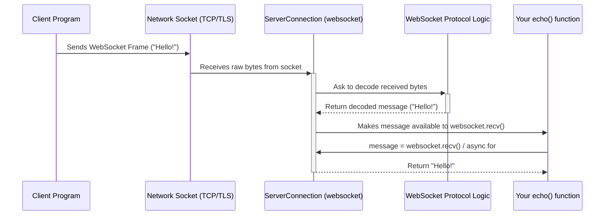
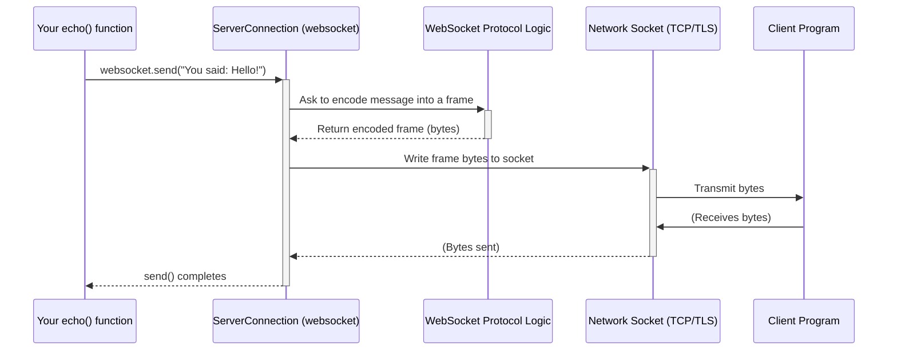

# Chapter 4: Handling Each Caller - ServerConnection (Asyncio / Sync)

In [Chapter 3: Answering the Call - The `serve` Factory](03_serve__factory_.md), we learned how to set up a WebSocket server using the `serve` function. We saw that `serve` acts like a telephone exchange, listening for incoming calls (connections). We also learned that we need to provide a `handler` function to `serve`, which gets called every time a new client successfully connects.

So, the server picked up the call... but how does your handler function actually talk to *that specific* caller? Imagine the operator at the exchange needs a dedicated console or headset for each person they're talking to. That's what the `ServerConnection` object provides!

## What Problem Does `ServerConnection` Solve?

When your `serve` function accepts a new client connection and the initial WebSocket handshake succeeds, it needs to give your code a way to interact *only* with that client. You wouldn't want messages intended for Client A accidentally going to Client B!

The `ServerConnection` object represents *one single, active connection* from a client *to your server*. It's the specific "console" your server's handler function uses to:

*   Receive messages *from* that particular client (`recv()`).
*   Send messages *back to* that particular client (`send()`).
*   Manage the lifecycle of that specific connection (like closing it).

Think of it like this:
*   `serve` is the main switchboard operator.
*   When a call comes in and connects, `serve` plugs it into a specific line.
*   `serve` then tells your handler function, "Hey, handle the call on line 7!"
*   The `ServerConnection` object *is* that "line 7" console – it lets your handler talk and listen *only* on that line.

**Key Ideas:**

*   It represents one active WebSocket connection *on the server side*.
*   It's created internally by the `serve` function for each new, successful client connection.
*   Your server's connection handler function (the one you pass to `serve`) receives this object as its main argument.
*   You use its methods, like `recv()` and `send()`, to communicate with that specific client.

## How to Use `ServerConnection` - Talking to the Caller

Let's look again at the simple "echo" server from Chapter 3. This time, pay close attention to the `websocket` argument inside the `echo` handler function.

**Example: The `asyncio` Echo Server Handler (Focus on `websocket`)**

```python
# example/asyncio/echo.py (Focus on the handler)
import asyncio
from websockets.asyncio.server import serve
from websockets.exceptions import ConnectionClosedOK

# This is our handler function. 'serve' calls this for each client.
async def echo(websocket):
    # <<< 'websocket' HERE IS THE ServerConnection OBJECT! >>>
    # It represents the connection TO the client that just connected.
    print(f"Client connected from {websocket.remote_address}")

    try:
        # Loop, receiving messages FROM this specific client
        async for message in websocket:
            print(f"Received from client: {message}")
            # Send the message back TO this specific client
            await websocket.send(f"You said: {message}")
            print(f"Sent back to client: {message}")

    except ConnectionClosedOK:
        print("Client disconnected normally.")
    except Exception as e:
        print(f"Client connection closed with error: {e}")
    finally:
        # When this function ends, 'serve' knows this client is done.
        print(f"Finished handling client {websocket.remote_address}")

# ... (rest of the server setup code from Chapter 3) ...
async def main():
    async with serve(echo, "localhost", 8765):
        print("Server started...")
        await asyncio.Future() # Run forever

if __name__ == "__main__":
    asyncio.run(main())
```

**Explanation:**

1.  `async def echo(websocket):`: When `serve` accepts a connection and the handshake is good, it calls this `echo` function. The `websocket` argument it passes **is the `ServerConnection` object** for that client.
2.  `websocket.remote_address`: This is an attribute of `ServerConnection` telling you where the client connected from (e.g., `('127.0.0.1', 54321)`).
3.  `async for message in websocket:`: This loop uses the `ServerConnection`'s `recv()` method internally. It waits for messages *only* from this specific client.
4.  `await websocket.send(f"You said: {message}")`: This uses the `ServerConnection`'s `send()` method. It sends the message *only* back to this specific client.

**What about the `sync` (threading) version?**

It's conceptually identical. The `websocket` object passed to the handler is still the `ServerConnection` for that client, and you use its `send` and `recv` methods (without `async`/`await`).

```python
# example/sync/echo.py (Focus on the handler)
from websockets.sync.server import serve
from websockets.exceptions import ConnectionClosedOK

# The sync handler function
def echo_sync(websocket):
    # <<< 'websocket' HERE IS THE ServerConnection OBJECT! >>>
    print(f"Client connected from {websocket.remote_address}")
    try:
        # Loop, receiving messages FROM this specific client
        for message in websocket: # No 'async' needed
            print(f"Received from client: {message}")
            # Send the message back TO this specific client
            websocket.send(f"You said: {message}") # No 'await' needed
            print(f"Sent back to client: {message}")
    except ConnectionClosedOK:
        print("Client disconnected normally.")
    except Exception as e:
        print(f"Client connection closed with error: {e}")
    finally:
        print(f"Finished handling client {websocket.remote_address}")

# ... (rest of the sync server setup code from Chapter 3) ...
def main():
    with serve(echo_sync, "localhost", 8765) as server:
        print("Server started...")
        server.serve_forever() # Blocks here

if __name__ == "__main__":
    main()
```

Whether using `asyncio` or `sync`, the `ServerConnection` object given to your handler is your dedicated line of communication with that one client.

## Under the Hood: The Dedicated Operator Console

The `ServerConnection` acts as the interface between your handler function and the underlying network connection and WebSocket protocol rules for a single client. It's similar to the [ClientConnection (Asyncio / Sync)](02_clientconnection__asyncio___sync_.md) but operates on the server side.

Here's a simplified view of what happens:

**Receiving a Message from a Client:**



1.  The client sends data over the network.
2.  The `ServerConnection` (listening in the background via `serve`) receives the raw bytes.
3.  It passes the bytes to its internal [Protocol (Core)](10_protocol__core_.md) logic.
4.  The protocol decodes the WebSocket frame(s) into a message.
5.  The `ServerConnection` makes the message available.
6.  Your handler calls `websocket.recv()` (or the `for` loop does) and gets the message.

**Sending a Message to a Client:**



1.  Your handler calls `websocket.send()` on the `ServerConnection` object.
2.  `ServerConnection` gives the message to its internal [Protocol (Core)](10_protocol__core_.md).
3.  The protocol encodes the message into WebSocket frame(s).
4.  `ServerConnection` sends the resulting bytes over the specific network socket for that client.

**Code Glimpse:**

The `ServerConnection` is built upon the fundamental [Connection (Asyncio / Sync)](06_connection__asyncio___sync_.md) class and uses the server-specific logic from [ClientProtocol / ServerProtocol](07_clientprotocol___serverprotocol.md). It's essentially a specialized `Connection` tailored for the server side.

Looking conceptually at `src/websockets/asyncio/server.py` (and its sync counterpart `src/websockets/sync/server.py`):

```python
# Conceptual structure based on src/websockets/asyncio/server.py

# ServerConnection inherits from the base Connection class
from .connection import Connection
# It also uses the ServerProtocol logic
from ..server import ServerProtocol

class ServerConnection(Connection):
    """
    Asyncio implementation of a WebSocket server connection.
    (Simplified explanation)
    """

    def __init__(
        self,
        protocol: ServerProtocol,  # Uses the Server's protocol rules
        server: Server,            # Knows which Server created it
        # ... other options like timeouts, queue size ...
    ) -> None:
        # Initialize the base Connection with the ServerProtocol
        super().__init__(
            protocol,
            # ... pass options like ping_interval, close_timeout ...
        )
        self.protocol: ServerProtocol  # Type hint for clarity
        self.server = server           # Reference to the main Server object
        self.request_rcvd = asyncio.Future() # Used internally for handshake timing

        # Attributes specific to server-side might be added here,
        # like 'username' if using basic_auth from the Server.
        # self.username: str

    # It inherits send(), recv(), close(), ping(), pong() etc.
    # from the base Connection class.

    # It adds server-specific methods like handshake() which is called
    # internally by the Server object when a connection starts.
    async def handshake(self, process_request=None, process_response=None, ...):
        # ... waits for the client's HTTP request ...
        # ... calls self.protocol.accept() or self.protocol.reject() ...
        # ... runs optional process_request/process_response hooks ...
        # ... calls self.protocol.send_response() to send the HTTP response ...
        pass # Simplified

    # It also overrides process_event to handle the initial HTTP request
    def process_event(self, event: Event) -> None:
        if self.request is None: # First event must be the HTTP request
            self.request = event
            self.request_rcvd.set_result(None) # Signal handshake can proceed
        else: # Subsequent events are WebSocket frames
            super().process_event(event) # Handle like base Connection

    # Overrides connection_made to tell the main Server to start the handler task
    def connection_made(self, transport: asyncio.BaseTransport) -> None:
        super().connection_made(transport)
        # Tell the Server object managing this connection to
        # start running the user's handler function (e.g., echo())
        # for this specific connection.
        self.server.start_connection_handler(self)
```

This shows that `ServerConnection` is largely a `Connection` but specifically configured with `ServerProtocol` logic and linked back to the main `Server` instance that created it. It handles the initial handshake steps before handing off control to your handler function via the inherited `recv` and `send` methods.

## Key Methods and Attributes

The most important methods you'll use on a `ServerConnection` object are the same ones inherited from the base [Connection (Asyncio / Sync)](06_connection__asyncio___sync_.md):

*   `recv()`: Receive the next message from this specific client.
*   `send()`: Send a message to this specific client.
*   `close(code, reason)`: Initiate the closing handshake with this client. (Often handled automatically when your handler function exits).
*   `ping(data)`: Send a Ping frame to this client.
*   `pong(data)`: Send an unsolicited Pong frame to this client.

It also has useful properties:

*   `remote_address`: The address (e.g., IP and port) of the connected client.
*   `subprotocol`: The subprotocol agreed upon during the handshake, if any.
*   `request`: The initial [Request](08_request___response__http_1_1_.md) object from the client's handshake.
*   `response`: The [Response](08_request___response__http_1_1_.md) object the server sent back during the handshake.

Again, focus on `recv()` and `send()` for basic communication.

## Conclusion

You've now learned about the `ServerConnection` object – the server's way of talking to one specific client.

*   It's created by the `serve` factory for each successful connection.
*   It's passed as the argument to your server's handler function.
*   You use its `recv()` method (or iterate over it) to get messages *from* that client.
*   You use its `send()` method to send messages *to* that client.
*   It manages the underlying details for that single connection, building upon the base [Connection (Asyncio / Sync)](06_connection__asyncio___sync_.md).

With `connect`, `ClientConnection`, `serve`, and `ServerConnection`, you now have the core tools to build both WebSocket clients and servers!

Of course, things don't always go perfectly. What happens when there's an error, like the network dropping or a client sending invalid data? Let's explore how the `websockets` library handles errors in [Chapter 5: When Things Go Wrong - WebSocketException](05_websocketexception.md).

---

Generated by [AI Codebase Knowledge Builder](https://github.com/The-Pocket/Tutorial-Codebase-Knowledge)