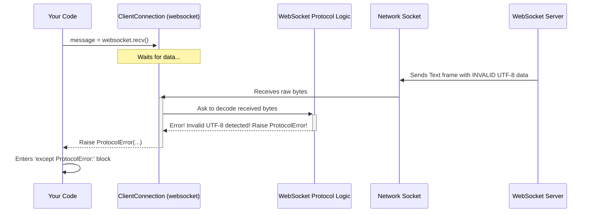

# Chapter 5: When Things Go Wrong - WebSocketException

In the previous chapters, we learned how to create WebSocket clients using [Chapter 1: Starting the Conversation - The `connect` Factory](01_connect__factory_.md) and servers using [Chapter 3: Answering the Call - The `serve` Factory](03_serve__factory_.md). We also saw how to use [Chapter 2: Talking Back and Forth - ClientConnection (Asyncio / Sync)](02_clientconnection__asyncio___sync_.md) and [Chapter 4: Handling Each Caller - ServerConnection (Asyncio / Sync)](04_serverconnection__asyncio___sync_.md) to send and receive messages when everything works perfectly.

But what happens when things *don't* go perfectly? Network connections can drop, servers can go offline, clients might send unexpected data, or maybe you just typed the server address incorrectly. How does the `websockets` library tell you about these problems?

## What Problem Does `WebSocketException` Solve?

Imagine you're having a phone call. Many things could interrupt it:
*   The other person hangs up politely. (`ConnectionClosedOK`)
*   The line suddenly goes dead (network error). (`ConnectionClosedError`)
*   You dialled a number that doesn't exist or is busy. (`InvalidURI`, `InvalidHandshake`)
*   The person starts speaking nonsense that you can't understand. (`ProtocolError`)

In Python, errors are usually signalled using **exceptions**. You could get a generic Python error like `ConnectionRefusedError` if the server isn't running, or a `TypeError` if you try to send the wrong kind of data.

However, the `websockets` library needs to tell you about problems *specific* to the WebSocket protocol itself. It needs a way to distinguish between "the server hung up properly" and "the server sent completely garbled data".

This is where `WebSocketException` comes in. It's the main **category** for all custom errors raised by the `websockets` library. Think of it as a specific "WebSocket Problems" label, making it easy to identify and handle issues related to your WebSocket communication, separate from other potential Python errors in your program.

## Meet the Error Family: `WebSocketException` and its Children

`WebSocketException` itself is usually too general. You typically want to know *more* about what went wrong. That's why `WebSocketException` has several "children" (subclasses) that provide more specific details:

*   **`ConnectionClosed`**: This is raised when you try to send or receive on a connection that is no longer active.
    *   **`ConnectionClosedOK`**: A friendly subclass of `ConnectionClosed`. It means the connection closed normally and cleanly (e.g., the other side initiated a proper closing handshake with code 1000 or 1001). This is often *not* an error you need to worry about; it just signals the end of the conversation. Iterating over messages (`async for message in websocket:`) often ends silently when this happens.
    *   **`ConnectionClosedError`**: Another subclass of `ConnectionClosed`. This means the connection closed unexpectedly or with an error code (e.g., network failure, server crash, protocol violation detected by the other side). This usually indicates a problem.

*   **`InvalidHandshake`**: Something went wrong during the initial "hello" phase (the WebSocket handshake). Maybe the server didn't understand your request, or you didn't like the server's response. Subclasses like `InvalidStatus` (wrong HTTP status code) or `InvalidHeader` (bad header value) give even more detail.

*   **`ProtocolError`**: The rules of WebSocket communication were broken *after* the connection was established. For example, receiving data that isn't valid UTF-8 in a text frame, or getting unexpected frame types.

*   **`InvalidURI`**: The address (URI) you provided to `connect` wasn't a valid WebSocket address (e.g., it didn't start with `ws://` or `wss://`, or had invalid characters).

Think of it like a doctor's diagnosis:
*   `WebSocketException`: "You have a problem related to WebSockets." (Too general)
*   `ConnectionClosed`: "The connection ended."
*   `ConnectionClosedOK`: "The connection ended normally." (Patient went home healthy)
*   `ConnectionClosedError`: "The connection ended because of an error." (Patient had a complication)
*   `InvalidHandshake`: "The initial setup failed."
*   `ProtocolError`: "Something went wrong mid-conversation."
*   `InvalidURI`: "The address you tried to connect to was wrong."

## How to Handle Errors - Using `try...except`

The standard way to handle potential errors (exceptions) in Python is using a `try...except` block. You put the code that *might* fail inside the `try` part, and the code to run *if* it fails inside the `except` part.

**Example: Catching Any WebSocket Error (Asyncio)**

Let's try connecting to a server and receiving a message, but be prepared for *any* WebSocket-specific problem.

```python
# example/asyncio/client_handle_errors.py (Simplified)
import asyncio
from websockets.asyncio.client import connect
# Import the base exception and a specific one
from websockets.exceptions import WebSocketException, ConnectionClosedOK

async def try_receive():
    uri = "ws://localhost:8765"  # Assume our echo server is running
    try:
        async with connect(uri) as websocket:
            print("Connected!")
            message = await websocket.recv()
            print(f"Received: {message}")
            # Maybe try sending something too
            await websocket.send("Thanks!")

    except WebSocketException as e:
        # Catch ANY error from the websockets library
        print(f"Something went wrong with WebSocket: {e}")
        # 'e' contains details, like the specific subclass and message
        # For ConnectionClosed, e.rcvd/e.sent have close details
        if isinstance(e, ConnectionClosed):
            print(f"  Close code received: {e.rcvd.code if e.rcvd else 'N/A'}")
            print(f"  Close reason received: {e.rcvd.reason if e.rcvd else 'N/A'}")

    except OSError as e:
        # Catch network errors (e.g., server not running)
        print(f"Could not connect: {e}")

    except Exception as e:
        # Catch any other unexpected Python errors
        print(f"An unexpected error occurred: {e}")

asyncio.run(try_receive())
```

**Explanation:**

1.  We wrap our connection and communication logic (`connect`, `recv`, `send`) inside a `try` block.
2.  `except WebSocketException as e:`: This catches *any* exception that is a `WebSocketException` or one of its children (like `ConnectionClosed`, `ProtocolError`, etc.). We print a general message and the details from the exception object `e`.
3.  `except OSError as e:`: We also catch `OSError`, which might happen if the server isn't running at all (e.g., `ConnectionRefusedError`). This is *not* a `WebSocketException`.
4.  `except Exception as e:`: A fallback to catch any other unexpected Python errors.

**Example: Catching Specific Errors (Sync)**

Sometimes, you want to handle different errors differently. For example, maybe you just want to log a normal closure (`ConnectionClosedOK`) but print a big warning for other errors.

```python
# example/sync/client_specific_errors.py (Simplified)
from websockets.sync.client import connect
from websockets.exceptions import (
    WebSocketException,
    ConnectionClosedOK,
    ConnectionClosedError,
    InvalidHandshake,
)

def try_receive_specific():
    uri = "ws://nonexistent-server.invalid:8765" # Intentionally wrong URI structure
    # uri = "ws://localhost:12345" # Server address, but maybe wrong port
    # uri = "ws://localhost:8765" # Correct address for echo server

    try:
        with connect(uri, open_timeout=5) as websocket:
            print("Connected!")
            # Loop to receive messages until closed
            for message in websocket:
                print(f"Received: {message}")
                websocket.send(f"Got {message}")

    except ConnectionClosedOK:
        # The server closed the connection normally. That's fine.
        print("Connection closed normally.")

    except ConnectionClosedError as e:
        # The connection broke unexpectedly.
        print(f"Connection closed with error: {e}")
        print(f"  Code: {e.rcvd.code if e.rcvd else 'N/A'}, Reason: {e.rcvd.reason if e.rcvd else 'N/A'}")

    except InvalidHandshake as e:
        # The initial handshake failed.
        print(f"Handshake failed: {e}")

    # You could also catch InvalidURI here if needed
    # except InvalidURI as e:
    #    print(f"The address '{e.uri}' is invalid: {e.msg}")

    except OSError as e:
        # Network errors (e.g., cannot connect)
        print(f"Network error: {e}")

    except WebSocketException as e:
        # Catch any *other* WebSocket errors we didn't handle specifically
        print(f"An unexpected WebSocket error occurred: {e}")

    except Exception as e:
        # Catch any other Python errors
        print(f"An unexpected generic error occurred: {e}")

try_receive_specific()
```

**Explanation:**

*   We have separate `except` blocks for `ConnectionClosedOK`, `ConnectionClosedError`, and `InvalidHandshake`.
*   This allows us to provide different feedback or take different actions based on the *type* of error.
*   We still have a general `except WebSocketException` to catch any other `websockets` errors and `except Exception` for anything else.
*   The order matters! Python checks `except` blocks from top to bottom. Since `ConnectionClosedOK` and `ConnectionClosedError` are *children* of `ConnectionClosed` (which is a child of `WebSocketException`), you need to catch the more specific ones *before* the more general ones if you want to handle them differently.

## Under the Hood: Where Do Exceptions Come From?

Exceptions don't appear out of thin air. They are raised (or "thrown") by the `websockets` library code when it detects a problem according to the WebSocket protocol rules or network conditions.

**Simplified Error Scenario: Receiving Bad Data**

Imagine your client is waiting to receive a message (`websocket.recv()`), but the server sends a text frame containing invalid UTF-8 data.



**Step-by-step:**

1.  Your code calls `websocket.recv()`.
2.  The `ClientConnection` waits for data from the network.
3.  The server sends bad data (invalid UTF-8 in a text frame).
4.  `ClientConnection` receives the bytes and passes them to the internal [Protocol (Core)](10_protocol__core_.md) logic.
5.  The `Protocol` logic tries to decode the text frame as UTF-8, but fails. It knows this violates the WebSocket rules.
6.  The `Protocol` logic raises a `ProtocolError` exception.
7.  This exception travels up through the `ClientConnection` and back to your `recv()` call.
8.  If your `recv()` call is inside a `try` block, Python looks for a matching `except ProtocolError:` (or `except WebSocketException:` or `except Exception:`) block to handle it.

**Code Glimpse:**

Let's look at the definition in `src/websockets/exceptions.py`:

```python
# src/websockets/exceptions.py (Simplified)

class WebSocketException(Exception):
    """
    Base class for all exceptions defined by websockets.
    """
    # Usually doesn't have much logic itself, just acts as a category marker.

class ConnectionClosed(WebSocketException):
    """
    Raised when trying to interact with a closed connection.
    """
    def __init__(
        self,
        rcvd: frames.Close | None, # Info about received close frame
        sent: frames.Close | None, # Info about sent close frame
        rcvd_then_sent: bool | None = None,
    ) -> None:
        self.rcvd = rcvd
        self.sent = sent
        # ... details about how it closed ...

class ConnectionClosedOK(ConnectionClosed):
    """
    Like ConnectionClosed, when the connection terminated properly.
    """
    # Inherits from ConnectionClosed, no extra logic needed here.

class ConnectionClosedError(ConnectionClosed):
    """
    Like ConnectionClosed, when the connection terminated with an error.
    """
    # Inherits from ConnectionClosed, no extra logic needed here.

class ProtocolError(WebSocketException):
    """
    Raised when receiving or sending a frame that breaks the protocol.
    """
    # Often initialized with a descriptive message string.
```

And conceptually, where might it be raised in the connection logic (`src/websockets/asyncio/connection.py`):

```python
# src/websockets/asyncio/connection.py (Conceptual recv logic)
from .exceptions import ConnectionClosed, ConnectionClosedOK, ProtocolError # etc.

class Connection: # Base class for Client/Server Connection
    # ... (other methods) ...

    async def recv(self, decode: bool | None = None) -> Data:
        try:
            # Get message assembled from frames
            # This might raise UnicodeDecodeError if text decoding fails
            message = await self.recv_messages.get(decode)
            return message

        except EOFError:
            # recv_messages signals the connection closed unexpectedly while assembling
            pass # Fall through to raise ConnectionClosed below

        except UnicodeDecodeError as exc:
            # We detected bad UTF-8! Fail the connection and fall through.
            async with self.send_context():
                self.protocol.fail( # This internally sets up a ProtocolError state
                    CloseCode.INVALID_DATA,
                    f"{exc.reason} at position {exc.start}",
                )
            pass # Fall through to raise ConnectionClosed below

        # --- If we fell through, connection is closed ---
        # Wait for the actual close reason to be determined by the protocol
        await asyncio.shield(self.connection_lost_waiter)
        # self.protocol.close_exc will be ConnectionClosedOK,
        # ConnectionClosedError, or maybe ProtocolError depending on why it closed.
        raise self.protocol.close_exc from self.recv_exc
```
This simplified `recv` shows how internal errors (like `EOFError` from the assembler or `UnicodeDecodeError`) or protocol failures triggered via `self.protocol.fail()` ultimately lead to raising the appropriate `ConnectionClosed` subclass (which might be `ProtocolError` if that was the reason for the failure).

## Conclusion

You've learned about `WebSocketException`, the foundation for error handling in the `websockets` library.

*   It provides a specific category for WebSocket-related problems.
*   Subclasses like `ConnectionClosed` (with `ConnectionClosedOK` and `ConnectionClosedError`), `InvalidHandshake`, `ProtocolError`, and `InvalidURI` give you detailed information about what went wrong.
*   Using `try...except` blocks allows you to catch these specific exceptions and make your client or server applications more robust by handling errors gracefully.

Understanding how to handle errors is crucial for building reliable applications. Now that we've covered the main client/server workflows and error handling, let's take a step back and look at the common foundation they share.

In the next chapter, we'll explore the base class that both `ClientConnection` and `ServerConnection` build upon: [Chapter 6: The Common Ground - Connection (Asyncio / Sync)](06_connection__asyncio___sync_.md).

---

Generated by [AI Codebase Knowledge Builder](https://github.com/The-Pocket/Tutorial-Codebase-Knowledge)