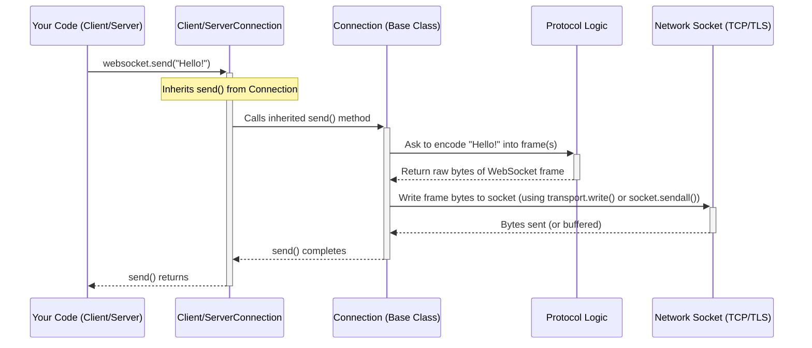

# Chapter 6: The Common Ground - Connection (Asyncio / Sync)

In the previous chapters, we learned how to set up clients ([Chapter 1](01_connect__factory_.md), [Chapter 2](02_clientconnection__asyncio___sync_.md)) and servers ([Chapter 3](03_serve__factory_.md), [Chapter 4](04_serverconnection__asyncio___sync_.md)) for WebSocket conversations. We also saw how to handle errors using [Chapter 5: When Things Go Wrong - WebSocketException](05_websocketexception.md).

You might have noticed that `ClientConnection` and `ServerConnection` seemed quite similar in how they let you `send()` and `recv()` messages. That's no accident! Underneath both of them lies a common foundation: the `Connection` class.

Think of `ClientConnection` and `ServerConnection` as specialized tools – one for making calls (client) and one for answering calls (server). The `Connection` class is like the core engine and electronics *inside* both tools, handling the fundamental task of transmitting and receiving signals according to the rules.

## What Problem Does `Connection` Solve?

Whether you're a client talking to a server or a server talking to a client, the basic mechanics of a WebSocket conversation are the same *once the connection is established*:

1.  Messages need to be encoded into WebSocket "frames" before sending.
2.  Incoming frames need to be decoded back into messages.
3.  Data needs to be physically sent and received over the network (TCP/TLS).
4.  Someone needs to manage "keepalive" pings and pongs to make sure the connection hasn't dropped silently.
5.  Messages waiting to be sent or that have just been received need to be temporarily stored (queued).

Writing this logic separately for both clients and servers would be repetitive and inefficient. The `Connection` class provides this shared core functionality. It acts as the bridge between the abstract rules of the WebSocket protocol ([Chapter 10: Protocol (Core)](10_protocol__core_.md)) and the actual network communication happening over a socket.

**Analogy: The Phone Line and Translator**

Imagine the `Connection` class as a combination of:
*   **The Phone Line:** The actual physical network connection (TCP socket or TLS-encrypted socket) that carries the raw electrical signals (bytes).
*   **The Translator:** A smart device attached to the phone line that understands the WebSocket language. It takes your plain message (text or bytes), translates it into the special WebSocket format (frames) using rules provided by the [Chapter 7: ClientProtocol / ServerProtocol](07_clientprotocol___serverprotocol.md), and sends it down the line. It also listens for incoming WebSocket signals, translates them back into plain messages, and hands them to you.

## How `Connection` Works: The Engine Room

You typically don't create a `Connection` object directly. Instead, when you use `connect()` ([Chapter 1](01_connect__factory_.md)) or `serve()` ([Chapter 3](03_serve__factory_.md)), the library creates either a `ClientConnection` ([Chapter 2](02_clientconnection__asyncio___sync_.md)) or a `ServerConnection` ([Chapter 4](04_serverconnection__asyncio___sync_.md)) for you. These specialized classes *inherit* from the base `Connection` class, gaining all its core capabilities.

Here's what the `Connection` base class takes care of:

1.  **Network I/O:** It directly interacts with the underlying network socket (provided by the operating system). It handles the reading of raw bytes coming in and writing raw bytes going out.
2.  **Protocol Interaction:** It holds an instance of a `Protocol` object ([Chapter 7](07_clientprotocol___serverprotocol.md), [Chapter 10](10_protocol__core_.md)). When you call `send()`, `Connection` gives your message to the `Protocol` to encode it into frames. When bytes arrive from the network, `Connection` feeds them to the `Protocol` to decode them into events (like messages, pings, or close signals).
3.  **Queue Management:** It maintains internal queues (like waiting lists) for incoming messages. When the `Protocol` decodes a full message, `Connection` puts it in a queue. When you call `recv()`, it retrieves the next message from this queue.
4.  **Keepalive:** If configured (`ping_interval`, `ping_timeout`), it manages timers to automatically send Ping frames and check for corresponding Pong frames, ensuring the connection is still alive. It uses the `Protocol` to create and interpret these special frames.
5.  **Providing `send()` and `recv()`:** The user-friendly `send()` and `recv()` methods you used on `ClientConnection` and `ServerConnection` are actually defined in the base `Connection` class.

## Asyncio vs. Sync Implementations

Because network operations can be handled in different ways (non-blocking `asyncio` vs. blocking threads `sync`), there are two separate base `Connection` classes:

*   `websockets.asyncio.connection.Connection`: Uses `asyncio`'s transports and protocols for non-blocking network I/O. Background tasks (like reading from the socket or sending keepalives) are managed using `asyncio.Task`.
*   `websockets.sync.connection.Connection`: Uses standard Python sockets and `threading`. Background tasks are typically run in separate threads.

While their internal mechanics differ to match their respective concurrency models, their purpose and the core logic they provide are fundamentally the same.

**Conceptual Code Difference (Sending Data):**

*Asyncio Version (`websockets.asyncio.connection.Connection`):*
```python
# Conceptual snippet - Asyncio Connection sending data
class Connection(asyncio.Protocol): # Inherits from asyncio's base Protocol
    # ... other methods ...
    def send_data(self) -> None:
        for data in self.protocol.data_to_send():
            if data:
                # Uses the asyncio transport's non-blocking write
                self.transport.write(data)
            # ... (handle closing, flow control) ...

    async def drain(self) -> None: # Needed for backpressure
        # Waits if the write buffer is full (simplified)
        if self.paused:
            await self.drain_waiters.get() # Example, actual is different
```
*Explanation:* The asyncio version integrates with the event loop, using `transport.write()` which doesn't block, and potentially `await`ing if the network buffer is full (`drain`).

*Sync Version (`websockets.sync.connection.Connection`):*
```python
# Conceptual snippet - Sync Connection sending data
class Connection: # Doesn't inherit from asyncio.Protocol
    # ... other methods ...
    def send_data(self) -> None:
        # Requires holding a lock (self.protocol_mutex)
        assert self.protocol_mutex.locked()
        for data in self.protocol.data_to_send():
            if data:
                # Uses the standard socket's blocking sendall
                self.socket.sendall(data)
            # ... (handle closing) ...
```
*Explanation:* The sync version uses the standard blocking `socket.sendall()` method. It relies on locks (`self.protocol_mutex`) to prevent multiple threads from interfering with the protocol state while sending.

## Under the Hood: The `send()` / `recv()` Flow

Let's visualize how a `send()` call flows through the layers, highlighting the role of `Connection`:



**Step-by-step (Sending):**

1.  Your code calls `send()` on a `ClientConnection` or `ServerConnection` object (`websocket`).
2.  This call actually executes the `send()` method inherited from the base `Connection` class.
3.  The `Connection.send()` method acquires necessary locks (in sync) or checks state (asyncio).
4.  It asks the contained `Protocol` object to encode the message "Hello!" into the proper WebSocket frame bytes.
5.  The `Protocol` returns the raw bytes.
6.  `Connection` takes these bytes and tells the underlying network layer (asyncio `transport` or sync `socket`) to send them.
7.  Once the bytes are sent (or buffered by the OS), control returns to your code.

Receiving works similarly, with `Connection` reading bytes from the Network, feeding them to the `Protocol` for decoding, putting decoded messages into an internal queue, and `recv()` retrieving messages from that queue. The `Connection` manages a background task or thread to continuously read from the network socket.

**Code Glimpse (Conceptual):**

Let's look at the conceptual structure combining ideas from both `websockets.asyncio.connection.py` and `websockets.sync.connection.py`.

```python
# Conceptual structure of the Connection base class
class Connection: # Simplified!
    def __init__(self, protocol, socket_or_transport, **options):
        self.protocol = protocol  # The WebSocket rules engine (e.g., ClientProtocol)
        self.transport_or_socket = socket_or_transport # Network pipe (asyncio or sync)
        self.recv_messages = MessageQueue() # Internal queue for received messages
        self.ping_interval = options.get('ping_interval')
        self.ping_timeout = options.get('ping_timeout')
        # ... other shared attributes: logger, state, close_code/reason ...
        # ... locks/events for synchronization ...

    # --- Core Send Logic (Conceptual Mix) ---
    def send(self, message, ...):
        # 1. Check state, handle fragmentation logic, acquire locks (sync)
        # ... (error checks, concurrency management) ...

        # 2. Ask protocol to encode
        bytes_to_send = self.protocol.encode_message(message) # Simplified

        # 3. Write bytes to network
        self._write_bytes(bytes_to_send) # Internal helper

        # 4. Handle potential backpressure (asyncio) or just return (sync)
        # ... (await self.drain() in asyncio if needed) ...

    # --- Core Receive Logic (Conceptual Mix) ---
    async def recv(self): # Asyncio example signature
        # 1. Get message from internal queue (blocks/awaits if empty)
        message = await self.recv_messages.get() # or self.recv_messages.get(timeout)

        # 2. Check for connection closed signal
        if message is CONNECTION_CLOSED_SENTINEL:
            raise self.protocol.close_exc # The specific close exception

        # 3. Return the message
        return message

    # --- Background Reader Task/Thread (Conceptual) ---
    def _background_reader_loop(self):
        while self.protocol.state is not CLOSED:
            try:
                # Read raw bytes from network (blocking/non-blocking)
                raw_data = self._read_bytes_from_network()

                # Feed bytes to protocol
                self.protocol.receive_data(raw_data)

                # Process events decoded by protocol
                for event in self.protocol.events_received():
                    if isinstance(event, Message):
                         # Put completed messages in the queue for recv()
                         self.recv_messages.put(event.data)
                    elif isinstance(event, CloseFrame):
                         # Signal closure to recv()
                         self.recv_messages.put(CONNECTION_CLOSED_SENTINEL)
                    # ... handle pings/pongs, update state ...

                # Write any responses generated by protocol (e.g., pongs)
                self._write_bytes(self.protocol.data_to_send())

            except Exception as exc:
                # Handle network errors, signal closure
                self.protocol.fail(...) # Or similar logic
                break
        # Signal closure completion
        self.recv_messages.close()
```

This conceptual code highlights how `Connection` orchestrates the flow: using `protocol` for encoding/decoding, managing the `recv_messages` queue, interacting with the network via helpers (`_write_bytes`, `_read_bytes_from_network`), and running a background loop to handle incoming data and protocol events.

## Key Responsibilities Recap

The `Connection` class is the workhorse responsible for:
*   Managing the underlying network socket (`asyncio` transport or `sync` socket).
*   Running a background loop/thread to read incoming data.
*   Using the `Protocol` object to parse incoming bytes into WebSocket frames and events.
*   Using the `Protocol` object to serialize outgoing messages into WebSocket frames.
*   Writing outgoing frame bytes to the network socket.
*   Handling keepalive pings and pongs based on timers.
*   Managing queues for incoming messages.
*   Providing the core `send()` and `recv()` methods inherited by `ClientConnection` and `ServerConnection`.
*   Managing the connection state (CONNECTING, OPEN, CLOSING, CLOSED).

## Conclusion

You've learned about the `Connection` base class, the hidden engine powering both `ClientConnection` and `ServerConnection`. While you don't use it directly, understanding its role helps clarify how the `websockets` library manages the low-level details of communication. It's the crucial piece that connects the abstract WebSocket rules (the `Protocol`) to the real network connection, handling byte shuffling, message queuing, and keepalives.

The `Connection` relies heavily on a `Protocol` object to understand the *rules* of WebSocket. What exactly are these `Protocol` objects?

Let's dive into them in the next chapter: [Chapter 7: The Rulebooks - ClientProtocol / ServerProtocol](07_clientprotocol___serverprotocol.md).

---

Generated by [AI Codebase Knowledge Builder](https://github.com/The-Pocket/Tutorial-Codebase-Knowledge)