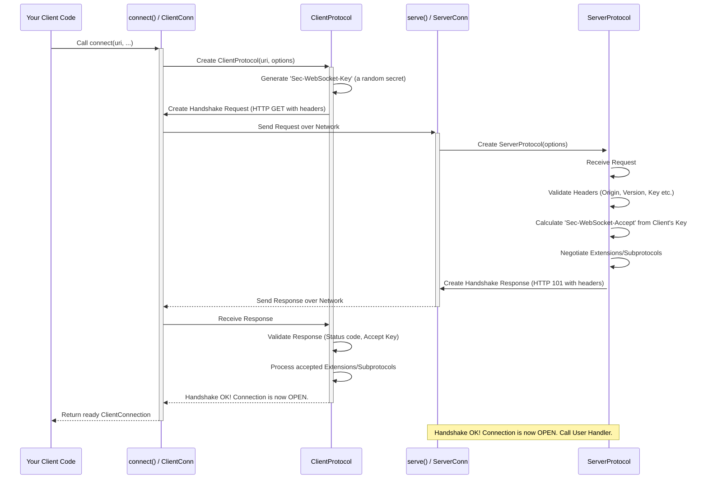

# Chapter 7: The Rulebooks - ClientProtocol / ServerProtocol

In [Chapter 6: The Common Ground - Connection (Asyncio / Sync)](06_connection__asyncio___sync_.md), we saw that both `ClientConnection` and `ServerConnection` rely on a common `Connection` base class. This base class handles the mechanics of sending and receiving data over the network. We also mentioned that `Connection` uses a `Protocol` object to understand the *rules* of WebSocket communication.

But wait, are the rules exactly the same for a client and a server? Mostly, yes, especially *after* the connection is established. However, the very beginning – the "opening handshake" – is quite different depending on whether you are initiating the connection (client) or accepting it (server).

Think of it like a game with specific player roles, like attacker and defender. They follow the same general game rules, but their opening moves and objectives are distinct.

## What Problem Do ClientProtocol / ServerProtocol Solve?

The initial WebSocket handshake is a crucial negotiation phase. It's a specific back-and-forth using HTTP-like messages to switch from a standard web connection to a WebSocket connection. During this handshake:

*   The **client** needs to *initiate* the request, prove it knows the secret handshake, suggest features (like extensions or subprotocols), and maybe declare its origin.
*   The **server** needs to *respond* to the request, verify the client's secret handshake, check if the client's origin is allowed, decide which features to accept, and confirm the switch to WebSockets.

Handling these different responsibilities requires specialized logic. Just having one generic `Protocol` isn't enough for the handshake part.

`ClientProtocol` and `ServerProtocol` are specialized versions of the core WebSocket protocol logic, tailored specifically for either the client or the server role during this critical opening phase. They provide the specific "rulebook" for how each side should behave during the handshake.

**Key Ideas:**

*   **ClientProtocol:** The rulebook for the program *starting* the connection (`connect()`).
*   **ServerProtocol:** The rulebook for the program *listening* for connections (`serve()`).
*   They both build upon the common rules found in the base [Protocol (Core)](10_protocol__core_.md).
*   Their main job is to handle the *differences* in the opening handshake.

## How They Are Used (Behind the Scenes)

You usually won't create `ClientProtocol` or `ServerProtocol` objects directly in your application code. They work behind the scenes:

1.  When you call `connect()`, the library automatically creates a `ClientProtocol` instance to manage the client-side handshake logic. This `ClientProtocol` is then passed to the underlying [Connection](06_connection__asyncio___sync_.md) object.
2.  When you use `serve()` and a client tries to connect, the library creates a `ServerProtocol` instance for that incoming connection to handle the server-side handshake. This `ServerProtocol` is then passed to the [ServerConnection](04_serverconnection__asyncio___sync_.md) object given to your handler.

So, while you interact with `ClientConnection` or `ServerConnection`, these objects are internally using `ClientProtocol` or `ServerProtocol` respectively to follow the correct handshake procedures.

## Under the Hood: The Secret Handshake

Let's visualize the handshake and the roles of these specialized protocols. Imagine the client wants to connect.



**Step-by-step:**

1.  **Client Starts:** Your code calls `connect()`.
2.  **Client Prep:** `connect()` creates a `ClientProtocol`.
3.  **Client Request:** `ClientProtocol` generates a secret key (`Sec-WebSocket-Key`) and builds the HTTP handshake request, including requested extensions and subprotocols. `connect()` sends this request.
4.  **Server Receives:** The server's `serve()` logic receives the request and creates a `ServerProtocol`.
5.  **Server Validation:** `ServerProtocol` checks the request headers (Is the `Origin` allowed? Is the `Sec-WebSocket-Version` correct?). It calculates the expected `Sec-WebSocket-Accept` response based on the client's key. It decides which extensions/subprotocols (if any) to agree on from the client's list and its own configured list.
6.  **Server Response:** `ServerProtocol` builds the HTTP 101 Switching Protocols response, including the calculated `Sec-WebSocket-Accept` key and negotiated features. `serve()` sends this response.
7.  **Client Validation:** The client's `ClientProtocol` receives the response. It checks if the status code is 101 and if the `Sec-WebSocket-Accept` key matches the expected value (proving the server knows the secret). It records the agreed-upon extensions/subprotocol.
8.  **Connected!** If everything checks out, both protocols signal that the handshake is complete, and the connection state changes from `CONNECTING` to `OPEN`. The regular message exchange (handled by the base `Protocol` logic) can now begin.

**Code Glimpse (Client):**

Let's peek at a *highly simplified* conceptual piece from `src/websockets/client.py` where `ClientProtocol` prepares the request:

```python
# Conceptual snippet from ClientProtocol's handshake logic

from .utils import generate_key, accept_key
from .headers import build_host, build_extension, build_subprotocol
from .http11 import Request
from .datastructures import Headers

class ClientProtocol(Protocol): # Inherits from base Protocol
    def __init__(self, uri, *, origin=None, extensions=None, subprotocols=None, **kwargs):
        super().__init__(side=CLIENT, state=CONNECTING, **kwargs)
        self.uri = uri
        self.origin = origin
        self.available_extensions = extensions
        self.available_subprotocols = subprotocols
        # 1. Generate the client's secret key for this connection attempt
        self.key = generate_key()

    def connect(self) -> Request:
        """Create the initial HTTP handshake request."""
        headers = Headers()
        # 2. Add standard handshake headers
        headers["Host"] = build_host(self.uri.host, self.uri.port, self.uri.secure)
        if self.origin is not None:
            headers["Origin"] = self.origin # Tell the server where we're from
        headers["Upgrade"] = "websocket"
        headers["Connection"] = "Upgrade"
        # 3. Include the generated secret key
        headers["Sec-WebSocket-Key"] = self.key
        headers["Sec-WebSocket-Version"] = "13" # Standard version
        # 4. Offer supported extensions and subprotocols
        if self.available_extensions:
            headers["Sec-WebSocket-Extensions"] = build_extension(...)
        if self.available_subprotocols:
            headers["Sec-WebSocket-Protocol"] = build_subprotocol(...)

        # 5. Return the Request object to be sent
        return Request(self.uri.resource_name, headers)

    def process_response(self, response: Response) -> None:
        """Check the server's handshake response."""
        if response.status_code != 101:
            raise InvalidStatus(response) # Must be 101

        # 6. Verify the server knew our secret key
        try:
            s_w_accept = response.headers["Sec-WebSocket-Accept"]
        except KeyError:
            raise InvalidHeader("Sec-WebSocket-Accept")
        if s_w_accept != accept_key(self.key): # Calculate expected key
            raise InvalidHeaderValue("Sec-WebSocket-Accept", s_w_accept)

        # 7. Process accepted extensions and subprotocol
        self.extensions = self.process_extensions(response.headers)
        self.subprotocol = self.process_subprotocol(response.headers)

        # If all checks pass, the handshake is successful!
```

This shows `ClientProtocol` generating the key (`generate_key`), adding required headers (including the key, origin, requested extensions/subprotocols), and later validating the server's response key (`accept_key`).

**Code Glimpse (Server):**

Now, a *highly simplified* look at `src/websockets/server.py` where `ServerProtocol` validates the request and prepares the response:

```python
# Conceptual snippet from ServerProtocol's handshake logic

from .utils import accept_key
from .exceptions import InvalidOrigin, InvalidHeader, InvalidHeaderValue
from .http11 import Request, Response
from .datastructures import Headers

class ServerProtocol(Protocol): # Inherits from base Protocol
    def __init__(self, *, origins=None, extensions=None, subprotocols=None, **kwargs):
        super().__init__(side=SERVER, state=CONNECTING, **kwargs)
        self.origins = origins # List of allowed origins
        self.available_extensions = extensions
        self.available_subprotocols = subprotocols
        # ... other server options ...

    def process_request(self, request: Request) -> tuple[str, str | None, str | None]:
        """Check the client's handshake request."""
        headers = request.headers

        # 1. Check essential headers like Upgrade, Connection, Version...
        # ... (validation logic for Upgrade, Connection, Version headers) ...

        # 2. Validate the Origin header (security check)
        self.origin = self.process_origin(headers) # Checks against self.origins

        # 3. Get the client's key
        try:
            key = headers["Sec-WebSocket-Key"]
        except KeyError:
            raise InvalidHeader("Sec-WebSocket-Key")
        # ... (validate key format) ...

        # 4. Calculate the acceptance key based on the client's key
        accept_header = accept_key(key)

        # 5. Negotiate extensions and subprotocol based on client request
        #    and server capabilities (self.available_extensions etc.)
        extensions_header, self.extensions = self.process_extensions(headers)
        protocol_header = self.subprotocol = self.process_subprotocol(headers)

        # 6. Return values needed for the Response
        return (accept_header, extensions_header, protocol_header)

    def accept(self, request: Request) -> Response:
        """Create the handshake acceptance response."""
        try:
            # 7. Process the request using the logic above
            accept_h, ext_h, proto_h = self.process_request(request)
        except InvalidHandshake as exc:
            # Handle handshake errors by returning a non-101 response
            return self.reject(400, f"Handshake failed: {exc}")
        except InvalidOrigin as exc:
            return self.reject(403, f"Invalid origin: {exc}")
        # ... other error handling ...

        # 8. Build the successful (101) response
        headers = Headers()
        headers["Upgrade"] = "websocket"
        headers["Connection"] = "Upgrade"
        # 9. Include the calculated accept key and negotiated features
        headers["Sec-WebSocket-Accept"] = accept_h
        if ext_h:
            headers["Sec-WebSocket-Extensions"] = ext_h
        if proto_h:
            headers["Sec-WebSocket-Protocol"] = proto_h

        return Response(101, "Switching Protocols", headers)

```

This shows `ServerProtocol` checking the client's headers (like `Origin`), calculating the `accept_key` based on the client's `Sec-WebSocket-Key`, deciding on extensions/subprotocols, and building the 101 response.

## Key Tasks Summary

*   **`ClientProtocol`:**
    *   Generates `Sec-WebSocket-Key`.
    *   Constructs the initial HTTP `GET` request with necessary headers (`Host`, `Upgrade`, `Connection`, `Sec-WebSocket-Key`, `Sec-WebSocket-Version`, `Origin`, `Sec-WebSocket-Extensions`, `Sec-WebSocket-Protocol`).
    *   Validates the server's HTTP `101` response.
    *   Verifies the `Sec-WebSocket-Accept` key from the server.
    *   Parses accepted extensions and subprotocol.

*   **`ServerProtocol`:**
    *   Parses the client's HTTP `GET` request.
    *   Validates required headers (`Host`, `Upgrade`, `Connection`, `Sec-WebSocket-Key`, `Sec-WebSocket-Version`).
    *   Validates the `Origin` header against allowed origins (optional security).
    *   Calculates the `Sec-WebSocket-Accept` value from the client's key.
    *   Negotiates extensions based on client offers and server support.
    *   Selects a subprotocol based on client offers and server support/preference.
    *   Constructs the HTTP `101` response (or an error response).

## Conclusion

You've learned about `ClientProtocol` and `ServerProtocol`, the specialized rulebooks used by the `websockets` library to handle the client and server roles during the crucial opening handshake. They manage the specific details like generating and validating security keys, negotiating extensions, and selecting subprotocols.

While you don't typically use them directly, understanding their role helps clarify what happens "under the hood" when you call `connect()` or when `serve()` accepts a new connection, before the main message exchange begins. They ensure both sides follow the correct steps to establish a valid WebSocket connection.

The handshake heavily involves exchanging HTTP-like messages. What do these `Request` and `Response` objects look like? Let's examine them next.

Up next: [Chapter 8: Request / Response (HTTP/1.1)](08_request___response__http_1_1_.md)

---

Generated by [AI Codebase Knowledge Builder](https://github.com/The-Pocket/Tutorial-Codebase-Knowledge)