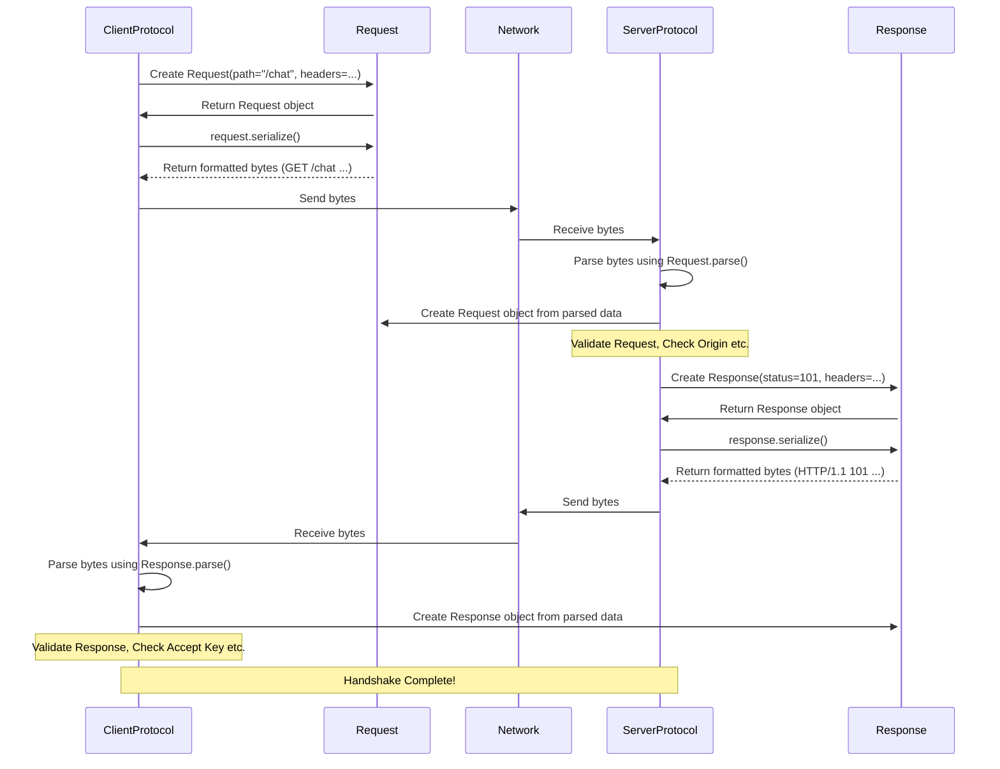

# Chapter 8: The Handshake Invitation and Reply - Request / Response (HTTP/1.1)

In [Chapter 7: The Rulebooks - ClientProtocol / ServerProtocol](07_clientprotocol___serverprotocol.md), we learned that the client and server use special rulebooks (`ClientProtocol` and `ServerProtocol`) to manage the very beginning of a WebSocket connection – the opening handshake. We saw this handshake involves sending messages back and forth that look a bit like standard web requests and responses (using HTTP).

But how does the library actually handle these specific "invitation" and "reply" messages? How does it make sure they follow the right format? That's where the `Request` and `Response` classes come in.

## What Problem Do Request / Response Solve?

Imagine you want to start a game with a friend. You can't just instantly start playing. First, you need to formally invite them ("Want to play WebSocket?"), and they need to formally accept ("Yes, let's switch to WebSocket rules!").

The WebSocket handshake is exactly this:
1.  The **client** sends a specific HTTP `GET` request – the invitation.
2.  The **server** sends back a specific HTTP `101 Switching Protocols` response – the acceptance.

These aren't just random text messages; they have a very specific structure defined by the HTTP/1.1 standard. They contain things like:
*   The path the client wants to connect to (like `/chat`).
*   Special instructions called "headers" (like `Upgrade: websocket` and `Connection: Upgrade`).
*   The server's status code (like `101`).
*   The server's reason phrase (like `Switching Protocols`).

Handling this structure manually – making sure all the colons, spaces, and line breaks (`\r\n`) are perfect – would be tedious and error-prone.

The `Request` and `Response` classes are helper objects that represent these structured HTTP messages. They act like pre-formatted templates for the invitation and acceptance:
*   They know how to **parse** incoming bytes from the network into a structured object (reading the invitation/acceptance).
*   They know how to **serialize** a structured object back into the correctly formatted bytes to send over the network (writing the invitation/acceptance).
*   They hold the different parts of the message (path, status code, headers) in an easy-to-access way.

Essentially, they handle the strict formatting rules of the HTTP part of the handshake, so the `ClientProtocol` and `ServerProtocol` can focus on the WebSocket-specific negotiation logic.

## How Are They Used? (Mostly Behind the Scenes)

You usually won't *create* `Request` or `Response` objects yourself in basic client or server code. They are primarily used internally by the library during the connection setup:

1.  **Client Sending:** When you call `connect()`, the underlying [Chapter 7: ClientProtocol / ServerProtocol](07_clientprotocol___serverprotocol.md) creates a `Request` object, fills it with the necessary details (path, host, the special `Sec-WebSocket-Key`, etc.), serializes it into bytes, and sends it.
2.  **Server Receiving:** When `serve()` receives an incoming connection attempt, the [Chapter 7: ClientProtocol / ServerProtocol](07_clientprotocol___serverprotocol.md) parses the incoming bytes into a `Request` object.
3.  **Server Sending:** The `ServerProtocol` validates the client's `Request`. If it's acceptable, it creates a `Response` object (with status 101, the calculated `Sec-WebSocket-Accept` key, etc.), serializes it, and sends it back.
4.  **Client Receiving:** The `ClientProtocol` parses the incoming bytes into a `Response` object and validates it to complete the handshake.

**Where You Might See Them:**

While you don't usually create them, you can sometimes *access* the `Request` and `Response` objects after the handshake is complete, which can be useful for seeing what happened:

**Server Example: Inspecting Client Headers**

Imagine your server handler wants to see a custom header the client sent during the initial handshake (maybe an authentication token).

```python
# example/asyncio/server_inspect_request.py (Simplified Handler)
import asyncio
from websockets.asyncio.server import serve
# We'll need the Headers object later
from websockets.datastructures import Headers

# The Request object is available on the connection
async def handler(websocket):
    # 'websocket' is the ServerConnection
    # Access the initial HTTP request the client sent
    initial_request = websocket.request
    if initial_request:
        print(f"Client connected from path: {initial_request.path}")
        # Access the headers using the .headers attribute
        client_headers: Headers = initial_request.headers
        auth_token = client_headers.get("X-Auth-Token") # Get a custom header
        if auth_token:
            print(f"Client sent auth token: {auth_token}")
        else:
            print("Client did not send X-Auth-Token header.")
        # Print all headers
        print("All client headers:")
        for name, value in client_headers.items():
            print(f"  {name}: {value}")

    # ... rest of your handler logic ...
    async for message in websocket:
        await websocket.send(message)

async def main():
    async with serve(handler, "localhost", 8765):
        await asyncio.Future() # Run forever

# asyncio.run(main())
```
*Explanation:* Inside the server handler, `websocket.request` gives you access to the `Request` object that the client sent to initiate the connection. You can then inspect its `path` and `headers` attributes. The `headers` attribute itself is a special [Headers](09_headers.md) object (covered in the next chapter).

**Client Example: Inspecting Server Headers**

Similarly, a client might want to see headers the server sent back in its `101` response.

```python
# example/asyncio/client_inspect_response.py (Simplified Client)
import asyncio
from websockets.asyncio.client import connect
# We'll need the Headers object later
from websockets.datastructures import Headers

async def connect_and_inspect():
    uri = "ws://localhost:8765"
    async with connect(uri) as websocket:
        # 'websocket' is the ClientConnection
        # Access the HTTP response the server sent back (101)
        handshake_response = websocket.response
        if handshake_response:
            print(f"Server response status: {handshake_response.status_code}")
            print(f"Server response reason: {handshake_response.reason_phrase}")
            # Access the headers
            server_headers: Headers = handshake_response.headers
            server_software = server_headers.get("Server")
            if server_software:
                print(f"Server software reported: {server_software}")
            # Print all headers
            print("All server headers:")
            for name, value in server_headers.items():
                print(f"  {name}: {value}")

        # ... rest of your client logic ...
        await websocket.send("Hello")
        print(f"Received: {await websocket.recv()}")

# asyncio.run(connect_and_inspect())
```
*Explanation:* Inside the client's `async with connect(...)` block, `websocket.response` gives you the `Response` object received from the server. You can check its `status_code`, `reason_phrase`, and `headers`.

## Under the Hood: Formatting the Invitation and Reply

How do these objects turn into bytes and back?

**Serialization (Object to Bytes):**

Imagine the `ClientProtocol` needs to send the handshake request. It constructs a `Request` object internally.

```python
# Conceptual Request Object
# request_obj = Request(path="/chat", headers={"Host": "example.com", ...})
```

Then, it calls a method like `request_obj.serialize()` which formats it according to HTTP/1.1 rules:

```
GET /chat HTTP/1.1\r\n
Host: example.com\r\n
Upgrade: websocket\r\n
Connection: Upgrade\r\n
Sec-WebSocket-Key: dGhlIHNhbXBsZSBub25jZQ==\r\n
Sec-WebSocket-Version: 13\r\n
\r\n
```
*(Note: `\r\n` represents the special carriage-return and line-feed characters required by HTTP)*

This resulting sequence of bytes is what actually gets sent over the network socket. The `Response` object has a similar `serialize()` method for the server's reply.

**Parsing (Bytes to Object):**

When the server receives bytes for an incoming connection, its `ServerProtocol` uses a parser (like `Request.parse()`) to read the bytes line by line until it recognizes the structure of an HTTP request. It extracts the method (`GET`), path (`/chat`), and all the headers, creating a `Request` object in memory.



This diagram shows the flow: `ClientProtocol` creates and serializes a `Request`, sends it; `ServerProtocol` parses the bytes into a `Request`, validates it, creates and serializes a `Response`, sends it; `ClientProtocol` parses the bytes into a `Response` and validates it.

**Code Glimpse:**

The `Request` and `Response` classes are defined in `src/websockets/http11.py`. They are implemented using Python's `dataclasses`, which makes their structure quite clear:

```python
# src/websockets/http11.py (Simplified Structure)
import dataclasses
from .datastructures import Headers # See Chapter 9

@dataclasses.dataclass
class Request:
    """WebSocket handshake request."""
    path: str         # e.g., "/chat?user=alice"
    headers: Headers  # The collection of request headers

    # Method to turn the object into bytes for sending
    def serialize(self) -> bytes:
        request = f"GET {self.path} HTTP/1.1\r\n".encode()
        request += self.headers.serialize() # Headers object knows how to format itself
        return request

    # Class method to parse incoming bytes into an object
    @classmethod
    def parse(cls, read_line_func) -> Generator[None, None, Request]:
        # ... logic to read lines using read_line_func ...
        # ... split the first line into method, path, protocol ...
        # ... validate method is GET, protocol is HTTP/1.1 ...
        # ... parse subsequent lines into a Headers object ...
        # yield from parse_headers(...) # Reads header lines
        # return cls(path=parsed_path, headers=parsed_headers)
        pass # Simplified

@dataclasses.dataclass
class Response:
    """WebSocket handshake response."""
    status_code: int    # e.g., 101
    reason_phrase: str  # e.g., "Switching Protocols"
    headers: Headers    # The collection of response headers
    body: bytes = b""   # Usually empty for 101, but used for error responses

    # Method to turn the object into bytes for sending
    def serialize(self) -> bytes:
        response = f"HTTP/1.1 {self.status_code} {self.reason_phrase}\r\n".encode()
        response += self.headers.serialize()
        response += self.body # Add body if present
        return response

    # Class method to parse incoming bytes into an object
    @classmethod
    def parse(cls, read_line_func, ...) -> Generator[None, None, Response]:
        # ... logic to read lines using read_line_func ...
        # ... split the first line into protocol, status, reason ...
        # ... validate protocol is HTTP/1.1, status is integer ...
        # ... parse subsequent lines into a Headers object ...
        # yield from parse_headers(...)
        # ... potentially read a body based on headers/status ...
        # return cls(status_code=..., reason_phrase=..., headers=..., body=...)
        pass # Simplified
```
This shows that `Request` mainly stores the `path` and `headers`, while `Response` stores `status_code`, `reason_phrase`, `headers`, and potentially a `body`. Both rely on the `Headers` object (which we'll see next) to handle the details of header formatting and parsing. Their `parse` and `serialize` methods handle the specific HTTP/1.1 line structures.

## Conclusion

You've learned about the `Request` and `Response` classes, which represent the structured HTTP/1.1 messages used for the WebSocket opening handshake.

*   They act as the formal "invitation" (client's `GET` request) and "acceptance" (server's `101` response).
*   They encapsulate the different parts of these messages (path, status code, headers).
*   They handle the details of **parsing** incoming bytes and **serializing** objects into bytes according to HTTP/1.1 rules.
*   You typically don't create them directly, but they work behind the scenes within `ClientProtocol` and `ServerProtocol`.
*   You can inspect the `request` (on `ServerConnection`) and `response` (on `ClientConnection`) objects after the handshake to see what was exchanged.

Both `Request` and `Response` rely heavily on another helper object to manage the collection of headers. Let's dive into that next!

Up next: [Chapter 9: Organizing the Details - Headers](09_headers.md)

---

Generated by [AI Codebase Knowledge Builder](https://github.com/The-Pocket/Tutorial-Codebase-Knowledge)