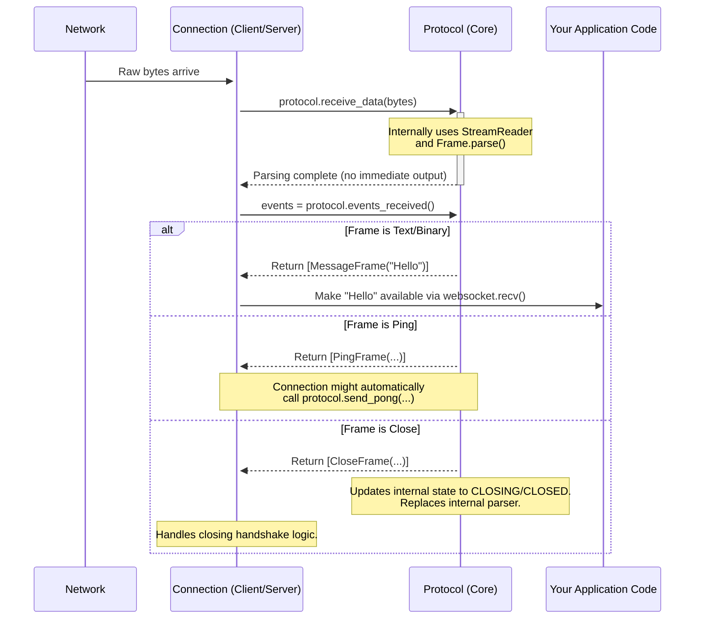
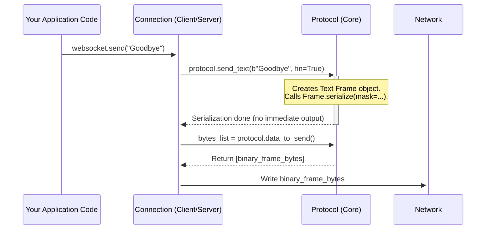

# Chapter 10: The Core Rules Engine - Protocol (Core)

In the previous chapters ([Chapter 7](07_clientprotocol___serverprotocol.md), [Chapter 8](08_request___response__http_1_1_.md), [Chapter 9](09_headers.md)), we focused heavily on the "opening handshake" – the special negotiation that starts a WebSocket connection. We saw how `ClientProtocol`, `ServerProtocol`, `Request`, `Response`, and `Headers` work together to get the conversation started correctly.

But what happens *after* the handshake? Once the connection is `OPEN`, how does the library ensure that both the client and server continue to follow the rules of WebSocket communication? How does it package your messages? How does it understand incoming messages? What happens if someone sends invalid data?

Think of the handshake like agreeing on the rules of a game (e.g., "Let's play chess!"). The game itself needs a referee to make sure players move correctly, handle special moves (like castling), and declare checkmate or a draw. The core `Protocol` class in `websockets` is that referee for the ongoing WebSocket game.

## What Problem Does `Protocol` Solve?

Once a WebSocket connection is established, communication isn't just sending raw data back and forth. The WebSocket standard (RFC 6455) defines a strict set of rules:

1.  **Framing:** Data must be sent in structured chunks called "frames". Frames have types (text, binary, ping, pong, close) and flags (like indicating if a message is fragmented).
2.  **State Management:** The connection goes through different states (CONNECTING, OPEN, CLOSING, CLOSED). Actions are only allowed in certain states (e.g., you can't send data when CLOSED).
3.  **Control Frames:** Special frames like Ping, Pong, and Close have specific rules for how they should be handled (e.g., sending a Pong in response to a Ping).
4.  **Error Handling:** If a peer sends invalid data (e.g., a malformed frame, incorrect UTF-8 in a text frame), the protocol defines how to react (usually by failing the connection with a specific error code).
5.  **Masking (Client-side):** Frames sent *from* the client *to* the server must have their payload data scrambled ("masked") using a random key. Frames from the server are not masked.

Implementing all these rules correctly and consistently for both clients and servers, while handling all the edge cases, is complex. Furthermore, we want this core logic to be independent of *how* data is actually sent or received over the network (whether using `asyncio`, threads, or some other mechanism).

The `Protocol` class is the fundamental engine that encapsulates these RFC 6455 rules. It focuses purely on the *logic* of the WebSocket protocol:
*   **Parsing:** Taking raw bytes received from the network and interpreting them as WebSocket frames.
*   **Serializing:** Taking application data (like text or bytes) or control signals (like pings) and formatting them into the correct WebSocket frame bytes ready to be sent.
*   **State Transitions:** Managing the connection state (OPEN, CLOSING, CLOSED) based on received frames or actions taken.
*   **Validation:** Checking if incoming frames and actions are valid according to the current state and protocol rules.

It acts as a translator and rule-keeper between your high-level actions (like `send("hello")`) and the low-level byte stream on the network. Crucially, it does this *without* doing any actual network I/O itself.

## How It's Used (Behind the Scenes)

You almost never interact with the base `Protocol` class directly in typical application code. It's the foundation upon which the more specialized [Chapter 7: ClientProtocol / ServerProtocol](07_clientprotocol___serverprotocol.md) classes are built. Remember them? They handle the specific client/server roles during the *handshake*.

Here's the relationship:
*   `ClientProtocol` **inherits from** `Protocol`. It adds the client-specific handshake logic but relies on the base `Protocol` for everything that happens *after* the handshake.
*   `ServerProtocol` **inherits from** `Protocol`. It adds the server-specific handshake logic but relies on the base `Protocol` for everything *after* the handshake.

The [Chapter 6: Connection (Asyncio / Sync)](06_connection__asyncio___sync_.md) object (the base for `ClientConnection` and `ServerConnection`) holds an instance of either `ClientProtocol` or `ServerProtocol`. When the `Connection` object needs to process incoming network bytes or prepare outgoing data, it delegates the WebSocket-specific parts to its internal `Protocol` instance.

**Simplified Interaction:**

```mermaid
graph TD
    subgraph Connection Layer (e.g., ClientConnection)
        direction LR
        A[Network I/O (Read Bytes)] --> B(Connection Object);
        B --> C{Protocol Instance (Client/Server)};
        C -- Events (Frames, Close) --> B;
        B --> D[Application Code (e.g., websocket.recv())];

        E[Application Code (e.g., websocket.send())] --> B;
        B --> C;
        C -- Bytes to Send --> B;
        B --> F[Network I/O (Write Bytes)];
    end
```

1.  **Receiving:** The `Connection` object reads raw bytes from the network. It feeds these bytes into its `Protocol` instance using `protocol.receive_data(bytes)`. The `Protocol` parses the bytes, identifies frames, and potentially generates events (like a decoded message frame or a ping frame). The `Connection` retrieves these events using `protocol.events_received()` and makes them available to your application (e.g., via `websocket.recv()`).
2.  **Sending:** Your application calls `websocket.send(message)`. The `Connection` object tells its `Protocol` instance to prepare the message (e.g., `protocol.send_text(data)`). The `Protocol` serializes the message into the correct WebSocket frame format (including masking if it's a client). The `Connection` retrieves these bytes using `protocol.data_to_send()` and writes them to the network.

The `Protocol` class acts as the pure "state machine" and "frame handler" in the middle.

## Under the Hood: The State Machine and Frame Processor

Let's visualize the `Protocol`'s role when the `Connection` layer interacts with it.

**Scenario 1: Receiving Data**



1.  `Connection` gets bytes from the network.
2.  It calls `protocol.receive_data(bytes)`.
3.  The `Protocol` object uses an internal buffer (`StreamReader`) and frame parsing logic ([Chapter 11: Frame](11_frame.md)) to process the bytes. It identifies complete frames and handles any protocol errors.
4.  If a frame requires action (like responding to a Ping or initiating a Close), the `Protocol` might queue up data to be sent. It also updates its internal state (e.g., from `OPEN` to `CLOSING` if a Close frame arrives).
5.  `Connection` calls `protocol.events_received()` to get a list of fully processed events (like decoded message frames, pings, etc.).
6.  `Connection` uses these events to satisfy application calls (like `recv()`) or perform other actions (like sending a Pong).

**Scenario 2: Sending Data**



1.  Your application calls `websocket.send("Goodbye")`.
2.  `Connection` determines it's a text message and calls the appropriate method on the `Protocol` object (e.g., `protocol.send_text(data)`).
3.  The `Protocol` object creates a `Frame` object ([Chapter 11: Frame](11_frame.md)) of the correct type (Text).
4.  It serializes the `Frame` into bytes, applying masking if `protocol.side` is `CLIENT`.
5.  It adds these bytes to an internal list of data waiting to be sent (`self.writes`).
6.  `Connection` calls `protocol.data_to_send()` to retrieve the list of byte chunks from `self.writes`.
7.  `Connection` writes these bytes to the network.

**Code Glimpse:**

Let's look at the core structure and some key methods in `src/websockets/protocol.py`.

```python
# src/websockets/protocol.py (Simplified Structure)

import enum
import logging
from collections.abc import Generator
# ... other imports ...
from .exceptions import ConnectionClosed, ProtocolError, InvalidState
from .frames import Frame, Close, CloseCode, OP_TEXT, OP_BINARY, OP_CONT, OP_PING, OP_PONG, OP_CLOSE
from .streams import StreamReader

# Define Sides and States
class Side(enum.IntEnum): SERVER, CLIENT = range(2)
class State(enum.IntEnum): CONNECTING, OPEN, CLOSING, CLOSED = range(4)

# Sentinel value for Connection layer to signal half-close
SEND_EOF = b""

class Protocol:
    """Sans-I/O implementation of a WebSocket connection."""

    def __init__(
        self,
        side: Side,
        *,
        state: State = OPEN, # Often overridden by Client/ServerProtocol
        max_size: int | None = 2**20,
        logger: LoggerLike | None = None,
    ) -> None:
        self.side = side        # Are we CLIENT or SERVER?
        self._state = state     # Current state (CONNECTING, OPEN, etc.)
        self.max_size = max_size # Max incoming message size
        self.logger = logger or logging.getLogger(...)
        self.debug = self.logger.isEnabledFor(logging.DEBUG)

        # For handling fragmented messages
        self.cur_size: int | None = None
        self.expect_continuation_frame = False

        # Info about how connection closed
        self.close_rcvd: Close | None = None
        self.close_sent: Close | None = None

        # Internal buffers and parser state
        self.reader = StreamReader() # Buffers incoming bytes
        self.events: list[Event] = [] # Queue for received events (frames)
        self.writes: list[bytes] = [] # Queue for outgoing bytes
        self.parser = self.parse()    # The main frame parsing generator
        next(self.parser)             # Initialize the generator
        self.parser_exc: Exception | None = None # Stores parsing errors


    @property
    def state(self) -> State:
        return self._state

    @state.setter
    def state(self, state: State) -> None:
        # Logs state changes
        if self.debug: self.logger.debug("= connection is %s", state.name)
        self._state = state

    # --- Receiving ---
    def receive_data(self, data: bytes) -> None:
        """Feed incoming network data to the protocol."""
        self.reader.feed_data(data)
        next(self.parser) # Drive the parsing process

    def events_received(self) -> list[Event]:
        """Fetch events generated from received data."""
        events, self.events = self.events, []
        return events

    # --- Sending ---
    def send_frame(self, frame: Frame) -> None:
        """Internal helper to serialize and queue a frame for sending."""
        if self.debug: self.logger.debug("> %s", frame)
        # Serialize frame, applying mask if we are the client
        frame_bytes = frame.serialize(mask=(self.side is CLIENT))
        self.writes.append(frame_bytes)

    def send_text(self, data: bytes, fin: bool = True) -> None:
        """Queue a Text frame for sending."""
        # ... (check state is OPEN, handle fragmentation flags) ...
        self.send_frame(Frame(OP_TEXT, data, fin))

    def send_binary(self, data: bytes, fin: bool = True) -> None:
        """Queue a Binary frame for sending."""
        # ... (check state is OPEN, handle fragmentation flags) ...
        self.send_frame(Frame(OP_BINARY, data, fin))

    def send_close(self, code: int | None = None, reason: str = "") -> None:
        """Queue a Close frame and start closing handshake."""
        if self.state is not OPEN: raise InvalidState(...)
        # ... (create Close object, validate code/reason) ...
        close = Close(code or CloseCode.NO_STATUS_RCVD, reason)
        self.send_frame(Frame(OP_CLOSE, close.serialize()))
        self.close_sent = close
        self.state = CLOSING # Transition state

    # ... send_ping, send_pong methods ...

    def data_to_send(self) -> list[bytes]:
        """Fetch data queued for sending to the network."""
        writes, self.writes = self.writes, []
        return writes

    # --- Internal Parser ---
    def parse(self) -> Generator[None]:
        """Main loop parsing incoming bytes into frames."""
        try:
            while True:
                # Check for EOF
                if (yield from self.reader.at_eof()):
                    # ... (handle unexpected EOF) ...
                    raise EOFError("unexpected end of stream")

                # Parse one frame
                frame = yield from Frame.parse(...)

                if self.debug: self.logger.debug("< %s", frame)

                # Process the parsed frame
                self.recv_frame(frame)

        except ProtocolError as exc:
            # If parsing fails, record error and fail the connection
            self.fail(CloseCode.PROTOCOL_ERROR, str(exc))
            self.parser_exc = exc
        # ... other exception handling (EOFError, UnicodeDecodeError, etc.) ...
        yield # Stop the generator

    def recv_frame(self, frame: Frame) -> None:
        """Process a single parsed frame."""
        # ... (check for unexpected continuation frames, update fragmentation state) ...

        if frame.opcode is OP_PING:
            # Auto-reply to Pings with Pongs
            self.send_pong(frame.data)
        elif frame.opcode is OP_PONG:
            # Pongs are noted (e.g., by Connection layer for keepalive) but require no protocol action
            pass
        elif frame.opcode is OP_CLOSE:
            # Handle incoming Close frame
            self.close_rcvd = Close.parse(frame.data)
            # If we weren't already closing, send Close back & change state
            if self.state is OPEN:
                self.send_frame(Frame(OP_CLOSE, frame.data)) # Echo close data
                self.close_sent = self.close_rcvd
                self.state = CLOSING
            # Stop parsing further data after receiving Close
            self.parser = self.discard()
            next(self.parser)
        # ... (handle text/binary/continuation frames) ...

        # Add the processed frame to the event queue for Connection layer
        self.events.append(frame)

    def discard(self) -> Generator[None]:
        """Replace parse() after errors or closure to ignore remaining data."""
        # ... (reads and throws away all remaining bytes until EOF) ...
        self.state = CLOSED
        yield

```

This simplified code shows the key components: `receive_data` feeds the parser, `events_received` gets the results, `send_*` methods queue frames via `send_frame`, and `data_to_send` retrieves the bytes. The internal `parse` generator uses `Frame.parse` and calls `recv_frame` to handle the logic for each frame type and manage state transitions.

## Conclusion

You've learned about the core `Protocol` class – the engine that enforces the rules of WebSocket communication defined in RFC 6455.

*   It acts like the referee, managing the game *after* the handshake.
*   It handles **frame parsing** (bytes -> frames/events) and **serialization** (messages -> frames -> bytes).
*   It manages the connection **state** (OPEN, CLOSING, CLOSED).
*   It operates independently of network **I/O**, making it reusable.
*   It's the base class for [Chapter 7: ClientProtocol / ServerProtocol](07_clientprotocol___serverprotocol.md).
*   It's used internally by the [Chapter 6: Connection (Asyncio / Sync)](06_connection__asyncio___sync_.md) layer to process data.

The `Protocol` class works heavily with the concept of "frames" – the structured envelopes used to send data and control signals. What exactly do these frames look like?

Let's take a closer look at them in the next chapter: [Chapter 11: Frame](11_frame.md).

---

Generated by [AI Codebase Knowledge Builder](https://github.com/The-Pocket/Tutorial-Codebase-Knowledge)