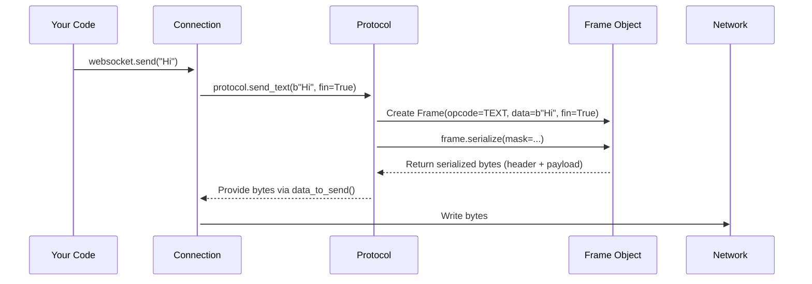
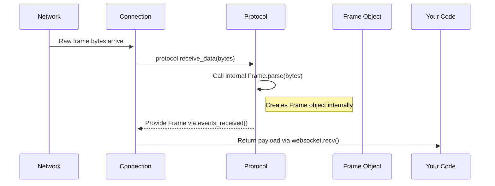

# Chapter 11: Frame - The Envelopes of Communication

In the previous chapter, [Chapter 10: The Core Rules Engine - Protocol (Core)](10_protocol__core_.md), we learned about the `Protocol` class, which acts like the referee for our WebSocket game, ensuring both sides follow the rules after the connection starts. We saw that the `Protocol` takes your messages and turns them into bytes to send, and turns incoming bytes back into events or messages.

But how exactly does it package up those messages? It doesn't just send raw text or bytes over the wire. It uses special digital "envelopes" called **Frames**.

## What Problem Do Frames Solve?

Imagine sending a very long letter through the postal service. You might have to split it into multiple pages and put each page in a separate envelope. You'd also want to label the envelopes: "Page 1 of 3 (Text)", "Page 2 of 3 (Text)", "Page 3 of 3 (Text)". This way, the recipient knows what kind of content is inside and how to put the pages back together in the right order.

WebSocket communication works similarly, especially for large messages or control signals:

1.  **Structure:** Raw data needs structure. How does the receiver know where one message ends and the next begins? How does it know if the data is text or raw binary bytes?
2.  **Fragmentation:** Sending a huge chunk of data all at once might block the network or cause problems. It's better to break large messages into smaller pieces.
3.  **Control Signals:** Besides regular messages, WebSockets need a way to send special instructions like "Are you still there?" (Ping), "Yes, I'm here!" (Pong), or "Let's hang up" (Close). These aren't regular data messages.

**Frames** are the solution! They are the basic, standardized "envelopes" used to carry *all* information over a WebSocket connection. Each frame contains a piece of data (or a control signal) along with instructions on what it is and whether it's part of a larger message.

The [Protocol (Core)](10_protocol__core_.md) layer's main job is to take your outgoing messages, package them into one or more `Frame` objects, and convert those frames into bytes. Going the other way, it takes incoming bytes, parses them back into `Frame` objects, potentially reassembles frames into a complete message, and then gives that message to you via `recv()`.

While you usually interact with complete messages using `send()` and `recv()`, understanding frames helps you grasp how things like large message handling (fragmentation) and background keep-alive checks (pings/pongs) work.

## Key Concepts: Inside the Envelope

Every WebSocket frame has a few key parts, like the fields on an envelope:

1.  **Opcode (Operation Code):** This tells the receiver *what kind* of data is in the frame. Think of it like writing "Letter," "Package," or "Special Instruction" on the envelope. Common opcodes include:
    *   `TEXT` (Opcode `0x01`): The payload is human-readable text (encoded in UTF-8).
    *   `BINARY` (Opcode `0x02`): The payload is raw binary data (like an image or audio).
    *   `CONTINUATION` (Opcode `0x00`): This frame continues a message started by a previous TEXT or BINARY frame. Used for fragmentation.
    *   `PING` (Opcode `0x09`): A "heartbeat" check to see if the other side is responsive. The payload is optional binary data.
    *   `PONG` (Opcode `0x0A`): The reply to a PING frame. Usually echoes the PING's payload.
    *   `CLOSE` (Opcode `0x08`): A signal to start closing the connection. The payload contains an optional status code and reason.

2.  **Payload Data:** This is the actual content being sent – the piece of your message, the ping data, or the close code.

3.  **FIN Flag (Final Fragment):** This is a single bit (True or False) that answers the question: "Is this the *last* frame for this particular message?"
    *   `FIN = True`: This frame completes a message. It might be the *only* frame for a small message, or the *last* frame of a fragmented message.
    *   `FIN = False`: This frame is *part* of a longer message, and more `CONTINUATION` frames will follow.

4.  **Other Flags (RSV1, RSV2, RSV3):** These are reserved for future extensions. Normally, they are all `False`. ([Chapter 12: Extension](12_extension.md) might use these).

5.  **Masking Key (Client-to-Server only):** For security reasons (to prevent certain attacks via intermediaries like caches), frames sent *from the client to the server* must have their payload data scrambled ("masked") using a 4-byte random key included in the frame. The server then uses this key to unscramble the payload. Server-to-client frames are *not* masked. This masking is handled automatically by the `Protocol` layer.

## How Frames Are Used (Behind the Scenes)

Let's trace how frames are involved when you send and receive messages.

**Sending a Message:**

1.  You call `websocket.send("Hello!")`.
2.  The `Connection` object ([Chapter 6](06_connection__asyncio___sync_.md)) passes `"Hello!"` to the `Protocol` object ([Chapter 10](10_protocol__core_.md)).
3.  The `Protocol` sees it's text data. It creates a `Frame` object:
    *   `opcode = TEXT`
    *   `payload = b"Hello!"` (UTF-8 encoded bytes)
    *   `fin = True` (since it's a small message, sent in one go)
    *   `rsv1, rsv2, rsv3 = False`
4.  If this is a client sending, the `Protocol` generates a random 4-byte masking key.
5.  The `Protocol` **serializes** the `Frame` object into the precise sequence of bytes defined by RFC 6455 (adding header bits, length information, the masking key if needed, and the masked payload).
6.  The `Protocol` gives these bytes back to the `Connection`.
7.  The `Connection` writes the bytes to the network socket.

**Receiving a Message:**

1.  The `Connection` reads raw bytes from the network socket.
2.  It passes these bytes to the `Protocol` using `protocol.receive_data()`.
3.  The `Protocol` **parses** the bytes. It reads the header bits, determines the opcode, FIN flag, payload length, and masking key (if present).
4.  It reads the payload data. If the frame was masked (sent by a client), it uses the masking key to unscramble the payload.
5.  It creates a `Frame` object in memory representing what was received.
6.  The `Protocol` checks the opcode:
    *   If `TEXT` or `BINARY` with `FIN = True`, it knows this is a complete message. It adds the payload to the `events_received` queue.
    *   If `PING`, it automatically creates and queues a `PONG` frame to be sent back, and adds the `PING` frame to the `events_received` queue (though your application usually doesn't need to see Pings).
    *   If `CLOSE`, it handles the closing handshake logic and adds the `CLOSE` frame to the queue.
    *   If `TEXT` or `BINARY` with `FIN = False`, it starts assembling a fragmented message... (see below).
7.  Your application calls `websocket.recv()`. The `Connection` retrieves the completed message payload (or close signal) from the `Protocol`'s event queue and returns it.

## Under the Hood: Building and Reading the Envelope

The `Protocol` layer uses the `Frame` class (defined in `src/websockets/frames.py`) to represent these data units logically before they are turned into bytes or after they are parsed from bytes.

**Serialization Flow (Conceptual):**



**Parsing Flow (Conceptual):**



**Code Glimpse:**

The `Frame` itself is represented quite simply using a Python dataclass in `src/websockets/frames.py`.

```python
# src/websockets/frames.py (Simplified Structure)
import dataclasses
import enum
# ... other imports ...

class Opcode(enum.IntEnum):
    """Opcode values for WebSocket frames."""
    CONT, TEXT, BINARY = 0x00, 0x01, 0x02
    CLOSE, PING, PONG = 0x08, 0x09, 0x0A

# Define constants for easier use
OP_TEXT = Opcode.TEXT
OP_BINARY = Opcode.BINARY
OP_CONT = Opcode.CONT
# ... etc. ...

@dataclasses.dataclass
class Frame:
    """
    Represents a WebSocket frame in memory.
    """
    opcode: Opcode             # Type of frame (TEXT, BINARY, PING, etc.)
    data: Union[bytes, bytearray, memoryview] # The payload
    fin: bool = True           # Is this the final frame of the message?
    rsv1: bool = False         # Reserved bits (usually False)
    rsv2: bool = False
    rsv3: bool = False

    # This class also contains the complex logic for:
    # - Frame.parse(read_exact, mask, max_size, extensions):
    #     A class method (used by Protocol) to read bytes
    #     and create a Frame object. Handles headers, lengths,
    #     unmasking.
    #
    # - frame.serialize(mask, extensions):
    #     An instance method (used by Protocol) to convert the
    #     Frame object back into bytes for sending. Handles header
    #     formatting, length calculation, masking.
    #
    # - frame.check():
    #     Validates the frame (e.g., control frames aren't fragmented).

    def __str__(self) -> str:
        # Provides a nice string representation for logging
        # ... (formats opcode, data preview, flags) ...
        pass

# Also defined here is the Close class for parsing/serializing Close frame payloads:
@dataclasses.dataclass
class Close:
    code: int
    reason: str
    # ... methods to parse/serialize the 2-byte code + reason string ...
```

This shows the core attributes of a `Frame` object: `opcode`, `data`, and the `fin` flag. The real complexity lies within the `parse()` and `serialize()` methods (which we don't need to explore in detail here) that the `Protocol` uses to convert between this logical representation and the raw bytes on the wire.

## Why Understanding Frames Matters: Fragmentation

Imagine you want to send a large 1 megabyte image file. Sending it in one giant frame might be problematic. Instead, the `websockets` library (via the `Protocol` layer) might fragment it:

1.  It sends a `BINARY` frame with `FIN = False`. This frame contains the *first* chunk of the image data.
2.  It sends one or more `CONTINUATION` frames, each with `FIN = False`. These contain the middle chunks of the image data.
3.  Finally, it sends a `CONTINUATION` frame with `FIN = True`. This contains the *last* chunk of the image data.

On the receiving end, the `Protocol` layer sees the initial `BINARY` frame with `FIN=False`, knows a fragmented message is starting, and starts buffering the data. It keeps adding data from the incoming `CONTINUATION` frames. When it finally sees a frame with `FIN=True` (which must be a `CONTINUATION` frame in this sequence), it knows the message is complete, combines all the chunks, and makes the full 1MB image available to your `recv()` call.

**Good News:** You usually don't have to worry about fragmentation! The `send()` and `recv()` methods handle splitting large messages and reassembling them automatically. But knowing frames exist explains *how* this happens seamlessly.

## Conclusion

You've learned about **Frames**, the fundamental building blocks of WebSocket communication.

*   They are like digital envelopes carrying pieces of your messages or control signals.
*   Each frame has an **Opcode** (type), **Payload** (content), and flags like **FIN** (is this the last piece?).
*   The [Protocol (Core)](10_protocol__core_.md) layer uses `Frame` objects internally to parse incoming bytes and serialize outgoing messages.
*   Client-to-server frames have their payloads masked (scrambled) for security.
*   Understanding frames helps explain concepts like **fragmentation** (splitting large messages) and **control frames** (Ping/Pong/Close).

Frames are the core data unit, but sometimes we want to modify the data *within* the frames, for example, by compressing it. How can we extend the basic rules?

Let's explore this in the final chapter: [Chapter 12: Extending the Rules - Extension](12_extension.md).

---

Generated by [AI Codebase Knowledge Builder](https://github.com/The-Pocket/Tutorial-Codebase-Knowledge)