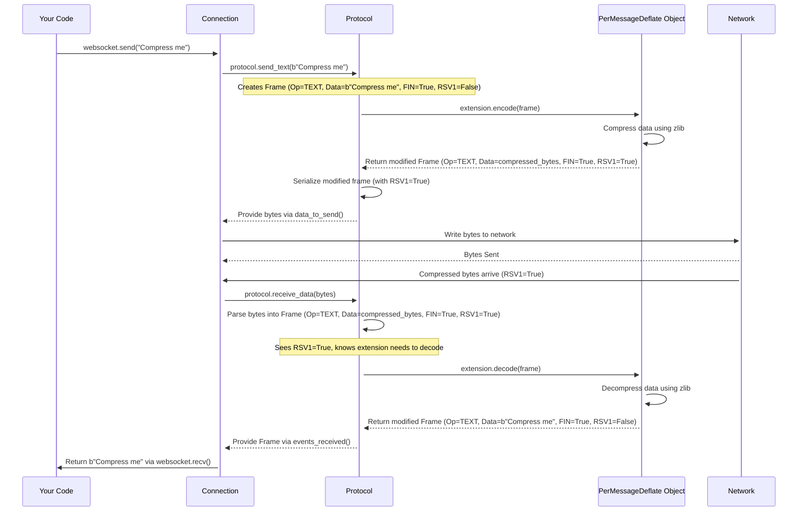

# Chapter 12: Extending the Rules - Extension

In [Chapter 11: Frame - The Envelopes of Communication](11_frame.md), we learned that all WebSocket communication happens using structured "envelopes" called frames. These frames follow the basic rules defined by the core WebSocket protocol (RFC 6455).

But what if we want to add *optional features* on top of these basic rules? For example, what if both the client and server agree to compress the data inside the frames to save bandwidth? Or maybe they want to add some other custom modification?

This is where **Extensions** come in. They provide a standardized way to "extend" the base WebSocket protocol with new, optional capabilities that both sides must agree to use.

## What Problem Do Extensions Solve?

Imagine the basic WebSocket protocol is like a standard board game with a core set of rules. Extensions are like optional expansion packs or house rules that players can agree to use *before* starting the game. These expansions might add new game pieces, change how turns work, or introduce new ways to score – but only if everyone agrees to use them.

The most common reason for using WebSocket extensions is **compression**. Sending large amounts of text or binary data can use a lot of network bandwidth. If both the client and server support a compression extension (like `permessage-deflate`, which uses the same DEFLATE algorithm as ZIP files), they can agree to automatically compress outgoing messages and decompress incoming ones. This can significantly reduce the amount of data transferred, making the connection faster and cheaper.

Other extensions could potentially handle things like multiplexing (sending multiple independent streams over one connection), but compression is by far the most widely used.

The `websockets` library provides a framework for managing these extensions:

1.  **Negotiation:** During the initial handshake ([Chapter 8](08_request___response__http_1_1_.md)), the client proposes the extensions it supports, and the server chooses which ones (if any) to enable for the connection. This involves specific HTTP headers (`Sec-WebSocket-Extensions`).
2.  **Frame Modification:** Once an extension is active, it gets a chance to modify frames as they are sent and received. For compression, this means compressing the payload of outgoing data frames and decompressing the payload of incoming data frames.

The library provides base classes (`Extension`, `ClientExtensionFactory`, `ServerExtensionFactory`) that define how this negotiation happens and how frames are modified (`encode`/`decode` methods).

## Key Concepts: Negotiation and Modification

1.  **Negotiation (The Handshake Agreement):**
    *   The client sends a `Sec-WebSocket-Extensions` header in its initial [Request](08_request___response__http_1_1_.md). This header lists the extensions the client wants to use and any parameters for them. Example: `Sec-WebSocket-Extensions: permessage-deflate; client_max_window_bits`
    *   The server looks at the client's proposals. If it supports any of them and agrees to the parameters, it sends back a `Sec-WebSocket-Extensions` header in its [Response](08_request___response__http_1_1_.md) listing the *accepted* extensions and parameters. Example: `Sec-WebSocket-Extensions: permessage-deflate`
    *   If they agree on an extension, it becomes active for the lifetime of the connection. If they don't agree, the connection proceeds without that extension.
    *   The `ClientExtensionFactory` and `ServerExtensionFactory` classes handle the logic of generating the offer parameters (client) and processing the offer/generating the response parameters (server).

2.  **Frame Modification (Applying the Rules):**
    *   Once an extension (like `permessage-deflate`) is active, the core [Protocol (Core)](10_protocol__core_.md) engine gives it a chance to modify frames.
    *   **Outgoing Frames:** Before a data frame is serialized into bytes, it's passed to the active extension's `encode()` method. For `permessage-deflate`, this method compresses the frame's payload. Extensions often signal their modification by setting one of the reserved bits (RSV1, RSV2, RSV3) in the frame header. `permessage-deflate` uses the `RSV1` bit to indicate a frame's payload is compressed.
    *   **Incoming Frames:** After a frame is parsed from bytes, if its `RSV1` bit is set (indicating compression), it's passed to the extension's `decode()` method. This method decompresses the payload before the message is made available to your application via `recv()`.
    *   The `Extension` base class defines the `encode()` and `decode()` methods that specific extensions (like `PerMessageDeflate`) implement.

## How to Use Extensions (Enabling Compression)

The good news is that for common extensions like `permessage-deflate`, the `websockets` library handles almost everything for you! You usually just need to tell `connect()` or `serve()` that you want to enable compression.

**Enabling Compression (Conceptual Example):**

The exact way to enable extensions can vary slightly depending on library versions and specific APIs, but the *concept* is generally to pass an argument during connection setup.

*Client-side (`connect`):*

```python
# Conceptual client enabling compression
import asyncio
from websockets.client import connect
# Factory for the permessage-deflate extension is often built-in or easily imported
from websockets.extensions.permessage_deflate import ClientPerMessageDeflateFactory

async def connect_with_compression():
    uri = "ws://localhost:8765"
    # Tell connect() we want to offer the permessage-deflate extension
    # The library provides the necessary factory.
    extension_factories = [ClientPerMessageDeflateFactory()]
    try:
        # Pass the factories to connect (actual argument name might differ)
        async with connect(uri, extensions=extension_factors) as websocket:
            print("Connected with extensions:", websocket.extensions) # See what was agreed!
            # Now, send() and recv() will automatically compress/decompress
            # if the server agreed to use permessage-deflate.
            await websocket.send("This message might be compressed!")
            response = await websocket.recv()
            print(f"Received: {response}") # This will be decompressed automatically

    except Exception as e:
        print(f"Connection failed: {e}")

# asyncio.run(connect_with_compression())
```

*Server-side (`serve`):*

```python
# Conceptual server enabling compression
import asyncio
from websockets.server import serve
from websockets.extensions.permessage_deflate import ServerPerMessageDeflateFactory

async def echo_handler(websocket):
    # Check which extensions are active for this connection
    print(f"Connection with extensions: {websocket.extensions}")
    async for message in websocket:
        # Send/receive happens automatically compressed/decompressed
        # if the extension was negotiated successfully.
        await websocket.send(message)

async def main():
    # Tell serve() we support the permessage-deflate extension
    extension_factories = [ServerPerMessageDeflateFactory()]
    async with serve(
        echo_handler,
        "localhost",
        8765,
        extensions=extension_factories, # Pass factories to serve
    ):
        print("Server started with compression support...")
        await asyncio.Future() # Run forever

# asyncio.run(main())
```

**Explanation:**

*   We import the necessary `Factory` classes (e.g., `ClientPerMessageDeflateFactory`, `ServerPerMessageDeflateFactory`). These factories know how to handle the negotiation for that specific extension.
*   We create instances of these factories.
*   We pass a list of these factories to the `connect` or `serve` function (using an argument like `extensions=`).
*   The library uses these factories during the handshake to negotiate the extensions with the other side.
*   If negotiation is successful, the library automatically enables the `encode()` and `decode()` methods for the connection. Your calls to `send()` and `recv()` will now transparently compress/decompress data if the extension is active.
*   You can check `websocket.extensions` on the connection object to see which `Extension` objects are active.

**Implementing Custom Extensions:**

Creating your *own* custom extension is an advanced topic. It involves:
1.  Defining the extension's logic by subclassing `Extension` and implementing `encode()` and `decode()`.
2.  Defining the negotiation logic by subclassing `ClientExtensionFactory` (implementing `get_request_params` and `process_response_params`) and/or `ServerExtensionFactory` (implementing `process_request_params`).
3.  Passing instances of your custom factories to `connect` or `serve`.

For most users, simply enabling the built-in `permessage-deflate` is sufficient.

## Under the Hood: Negotiation and Data Flow

Let's see how the negotiation and frame modification work internally.

**Negotiation Flow (permessage-deflate):**

```mermaid
sequenceDiagram
    participant ClientApp as Client Code
    participant ClientConn as connect() / ClientProtocol
    participant ClientFactory as ClientPerMessageDeflateFactory
    participant ServerConn as serve() / ServerProtocol
    participant ServerFactory as ServerPerMessageDeflateFactory
    participant ServerApp as Server Handler Code

    ClientApp->>+ClientConn: connect(uri, extensions=[ClientFactory()])
    ClientConn->>+ClientFactory: factory.get_request_params()
    ClientFactory-->>-ClientConn: Return request params (e.g., [('client_max_window_bits', None)])
    ClientConn->>ClientConn: Build 'Sec-WebSocket-Extensions' header offer
    ClientConn->>+ServerConn: Send Handshake Request (with Offer Header)
    ServerConn->>+ServerFactory: factory.process_request_params(offer_params)
    alt Server Accepts Offer
        ServerFactory-->>-ServerConn: Return (response_params, Extension Object)
        ServerConn->>ServerConn: Build 'Sec-WebSocket-Extensions' response header
        ServerConn->>-ClientConn: Send Handshake Response (101, with Response Header)
        ClientConn->>+ClientFactory: factory.process_response_params(response_params)
        ClientFactory-->>ClientConn: Return Extension Object
        ClientConn->>ClientConn: Store active Extension Object
        Note over ClientConn: Handshake OK
        ClientConn-->>-ClientApp: Return websocket (with active extension)
        Note over ServerConn: Handshake OK
        ServerConn->>ServerApp: Call handler(websocket) (with active extension)
    else Server Rejects Offer
        ServerFactory-->>-ServerConn: Raise NegotiationError
        ServerConn->>ServerConn: Send Handshake Response (101, NO Extension Header)
        ClientConn->>+ClientFactory: factory.process_response_params([])
        ClientFactory-->>-ClientConn: Raise NegotiationError
        Note over ClientConn: Handshake OK (but no extension)
        ClientConn-->>-ClientApp: Return websocket (no active extension)
        Note over ServerConn: Handshake OK (but no extension)
        ServerConn->>ServerApp: Call handler(websocket) (no active extension)
    end

```

1.  Client calls `connect` with `ClientPerMessageDeflateFactory`.
2.  `ClientProtocol` asks the factory for request parameters (`get_request_params`).
3.  `ClientProtocol` includes these in the `Sec-WebSocket-Extensions` header sent to the server.
4.  `ServerProtocol` receives the request and asks its `ServerPerMessageDeflateFactory` to process the client's parameters (`process_request_params`).
5.  The server factory decides if it can accept the offer.
    *   If **yes**, it returns the response parameters and an `Extension` object (e.g., `PerMessageDeflate`). `ServerProtocol` includes these response parameters in the `Sec-WebSocket-Extensions` header of the `101` response.
    *   If **no**, it raises `NegotiationError`. `ServerProtocol` sends the `101` response *without* the extension header.
6.  `ClientProtocol` receives the server's response. It asks its `ClientPerMessageDeflateFactory` to process the response parameters (`process_response_params`).
    *   If the server accepted, the factory returns the configured `Extension` object, which gets stored on the connection.
    *   If the server rejected (no extension header), the factory raises `NegotiationError` (which is usually caught and simply means the extension isn't active).
7.  The connection proceeds, with the `Extension` object being used by the `Protocol` layer if it was successfully negotiated.

**Data Flow with Active Extension (Compression):**


1.  `send()`: The `Protocol` creates a normal frame. Before serializing, it calls `extension.encode()`. The extension compresses the data and sets `RSV1=True` on the frame. The `Protocol` then serializes *this modified* frame.
2.  `recv()`: The `Protocol` parses an incoming frame. If `RSV1` is set, it calls `extension.decode()` on the frame *before* adding it to the event queue. The extension decompresses the data and unsets `RSV1`. The `Connection` layer eventually gets the *decompressed* data for `recv()`.

**Code Glimpse:**

Let's look at the base classes and a simplified `PerMessageDeflate`.

*Base Classes (`src/websockets/extensions/base.py`):*
```python
# Simplified from src/websockets/extensions/base.py

class Extension:
    """Base class for extensions."""
    name: str # e.g., "permessage-deflate"

    def decode(self, frame: Frame, *, max_size: int | None = None) -> Frame:
        """Decode an incoming frame."""
        # Default is no-op, subclasses override
        return frame

    def encode(self, frame: Frame) -> Frame:
        """Encode an outgoing frame."""
        # Default is no-op, subclasses override
        return frame

class ClientExtensionFactory:
    """Base class for client-side extension factories."""
    name: str

    def get_request_params(self) -> Sequence[ExtensionParameter]:
        """Build parameters for the Sec-WebSocket-Extensions header offer."""
        raise NotImplementedError

    def process_response_params(
        self, params: Sequence[ExtensionParameter], accepted_extensions: Sequence[Extension]
    ) -> Extension:
        """Process server's response parameters and return the Extension object."""
        raise NotImplementedError

class ServerExtensionFactory:
    """Base class for server-side extension factories."""
    name: str

    def process_request_params(
        self, params: Sequence[ExtensionParameter], accepted_extensions: Sequence[Extension]
    ) -> tuple[list[ExtensionParameter], Extension]:
        """Process client's offer parameters, return response params and Extension."""
        raise NotImplementedError
```
*Simplified PerMessageDeflate (`src/websockets/extensions/permessage_deflate.py`):*
```python
# Simplified conceptual logic from src/websockets/extensions/permessage_deflate.py
import zlib
from .base import Extension
from ..frames import Frame, OP_CONT, CTRL_OPCODES

class PerMessageDeflate(Extension):
    name = "permessage-deflate"

    def __init__(self, remote_no_context_takeover, local_no_context_takeover, ...):
        # Store negotiated parameters
        self.remote_no_context_takeover = remote_no_context_takeover
        # ... etc ...
        # Initialize zlib objects if context takeover is allowed
        if not self.remote_no_context_takeover:
            self.decoder = zlib.decompressobj(...)
        if not self.local_no_context_takeover:
            self.encoder = zlib.compressobj(...)
        self.decode_cont_data = False # Track fragmented compressed messages

    def decode(self, frame: Frame, *, max_size: int | None = None) -> Frame:
        # Skip control frames
        if frame.opcode in CTRL_OPCODES: return frame

        # Determine if this frame should be decoded based on RSV1 and fragmentation state
        is_compressed = frame.rsv1
        if frame.opcode == OP_CONT:
            should_decode = self.decode_cont_data
            if frame.fin: self.decode_cont_data = False # Reset on final cont frame
        else: # TEXT or BINARY
            should_decode = is_compressed
            if should_decode and not frame.fin: self.decode_cont_data = True # Start tracking

        if not should_decode: return frame

        # Reset decoder if necessary (no context takeover)
        if self.remote_no_context_takeover:
            self.decoder = zlib.decompressobj(...)

        # Perform decompression
        try:
            decompressed_data = self.decoder.decompress(frame.data + b"\x00\x00\xff\xff", max_size)
            # ... (handle trailer, errors, size limits) ...
        except zlib.error as exc:
            raise ProtocolError("decompression failed") from exc

        # Return a new frame with decompressed data and RSV1 unset
        return Frame(frame.opcode, decompressed_data, frame.fin, rsv1=False)

    def encode(self, frame: Frame) -> Frame:
        # Skip control frames
        if frame.opcode in CTRL_OPCODES: return frame

        # Reset encoder if necessary
        if frame.opcode != OP_CONT and self.local_no_context_takeover:
            self.encoder = zlib.compressobj(...)

        # Perform compression
        compressed_data = self.encoder.compress(frame.data)
        compressed_data += self.encoder.flush(zlib.Z_SYNC_FLUSH)
        # Remove trailer added by zlib flush
        if frame.fin: compressed_data = compressed_data[:-4]

        # Return a new frame with compressed data and RSV1 set (if not CONT)
        return Frame(
             frame.opcode, compressed_data, frame.fin, rsv1=(frame.opcode != OP_CONT)
        )

```
These snippets show how the base classes define the interface (`decode`, `encode`, negotiation methods) and how a specific extension like `PerMessageDeflate` implements them, using libraries like `zlib` to perform the actual work and manipulating the frame's `rsv1` bit.

## Conclusion

You've learned about WebSocket **Extensions**, the mechanism for adding optional features like compression to the base protocol.

*   They work like optional plugins or modules agreed upon during the handshake.
*   **Negotiation** happens via the `Sec-WebSocket-Extensions` header, managed by `ClientExtensionFactory` and `ServerExtensionFactory`.
*   Active extensions modify frames using `encode()` (outgoing) and `decode()` (incoming) methods defined in the `Extension` class.
*   The most common extension is **`permessage-deflate`** for compression, which often uses the `RSV1` frame bit.
*   The `websockets` library makes enabling common extensions like compression straightforward, usually via options in `connect()` or `serve()`.

This concludes our tutorial journey through the core concepts of the `websockets` library! We started with connecting ([Chapter 1](01_connect__factory_.md)) and serving ([Chapter 3](03_serve__factory_.md)), learned how to communicate ([Chapter 2](02_clientconnection__asyncio___sync_.md), [Chapter 4](04_serverconnection__asyncio___sync_.md)), handle errors ([Chapter 5](05_websocketexception.md)), and explored the underlying layers like the base connection ([Chapter 6](06_connection__asyncio___sync_.md)), protocols ([Chapter 7](07_clientprotocol___serverprotocol.md), [Chapter 10](10_protocol__core_.md)), handshake messages ([Chapter 8](08_request___response__http_1_1_.md), [Chapter 9](09_headers.md)), frames ([Chapter 11](11_frame.md)), and now extensions ([Chapter 12](12_extension.md)).

We hope this gives you a solid foundation for building your own WebSocket applications!

---

Generated by [AI Codebase Knowledge Builder](https://github.com/The-Pocket/Tutorial-Codebase-Knowledge)