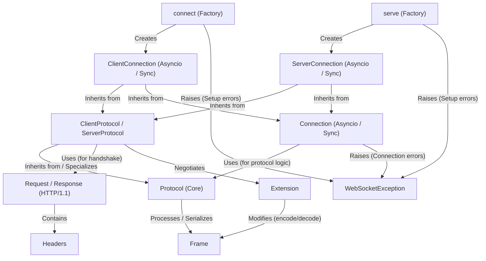

# Tutorial: websockets

The `websockets` library provides a high-level and easy-to-use way to build **WebSocket clients and servers** in Python.
It handles the complexities of the *WebSocket protocol*, including the opening handshake, sending and receiving messages (as text or binary frames), keepalive pings, and closing the connection gracefully.
It offers both *asynchronous* (using `asyncio`) and *synchronous* (using `threading`) APIs to fit different programming models.

**Source Repository:** [https://github.com/python-websockets/websockets](https://github.com/python-websockets/websockets)

## Chapters

1. [connect (Factory)](01_connect__factory_.md)
2. [ClientConnection (Asyncio / Sync)](02_clientconnection__asyncio___sync_.md)
3. [serve (Factory)](03_serve__factory_.md)
4. [ServerConnection (Asyncio / Sync)](04_serverconnection__asyncio___sync_.md)
5. [WebSocketException](05_websocketexception.md)
6. [Connection (Asyncio / Sync)](06_connection__asyncio___sync_.md)
7. [ClientProtocol / ServerProtocol](07_clientprotocol___serverprotocol.md)
8. [Request / Response (HTTP/1.1)](08_request___response__http_1_1_.md)
9. [Headers](09_headers.md)
10. [Protocol (Core)](10_protocol__core_.md)
11. [Frame](11_frame.md)
12. [Extension](12_extension.md)

---

Generated by [AI Codebase Knowledge Builder](https://github.com/The-Pocket/Tutorial-Codebase-Knowledge)